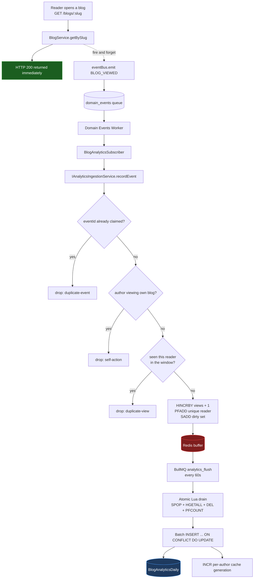
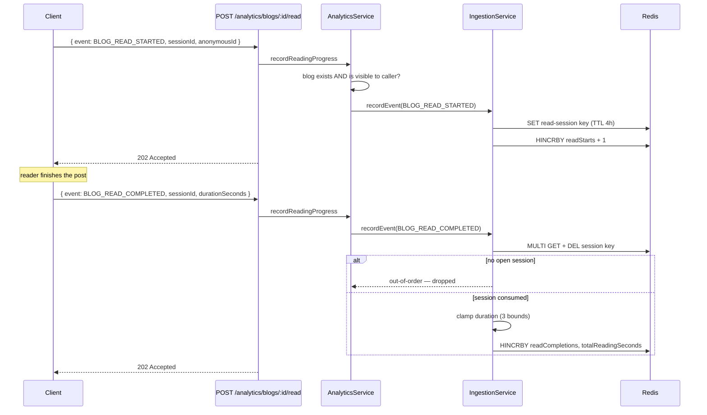
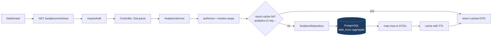
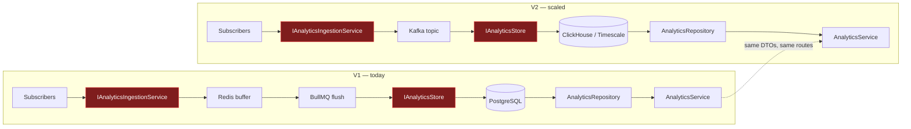

# Analytics Module

Collects, aggregates and serves reader analytics for Narrative — views, unique
readers, reading behaviour, engagement, and audience growth — without putting a
single write on the request path that produces them.

The module's whole design follows from one constraint: **a blog view must never
cost a database write.** Everything below — the Redis buffer, the atomic drain,
the daily aggregate tables, the eventual-consistency contract — is what that
constraint forces once you take it seriously.

---

## 1. Responsibilities

**Owns**

- Ingesting analytics events from domain events and from client telemetry
- Deduplicating views, validating reading sessions, filtering author self-actions
- Buffering high-frequency counters in Redis
- Flushing buffers into PostgreSQL daily aggregates
- Serving authenticated per-blog and per-author reports
- Enforcing analytics retention

**Does not own**

- Any domain data. Analytics reads `Blog`, `User` and `Follow` through their
  owning modules and never writes to them.
- The dashboard UI. This module exposes DTOs a React dashboard consumes as-is.
- Platform-wide analytics. The schema and query layer support it; V1 does not
  ship it (see §20).

**Dependency direction is strictly one-way.** No module calls
`AnalyticsService`. Analytics listens to the event bus and calls `blogService`
and `followRepository` for facts it needs. That is what makes it a leaf: pulling
it out into its own service later means re-pointing the subscriptions at a
broker and nothing else.

---

## 2. Architecture

```text
src/modules/analytics/
├── analytics.types.ts        # the module's vocabulary — no Redis/SQL in here
├── analytics.keys.ts         # every Redis key, in one file
├── analytics.time.ts         # reporting-day bucketing; instant-vs-label split
├── analytics.buffer.ts       # Redis counters + the atomic Lua drain
├── analytics.resolver.ts     # cached blog → { author, reading time }
├── analytics.cache.ts        # report cache, per-owner generations
├── analytics.range.ts        # date-range resolution and bounds
├── analytics.cursor.ts       # keyset cursor for top-blogs
├── analytics.repository.ts   # READ side — every reporting query
├── analytics.service.ts      # authorization, orchestration, DTO mapping
├── analytics.controller.ts   # HTTP parse / delegate / format
├── analytics.routes.ts       # /api/v1/analytics
├── analytics.validator.ts    # Zod schemas
├── analytics.worker.ts       # flush + prune jobs
├── analytics.scheduler.ts    # repeatable job registration
├── ingestion/
│   ├── IAnalyticsIngestionService.ts      # the ingestion seam
│   └── RedisAnalyticsIngestionService.ts  # validation, dedupe, buffering
└── store/
    ├── IAnalyticsStore.ts                 # the durable-write seam
    └── PostgresAnalyticsStore.ts          # batch UPSERT
```

### The two seams that matter

`IAnalyticsIngestionService` and `IAnalyticsStore` are the module's load-bearing
abstractions.

Everything **upstream** of ingestion — the domain-event subscribers, the reading
telemetry endpoint — knows only that it can hand over an `AnalyticsEvent`.
Everything **downstream** — Redis buffers, HyperLogLogs, BullMQ, the daily
tables — is an implementation detail of one class. Moving to Kafka or ClickHouse
means writing new implementations of two interfaces; no domain module changes,
because no domain module has ever known what happens after `recordEvent`
returns.

`AnalyticsRepository` (read) is deliberately **separate** from `IAnalyticsStore`
(write). They have opposite shapes: the store takes batches from a background
worker and cares about throughput and lock duration; the repository takes a date
range from an HTTP request and cares about selectivity and index use. Merged,
half the methods would be unreachable from either caller.

---

## 3. Event model

```ts
interface AnalyticsEvent {
  readonly eventId: string;              // idempotency key, stable across retries
  readonly eventType: AnalyticsEventType;
  readonly occurredAt: Date;
  readonly userId?: string;
  readonly anonymousId?: string;
  readonly entityType: 'BLOG' | 'USER';
  readonly entityId: string;
  readonly ownerId?: string;             // whose dashboard this rolls up to
  readonly metadata?: AnalyticsEventMetadata;
}
```

`metadata` is a **discriminated union**, not `Record<string, unknown>`:

```ts
type AnalyticsEventMetadata =
  | { readonly kind: 'none' }
  | { readonly kind: 'read'; readonly sessionId: string; readonly durationSeconds?: number };
```

The ingestion service branches on event type and reads these fields. With an
open-ended metadata bag a typo would be a silent zero rather than a compile
error, which is how analytics pipelines rot. There is no `any` in the module.

### V1 analytics events

| Analytics event | Source | Scope |
|---|---|---|
| `BLOG_VIEWED` | `BLOG_VIEWED` domain event (**new**, see §4) | blog |
| `BLOG_READ_STARTED` | client telemetry | blog |
| `BLOG_READ_COMPLETED` | client telemetry | blog |
| `BLOG_BOOKMARKED` | `BLOG_BOOKMARKED` domain event | blog |
| `BLOG_UNBOOKMARKED` | `BLOG_UNBOOKMARKED` domain event | blog |
| `BLOG_COMMENTED` | `COMMENT_CREATED` domain event | blog |
| `BLOG_PUBLISHED` | `BLOG_PUBLISHED` domain event | user |
| `USER_FOLLOWED` | `USER_FOLLOWED` domain event | user |
| `USER_UNFOLLOWED` | `USER_UNFOLLOWED` domain event | user |

Analytics event types are deliberately **not** the same set as domain events.
Some are converted from one by a subscriber; the reading events have no domain
counterpart, because nothing in the domain changes when a reader scrolls.

### Deliberate scope exclusion: likes

**`BLOG_LIKED` is absent, on purpose.** The Prisma schema has a `Like` table and
`NotificationType` has a `LIKE` value, but there is no Like module: nothing
creates a like, nothing removes one, and no event is emitted anywhere in the
codebase. Wiring a subscriber to a source that does not exist would mean shipping
a column, a DTO field and an API contract that permanently read zero — worse than
absent, because a dashboard showing "0 likes" reads as *nobody liked this* rather
than *this platform has no likes yet*.

When the Like module lands, adding it is four changes: an event name in the
engagement subscriber, a `likes` column on `BlogAnalyticsDaily`, a field in
`BlogDailyDelta`, and a line in the store's upsert. No pipeline change.

**Comments carry the engagement axis instead** — they exist, they are meaningful,
and `COMMENT_CREATED` already carries `blogAuthorId`.

> Note: analytics subscribes to `COMMENT_CREATED` only, never `COMMENT_REPLIED`.
> The Comment module emits `COMMENT_CREATED` for *every* new comment and
> `COMMENT_REPLIED` *additionally* for replies; subscribing to both would count
> every reply twice. There is a test pinning this.

---

## 4. Upstream changes this module required

Three changes outside `modules/analytics`, each made in the owning module rather
than faked inside Analytics.

### 4.1 `BLOG_VIEWED` — added to the Blog module

No view event existed. `blogService.getBySlug` is the platform's only public
full-read path, so it is the one honest place to say a blog was viewed. It emits
only for a `PUBLISHED` blog the viewer was actually allowed to see.

```ts
eventBus.emit(EVENTS.BLOG_VIEWED, {
  blogId, authorId, slug, userId?, anonymousId?
});
```

*Server-side, not a client beacon.* The server already knows a view happened; a
beacon is trivially forgeable, misses readers without JavaScript, and would
report views for pages the server never served.

An author opening their own **draft** through this path is authoring, not
readership, so nothing is emitted — this is the single most common way a
brand-new post shows "1 view" before anyone has seen it.

The Blog controller reads an `x-anonymous-id` header and passes it through as
opaque `ReadContext`. Blog neither stores nor interprets it. A malformed value is
**dropped, never rejected**: this is optional telemetry riding on a public page
read, and failing the request would let a bad client build take the blog page
down.

### 4.2 `eventId` — added to the event bus

Idempotency needs a key that is stable across BullMQ retries. `eventBus.emit`
now mints one and passes a `DomainEventMeta` second argument to handlers:

```ts
export interface DomainEventMeta { eventId: string; event: string; emittedAt: string; }
export type DomainEventHandler = (payload: any, meta: DomainEventMeta) => void | Promise<void>;
```

Existing subscribers declare one parameter and are unaffected — a narrower
function is assignable to a wider signature. **Zero changes to the Notification
and Search subscribers.**

*Why not hash the payload?* A payload hash cannot distinguish "the same event
redelivered" from "the user did that twice": bookmark → unbookmark → bookmark
produces byte-identical payloads and must count twice.

The domain-events worker falls back to the BullMQ job id when a job predates this
change — also retry-stable, since BullMQ holds the job id fixed across attempts.

`eventBus.settled()` was added as a test seam: under `NODE_ENV=test` the bus
dispatches inline and fire-and-forget, so an integration test that emits and
immediately inspects a subscriber's writes is racing it. Production is unaffected
(it enqueues).

### 4.3 `blogService.getBlogMeta` / `countBlogsByStatus`

Analytics needs a blog's author (authorization, aggregation), its title/slug
(report labels) and its `readingTimeMinutes` (duration validation). Rather than
reach into `blogRepository` — a private module internal — the Blog module exposes
a generic descriptive-scalars method. `countBlogsByStatus` backs the live
blog counts in the author overview.

---

## 5. Event flow



The reader's request **returns at step C**. Everything after is off the request
path.

### Reading telemetry



The response is `202` and **identical either way**. A client that could tell
"counted" from "dropped" could probe the dedupe state, and there is nothing
useful it would do with the answer.

### Query path



---

## 6. Redis strategy

Every key the module writes is built in `analytics.keys.ts`. Centralised because
the flush worker, the ingestion service and operational tooling must agree
byte-for-byte; a key built inline at three call sites is an orphaned buffer
waiting to happen.

| Key | Type | TTL | Purpose |
|---|---|---|---|
| `analytics:v1:buf:blog:{blogId}:{date}` | HASH | 48h | per-blog daily counters |
| `analytics:v1:buf:user:{userId}:{date}` | HASH | 48h | per-user daily counters |
| `analytics:v1:uniq:{blogId}:{date}` | HLL | 48h | distinct readers for the day |
| `analytics:v1:dirty` | SET | — | buckets awaiting a flush |
| `analytics:v1:dedupe:{eventId}` | STRING | 24h | at-least-once delivery guard |
| `analytics:v1:view:{blogId}:{identity}` | STRING | 30m | view dedupe window |
| `analytics:v1:read:{blogId}:{identity}:{session}` | STRING | 4h | open reading session |
| `analytics:v1:readq:{blogId}:{identity}` | STRING | 30m | reads claimed per window |
| `analytics:v1:owner:{blogId}` | STRING | 1h | cached blog author + reading time |
| `analytics:v1:gen:{ownerId}` | STRING | — | report cache generation |
| `analytics:v1:rep:{scope}:g{n}:{hash}` | STRING | 60–120s | cached report payload |

### Aggregation, not an event log

There is deliberately **no key per event**. A busy day would mint millions, and
Redis would become a queue of raw facts PostgreSQL then has to replay. Counters
collapse an unbounded event stream into `O(active blogs × days)` keys — the
property that keeps buffer memory predictable during exactly the traffic spike
that would otherwise sink it.

### Everything expires

Redis is a **buffer, never the source of truth**. Every key has a TTL, so a flush
worker that stays down degrades to lost recent counters rather than an
ever-growing keyspace, and PostgreSQL still holds everything already flushed.

The buffer TTL (48h) must comfortably outlive its day plus the flush interval, or
a bucket could expire between its last increment and its final flush, losing a
day's tail. 48h gives a full day of slack for a worker that was down overnight.

The one exception is the **dirty set**, which the flush drains itself and which is
bounded by the number of active buckets.

### The dirty set, not SCAN

The flush is driven by a Redis SET, never by `SCAN`/`KEYS`. Scanning is
`O(whole keyspace)` on a Redis shared with sessions, rate limiters and BullMQ,
and it grows more expensive exactly as the platform does. Reading the set is
`O(dirty buckets)` — the number of blogs that saw traffic since the last flush.

A member also survives a day boundary, so yesterday's final partial bucket is
flushed by today's first cycle with no special-casing.

### Unique readers: HyperLogLog

A Redis Set would be exact but grows with the audience — a post read by a million
people would hold a million 32-character hashes (~40MB) for one blog for one day.
The HLL answers the same question in a fixed **12KB with ~0.81% standard error**,
which is well inside what "unique readers" means to an author.

This makes `uniqueViews` the one **absolute** column: it is the day-to-date count,
written with `GREATEST(stored, incoming)` rather than added — which also makes it
idempotent by construction.

#### `uniqueViews` vs `uniqueReaderDays`

There is one sketch **per blog per day**, and two days' counts cannot be added: a
reader who came back on Tuesday sits in both, and summing counts them twice. Only
merging the sketches themselves would give a true period figure, and they do not
outlive the flush.

So the API reports two different things under two different names:

| Field | Meaning | Availability |
|---|---|---|
| `uniqueReaderDays` | Σ over days of (distinct readers that day). Unit is reader-days: one reader on three days is 3. | always |
| `uniqueViews` | Distinct readers, full stop. | **only when the window is one day**, `null` otherwise |

`uniqueReaderDays` is a real engagement measure and a hard upper bound on
uniques, so nothing is lost by reporting it — what changes is that it is no
longer reported under a name that claims to be something else. The `null` is the
point: a 30-day dashboard used to show a figure inflated by every returning
reader, silently and in the flattering direction. A field that is absent when it
cannot be computed is the only version a caller cannot misread.

Ranking (`/me/top-blogs`) uses `uniqueReaderDays` for the same reason — ranking is
inherently over a range, so there is no per-day figure to rank on.

### Identity hashing

Reader identities are **hashed with a private salt** before entering any key:

```ts
hashIdentity(`u:${userId}`)   // signed-in
hashIdentity(`a:${anonymousId}`) // anonymous
```

Analytics needs to know two requests came from the same reader; it never needs to
know *who*. Hashing gives the first without the second, so a Redis dump — the
only place this data is written at all — contains no user ids and no client
identifiers. `ANALYTICS_ID_SALT` is required to be set in production.

---

## 7. BullMQ integration

Reuses the existing generic queue abstraction. `QUEUES.ANALYTICS_FLUSH` and
`analyticsQueue` were already declared in `core/providers/queue.ts` (created but
unused); no new queue system was introduced.

Two jobs share the queue, discriminated by name:

| Job | Schedule | Retries |
|---|---|---|
| `analytics.flush` | every `ANALYTICS_FLUSH_INTERVAL_MS` (default 60s) | 1 |
| `analytics.prune` | `15 3 * * *` | 3 |

### Why a queue rather than `setInterval`

The flush must run once per interval **across the deployment**, not once per
process. Two instances each running a timer would both drain — safely, thanks to
the atomic drain, but at double the frequency and half the batch size each. A
repeatable job is scheduled once in Redis and delivered to exactly one worker, so
horizontal scaling changes nothing about the cadence.

### `upsertJobScheduler`, not `add({ repeat })`

`queue.add(name, data, { repeat })` keys a schedule by a **hash of the repeat
options**. Change `ANALYTICS_FLUSH_INTERVAL_MS` and the next boot registers a
*second* schedule under a new hash while the old one keeps firing — the flush
quietly runs on two cadences, which nothing surfaces until someone reads a queue
dashboard. `jobId` does not help: for a repeatable job that names the delivered
jobs, not the schedule.

`upsertJobScheduler(id, repeat, template)` takes an explicit id and replaces
whatever was registered under it, so a changed interval updates in place. Verified
against a live Redis.

### Why the flush uses `attempts: 1`

A failed flush is not worth replaying minutes later. Its buckets were restored to
the dirty set, so the **next cycle** picks up the same data and writes it with
fresher counters alongside. Retrying would multiply the work during exactly the
incident that caused the failure.

Failed jobs are retained by **count** (50) rather than the platform default's
24-hour age: at one job a minute, age-based retention would keep ~1,440 records
of a job whose only interesting state is "is it failing now".

---

## 8. Aggregation strategy

### Daily rows only

```prisma
model BlogAnalyticsDaily {
  blogId   String
  authorId String   // denormalized — see below
  date     DateTime @db.Date

  views               Int @default(0)
  uniqueViews         Int @default(0)   // absolute, approximate
  readStarts          Int @default(0)
  readCompletions     Int @default(0)
  totalReadingSeconds Int @default(0)
  bookmarks           Int @default(0)
  unbookmarks         Int @default(0)
  comments            Int @default(0)

  @@id([blogId, date])
  @@index([authorId, date])
  @@index([date])
}

model UserAnalyticsDaily {
  userId String
  date   DateTime @db.Date

  followersGained Int @default(0)
  followersLost   Int @default(0)
  blogsPublished  Int @default(0)

  @@id([userId, date])
  @@index([date])
}
```

**Weekly and monthly are not stored.** They are derived at query time with
`date_trunc`, because a rollup table is duplicated state that has to be kept
consistent with its source, and daily rows are already small enough to aggregate
on demand. One code path serves all three granularities; for `day`, `date_trunc`
is a no-op.

### Why `authorId` is denormalized

An author's time series is the dashboard's core query. With `authorId` on the
aggregate table it is a **single-table range scan**; without it, the author filter
sits on the far side of a join to `Blog` over every daily row in the range. Safe
to denormalize because authorship is immutable in this schema — there is no
transfer feature. (If one is added, it must backfill this column; the store's
upsert already re-asserts `authorId` so new rows converge.)

### Why composite primary keys

`@@id([blogId, date])` rather than a surrogate `id` with a unique index beside it.
It is the row's real identity — an aggregate for a blog on a day is unique by
definition — so a synthetic key would add a column and a second index nothing
looks anything up by. It is also the upsert conflict target.

### Gross counters, never net

`bookmarks` and `unbookmarks` are stored separately, as are `followersGained` and
`followersLost`. A day's row stays an immutable record of what happened, and net
change is a subtraction at read time. A single net column could not distinguish
a quiet day from one that gained fifty followers and lost fifty — which is the
day an author most needs to see.

### Live counts vs. aggregated counts

A metric that is cheap and exact to read from its source table **is** read from
its source table:

| Metric | Source | Why |
|---|---|---|
| current followers | `Follow` table | exact, indexed, cannot drift |
| published/draft blog counts | `Blog` table | exact; unpublishing would make a delta sum drift |
| views, reads, engagement over time | aggregates | impossible to reconstruct otherwise |
| follower growth chart | aggregates | genuinely needs history |

This is a correctness argument, not a shortcut. A follower total summed from
daily deltas drifts permanently and invisibly the moment one delta is lost or
double-counted. Reading the live count means the headline number is always exactly
right, while the growth chart beside it comes from the deltas.

### The batch upsert

One statement per batch:

```sql
INSERT INTO "BlogAnalyticsDaily" (...) VALUES (...), (...), ...
ON CONFLICT ("blogId", "date") DO UPDATE SET
  "views"       = "BlogAnalyticsDaily"."views" + EXCLUDED."views",
  "uniqueViews" = GREATEST("BlogAnalyticsDaily"."uniqueViews", EXCLUDED."uniqueViews"),
  ...
```

`prisma.upsert()` in a loop would issue one round trip and take one lock per row —
the exact database contention this module exists to avoid, since a 500-bucket
flush would hold a connection for 500 sequential statements while Express waits
behind it on the same pool.

Prisma cannot express `col = table.col + EXCLUDED.col`: `upsert` increments only
one row at a time, and `createMany({ skipDuplicates })` **discards** the
conflicting row rather than folding it in, which would silently drop every flush
after a bucket's first. Values are still bound through `Prisma.sql` — nothing is
string-interpolated.

---

## 9. Idempotency

Analytics processing is idempotent at **two independent layers**, because there
are two independent duplication risks.

### Layer 1 — duplicate event delivery

A BullMQ job may be redelivered. Every event carries an `eventId` that is fixed
across retries, and ingestion claims it:

```ts
SET analytics:v1:dedupe:{eventId} 1 EX 86400 NX
```

First claimant wins; every redelivery loses.

**Why Redis and not a processed-events table.** A table adds a synchronous write
per event to the database this module exists to keep off the hot path, and would
need its own pruning. Redis gives the same guarantee with a TTL that cleans up
after itself, and only has to outlive BullMQ's retry envelope (5 attempts,
exponential backoff from 2s — minutes, not hours).

**This check fails OPEN.** If Redis cannot answer, the event is processed.
Duplicates are rare (they require a retry) and cost a small over-count; dropping
events on a transient blip loses data permanently. For a metric, the first is the
cheaper error.

### Layer 2 — duplicate flush processing

Solved structurally rather than with a key. A bucket is claimed **atomically out
of Redis by exactly one caller**:

```lua
local members = redis.call('SPOP', dirty, batch)   -- claim
for each member:
  local values = redis.call('HGETALL', key)         -- read
  redis.call('DEL', key)                            -- empty
  unique = redis.call('PFCOUNT', uniq_key)          -- absolute, NOT deleted
```

Redis runs a Lua script to completion without interleaving, so two concurrent
workers cannot both receive the same bucket. The naive `HGETALL` then `DEL` has a
window where an increment is read *and then deleted* (silent loss), and where two
workers both read and both write (doubled numbers). There is a test that races two
drains and asserts exactly one gets the bucket.

`SPOP` happens **before** the hashes are read, which is the correct order: an
increment arriving after the pop re-adds its member and is flushed next cycle.
Popping after reading would let that increment's member be removed while its
value was already gone.

### Layer 3 (structural) — absolute unique views

`uniqueViews` is written with `GREATEST`, so replaying a batch cannot multiply it.

### Reading sessions

A completion must consume the session marker its start wrote (`MULTI GET + DEL`),
which enforces **ordering and uniqueness in one atomic step**: a completion with
no start finds nothing, and a second completion for the same session finds nothing
because the first took it.

---

## 10. View deduplication and reading validation

### Views

```text
SET analytics:v1:view:{blogId}:{identityHash} 1 EX 1800 NX
```

A repeat inside the 30-minute window drops the event entirely. Counting it would
make "views" mean "page loads".

- **Signed-in** readers key by user id, so one person is one reader across devices.
- **Anonymous** readers key by the client-supplied `anonymousId`.
- **Unidentified** readers (no id offered) are still *counted* — the view happened —
  but never enter the HyperLogLog. Uniques under-count rather than inventing an
  identity. IP addresses are **never** used as analytics identity; per the existing
  privacy architecture they are security data.

### Reading durations — three bounds, one rejection rule

Client-reported time is never trusted directly:

1. **Server-measured elapsed time** — the gap between the start we recorded and
   the completion arriving. The client cannot inflate it, because we timestamped
   both ends. This is the strongest bound.
2. **The post's own reading estimate**, ×4 tolerance (a reader who pauses,
   re-reads and thinks is normal).
3. **Absolute floor and ceiling** (5s / 4h) for mis-fired timers.

Durations **below the floor are rejected**; over-long ones are **clamped, not
discarded** — the read genuinely happened and should count, only the number
attached to it is not credible, and an unclamped one would drag the author's
average away from anything useful.

### Fabrication resistance

| Attack | Defence |
|---|---|
| Post completions in a loop | must consume a real session marker |
| Complete the same session twice | marker is consumed atomically |
| Complete another reader's session | key is scoped by identity as well as session id |
| Mint unlimited sessions | max 10 reads per reader per blog per window |
| Claim a 2-hour read | clamped to server-measured elapsed time |
| Report `BLOG_VIEWED` / `BLOG_BOOKMARKED` over HTTP | only the two reading events are client-reportable |
| Volume | dedicated 30/min rate limiter on the ingest route |

### Self-actions are excluded

An author's own views, bookmarks and comments on their own post are not counted.
An author is not audience, and counting them means a dashboard that responds to
its own reader — most visibly as a brand-new post showing "1 view" before anyone
has seen it.

---

## 11. Data retention

| Data | Lifetime | Enforced by |
|---|---|---|
| Redis buffers / HLLs | 48h | key TTL |
| Event dedupe keys | 24h | key TTL |
| Reading sessions | 4h | key TTL |
| Report cache | 60–120s | key TTL |
| Daily aggregates | `ANALYTICS_DAILY_RETENTION_DAYS` (400) | nightly prune job |

400 days keeps a full year-over-year comparison available and bounds the tables'
growth.

**The API's lookback limit is derived from the retention setting**, not
hardcoded beside it. Hardcoded, the two drift the moment an operator lowers
retention: the API would go on accepting a 400-day range whose rows the prune job
had deleted, and answer with an empty series that reads as *you had no traffic*
rather than *that data no longer exists*.

The prune is chunked (5,000 rows per table per run). An unbounded
`DELETE ... WHERE date < x` takes a long transaction and many locks the first time
it runs; chunking keeps each pass short and lets the job simply run again.

Its `date` predicate is **repeated on the outer delete**. Logically redundant, but
not to the planner: with `ctid IN (...)` alone the outer delete has no indexable
predicate and sequentially scans the whole table. Repeating it lets both halves
use `@@index([date])` — measured at 8.8ms → 2.0ms on 24k rows, and the difference
between a full scan and a range scan on a table that grows forever.

**Historical reports never depend on Redis.** PostgreSQL aggregates are the
durable source of truth.

---

## 12. API

All reporting endpoints require authentication and are scoped to the token's own
user.

### Common query parameters

| Parameter | Type | Default | Notes |
|---|---|---|---|
| `startDate` | `YYYY-MM-DD` | 30 days ago | must be within retention |
| `endDate` | `YYYY-MM-DD` | today | a future date is clamped, not rejected |
| `granularity` | `day` \| `week` \| `month` | `day` | **series endpoints only** |

`granularity` is accepted **only by the series endpoints** (`views`,
`engagement`, `followers`, `top-blogs`). `overview` and `reading` collapse the
whole range into a single set of totals, so a bucket size means nothing to them
and they do not advertise a knob that silently does nothing.

Those two also **skip the bucket cap**: a year-long overview is one indexed
aggregate, not 365 data points, so `RANGE_TOO_LARGE` is not a failure mode it
has. The retention bound still applies to every endpoint — that one is about data
that no longer exists.

### Endpoints

| Method | Path | Returns |
|---|---|---|
| `GET` | `/api/v1/analytics/me/overview` | headline numbers for the author |
| `GET` | `/api/v1/analytics/me/views` | views time series |
| `GET` | `/api/v1/analytics/me/engagement` | bookmarks/comments time series |
| `GET` | `/api/v1/analytics/me/followers` | growth series + live current count |
| `GET` | `/api/v1/analytics/me/top-blogs` | ranked list, **cursor-paginated** |
| `GET` | `/api/v1/analytics/blogs/:blogId/overview` | totals for one blog |
| `GET` | `/api/v1/analytics/blogs/:blogId/views` | views time series |
| `GET` | `/api/v1/analytics/blogs/:blogId/engagement` | engagement time series |
| `GET` | `/api/v1/analytics/blogs/:blogId/reading` | reading stats + the post's estimate |
| `POST` | `/api/v1/analytics/blogs/:blogId/read` | reading telemetry (**public**, `202`) |

`/me/top-blogs` also accepts `metric` (`views` \| `uniqueReaderDays` \|
`bookmarks` \| `comments` \| `readCompletions`), `limit` (≤50) and `cursor`.

Every response carrying view counts returns **both** `uniqueReaderDays` and
`uniqueViews`, where `uniqueViews` is `null` unless the window is a single
day — `granularity=day` for a series, `startDate == endDate` for a total. See
§6 for why.

### Example

```http
GET /api/v1/analytics/me/views?startDate=2026-08-01&endDate=2026-08-20&granularity=day
```

```json
{
  "success": true,
  "data": {
    "points": [
      { "date": "2026-08-01", "views": 120, "uniqueReaderDays": 98, "uniqueViews": 98 },
      { "date": "2026-08-02", "views": 143, "uniqueReaderDays": 121, "uniqueViews": 121 }
    ]
  },
  "meta": {
    "range": { "startDate": "2026-08-01", "endDate": "2026-08-20" },
    "granularity": "day"
  }
}
```

Every response echoes its **resolved** range. The service fills in defaults and
clamps a future `endDate`, so without it a client charting "the last 30 days" has
no way to label its own axis correctly.

Buckets with no data are **absent, not zero-filled** — "no row" and "zero" are the
same fact for a counter, so filling is presentation, not retrieval.

### Reading telemetry

```http
POST /api/v1/analytics/blogs/{blogId}/read
Content-Type: application/json

{ "event": "BLOG_READ_COMPLETED",
  "sessionId": "1f9c0a2b4d6e8f01",
  "anonymousId": "9a8b7c6d5e4f3a2b",
  "durationSeconds": 214 }
```

`202 Accepted`, empty body. **Not `200`**: the event is buffered for processing,
not stored — claiming `200 OK` would imply a durability the pipeline does not
offer.

`anonymousId` is required for unauthenticated callers and ignored when a bearer
token is present, so a signed-in reader cannot attribute their reading to someone
else's identity.

### Errors

| Code | Status | Meaning |
|---|---|---|
| `VALIDATION_ERROR` | 400 | malformed parameter |
| `INVALID_DATE_RANGE` | 400 | reversed range, or a date that does not exist |
| `RANGE_TOO_LARGE` | 400 | more than 370 buckets on a series endpoint — ask for a coarser granularity |
| `RANGE_TOO_OLD` | 400 | start date outside retention |
| `INVALID_CURSOR` | 400 | cursor from a different query |
| `ANONYMOUS_ID_REQUIRED` | 400 | telemetry with no identity |
| `UNAUTHORIZED` | 401 | missing or invalid token |
| `BLOG_NOT_FOUND` | 404 | no such blog, **or not yours** |

`RANGE_TOO_LARGE` is distinct from `VALIDATION_ERROR` so a client can offer "try a
coarser granularity" rather than "check your input".

---

## 13. Pagination: time series vs. lists

Cursor pagination is applied **by data shape**, not uniformly.

**Time series** (`/views`, `/engagement`, `/followers`) use `startDate` /
`endDate` / `granularity` with a bounded result size. A cursor over time-series
data provides nothing a date range does not already express, and would make a
chart harder to fetch, not easier.

**`/me/top-blogs`** uses keyset cursor pagination, because it is the one analytics
endpoint whose result length grows with the author's output rather than with the
requested range.

Its cursor is keyset over `(metricValue, blogId)`, **both descending**. The
`blogId` tiebreaker is load-bearing: dozens of blogs can share a metric value
(zero views is common), and ranking on the metric alone gives the database no
defined order among them — pages would repeat and skip rows arbitrarily. There is
a database test that pages through five blogs tied on the same value and asserts
each is seen exactly once.

The cursor carries a **fingerprint** of `(author, metric, range)`. Paging a
`views` ranking into a `comments` ranking would otherwise compare a value against
a completely different distribution and return an arbitrary slice — silently, and
looking perfectly normal. A mismatched cursor is a clear 400.

### Bounding ranges

`MAX_BUCKETS = 370` caps points per response — the rule that stops "ten years of
daily data" from being a valid request. Expressed in buckets rather than days
because that is what costs: 370 daily and 370 weekly points are the same work,
while a "max N days" rule would forbid a three-year monthly chart returning 36
rows.

It is deliberately **below** the lookback limit so the two do different jobs. Set
equal, the bucket cap would be unreachable at daily granularity — lookback would
always reject first — and the cap would be dead code on the granularity where it
matters most. 370 admits a full year of daily points (366 in a leap year) and
rejects anything longer with actionable guidance.

---

## 14. Authorization and privacy

Analytics is **private to the author** (and to `ADMIN`). There is no public
surface: view counts are competitive information, and public analytics would also
expose whether an `UNLISTED` post is being read.

```ts
blog.authorId === requester.userId || requester.role === 'ADMIN'
```

**A blog that does not exist and a blog belonging to someone else both produce
404, never 403.** A 403 confirms the id is real — which for a `DRAFT` is exactly
the fact its author relies on us not to leak. The Blog module takes the same
position on its own read path.

Authorization runs **before** any analytics query, so an unauthorized request
never costs a database round trip.

Reuses `requireAuth` / `optionalAuth` from `core/middlewares/requireAuth`; no
authentication logic is duplicated.

### Privacy

- No PII reaches PostgreSQL. Aggregate tables hold ids and integers — no reader
  identity of any kind.
- Reader identities exist only inside short-lived Redis keys, and only **hashed**
  with a private salt.
- IP addresses are never used as analytics identity.
- The reading endpoint checks blog visibility before doing anything, so it cannot
  be used as a blog-id enumeration oracle.

---

## 15. Failure handling and consistency

### Analytics is non-critical to every request

```text
Reader opens a blog  →  analytics is completely down  →  the blog still loads
```

There is an end-to-end test that breaks the Redis pipeline and asserts
`GET /blogs/:slug` still returns 200 with the correct body.

`recordEvent` returns an `IngestionResult` rather than throwing, and subscribers
swallow it. A failing analytics subscriber must never fail the domain-events job
that also carries the Notification module's work — which would turn an analytics
outage into duplicate notifications.

### Failure matrix

| Failure | Behaviour |
|---|---|
| Redis down | Events are lost (no domain events flow either — BullMQ is on Redis). The user's request is unaffected. |
| PostgreSQL down | Flush restores drained deltas to Redis and rethrows; the next cycle writes them. Nothing is lost. |
| Worker crash mid-flush | Deltas drained but not yet written are lost — bounded by one flush interval. See below. |
| Duplicate job | `SET NX` on `eventId`; atomic drain claims each bucket once. |
| Failed batch write | Restored and retried. There is a test asserting no loss across an outage and a successful retry, and none when views arrive *during* the failed flush. |
| Cache failure | Degrades to uncached. Every Redis call in the cache is best-effort. |
| Graceful shutdown | The worker is built via `createWorker`, so `closeWorkers()` drains it with the rest. |

### The one documented gap

Once drained, deltas live only in the worker's memory until PostgreSQL accepts
them. A failed write puts them back; a **hard process crash in that window** loses
them. This is a deliberate trade: the alternative (staging keys plus an orphan
sweeper) costs a second round trip on every flush to protect against a crash
inside a window measured in milliseconds, and the exposure is capped at one flush
interval of counters. This is the same risk ARCHITECTURE.md's register already
names; the mitigation is Redis AOF plus a short flush interval.

### Eventual consistency

Analytics is **intentionally eventually consistent**.

```text
view occurs → Redis counter (immediate)
            → flush worker (≤ 60s)
            → PostgreSQL
            → dashboard (≤ 60s + cache TTL)
```

Worst case a number is ~2 minutes behind. This is a deliberate trade of freshness
for the guarantee that a reader's request never waits on analytics, and there is
an end-to-end test asserting the contract explicitly: a view reports 0 before the
flush and 1 after.

---

## 16. Performance

### Cost per view

| Step | Cost |
|---|---|
| HTTP request | **zero** — one fire-and-forget emit |
| Ingestion | 1 `SET NX` + 1 pipeline (`HSET`+`HINCRBY`+`EXPIRE`+`SADD`) + 1 `PFADD` pipeline |
| Database | **zero** |

A million views on one blog in one day produce **one row** and, at a 60s interval,
1,440 upserts — regardless of traffic. Contrast the rejected design:

```text
BLOG_VIEWED → UPDATE Blog SET totalReads = totalReads + 1
```

which serializes every reader of a popular post behind one row lock.

### Query performance (`EXPLAIN ANALYZE`, 24,000 rows, 60 blogs × 400 days)

| Query | Plan | Time |
|---|---|---|
| blog totals, 30 days | Index Scan on `BlogAnalyticsDaily_pkey` | 0.07 ms |
| author views, 30 days daily | Bitmap Index Scan on `authorId_date_idx` | 0.24 ms |
| author views, 365 days weekly | Bitmap Index Scan on `authorId_date_idx` (1,825 rows) | 1.66 ms |
| top blogs, 30 days | `authorId_date_idx` + hash join to `Blog` | 0.36 ms |
| retention prune, 5,000 rows | Bitmap Index Scan on `date_idx`, both halves | 2.00 ms |

Every reporting query uses its intended index; none falls back to a sequential
scan.

### Bounded everywhere

- Drain batch: 500 buckets; max 20 rounds per flush run (bounded job duration).
- Lua runtime is bounded because Redis is single-threaded — a long script blocks
  every other client, including the rate limiter in front of the API.
- API page size ≤50; buckets per response ≤370.
- All aggregates are `COALESCE`d and cast to `int` **in SQL**: `SUM` over no rows
  is `NULL`, and `SUM` of an integer column returns `bigint`, which
  `JSON.stringify` refuses to serialize. Without the casts the endpoint would
  work until a number got large enough to matter.

---

## 17. Caching

Read-through cache with **per-owner generation counters**:

```text
analytics:v1:rep:{scope}:g{generation}:{sha256 of canonicalized parts}
```

Key parts include owner identity (via the generation), date range, granularity,
metric, page size, cursor, and a cache version.

### Per-owner, not per-scope

The Search module invalidates by scope, because nobody can know which cached
queries a change would have matched. Analytics is luckier: the flush worker knows
exactly whose numbers changed — it just wrote them — so it `INCR`s only the
generations of the authors it touched. Every other author's cache survives.

On a platform where most authors see no traffic in a given minute, scope-wide
invalidation would throw away almost every useful entry, every minute, forever.
There is a test asserting an untouched author's generation is unchanged by another
author's flush.

Generations are bumped **after** the write, never before: bumping first opens a
window where a request repopulates the cache from pre-flush data and then looks
fresh for a full TTL.

### DTOs are cached, not database rows

A cached value round-trips through JSON, which turns every `Date` into a string —
and the DTO mappers call `.toISOString()`. Caching raw rows works on the miss and
throws on **every hit**, so the endpoint fails only on its second call. Mapping
inside the cache loader means the cached value is exactly what is returned, in a
shape JSON preserves. (This was a real bug, found in review; the regression tests
assert on the second call specifically.)

The cache can never break a report: every Redis call is best-effort and falls
through to the loader.

---

## 18. Testing

222 analytics tests across 8 suites; 857 in the repository, all passing.
`npm run typecheck` and `npm run build` are clean.

| Suite | What it proves | Infrastructure |
|---|---|---|
| `analytics.unit` | date bucketing, range bounds, cursor integrity, key/identity hashing, telemetry schema | none |
| `analytics.ingestion` | dedupe, view windows, self-actions, session ordering, duration clamping, quotas | **real Redis** |
| `analytics.flush` | buffer → drain → PostgreSQL, concurrent drains, outage recovery, cache invalidation, retention, cascade | **real Redis + PostgreSQL** |
| `analytics.db` | `date_trunc` bucketing, keyset paging with ties, empty-range zeros, bigint safety, index presence | **real PostgreSQL** |
| `analytics.service` | authorization, derived rates, cursor validation, cache-hit shape | mocked repo, real cache |
| `analytics.subscriber` | domain event → analytics event mapping | mocked ingestion |
| `analytics.integration` | routing, auth wiring, validation, response envelope | mocked service |
| `analytics.e2e` | **the whole loop, nothing mocked** | real everything |

Uses the existing infrastructure (`src/test/db.ts`, the shared test database,
Redis logical DB 1). No separate testing architecture was introduced. Analytics
Redis cleanup is scoped via `SCAN MATCH analytics:v1:*` rather than `FLUSHDB`,
because the test Redis is shared with rate limiters and BullMQ.

Notable cases worth knowing about:

- **Two concurrent drains** race for one bucket; exactly one gets it.
- **Outage then retry** loses nothing, including views that arrive *during* the
  failed flush.
- **`uniqueViews` never exceeds `views`** — the invariant that breaks if the
  HyperLogLog is ever added rather than taken as absolute.
- **Five blogs tied on one metric** page through exactly once each.
- **A blog page still loads** with the analytics buffer throwing.

---

## 19. Configuration

| Variable | Default | Purpose |
|---|---|---|
| `ANALYTICS_FLUSH_INTERVAL_MS` | `60000` | flush cadence; also the max data a Redis loss can destroy |
| `ANALYTICS_VIEW_DEDUPE_SECONDS` | `1800` | view dedupe window |
| `ANALYTICS_DAILY_RETENTION_DAYS` | `400` | aggregate retention **and** API lookback limit |
| `ANALYTICS_ID_SALT` | dev default | identity hashing; **required in production** |
| `ANALYTICS_REPORTING_UTC_OFFSET_MINUTES` | `0` | the day boundary analytics buckets by, in minutes east of UTC |

`ANALYTICS_REPORTING_UTC_OFFSET_MINUTES` is a **deploy-once** setting. It decides
which instant starts a calendar day (IST = `330`, JST = `540`, US Pacific =
`-480`), and that decision is made at ingest — so changing it after data exists
does not re-slice history, and the days either side of the change are cut
differently. Default `0` is plain UTC.

It is a fixed **offset**, deliberately not an IANA zone name: a DST-observing zone
produces a 23-hour and a 25-hour day each year plus an ambiguous hour belonging to
two buckets, and for a counter whose entire value is comparability, two irregular
days a year is a worse defect than a boundary an hour off for part of the year.

All optional with defaults: analytics must never be the reason a deployment fails
to boot. The one exception is `ANALYTICS_ID_SALT`, refused at its default in
production for the same reason `EMAIL_PROVIDER=log` is — a setting that looks like
privacy but provides none is worse than no setting at all.

---

## 20. Known limitations

Each is a deliberate V1 boundary with a named path forward.

1. **Period-unique readers are not computed** — only reported when the window is
   a single day. Above that the API returns `uniqueReaderDays` (Σ of daily
   uniques) and `uniqueViews: null` rather than a summed figure passing itself
   off as distinct readers (§6). True period-uniques need the daily sketches
   persisted (they are plain Redis strings, so a `bytea` column would hold them)
   and `PFMERGE`d at query time — which would answer *any* range, not just
   calendar weeks and months, at the cost of putting Redis on the read path.

2. **Unique views are approximate** (~0.81% standard error), inherent to
   HyperLogLog. Exactness would cost unbounded memory per blog per day.

3. **One reporting day boundary for the whole platform, not per author.**
   `ANALYTICS_REPORTING_UTC_OFFSET_MINUTES` moves the boundary to the audience the
   numbers are for, which is the 90% of the problem — UTC is only a quiet hour for
   roughly UTC±3. What it does not give is a *per-author* boundary, and that is
   not a query-side feature: a daily grain cannot be re-sliced into a different
   day, because the new boundary falls mid-bucket. Per-author timezones require
   **hourly** grain at ingest (24× rows, then
   `date_trunc('day', ts AT TIME ZONE tz)`), which would also make hourly traffic
   charts possible.

4. **A view spanning midnight is not re-counted.** The dedupe window is
   session-shaped and does not reset at the day boundary, so a reader active at
   23:50 and 00:05 is counted once, on the earlier day. At most one view per
   reader per day boundary; treating a continuous read as one view is arguably
   the more faithful answer.

5. **A crash between drain and write loses one interval of counters** (§15).
   Closing it fully needs staging keys plus an orphan sweeper.

6. **No likes** (§3) — no Like module exists to source them.

7. **No platform analytics in V1.** The schema supports it: `@@index([date])` on
   both tables exists precisely so a platform rollup is a query, not a migration.

8. **The Lua drain derives key names from `ARGV`**, which Redis Cluster rejects.
   Narrative runs a single Redis; a move to Cluster needs the script rewritten to
   pop first and pipeline the rest.

9. **Blog-count staleness.** Published/draft counts in the overview are live but
   sit inside a cached blob, so an archive or delete can take up to the 120s TTL
   to show. Traffic changes invalidate immediately via the generation bump.

---

## 21. Future migration path

The application-facing API does not change under any of these.



What each future step actually costs:

| Change | Work |
|---|---|
| Event streaming (Kafka) | new `IAnalyticsIngestionService` implementation |
| Warehouse (ClickHouse/Timescale) | new `IAnalyticsStore` + `AnalyticsRepository` |
| Platform analytics | new repository queries + service methods; `@@index([date])` is already there |
| Likes | one event, one column, one DTO field |
| Real-time counters | read the Redis buffer alongside PostgreSQL in the service |
| Geo / device / referrer | new columns + `AnalyticsEventMetadata` variants; the ingestion pipeline is unchanged |
| Platform-wide day boundary | already available: `ANALYTICS_REPORTING_UTC_OFFSET_MINUTES` |
| Per-author timezones | **hourly** grain at ingest, then `date_trunc('day', ts AT TIME ZONE tz)`; a daily grain cannot be re-sliced |
| True period-unique readers | persist the daily HLL sketch (`bytea`) and `PFMERGE` at query time |

None of these require touching a domain module, because no domain module knows
anything about analytics beyond emitting an event it would emit anyway.

---

## 22. Production readiness

**Score: 8.5 / 10** for the V1 scope.

| Dimension | Assessment |
|---|---|
| **Architecture** | Clean boundaries; ingestion and querying fully separated; two real abstraction seams; strictly one-way dependencies. |
| **Performance** | Zero database writes on the request path; O(active blogs) buffer memory; every query index-verified with `EXPLAIN ANALYZE`; bounded batches and responses. |
| **Reliability** | Three idempotency layers; atomic drain proven against concurrent workers; restore-on-failure with no-loss tests; graceful shutdown inherited. One documented crash window. |
| **Security** | Author-only access, 404-not-403, no PII in PostgreSQL, salted identity hashes, no IP-derived identity, fabrication-resistant telemetry, dedicated rate limiter. |
| **Maintainability** | No `any`; discriminated unions; service/repository/store separated; Redis keyspace in one file; 216 tests including a no-mocks end-to-end suite. |
| **Scalability** | Evolves to Kafka + a warehouse behind two interfaces with no API change. |

**What holds the score below 10** — all foundation-level, none fixable inside this
module without a wider change:

1. The drain-to-write crash window (needs staging keys + a sweeper).
2. No transactional outbox on the event bus — a crash between commit and enqueue
   loses an event. Pre-existing and already documented in `eventBus.ts`; it caps
   the accuracy of *every* event-driven module, not just this one.
3. Period-unique readers are reported honestly (`null` above one day) rather than
   computed; computing them needs persisted sketches and a query-time `PFMERGE`.
4. One platform-wide day boundary; per-author timezones need hourly grain at
   ingest, not a query-side change.

---

## 23. Related documentation

- [ARCHITECTURE.md](./ARCHITECTURE.md) — modular monolith, event bus, queue strategy
- [BLOG_MODULE.md](./BLOG_MODULE.md) — the source of `BLOG_VIEWED`
- [NOTIFICATION_MODULE.md](./NOTIFICATION_MODULE.md) — the other event-bus consumer
- [SEARCH_MODULE.md](./SEARCH_MODULE.md) — the generation-counter cache pattern this module adapts
