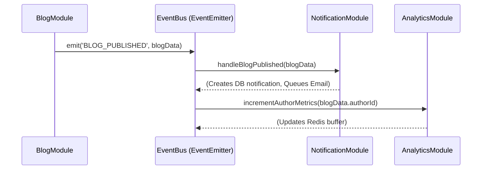
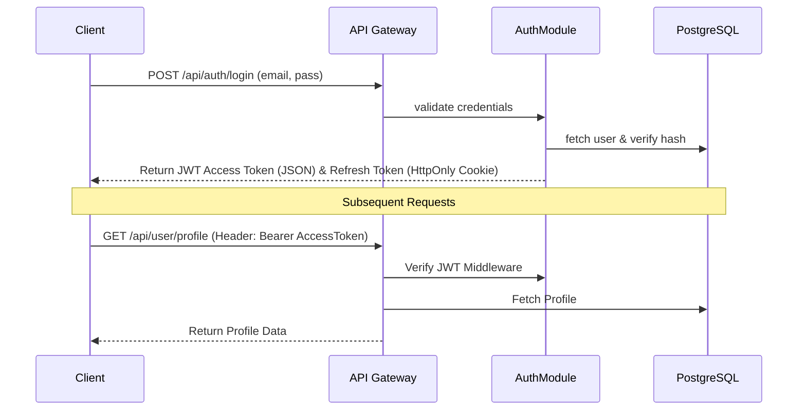
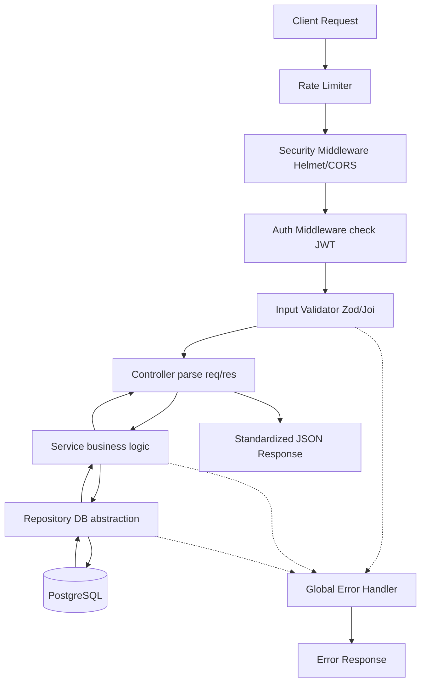
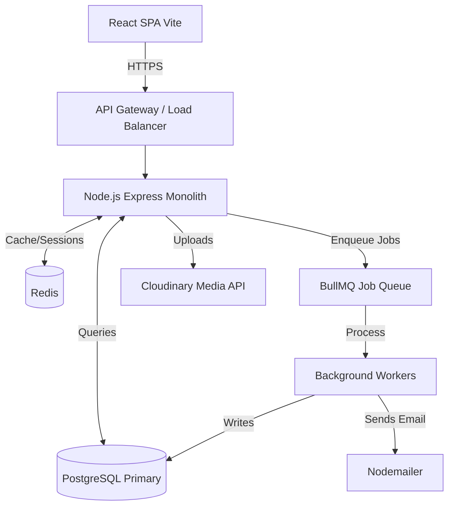
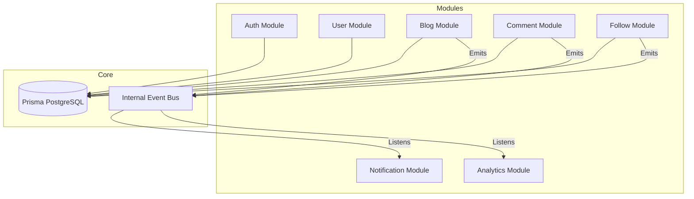
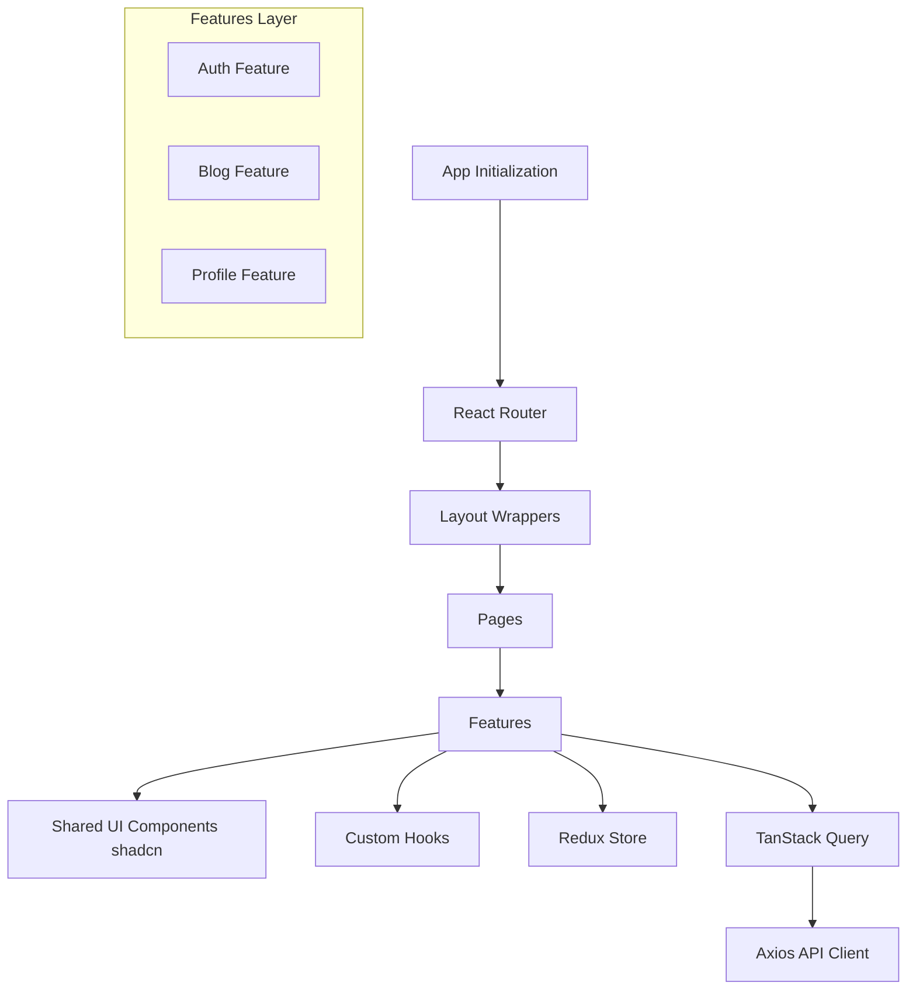

# Blogzilla 2.0 - Software Architecture Document

## 1. High-Level Architecture

Blogzilla 2.0 follows a **Modular Monolith** architecture for the backend and a **Feature-Sliced Design** for the frontend. 

* **Frontend:** React SPA built with Vite, TypeScript, Redux Toolkit for global state, and TanStack Query for server state. 
* **Backend:** Node.js + Express.js, organized into tightly encapsulated domains (modules). 
* **Database:** PostgreSQL managed via Prisma ORM for relational data integrity.
* **Infrastructure Layer:** Redis handles session caching, API response caching, and acts as the broker for BullMQ background jobs. Cloudinary serves as the external media storage, wrapped by a generic storage provider interface.

## 2. Backend Folder Structure

The backend strictly enforces the modular monolith pattern. Each module encapsulates its own routes, controllers, services, and repositories.

```text
src/
├── core/                  # Application-wide core infrastructure
│   ├── config/            # Environment variables & configuration
│   ├── database/          # Prisma client instantiation
│   ├── events/            # Internal Event Bus implementation
│   ├── exceptions/        # Custom AppError classes
│   ├── middlewares/       # Global middlewares (Auth, Error, Logging)
│   ├── providers/         # External integrations (IStorageProvider, IEmailProvider)
│   └── utils/             # Shared utilities
├── modules/               # Independent feature modules
│   ├── auth/              # Routes, Controllers, Services, Repositories, DTOs
│   ├── user/
│   ├── blog/
│   ├── comment/
│   ├── follow/
│   ├── bookmark/
│   ├── notification/
│   ├── analytics/
│   ├── search/
│   └── admin/
├── app.ts                 # Express app setup and middleware wiring
└── server.ts              # Entry point and server initialization
```

## 3. Frontend Folder Structure

The frontend uses a feature-based architecture to maintain cohesion and prevent the "bucket" anti-pattern.

```text
src/
├── app/                   # Global providers, Redux store setup, router initialization
├── assets/                # Static assets (fonts, images)
├── components/            # Global shared UI components (shadcn/ui, buttons, inputs)
├── features/              # Feature-specific modules
│   ├── auth/              # Auth components, API hooks, slice
│   ├── blog/              # Blog editor (Tiptap), feed components, API hooks
│   ├── profile/           # User profile components
│   └── analytics/         # Dashboard charts and metrics
├── hooks/                 # Global shared hooks (useWindowSize, useTheme)
├── layouts/               # Page layout wrappers (MainLayout, AuthLayout)
├── lib/                   # Utility functions, generic API client (Axios fetcher)
├── pages/                 # Top-level route components mapping to URLs
├── routes/                # React Router configuration
└── types/                 # Global TypeScript definitions
```

## 4. Module Responsibilities

* **Authentication:** Handles registration, login, JWT issuance/validation, password resets, and session management.
* **User:** Manages user profiles, avatars, bios, and account deletion.
* **Blog:** Core content module. Manages drafts, publishing, formatting, categories, and tags.
* **Comment:** Manages hierarchical comments (nested/replies) on blogs.
* **Follow:** Manages the graph of followers and followings.
* **Bookmark:** Manages user reading lists and saved blogs.
* **Notification:** Aggregates and delivers in-app and email notifications.
* **Analytics:** Tracks reads, likes, and engagement metrics via buffered writes.
* **Search:** Provides cross-entity search (blogs, users, tags, categories) with PostgreSQL full-text + `pg_trgm` ranking behind a swappable engine interface. See [SEARCH_MODULE.md](./SEARCH_MODULE.md).
* **Media:** Handles parsing, validating, and uploading files via `IStorageProvider`.
* **Admin:** Platform moderation, category management, and user bans.

## 5. Dependency Rules

To prevent the monolith from becoming a "Big Ball of Mud", strict dependency rules apply:
1. **No Circular Dependencies:** Module A can call Module B, but B cannot call A.
2. **Downward Communication:** Modules can depend on `core/`, but `core/` cannot depend on `modules/`.
3. **Cross-Module Communication:** Synchronous communication between modules happens *only* via exposed Module Services (e.g., `BlogService` calling `UserService.getUserById()`). Controllers and Repositories are strictly private to their module.
4. **Asynchronous Communication:** For non-blocking side-effects, modules communicate via the Internal Event Bus (e.g., `BlogModule` emits `BLOG_PUBLISHED`, `NotificationModule` listens).

## 6. Internal Event Flow



## 7. Authentication Flow



## 8. Request Lifecycle



## 9. File Upload Flow

1. Client submits `multipart/form-data` to `/api/media/upload`.
2. `MediaModule` controller uses `multer` (in memory or temp disk) to parse the file.
3. Controller validates file type, size, and dimensions.
4. Controller passes file buffer to `IStorageProvider.upload(file)`.
5. `CloudinaryProvider` (implementing the interface) uploads to Cloudinary and returns the secure URL.
6. Backend returns the URL to the frontend for embedding in Tiptap or updating the user profile.

## 10. Notification Flow

1. Action occurs (e.g., User A follows User B).
2. `FollowService` emits `USER_FOLLOWED` — it knows nothing about notifications.
3. The event is published to the durable `domain_events` queue (not an in-process emitter).
4. The Domain Events Worker dispatches it to registered subscribers.
5. `FollowNotificationSubscriber` builds a NotificationRequest and hands it to the Notification Orchestrator.
6. The orchestrator drops self-notifications, resolves the user's preferences, and persists an In-App Notification.
7. If email is enabled for that type, it writes a PENDING NotificationDelivery and pushes a job to `email_queue`.
8. The Email Worker renders a template and sends via the configured EmailProvider (log in development, Resend in production), then records SENT/FAILED.

See [NOTIFICATION_MODULE.md](./NOTIFICATION_MODULE.md) for the full design.

## 10a. Search Flow

Search is a read-only query module: it owns no writable domain data and calls no
sibling service.

1. `GET /api/v1/search/blogs?q=...` hits a dedicated rate limiter, then `optionalAuth`.
2. The controller validates the query string with Zod (`req.query` is read-only in Express 5).
3. `SearchService` normalizes the query — NFKC, whitespace collapse, length and
   token caps, `LIKE` escaping — and derives a Redis cache key from it.
4. On a cache miss the request goes to `ISearchEngine`. `PostgresSearchEngine` is
   the only implementation today; it holds every line of search SQL.
5. The engine runs one statement: several index-backed candidate sources (full-text,
   title prefix, tag, category, author, and a *gated* trigram fuzzy pass), each capped,
   then a single ranking pass over the union, then a keyset page.
6. Tags and categories for the page load in two batched queries — never per row.
7. The result is cached with a per-scope TTL. Popularity and per-user history are
   recorded fire-and-forget in Redis and can never fail the request.
8. Cache invalidation is event-driven: `BLOG_*`, `USER_*` and `CATEGORY_CREATED`
   bump a per-scope generation counter that is part of every cache key, so
   invalidation is one `INCR` rather than a keyspace scan.

Ranking is deterministic and never falls back to `createdAt DESC`. See
[SEARCH_MODULE.md](./SEARCH_MODULE.md) for the full design, the ranking ladder,
the index set, and the migration path to a dedicated search engine.

## 11. Analytics Flow

To prevent database contention on read/write heavy metrics (like view counts or read times):
1. Client triggers an interaction (e.g., 10 seconds spent reading).
2. Backend API receives telemetry and emits `ANALYTICS_READ_TICK`.
3. `AnalyticsService` increments a counter in **Redis** (e.g., `HINCRBY blog:stats:123 reads 1`).
4. A **BullMQ Cron Job** runs every 5 minutes, pulls aggregated metrics from Redis, and performs a bulk `UPSERT` into PostgreSQL.
5. Redis keys are cleared after successful DB persistence.

## 12. Database Access Strategy

* **Prisma ORM:** Used for schema definition, migrations, and type-safe querying.
* **Repository Pattern:** Prisma Client is never imported directly into Controllers or Services. Instead, Repositories abstract the DB logic (e.g., `UserRepository.findByEmail()`). This allows for easier mocking during tests and centralized query logic.

## 13. Caching Strategy (Redis)

* **Read-Heavy Endpoints:** Responses for endpoints like Home Feed, Trending Blogs, and Public Profiles are cached in Redis as serialized JSON.
* **Invalidation:** Cache entries have a TTL (Time-To-Live). Additionally, relevant write events (e.g., a new blog published) actively purge specific Redis keys (`DEL cache:home_feed`).

## 14. Background Job Strategy (BullMQ)

* **Redis-Backed:** BullMQ uses Redis to maintain job queues (`domain_events`, `email_queue`, `notification_queue`, `media_processing`, `analytics_flush`).
* **Workers:** Dedicated Node.js worker processes (or threads within the monolith, depending on scale) consume jobs.
* **Retries:** Every queue applies `DEFAULT_JOB_OPTIONS` (5 attempts, exponential backoff from 2s). Completed jobs are reaped after an hour; **failed jobs are retained for 24h** for inspection, which serves the DLQ role — there is no separate DLQ queue.

## 15. Error Handling Strategy

* **AppError Class:** A unified custom error class containing `statusCode`, `message`, `isOperational`, and `errorCode`.
* **Centralized Handling:** All errors propagate down to a single Global Error Handling Middleware.
* **Response Format:** 
  ```json
  { "success": false, "error": { "code": "VALIDATION_ERROR", "message": "Invalid email", "details": [...] } }
  ```

## 16. Logging Strategy

* **Library:** Pino (for low-overhead JSON logging).
* **HTTP Logging:** Morgan middleware logs all incoming HTTP requests.
* **Levels:** `info` (normal ops), `warn` (retries, soft failures), `error` (operational errors), `fatal` (crashes).
* **Format:** NDJSON (Newline Delimited JSON) in production for ingestion by log aggregators (e.g., ELK, Datadog). Console readable format in development.

## 17. Security Architecture

* **Authentication:** JWTs signed with RS256/HS256. Short expiry (15m) for Access, long (7d) for HTTP-Only Secure Refresh Cookies.
* **Passwords:** Hashed via bcrypt (cost factor 12) or Argon2.
* **Data Sanitization:** Strict validation using Zod on API boundaries. HTML content (Tiptap) sanitized via `sanitize-html` on the backend before DB insertion, stripping unsafe tags/attributes.
* **Network Security:** Helmet for security headers, strict CORS policy, rate-limiting via Redis (e.g., 100 req/15min per IP, stricter on `/login`).

## 18. API Design Guidelines

* **RESTful Principles:** Nouns for resources (`/blogs`, `/users`), standard HTTP verbs (`GET`, `POST`, `PUT`, `PATCH`, `DELETE`).
* **Versioning:** All routes prefixed with `/api/v1/`.
* **Pagination:** Cursor-based pagination standard for feeds (`?cursor=1234&limit=20`), responding with `{ data: [...], nextCursor: 1235, hasNextPage: true }`.

## 19. Coding Standards

* **TypeScript:** Strict mode enabled. No `any` types.
* **SOLID:** Single responsibility for classes/functions. Interface segregation for providers.
* **Formatting/Linting:** Prettier + ESLint enforced via Husky pre-commit hooks and Commitlint for conventional commits.

## 20. Future Scalability Plan

While starting as a Modular Monolith, the architecture supports future scaling:
1. **Vertical Scaling:** Increase CPU/RAM on the Node.js container.
2. **Horizontal Scaling:** Run multiple instances of the monolithic backend behind a Load Balancer (Redis handles session state).
3. **Database Scaling:** Implement read replicas in PostgreSQL for heavy read operations.
4. **Microservices Extraction:** The strict module boundaries allow extracting high-load modules (e.g., Analytics, Notifications) into independent microservices communicating via RabbitMQ or Kafka in the future.

---

## Architecture Review & Risk Assessment

Before implementation, the following potential design flaws, bottlenecks, and security concerns must be acknowledged:

### 1. Bottlenecks & Scalability Risks
* **Fan-Out on Read (Following Feed):** Currently planned to query the DB for all followed authors at read time. As users follow hundreds of active authors, this `IN (author_ids)` query will become a massive bottleneck. 
  * *Mitigation:* Ensure strict indexing on `author_id` and `created_at`. If metrics indicate slow read times, we must prioritize transitioning to a Fan-Out on Write architecture (pre-computing feeds into Redis lists) earlier than planned.
* **Analytics Buffering Crash Risk:** Buffering analytics in Redis before flushing to PostgreSQL introduces a risk of data loss if the Redis instance crashes before the cron job runs.
  * *Mitigation:* Configure Redis with AOF (Append Only File) persistence, and keep the BullMQ flush interval relatively short (e.g., 1-2 minutes).

### 2. Security Concerns
* **XSS in Rich Text:** Tiptap allows complex HTML generation. If the backend fails to perfectly mirror the frontend's sanitization rules, malicious scripts could bypass validation.
  * *Mitigation:* The backend MUST NOT trust the frontend. The `sanitize-html` backend configuration must explicitly define a whitelist of allowed tags and attributes (e.g., `<a>`, `href`, `<strong>`, `<em>`, ``, `src`).
* **Refresh Token Rotation & Theft:** Storing refresh tokens in HTTP-Only cookies mitigates XSS, but CSRF remains a minor risk, and token theft via physical device access is possible.
  * *Mitigation:* Implement strict Refresh Token Rotation (invalidate old refresh token upon using it to get a new one) and tie tokens to IP/User-Agent families where applicable.

### 3. Complexity & Maintainability
* **Monolith Coupling Drift:** Without strict enforcement, developers tend to bypass interfaces and inject repositories from Module A directly into Module B, destroying the modular architecture.
  * *Mitigation:* Implement strict ESLint rules (e.g., `eslint-plugin-boundaries`) to mechanically prevent cross-module imports outside of defined `service.ts` or `event.ts` boundaries.
* **Event Sourcing Traceability:** Using an internal event bus decouples code, but makes request flows harder to trace (e.g., debugging why a notification wasn't sent requires tracing async events).
  * *Mitigation:* Ensure the Pino logger includes a `correlationId` that is passed through the event bus payload, allowing end-to-end tracing of a user action in the logs.

## Diagrams

### Overall System Architecture



### Backend Module Dependencies



### Frontend Architecture


