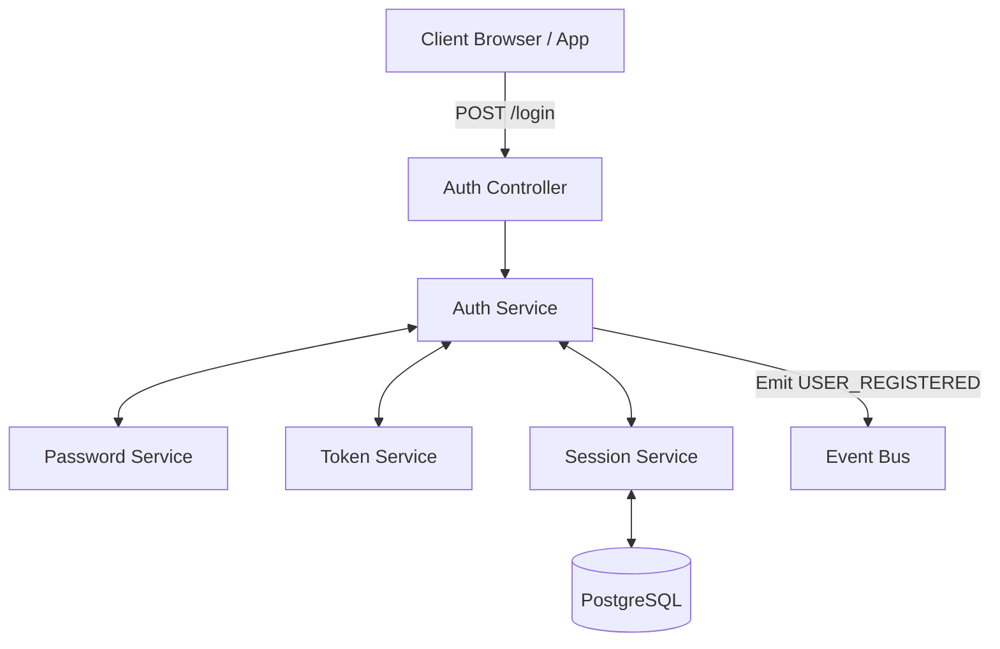
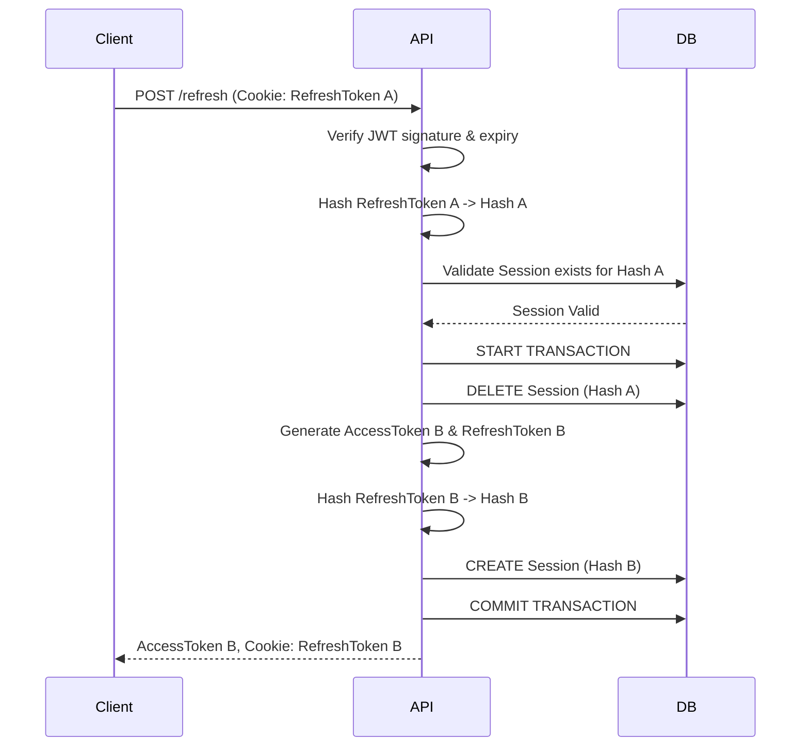

# Authentication Module Documentation

This document outlines the architecture, data flows, and security measures implemented in the Authentication module of Blogzilla 2.0.

## 1. Authentication Flow Architecture

The module utilizes a **Modular Monolith** architecture with strict Separation of Concerns. 

## 2. Token Lifecycle & Flow

We employ a dual-token strategy to maximize security and UX.

### 2.1 Login Flow
1. User provides credentials.
2. `AuthService` verifies credentials via `PasswordService` (Argon2).
3. `TokenService` generates:
   - **Access Token:** (15m expiry, stateless).
   - **Refresh Token:** (7d expiry, long-lived).
4. `SessionService` receives the raw refresh token, hashes it via `TokenService` (SHA-256), and stores the hash in the `Session` DB table alongside device metadata.
5. Controller sends Access Token in JSON body, and Refresh Token in an `HttpOnly`, `Secure`, `SameSite=Strict` cookie.

### 2.2 Refresh Token Rotation Flow

## 3. Session Lifecycle
- **Creation**: Occurs upon valid Login or successful Token Rotation.
- **Validation**: Occurs during `/refresh` or specific session-verification flows.
- **Revocation**:
  - `/logout` removes the specific session tied to the current device.
  - `/logout-all` removes all active sessions for the user.
  - Automatic expiration via `expiresAt`.

## 4. Security Measures Implemented
- **Argon2 Hashing**: GPU-resistant password hashing.
- **Refresh Token Hashing**: Refresh tokens are never stored in plain text. A compromised database yields only useless SHA-256 hashes.
- **Transaction Atomicity**: Session rotation uses database transactions to prevent race conditions or partial failures.
- **Strict Cookies**: Prevents XSS via `HttpOnly` and CSRF via `SameSite=Strict` and restricted cookie `path`.
- **Brute-Force Protection**: A strict Rate Limiter (5 req / 15m) protects `/login` and `/forgot-password`.
- **Stateless Verification**: Protected routes verify Access Tokens without DB hits, maintaining high throughput.
