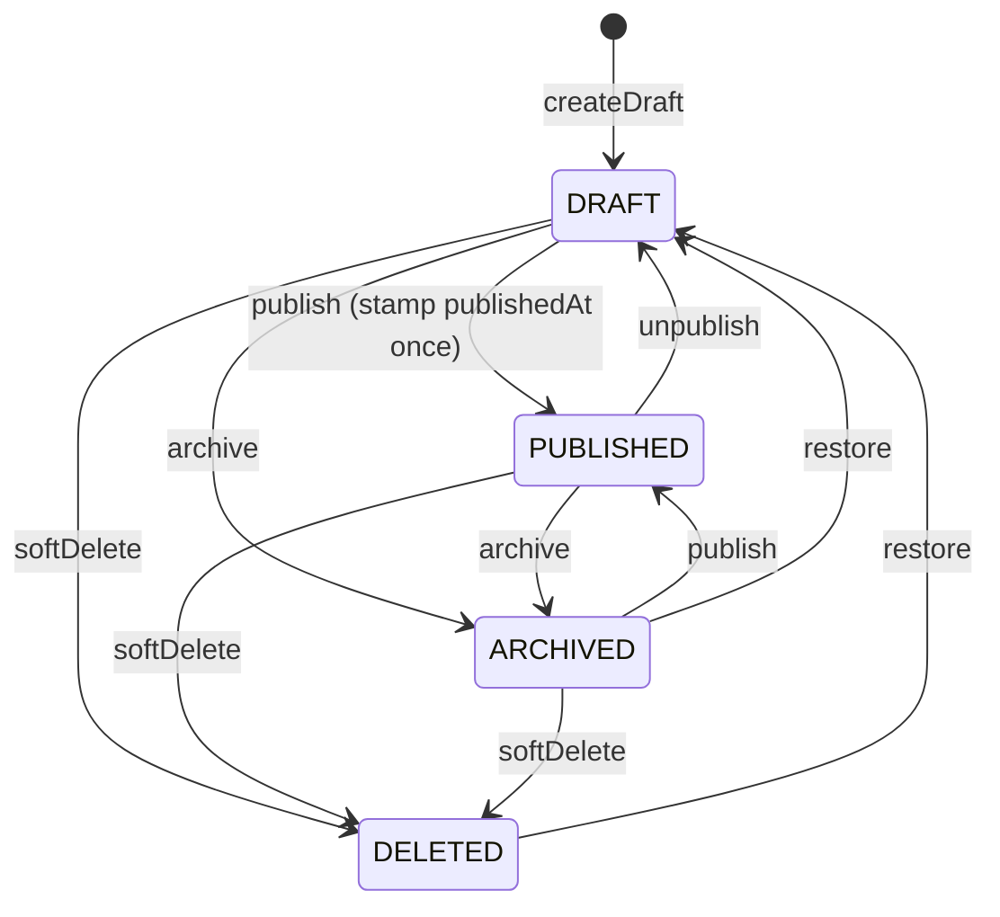
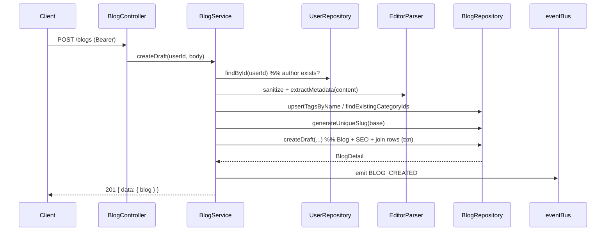
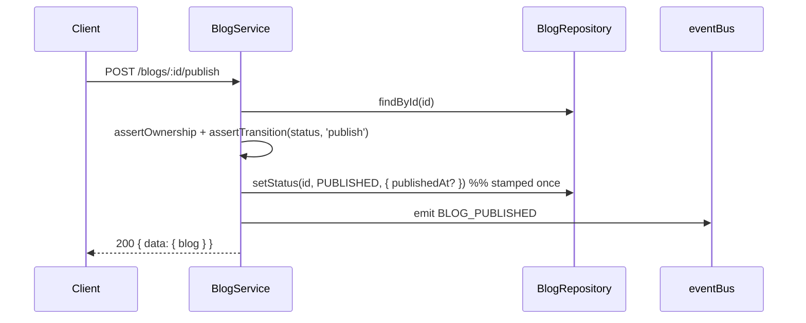
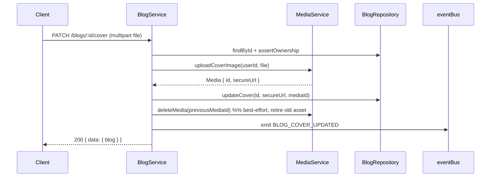

# Blog Module Documentation

The Blog Module is the **core domain** of Narrative — the single source of truth for every blog post, its draft/publish lifecycle, rich content, SEO metadata, reading metadata, categories, tags, cover-image association, and author association.

It integrates with **Authentication** (the authenticated user is the author), **User** (author existence + public author fields), and **Media** (cover-image upload/replace/delete), and communicates outward **only through domain events** (`BLOG_CREATED`, `BLOG_PUBLISHED`, …). It never calls the Comment, Bookmark, Notification, Analytics, Search, or Feed modules directly — those subscribe to its events.

## Responsibilities

The module **owns**:

- Blog lifecycle (draft → publish → unpublish → archive → restore → soft-delete) as a state machine
- Draft management + autosave
- Publishing workflow (`publishedAt` stamped once, on first publish)
- SEO metadata (slug, meta title/description, canonical URL, Open Graph, Twitter cards) with sensible generated defaults
- Rich content (Tiptap JSON, stored editor-agnostically as JSONB)
- Reading metadata (reading time, word/char count, heading/image/code-block counts)
- Categories (admin-curated) and Tags (author get-or-create)
- Cover-image association (via the Media module)
- Author association + author-scoped queries

It deliberately knows **nothing** about:

- Authentication, User profiles, Media storage, Follow relationships (it only *reads* their public surfaces)
- Comments, Bookmarks, Likes, Notifications, Analytics, Search indexing, Feed generation (they subscribe to this module's events)

## Architecture

Follows the established **Modular Monolith** layering; each layer is a class exported as a singleton instance.

- **Repository** — [blog.repository.ts](../backend/src/modules/blog/blog.repository.ts) — all Prisma access, cursor pagination, slug uniqueness, tag get-or-create, category validation, reusable `select` projections.
- **Service** — [blog.service.ts](../backend/src/modules/blog/blog.service.ts) — lifecycle state machine, ownership + visibility access control, SEO defaulting, cover lifecycle, DTO mapping, event emission.
- **Controller** — [blog.controller.ts](../backend/src/modules/blog/blog.controller.ts) — thin HTTP handlers; validates params/query with Zod; response envelope.
- **Validator** — [blog.validator.ts](../backend/src/modules/blog/blog.validator.ts) — Zod schemas for bodies, params, and query strings.
- **Routes** — [blog.routes.ts](../backend/src/modules/blog/blog.routes.ts) — per-route auth; load-bearing route ordering (literal segments before `/:slug`).
- **Shared** — cursor pagination [core/utils/pagination.ts](../backend/src/core/utils/pagination.ts); slug helpers [core/utils/slug.ts](../backend/src/core/utils/slug.ts); editor parser [core/providers/editor/TiptapParser.ts](../backend/src/core/providers/editor/TiptapParser.ts); events [core/events/eventBus.ts](../backend/src/core/events/eventBus.ts).

## Database Design

The `Blog` model ([schema.prisma](../backend/prisma/schema.prisma)) with its SEO row and explicit tag/category join tables:

```prisma
model Blog {
  id         String  @id @default(cuid())
  title      String
  slug       String  @unique
  subtitle   String?
  content    Json?          // Tiptap/ProseMirror document (editor-agnostic)
  coverImage String?        // denormalized secureUrl of the current cover

  status     BlogStatus     @default(DRAFT)      // DRAFT | PUBLISHED | ARCHIVED | DELETED
  visibility BlogVisibility @default(PUBLIC)     // PUBLIC | UNLISTED | PRIVATE | MEMBERS_ONLY

  readingTimeMinutes Int  @default(0)
  wordCount          Int  @default(0)
  charCount          Int  @default(0)
  readingStats       Json?                        // { headingCount, imageCount, codeBlockCount }

  authorId String
  author   User   @relation(fields: [authorId], references: [id])

  coverMediaId String? @unique                    // FK to the cover's Media record (source of truth)
  coverMedia   Media?  @relation("BlogCover", fields: [coverMediaId], references: [id], onDelete: SetNull)

  createdAt   DateTime  @default(now())
  updatedAt   DateTime  @updatedAt
  publishedAt DateTime?

  seo        BlogSEO?
  tags       BlogTag[]
  categories BlogCategory[]

  @@index([slug])
  @@index([authorId])
  @@index([status])
  @@index([status, publishedAt]) // published feed, newest-first cursor
  @@index([authorId, status])    // "my blogs" / "my drafts"
}

model BlogTag      { blogId String; tagId String;      addedAt DateTime @default(now()); @@id([blogId, tagId]);      @@index([tagId]) }
model BlogCategory { blogId String; categoryId String; addedAt DateTime @default(now()); @@id([blogId, categoryId]); @@index([categoryId]) }
```

Design notes:

- **Soft delete is state-machine-based** (`status = DELETED`), consistent with the User module (not a `deletedAt` timestamp like Media). Public reads filter to `PUBLISHED`.
- **`readingStats` is a JSON column** holding the extended structural counts; the three hot core metrics (`readingTimeMinutes`, `wordCount`, `charCount`) remain first-class columns.
- **`coverMediaId`** mirrors `User.avatarMediaId`: the denormalized `coverImage` URL is served on reads, while the FK lets the module retire the previous Media asset cleanly on replace/delete. `onDelete: SetNull` keeps a blog intact if its cover Media is purged.
- **Explicit join tables** (`BlogTag`/`BlogCategory`) over implicit m:n, so per-link metadata (ordering, `addedAt`) can be added without a relational migration. Both cascade-delete with their parents.
- **Tags** are author-created (get-or-create by name; slug derived + de-duplicated). **Categories** are admin-curated (`POST /blogs/categories` is `ADMIN`-only); authors may only attach existing categories.
- **Indexes**: `[status, publishedAt]` serves the public feed's newest-first cursor page; `[authorId, status]` serves author dashboards. `slug @unique` guarantees slug uniqueness at the DB level.

Schema changes are applied with `prisma db push` (this project's workflow); the driver-adapter URL comes from `prisma.config.ts`.

## API Documentation

Base path: `/api/v1/blogs`. Response envelope (success): `{ "success": true, "data": {...}, "meta": {...} }`. Error envelope: `{ "success": false, "error": { "code", "message", "details" } }`.

| Method | Path | Auth | Description |
|---|---|---|---|
| `POST` | `/blogs` | **required** | Create a draft (author = token user). |
| `GET` | `/blogs/me` | **required** | My blogs (optional `?status=`). |
| `GET` | `/blogs/me/drafts` | **required** | My drafts. |
| `GET` | `/blogs/author/:username` | optional | An author's published, public blogs. |
| `GET` | `/blogs/categories` | public | List curated categories. |
| `POST` | `/blogs/categories` | **admin** | Create a category. |
| `GET` | `/blogs/tags` | optional | Tag typeahead (`?q=&limit=`). |
| `GET` | `/blogs/:id/preview` | **required** | Author/admin preview (any status/visibility). |
| `PATCH` | `/blogs/:id/autosave` | **required** | Lightweight draft autosave. |
| `PATCH` | `/blogs/:id/cover` | **required** | Upload/replace cover (`multipart` field `file`). |
| `POST` | `/blogs/:id/publish` | **required** | Publish (DRAFT/ARCHIVED → PUBLISHED). |
| `POST` | `/blogs/:id/unpublish` | **required** | Unpublish (PUBLISHED → DRAFT). |
| `POST` | `/blogs/:id/archive` | **required** | Archive (DRAFT/PUBLISHED → ARCHIVED). |
| `POST` | `/blogs/:id/restore` | **required** | Restore (ARCHIVED/DELETED → DRAFT). |
| `PATCH` | `/blogs/:id` | **required** | Update draft/blog. |
| `DELETE` | `/blogs/:id` | **required** | Soft delete (→ DELETED). |
| `GET` | `/blogs/:slug` | optional | Public read by slug (personalized when authed). |

> **Route ordering & REST note.** Public reads are by SEO `:slug`; mutations/actions are by stable `:id` (slugs can change, ids can't). Literal-segment routes (`/me`, `/author`, `/categories`, `/tags`) are registered **before** the bare `/:slug` route so Express doesn't match them as slugs. Two-segment id routes (`/:id/publish`, …) never collide with single-segment `/:slug`.

### Auth & authorization model

- **The author is always `req.user.userId`** — never taken from the body — so a blog is structurally created "as yourself".
- **Ownership** (author *or* admin) is enforced in the service (`assertOwnership`) for every mutation, preview, publish, etc. → `403 FORBIDDEN` otherwise.
- **Category creation** is gated at the route with `requireRole(['ADMIN'])`.
- **Public reads** use `optionalAuth`; a present token personalizes access (owner sees drafts, members see `MEMBERS_ONLY`).

### Public-read access-control matrix (`GET /blogs/:slug`)

| status \ visibility | PUBLIC | UNLISTED | PRIVATE | MEMBERS_ONLY |
|---|---|---|---|---|
| **PUBLISHED** | anyone | anyone (by link) | author/admin | any authenticated user |
| **DRAFT / ARCHIVED** | author/admin | author/admin | author/admin | author/admin |
| **DELETED** | 404 | 404 | 404 | 404 |

Anything not visible returns **`404 BLOG_NOT_FOUND`** (never `403`) so hidden blogs don't leak their existence.

### `POST /blogs` → `201`

```jsonc
// request
{ "title": "My First Blog", "content": { "type": "doc", "content": [] },
  "tags": ["typescript"], "categoryIds": ["cat_123"], "visibility": "PUBLIC" }
// response
{ "success": true, "data": { "blog": { "id": "clx…", "slug": "my-first-blog", "status": "DRAFT",
  "readingStats": { "headingCount": 0, "imageCount": 0, "codeBlockCount": 0 }, "seo": { … } } },
  "meta": { "message": "Draft created" } }
```

Errors: `400 VALIDATION_ERROR`, `400 INVALID_CATEGORY`, `401 UNAUTHORIZED`, `404 USER_NOT_FOUND`.

### `GET /blogs/:slug` (and `GET /blogs/me`)

List endpoints take `?cursor=<opaque>&limit=<1..100>` and return `meta: { nextCursor, hasNextPage, totalCount }`. The detail response embeds the flattened `author`, `tags`, `categories`, effective `seo`, and `readingStats`.

### Business rules

- **Slug** is generated from the title with incremental numbering — `my-first-blog`, `my-first-blog-2`, … (no random suffixes). Uniqueness is guarded by `slug @unique` + a `P2002` retry.
- **Reading metadata** is recomputed by the EditorParser on every content change.
- **SEO defaults** are computed at read time from stored overrides + the blog (see below), so custom SEO is never clobbered by an edit.
- **Lifecycle transitions** are validated against the state machine → `409 INVALID_TRANSITION` on an illegal move.
- **Autosave** is DRAFT-only (`409 NOT_A_DRAFT` otherwise) and emits no event.

## SEO default generation

SEO overrides are persisted as-is (empty → `null`); the **effective** SEO is derived on read:

| Field | Default when override absent |
|---|---|
| `metaTitle` | blog `title` |
| `metaDescription` | `subtitle` → else first ~160 chars of plain text |
| `ogTitle` / `ogDescription` | the effective `metaTitle` / `metaDescription` |
| `ogImage` | blog `coverImage` |
| `twitterCard` | `summary_large_image` |
| `canonicalUrl` | `null` (override-only; no public base URL configured) |

## Event Flow

Emitted via the central `eventBus` ([core/events/eventBus.ts](../backend/src/core/events/eventBus.ts)) as fire-and-forget. This module only **emits**; Comment/Bookmark/Notification/Analytics/Search/Feed subscribe independently.

| Event | Emitted when | Payload |
|---|---|---|
| `BLOG_CREATED` | a draft is created | `{ blogId, authorId, slug }` |
| `BLOG_UPDATED` | a blog is updated | `{ blogId, authorId }` |
| `BLOG_PUBLISHED` | a blog is published | `{ blogId, authorId, slug, publishedAt }` |
| `BLOG_UNPUBLISHED` | a blog returns to draft | `{ blogId, authorId }` |
| `BLOG_ARCHIVED` | a blog is archived | `{ blogId, authorId }` |
| `BLOG_RESTORED` | a blog is restored | `{ blogId, authorId, status }` |
| `BLOG_DELETED` | a blog is soft-deleted | `{ blogId, authorId }` |
| `BLOG_COVER_UPDATED` | the cover changes | `{ blogId, authorId, coverImage }` |

Autosave is intentionally silent (no event) to avoid downstream churn.

## State Machine



Any (action, status) pair not in this diagram → `409 INVALID_TRANSITION`.

## Sequence Diagrams

### Create draft



### Publish



### Cover upload



## Integration Points

- **Authentication** — `requireAuth` / `optionalAuth` / `requireRole(['ADMIN'])` ([requireAuth.ts](../backend/src/core/middlewares/requireAuth.ts)); the author is always the token user.
- **User** — `userRepository.findById` (author existence) and `userRepository.findByUsername` (author page); the public author projection `{ id, username, name, avatar, bio, isVerified }` is embedded in every blog payload.
- **Media** — `mediaService.uploadCoverImage` / `deleteMedia`; the Blog module never touches storage/Cloudinary directly and retires previous cover assets through the Media lifecycle.
- **Follow** — *not called.* The author relationship is exposed cleanly (`findByAuthor`, author-embedded payloads) so a future Feed module can orchestrate Blog + Follow.

## Performance & Scalability

- **Cursor pagination** (`take: limit + 1`, `cursor: { id }`, `skip: 1`) — constant page cost regardless of depth.
- **Composite indexes** `[status, publishedAt]` and `[authorId, status]` serve the feed and dashboards index-ordered; counts run in parallel with the page fetch (`Promise.all`).
- **Lean list projection** (`blogCardSelect`) omits the heavy `content` JSON from list queries; the full body is only read on detail/preview.
- **No N+1** on tags/categories — they are selected in the same query as the blog.
- **Full-text-search ready** — plain text is extractable via the EditorParser and `readingStats` is stored; a GIN/tsvector index and search endpoint are deferred to the Search module without touching this schema.

## Future Extension Points

- **Comment / Bookmark / Like modules** — subscribe to `BLOG_*` events; the `Comment`/`Like`/`Bookmark` models already relate to `Blog`.
- **Feed module** — orchestrate `BlogRepository.findByAuthor` + `FollowRepository.getFollowing` to build a following feed; no change to this module.
- **Search module** — add a tsvector column + GIN index and subscribe to `BLOG_PUBLISHED`/`BLOG_UPDATED` to index content.
- **`MEMBERS_ONLY` refinement** — currently any authenticated user; gate on a real membership/subscription check in `canView` (single enforcement point).
- **Scheduled publishing** — a `scheduledAt` column + a worker that transitions DRAFT → PUBLISHED; the state machine is the single place to gate it.
- **Per-link tag ordering** — the explicit `BlogTag`/`BlogCategory` join rows can carry an `order` field with no relational migration.
```
