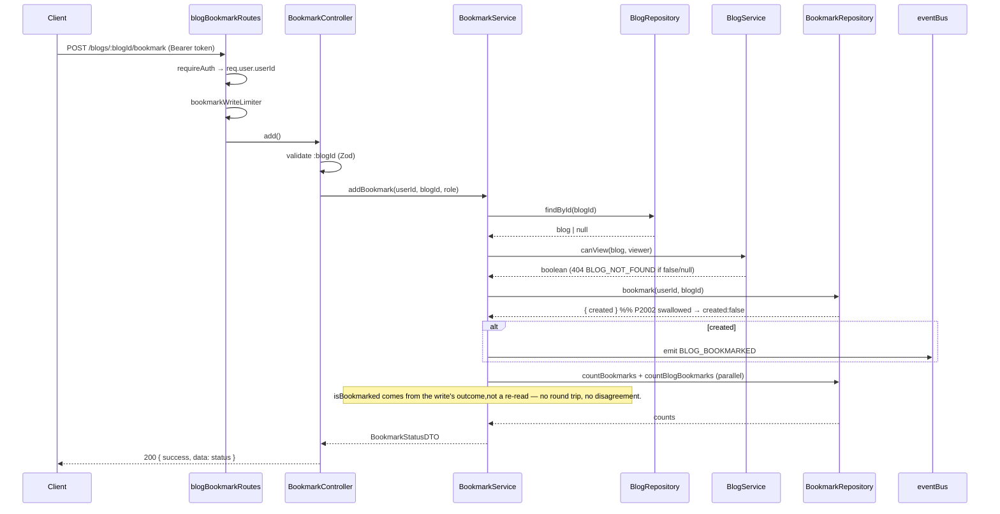
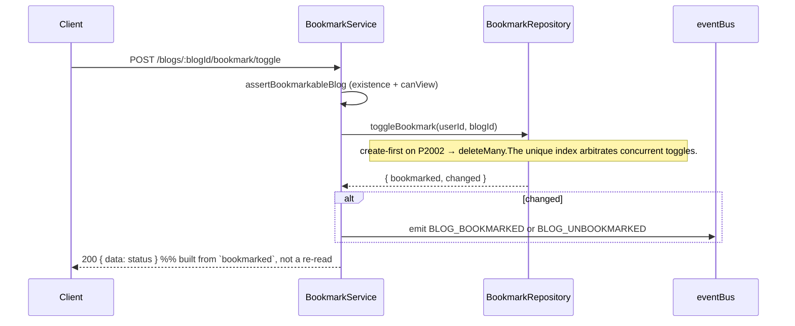
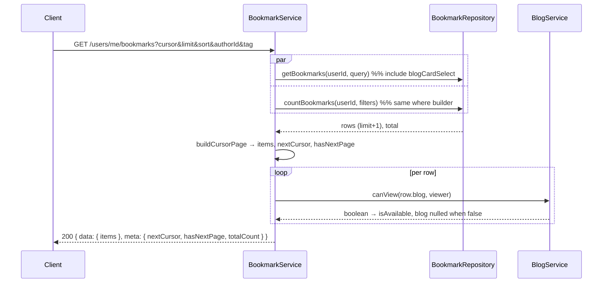

# Bookmark Module Documentation

The Bookmark Module owns the **save-for-later graph** of Narrative — every bookmark a user places on a blog. It is the single source of truth for what a reader has saved, and exposes the read models (bookmark library, bookmark status, counts) that reading lists, dashboards, recommendations, and analytics consume.

It communicates outward **only through domain events** (`BLOG_BOOKMARKED`, `BLOG_UNBOOKMARKED`); it never calls the Notification, Analytics, Recommendation, or Search modules directly.

## Responsibilities

The module owns:

- Bookmark a blog
- Remove a bookmark
- Toggle a bookmark
- Bookmark status (for a viewer + blog)
- The user's bookmark library (paginated, sortable, filterable)
- Bookmark statistics (per-user count)

It deliberately knows **nothing** about:

- Blogs (owned by the **Blog** module — this module reads existence, a lean card projection, and delegates the visibility decision)
- Users (owned by the **User** module — ownership comes from the auth token, so no user lookup is needed at all)
- Media (cover images arrive through the Blog module's denormalized `coverImage`; `MediaService` is never called)
- Notifications, analytics, recommendations, search, reading history (they subscribe to this module's events)

There is **no dependency** on the Follow or Comment modules.

## Architecture

Follows the established **Modular Monolith** layering; each layer is a class exported as a singleton instance.

- **Repository** — [bookmark.repository.ts](../backend/src/modules/bookmark/bookmark.repository.ts) — all Prisma access, cursor pagination, idempotent writes, the shared filter builder, batched enrichment lookups.
- **Service** — [bookmark.service.ts](../backend/src/modules/bookmark/bookmark.service.ts) — business rules (blog existence, visibility, idempotency), DTO mapping, availability re-checks, event emission.
- **Controller** — [bookmark.controller.ts](../backend/src/modules/bookmark/bookmark.controller.ts) — thin HTTP handlers; validates params/query with Zod; response envelope.
- **Validator** — [bookmark.validator.ts](../backend/src/modules/bookmark/bookmark.validator.ts) — Zod schemas for the `:blogId` param and the library query.
- **Routes** — [bookmark.routes.ts](../backend/src/modules/bookmark/bookmark.routes.ts) — **two routers**: blog-scoped actions and the user-scoped library.
- **Shared** — cursor pagination primitives from [core/utils/pagination.ts](../backend/src/core/utils/pagination.ts); the blog card projection `blogCardSelect` from [blog.repository.ts](../backend/src/modules/blog/blog.repository.ts); the visibility guard `blogService.canView` from [blog.service.ts](../backend/src/modules/blog/blog.service.ts).

### Why two routers

The module's endpoints straddle two mounts, so — exactly as the Comment module does — it exports two routers rather than splitting the logic across modules:

- `blogBookmarkRoutes` mounts on `/api/v1/blogs`. Its paths are two-segment (`/:blogId/bookmark`), so they never collide with the Blog router's `/:slug` route.
- `userBookmarkRoutes` mounts on `/api/v1/users`, registered **before** `userRoutes` so `/me/bookmarks` is matched ahead of that router's `/:username` route.

Auth is applied **per route**, never via `router.use()`, so it cannot leak onto a sibling router sharing the same mount.

## Database Design

The `Bookmark` model ([schema.prisma](../backend/prisma/schema.prisma)) is a join between `User` and `Blog`:

```prisma
model Bookmark {
  id String @id @default(cuid())

  blogId String
  blog   Blog   @relation(fields: [blogId], references: [id], onDelete: Cascade)

  userId String
  user   User   @relation(fields: [userId], references: [id], onDelete: Cascade)

  createdAt DateTime @default(now())

  @@unique([blogId, userId])   // prevents duplicate bookmarks
  @@index([userId, createdAt]) // "my bookmarks" list + per-user count
  @@index([blogId])            // per-blog bookmark count + cascade deletes
}
```

Design notes:

- **Composite unique `(blogId, userId)`** makes a duplicate bookmark a no-op at the database level (the repository catches the `P2002` violation). Note the field order — the Prisma compound key is `blogId_userId`, *not* `userId_blogId`.
- **Cascade deletes** on both foreign keys: deleting a user removes their whole library; hard-deleting a blog removes every bookmark pointing at it.
- **Composite `(userId, createdAt)` index** makes the library's cursor pagination index-ordered in **both** sort directions and also covers the single-column `userId` count query (leftmost-prefix rule) — the same treatment the Follow module received.
- **`@@index([blogId])`** is retained for the reverse direction (per-blog bookmark counts) and to keep cascade deletes cheap.
- **No collection/folder columns.** Future organisation features land in a separate table so this hot index stays narrow — see [Future Extension Points](#future-extension-points).

Schema changes are applied with `prisma db push` in development.

## API Documentation

Base paths: `/api/v1/blogs` (blog-scoped actions) and `/api/v1/users` (the library).

Response envelope (success): `{ "success": true, "data": {...}, "meta": {...} }`
Error envelope: `{ "success": false, "error": { "code", "message", "details" } }`

| Method | Path | Auth | Description |
|---|---|---|---|
| `POST` | `/blogs/:blogId/bookmark` | **required** | Bookmark `:blogId`. Idempotent. |
| `DELETE` | `/blogs/:blogId/bookmark` | **required** | Remove the bookmark. Idempotent. |
| `POST` | `/blogs/:blogId/bookmark/toggle` | **required** | Flip the bookmark, return the new state. |
| `GET` | `/blogs/:blogId/bookmark-status` | **required** | Viewer's bookmark state + library size. |
| `GET` | `/users/me/bookmarks` | **required** | The viewer's own paginated library. |

### Auth model

**Every** endpoint requires a valid `Authorization: Bearer <token>` — a bookmark library is private to its owner, so unlike the Follow module there is no `optionalAuth` or anonymous surface here.

The bookmark owner is **always** the authenticated user (`req.user.userId`), never taken from the body or params, which structurally guarantees "users can only bookmark as themselves" and "users can only read their own library". There is deliberately **no route** for reading another user's bookmarks; `GET /users/:userId/bookmarks` does not exist and returns `404`.

Admins do not get a bypass on read: the endpoints are scoped to `/me`, so an admin sees their own library like anyone else. The `role` from the token is used only when evaluating blog visibility (an admin may bookmark a blog a regular user could not see).

### `POST` / `DELETE /blogs/:blogId/bookmark` → `200`

```jsonc
{
  "success": true,
  "data": {
    "isBookmarked": true,
    "viewerBookmarksCount": 42,  // blogs THIS viewer has saved in total
    "blogBookmarksCount": 9      // users who have saved THIS blog
  },
  "meta": { "message": "Bookmarked successfully" }
}
```

Errors: `404 BLOG_NOT_FOUND`, `401 UNAUTHORIZED`, `429 TOO_MANY_REQUESTS`.

The two counts are named for their subject rather than sharing a bare `bookmarksCount`. On a blog-scoped route that name is genuinely ambiguous — some callers read it as "how many people saved this blog", others as "how many blogs have I saved" — and renaming it after clients depend on it would be a breaking change.

`isBookmarked` reflects the state the request itself produced, taken from the write's own outcome rather than a follow-up read. That saves a round trip and guarantees the response can never contradict the event emitted alongside it.

### `POST /blogs/:blogId/bookmark/toggle` → `200`

Same envelope. `data.isBookmarked` reports the **resulting** state, and `meta.message` reflects the direction the toggle went. Gated by the same visibility check as `POST .../bookmark`, since a toggle can create a row.

### `GET /blogs/:blogId/bookmark-status` → `200`

```jsonc
{
  "success": true,
  "data": { "isBookmarked": true, "viewerBookmarksCount": 42, "blogBookmarksCount": 9 }
}
```

Gated by the **same visibility check as the writes**: a blog the viewer could not bookmark returns `404` here too. Without that, a client would render an enabled bookmark button from a `200` and the follow-up `POST` would 404.

### `GET /users/me/bookmarks`

Query parameters:

| Param | Type | Default | Notes |
|---|---|---|---|
| `cursor` | string | — | `id` of the last item from the previous page. |
| `limit` | int `1..100` | `20` | Shared pagination cap (`MAX_PAGE_LIMIT`). |
| `sort` | `recent` \| `oldest` | `recent` | Orders by **when the bookmark was saved**, not by publish date. |
| `authorId` | string | — | Only bookmarks whose blog has this author. |
| `tag` | string (≤50) | — | Only bookmarks whose blog carries this tag slug. |

```jsonc
{
  "success": true,
  "data": {
    "items": [
      {
        "bookmarkId": "clx...",
        "bookmarkedAt": "2026-07-13T10:00:00.000Z",
        "isAvailable": true,
        "blog": {
          "id": "clx...", "title": "Deep Dive", "slug": "deep-dive",
          "coverImage": "https://cdn/…/cover.png",
          "readingTimeMinutes": 7,
          "author": { "id": "clx...", "username": "ada", "name": "Ada", "avatar": null, "isVerified": true },
          "publishedAt": "2026-06-01T00:00:00.000Z",
          "visibility": "PUBLIC"
        }
      },
      {
        "bookmarkId": "clx...",
        "bookmarkedAt": "2026-07-01T10:00:00.000Z",
        "isAvailable": false,   // blog was deleted or made private since
        "blog": null            // nothing about the hidden blog leaks
      }
    ]
  },
  "meta": { "nextCursor": "clx...", "hasNextPage": true, "totalCount": 128 }
}
```

The card is deliberately lean — the blog's `content` JSON is **never** returned, so a library page stays cheap for a user with thousands of bookmarks.

`totalCount` is computed with the **same filters** as the page (one shared `where` builder in the repository), so the two can never contradict each other.

### Business rules

- **Bookmarking twice is idempotent** → `200`, no duplicate row, event emitted only on the first (creating) call.
- **Removing a non-existent bookmark is idempotent** → `200`, no event.
- **The blog must exist** → `404 BLOG_NOT_FOUND`.
- **Deleted blogs cannot be bookmarked** → `404` (a `DELETED` blog never passes `canView`).
- **Private blogs respect visibility** — the module delegates to `blogService.canView`, the Blog module's single visibility matrix, rather than re-implementing it. A blog the viewer may not see returns **`404`, never `403`**, so the existence of a hidden blog is not leaked.
- **Removal never checks the blog.** A user must always be able to clear a bookmark whose blog was since deleted or restricted, so `DELETE` performs no blog lookup at all.

### Stale bookmarks

A blog that was public when bookmarked may later be deleted or made private. Those rows are **not** silently dropped from the library — dropping them would make bookmarks appear to vanish with no explanation and leave the user no way to tidy up. Instead each row is re-checked against `canView` at read time and returned with `isAvailable: false` and `blog: null`, so the client can render "this post is no longer available" and offer to remove it, while the title, slug and author of a now-hidden blog stay invisible.

If the blog becomes visible again (unarchived, re-published, visibility widened), the same bookmark simply starts resolving again — no repair job needed.

## Event Flow

Events are emitted via the central `eventBus` ([core/events/eventBus.ts](../backend/src/core/events/eventBus.ts)) as fire-and-forget. This module only **emits**; consumers (Notification, Analytics, Recommendation, Search) subscribe independently.

| Event | Emitted when | Payload |
|---|---|---|
| `BLOG_BOOKMARKED` | a new bookmark row is created | `{ blogId, userId }` |
| `BLOG_UNBOOKMARKED` | an existing bookmark row is removed | `{ blogId, userId }` |

Idempotent no-ops (re-bookmark / re-remove) emit **nothing**, so downstream consumers never see phantom events.

A toggle emits **at most one** event, and only when that call actually mutated the row. Two simultaneous toggles against an existing bookmark both fail the insert on the unique constraint and both attempt the delete; only one removes a row. The repository reports `changed` alongside the resulting state so the losing side stays silent — otherwise a single removal would emit `BLOG_UNBOOKMARKED` twice and any listener maintaining a counter would drift negative.

## Sequence Diagrams

### Bookmark a blog



### Toggle a bookmark



### Paginated library with availability re-check



## Integration Points

| Module | Direction | Nature of the dependency |
|---|---|---|
| **Authentication** | inbound | `requireAuth` on every route; `req.user` supplies the owner and the role used for visibility. |
| **Blog** | outbound (read-only) | `blogRepository.findVisibilityById` for existence; `blogCardSelect` reused verbatim for the card projection; `blogService.canView` for the visibility decision. No blog business logic is modified or duplicated. |
| **User** | none | Ownership comes from the token, so no user lookup is performed. |
| **Media** | none (indirect) | Cover images arrive as Blog's denormalized `coverImage` URL. `MediaService` is never called and no Media join is issued. |
| **Follow / Comment** | none | No dependency in either direction. |
| **Notification / Analytics / Search** | outbound (events only) | They subscribe to `BLOG_BOOKMARKED` / `BLOG_UNBOOKMARKED`; this module never calls them. |

Two additive changes were made to the Blog module; neither alters existing behaviour:

- `BlogService.canView` was promoted from `private` to public and its parameter widened to a structural `ViewableBlog`, so the visibility matrix has exactly one implementation. Its body and existing call site are unchanged.
- `blogVisibilitySelect` / `blogRepository.findVisibilityById` were added — an access-control projection carrying only the three fields `canView` reads. Without it, an existence check would pull `blogDetailSelect` and drag an entire article's Tiptap JSON (plus its SEO and tag joins) across the wire on every bookmark write, for a decision that never renders the blog.

## Performance & Scalability

- **Cursor pagination** (`take: limit + 1`, `cursor: { id }`, `skip: 1`) — no `OFFSET` scan, so page cost is constant regardless of depth. The `(createdAt, id)` tiebreaker keeps the ordering total, so a cursor can never skip or repeat a row.
- **Composite `(userId, createdAt)` index** serves the library page in both sort directions and covers the count query.
- **Minimal payloads** — `blogCardSelect` excludes the blog `content` JSON; the DTO narrows further to the fields a card actually renders.
- **No N+1** — the blog card is fetched via a single `include` join, and the per-row availability check is pure in-memory logic against fields already selected, not an extra query.
- **Counts run in parallel** with the page fetch (`Promise.all`), and the write paths derive `isBookmarked` from the write's own outcome instead of re-reading it — one fewer round trip per write.
- **Access-control lookups are lean** — `findVisibilityById` selects four columns, so gating a write never loads article content.
- **`getBookmarkedSubset`** is available for annotating blog feeds with `isBookmarked` in one batched query when the Blog module wants it.
- **Concurrency** — writes are create-first and lean on the unique index, so simultaneous double-clicks converge instead of double-inserting.
- **Rate limiting** — `bookmarkWriteLimiter` (60 writes/min/IP, Redis namespace `rl:bookmark:`) curbs toggle-spam without hampering a reader saving a burst of posts.

### Known trade-offs

**Counts on every write.** Each add/remove/toggle returns both counts, so a write costs a visibility lookup, the write itself, and two parallel indexed `COUNT`s. Both counts are index-served and the `exists` re-read was eliminated (the write's outcome is authoritative), but a `COUNT` is still O(rows) — a user with tens of thousands of saves scans their whole library on every button tap. This matches the Follow module, which returns counts on every follow/unfollow. If it becomes hot, denormalize `bookmarksCount` onto `User` and `Blog` and update it inside the write; the repository is the only writer, so the change stays local.

**Unavailable rows occupy page slots.** Hidden blogs are mapped to `isAvailable:false` after the fetch rather than filtered in SQL, so a user whose saves have all gone private can receive a full page of 20 unavailable items, and `totalCount` includes rows they cannot see. This is the deliberate consequence of surfacing stale bookmarks instead of silently dropping them — clients doing infinite scroll should expect pages that render mostly "no longer available" cards and should not treat an all-unavailable page as the end of the list.

**Filters are not index-covered.** The `authorId` / `tag` filters are **not** covered by the bookmark index — they resolve through a nested join on `Blog`, so Postgres filters within the user's bookmark set. That is comfortable at hundreds of bookmarks and acceptable at thousands; if filtered library views become hot at much larger scale, the fix is a covering index on the joined columns or denormalizing `authorId` onto `Bookmark`. The repository is the only place that builds the `where`, so that change is localized.

## Future Extension Points

The architecture accommodates the following **without breaking the existing API**:

- **Bookmark folders / collections / reading lists** — add a `BookmarkCollection` table plus a `BookmarkCollectionItem` join, rather than columns on `Bookmark`. That keeps the hot `(userId, createdAt)` index narrow and lets one bookmark live in several collections. The API stays additive: an optional `?collectionId=` on the list endpoint and an optional body field on create.
- **Favorites** — a boolean or a reserved system collection; either way the list query grows one optional filter, and the shared `where` builder is the single place to extend.
- **Tags on bookmarks** (user-authored, distinct from blog tags) — a `BookmarkTag` join; the existing `tag` filter already establishes the query shape.
- **Shared collections** — an ownership/visibility column on the collection table; the per-row `canView` re-check in the service is the natural place to gate blogs inside a shared list.
- **Offline reading sync** — the `bookmarkedAt` timestamp plus cursor pagination already supports a delta sync; add an `updatedAt` and a `?since=` filter.
- **Notification / Analytics / Recommendation subscribers** — add `eventBus.on(EVENTS.BLOG_BOOKMARKED, …)` listeners in their own modules; no change to this module.
- **Per-blog bookmark counts on blog cards** — `@@index([blogId])` already serves it; expose via the Blog module using `bookmarkRepository.getBookmarkedSubset` / a count query.
