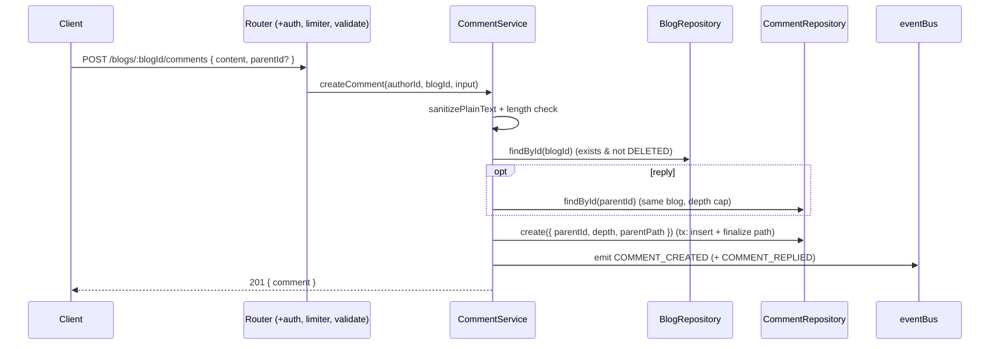
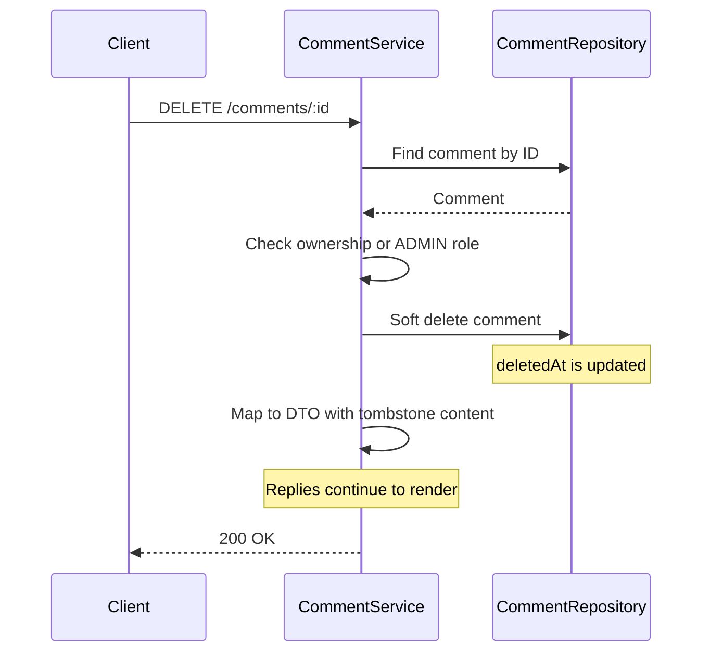

# Comment Module

The discussion system for Narrative. It provides **nested, threaded comments** on
blogs with editing, soft deletion, moderation, and event emission — built to the
same modular-monolith conventions as the Blog/Follow modules (routes → controller
→ service → repository → validator, plain module-singleton DI, cursor pagination,
central `eventBus`, single `AppError`).

- Source: [`backend/src/modules/comment/`](../backend/src/modules/comment/)
- Mounted at `/api/v1/blogs/:blogId/comments` and `/api/v1/comments`

---

## Responsibilities

Owns: comment creation, nested replies, editing, soft deletion & restore, moderation
(hide), retrieval, comment-tree construction, and comment statistics.

Does **not** own: blogs, users, notifications, likes/reactions, analytics. It reads
the Blog/User modules for validation and public author data and emits domain events
that future Notification/Analytics modules subscribe to — it never calls them directly.

---

## Database design

The `Comment` model (see [`prisma/schema.prisma`](../backend/prisma/schema.prisma)):

| Field | Type | Purpose |
|---|---|---|
| `id` | `String @id @default(cuid())` | Primary key / cursor / path segment |
| `content` | `String @db.Text` | Plain-text body (sanitized) |
| `blogId` | `String` → `Blog` (Cascade) | Owning blog |
| `authorId` | `String` → `User` (Cascade) | Comment author |
| `parentId` | `String?` → `Comment` (Cascade) | Parent comment (null = top-level) |
| `depth` | `Int @default(0)` | Nesting level; drives the max-depth cap |
| `path` | `String @default("")` | Materialized ancestor path `"<rootId>/…/<selfId>"` |
| `isEdited` / `editedAt` | `Boolean` / `DateTime?` | Edit tracking (future-ready for history) |
| `deletedAt` | `DateTime?` | Soft-delete tombstone |
| `isHidden` | `Boolean @default(false)` | Moderation hide flag |
| `createdAt` / `updatedAt` | `DateTime` | Timestamps |

**Indexes** (chosen for the actual access paths):

- `@@index([blogId, parentId, createdAt])` — top-level page (`parentId IS NULL`) with stable ordering.
- `@@index([parentId, createdAt])` — direct-children page and the BFS descendant load.
- `@@index([authorId])` — author's comments.
- `@@index([blogId, deletedAt])` — per-blog non-deleted count.

Schema is applied with `npx prisma db push` (the project's de-facto workflow; the
`prisma/migrations/` dir is drifted and `migrate dev` is not used here).

---

## Nested-comment strategy

**Model:** adjacency list (`parentId`) augmented with a stored `depth` and a
materialized `path`. `depth` powers the depth cap; `path` is a cheap structural
cycle guard and a future O(1) subtree fetch (`WHERE path startsWith <root>`).

**Configurable cap:** `MAX_COMMENT_DEPTH` (default **5**, 0-indexed) in
[`comment.validator.ts`](../backend/src/modules/comment/comment.validator.ts).

**Depth-cap behavior:** when replying to a comment already at the cap, the new
comment does **not** nest further — it attaches to that comment's parent (the
deepest allowed parent) and stays at `MAX_COMMENT_DEPTH`. So the schema supports
unlimited nesting, but runtime depth is bounded.

**Cycle safety:** cycles are structurally impossible — a brand-new node can never
be an ancestor of an existing one, and `parentId` is never mutated after creation
(edits touch content only).

**Retrieval without N+1 — bounded BFS:** to load a subtree we breadth-first sweep
one query per depth level (`findChildrenByParentIds(parentIds[])` → `WHERE parentId IN (…)`),
capped at `MAX_COMMENT_DEPTH` iterations. Total queries for a page = `1` (roots) `+ 1`
(count) `+ ≤ MAX_COMMENT_DEPTH` (levels) — **bounded by depth, not by comment count**.
The flat rows are assembled into a tree in memory by `buildCommentTree` (pure, O(n)).
Authors are embedded in each query via the shared `blogAuthorSelect` projection, so
there is no per-comment author fetch.

**Soft-deleted and hidden comments stay in the tree** as tombstones ("This comment
has been deleted." / "…hidden by a moderator.") so their children remain visible.

---

## API reference

All responses use the standard envelope `{ success, data, meta }`; errors use
`{ success:false, error:{ code, message, details? } }`. Paginated endpoints take
`?cursor=<id>&limit=<1..100>` and return `meta:{ nextCursor, hasNextPage, totalCount }`.

| Method | Path | Auth | Body / Query | Notes |
|---|---|---|---|---|
| POST | `/blogs/:blogId/comments` | required + write-limiter | `{ content, parentId? }` | Top-level, or a reply if `parentId` set |
| GET | `/blogs/:blogId/comments` | optional | `?cursor&limit&tree` | `tree=true` (default) eager subtree; `tree=false` roots + `replyCount` |
| GET | `/comments/:id` | optional | — | Single comment with its subtree |
| PATCH | `/comments/:id` | required | `{ content }` | Author or ADMIN; sets `isEdited` |
| DELETE | `/comments/:id` | required | — | Soft delete; author or ADMIN |
| POST | `/comments/:id/reply` | required + write-limiter | `{ content }` | Reply to a comment |
| POST | `/comments/:id/restore` | ADMIN | — | Clears the soft-delete tombstone |
| POST | `/comments/:id/hide` | ADMIN | `{ reason? }` | Moderation hide |
| GET | `/comments/:id/replies` | optional | `?cursor&limit` | Cursor page of direct children (lazy expansion) |

**Comment shape:** `{ id, content, blogId, authorId, parentId, depth, author{…public},
isEdited, editedAt, isDeleted, isHidden, createdAt, updatedAt, replyCount, replies?[] }`.
`replies` is present only in tree/detail responses.

**Error codes:** `VALIDATION_ERROR` (400), `INVALID_COMMENT` (400, empty/too long
after sanitize), `PARENT_BLOG_MISMATCH` (400), `UNAUTHORIZED` (401), `FORBIDDEN`
(403), `BLOG_NOT_FOUND` / `COMMENT_NOT_FOUND` (404), `COMMENT_DELETED` (409, editing
a deleted comment), `TOO_MANY_REQUESTS` (429).

---

## Event flow

Emitted on the in-process `eventBus` (fire-and-forget; no listeners yet by design):

| Event | Payload | When |
|---|---|---|
| `COMMENT_CREATED` | `{ commentId, blogId, authorId, parentId }` | Any comment created |
| `COMMENT_REPLIED` | `{ commentId, blogId, authorId, parentId, parentAuthorId }` | A reply (in addition to `CREATED`); `parentId`/`parentAuthorId` name the replied-to comment (the notification target) |
| `COMMENT_UPDATED` | `{ commentId, blogId, authorId }` | Edited |
| `COMMENT_DELETED` | `{ commentId, blogId, authorId }` | Soft-deleted |
| `COMMENT_RESTORED` | `{ commentId, blogId, authorId }` | Admin restore |
| `COMMENT_HIDDEN` | `{ commentId, blogId, authorId }` | Admin hide |

### Sequence — create / reply

### Sequence — soft delete (tombstone)

---

## Performance considerations

- **Bounded recursive retrieval:** subtree loads are `≤ MAX_COMMENT_DEPTH` queries
  regardless of thread size (see BFS above) — no N+1, no unbounded recursion.
- **Batched author loading:** the shared `blogAuthorSelect` projection embeds the
  author in the same query for every comment row.
- **Batched reply counts:** lazy mode annotates a whole page with one `groupBy`
  (`countRepliesFor`) instead of a count per row.
- **Index coverage:** every list/count path is backed by a composite index (see
  Database design).
- **Eager vs lazy trade-off:** `tree=true` returns complete threads (bounded by
  page size × subtree size) — ideal for typical discussions. For viral threads
  clients switch to `tree=false` + `GET /comments/:id/replies` to page children
  on demand.
- **Rate limiting:** comment writes use a dedicated `commentWriteLimiter`
  (15/min/IP, Redis prefix `rl:comment:`) on top of the global `/api` limiter.

---

## Security

- **XSS / HTML injection:** all content passes through `sanitizePlainText`
  (`sanitize-html`, all tags/attributes stripped) before persistence.
- **Empty / oversized content:** rejected at the validator (length bounds) and
  re-checked post-sanitize in the service (`INVALID_COMMENT`).
- **Deep-nesting abuse:** capped by `MAX_COMMENT_DEPTH` with graceful re-parenting.
- **Authorization:** edit/delete require author-or-ADMIN (`assertOwnership`);
  restore/hide are ADMIN-only (route `requireRole(['ADMIN'])` + service `assertAdmin`).
- **Spam:** per-IP write rate limiting.

---

## Future extension points

- **Media attachments:** the create path is content-centric; an attachments array
  + join model can be added without touching the tree logic.
- **Edit history:** `isEdited`/`editedAt` are in place; add a `CommentRevision`
  table to retain prior versions.
- **`path`-based subtree fetch:** swap the BFS for a single `WHERE path startsWith`
  query if profiling favors it.
- **Denormalized counts:** a `Blog.commentCount` (or per-comment `replyCount`
  column) maintained on write, if the computed counts become hot.
- **Moderation:** spam detection, user reports, and AI moderation can hook the
  emitted events and the existing `isHidden` flag.
- **Comment visibility:** finer per-blog-visibility rules (private/members-only)
  can be layered on the existing blog-existence check.

---

## Testing

Jest suites in [`__tests__/`](../backend/src/modules/comment/__tests__/): validator
(length/sanitize/query), repository (query shape, path finalize, grouped counts),
service (depth-cap re-parenting, ownership matrix, admin-only moderation, tombstones,
tree builder, events), and integration (supertest over the real app: create/reply/
edit/delete/restore/hide, auth 401/403, route ordering, pagination envelope). Verified
end-to-end against live Postgres (depth clamp, tree assembly, sanitization, restore/hide).

**Production-readiness: 9/10.** Fully integrated, typechecked, 60 module tests +
235 total green, and validated against the live database. The reserved point is for
optimizations deferred by design (denormalized counts, `path`-based subtree fetch)
that only matter at very large scale.
