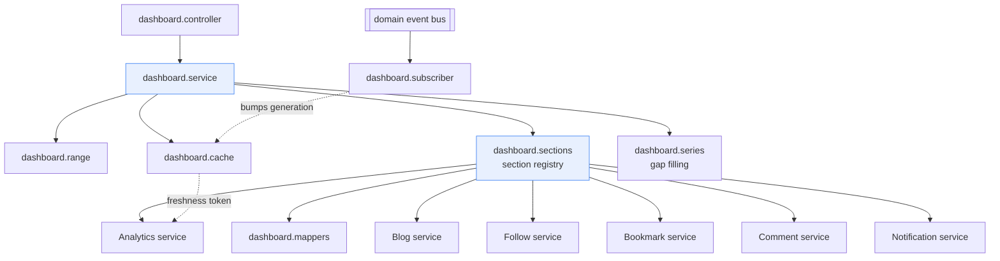
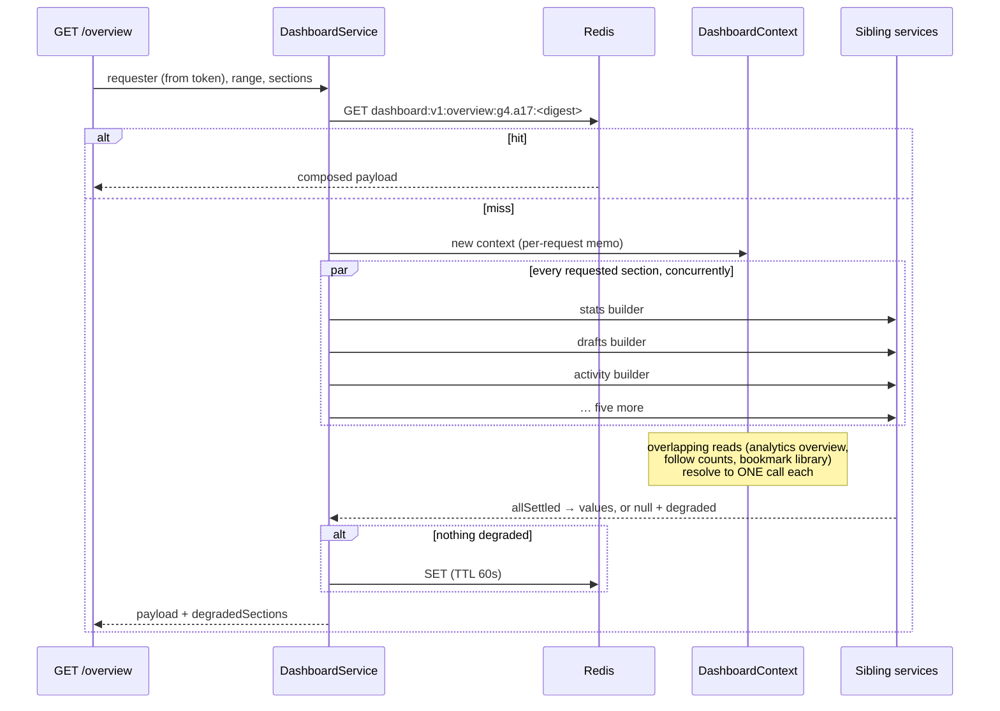
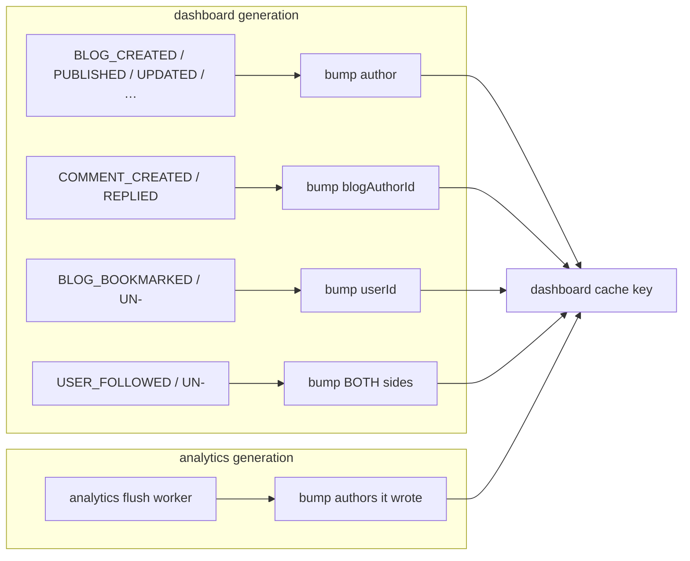

# Dashboard Module

The authenticated author's overview: their content, their audience, their
engagement and their recent activity, composed into one screen.

> **One sentence:** the Dashboard owns no data, no SQL and no rules — it
> composes what the Blog, Analytics, Follow, Bookmark, Comment and Notification
> modules already own, and presents it in a dashboard-shaped payload.

---

## 1. Responsibilities

**Owns**

- The dashboard-shaped **API contract** — its DTOs, its sections, its envelope.
- **Composition**: which panels exist, what each one needs, and how a panel that
  fails is reported.
- The **range vocabulary** (`7d`, `30d`, `90d`, `all`) and the granularity
  derived from it.
- **Gap filling** for chart series (a presentation decision — see § 6).
- Its own **Redis cache** and the invalidation that keeps it honest.

**Does not own — and must never start owning**

| Not owned | Owner |
| --- | --- |
| Blog lifecycle, drafts, ownership | Blog |
| Analytics collection, metrics, ranking | Analytics |
| The follow graph | Follow |
| Saved-content rules | Bookmark |
| Comment visibility and moderation | Comment |
| Notifications and delivery preferences | Notification |
| Authentication | `core/middlewares/requireAuth` |

**The structural rule that enforces it:** there is **no `dashboard.repository.ts`
and no SQL anywhere in the module**. When a panel needs data no service can
express, the query is added to the module that owns that data — which is exactly
how `commentService.getReceivedComments` came to exist. A dashboard that queried
`Comment` directly would disagree with the comment thread about which comments
are visible the first time moderation rules changed.

---

## 2. Architecture



Dependencies point **outward only**. Nothing in the platform imports Dashboard,
so it is a leaf in the dependency graph and the cycles the brief warns about
(`Dashboard → Analytics → Dashboard`) are impossible by construction, not by
convention.

### File layout

| File | Holds |
| --- | --- |
| `dashboard.config.ts` | Every tunable: presets, section keys, panel sizes, TTLs |
| `dashboard.types.ts` | The wire contract — every DTO |
| `dashboard.validator.ts` | Zod schemas for the query strings |
| `dashboard.range.ts` | Preset → analytics window + derived granularity |
| `dashboard.series.ts` | Bucket labels and gap filling (pure) |
| `dashboard.mappers.ts` | Sibling DTO → dashboard DTO (pure) |
| `dashboard.sections.ts` | The section registry and the per-request context |
| `dashboard.service.ts` | Composition, caching, section isolation |
| `dashboard.controller.ts` | Parse, delegate, format |
| `dashboard.routes.ts` | Six authenticated GETs |
| `subscribers/` | Cache invalidation from existing domain events |

---

## 3. Data sources

Every number on the dashboard, and where it actually comes from:

| Panel | Source | Call |
| --- | --- | --- |
| `stats.content` | Blog | `blogService.countBlogsByStatus` |
| `stats.audience` | Follow | `followService.getCounts` |
| `stats.engagement` | Analytics daily aggregates | `analyticsService.getUserOverview` |
| `stats.library` | Bookmark | `bookmarkService.getUserBookmarks` |
| `stats.notifications` | Notification | `notificationService.unreadCount` |
| `recentBlogs` | Blog | `blogService.listMyBlogs` |
| `drafts` | Blog | `blogService.listMyBlogs` / `getMyDrafts` |
| `topContent` | Analytics ranking + Blog hydration | `getUserTopBlogs` + `getMyBlogCards` |
| `audience` | Follow (totals) + Analytics (deltas) | `getCounts` + `getUserOverview` |
| `bookmarks` | Bookmark | `bookmarkService.getUserBookmarks` |
| `notifications` | Notification | `notificationService.list` |
| `activity` | Comment + Follow + Blog | three parallel reads, merged |
| charts | Analytics | `getUserViews` / `getUserEngagement` / `getUserFollowers` |

### The rule behind that table: live counts vs aggregates

A count that has a **live source** is read from it. Only figures that cannot be
reconstructed — views, reads, engagement, audience deltas — come from the daily
aggregates.

This is not a stylistic preference, and it cost a bug to learn. Blog counts were
originally taken from `analyticsService.getUserOverview`, which does return them
and would have saved a query. But that response is cached under the **analytics**
generation, which only its flush worker advances — so a draft saved thirty
seconds ago was missing from `stats.content.drafts` while the `drafts` panel
beside it, read live, already listed it. Two numbers contradicting each other on
one screen is a worse defect than one extra indexed `GROUP BY`, and it is the
kind a user reports as "the dashboard is broken". The e2e suite now asserts the
counter and the panel move together.

### Deliberately absent: likes and reactions

The brief lists "total likes/reactions". They are **not** in the payload.

The `Like` table exists in `schema.prisma`, but **no Like module does** — nothing
likes, unlikes, or emits. The Analytics module excludes `BLOG_LIKED` from its
event vocabulary for exactly this reason and says so in `analytics.types.ts`.
Shipping a `likes` field would mean shipping an API field that permanently reads
zero, which is worse than not shipping it: a zero is a claim about reality, an
absent field is not. See § 13 for what adding it later looks like.

### Upstream capabilities added for this module

Four narrow, additive changes. No existing behaviour was altered.

| Module | Added | Why it could not live in Dashboard |
| --- | --- | --- |
| Comment | `findReceivedByAuthor` / `getReceivedComments` | Which comments "count" (not deleted, not hidden, not the author's own) is comment policy |
| Blog | `AuthorBlogOrder` on `findByAuthor`, `listByAuthor`, `findCardsByIds` | Ordering and ownership filters on blogs belong to Blog |
| Follow | `getCounts` | Reading the follow graph belongs to Follow |
| Analytics | `getReportingLimits`, `buildReportingWindow`, `getReportGeneration` | Retention, day boundaries and freshness are analytics policy (§ 5) |

`getMyDrafts` gained an **optional** `order` parameter defaulting to its existing
behaviour, so `/blogs/me/drafts` returns exactly what it always did.

---

## 4. API

All routes are mounted at `/api/v1/dashboard`, all require authentication, and
all use the platform envelope: `{ success, data, meta }`.

### Common parameters

| Parameter | Values | Default |
| --- | --- | --- |
| `range` | `7d` \| `30d` \| `90d` \| `all` | `30d` |
| `sections` | comma-separated section keys | all eight |
| `series` | comma-separated: `views`, `engagement`, `followers` | all three |
| `metric` | `views` \| `uniqueReaderDays` \| `bookmarks` \| `comments` \| `readCompletions` | `views` |
| `limit` | 1–50 | 20 |
| `cursor` | opaque | — |

Every response echoes its resolved range in `meta.range`, including the
**derived** granularity. That is not decoration: the server picks the window and
the bucket size, so without the echo a client charting "all time" cannot label
its own axis or know whether it received days or weeks.

### `GET /overview`

The composite payload — the reason the module exists. One request, eight panels.

```jsonc
{
  "success": true,
  "data": {
    "overview": {
      "range": { "preset": "30d", "startDate": "2026-07-22", "endDate": "2026-08-20", "granularity": "day" },
      "stats": {
        "content":       { "total": 12, "published": 8, "drafts": 3, "archived": 1 },
        "audience":      { "followers": 240, "following": 31 },
        "engagement":    {
          "views": 5120, "uniqueReaderDays": 3980, "uniqueViews": null,
          "comments": 46, "netBookmarks": 88,
          "reading": {
            "starts": 2100, "completions": 1260, "averageSeconds": 184,
            "totalSeconds": 231840, "completionRate": 0.6, "readThroughRate": 0.2461
          }
        },
        "library":       { "bookmarks": 37 },
        "notifications": { "unread": 4 }
      },
      "recentBlogs": [ /* BlogSummaryDTO */ ],
      "drafts":      [ /* BlogSummaryDTO */ ],
      "topContent":  [ { "blog": { /* … */ }, "views": 900, "metricValue": 900 } ],
      "audience":    { "followers": 240, "following": 31, "growth": { "gained": 12, "lost": 3, "net": 9 } },
      "bookmarks":   { "total": 37, "items": [ /* SavedBlogDTO */ ] },
      "notifications": { "unread": 4, "items": [ /* … */ ] },
      "activity":    [ /* ActivityItemDTO */ ]
    }
  },
  "meta": {
    "range": { /* as above */ },
    "sections": ["stats", "recentBlogs", "…"],
    "degradedSections": []
  }
}
```

**Three states per section, and the difference matters:**

| State | Meaning | Client should render |
| --- | --- | --- |
| key absent | not requested | nothing |
| `null` + listed in `degradedSections` | requested, failed | "couldn't load this" |
| a value (`[]` included) | loaded | the data, or an empty state |

An author with no posts gets `recentBlogs: []`. An author whose Blog queries
failed gets `recentBlogs: null`. Collapsing those two is how a dashboard
cheerfully tells an author with fifty posts that they have none.

### The section endpoints

| Route | Returns | Cursor |
| --- | --- | --- |
| `GET /stats` | Headline counters only — cheap, poll-friendly | — |
| `GET /charts` | 1–3 gap-filled time series in one call | — |
| `GET /top-content` | Ranked content, hydrated with blog metadata | ✔ (Analytics') |
| `GET /drafts` | Drafts, most recently edited first | ✔ (Blog's) |
| `GET /activity` | Merged activity feed | ✖ (§ 14) |

Charts are deliberately **not** a section of `/overview`: they are the heaviest
thing the dashboard can ask for, a client typically renders them below the fold,
and including them would make every dashboard open pay for them.

### Errors

| Code | Status | When |
| --- | --- | --- |
| `UNAUTHORIZED` | 401 | Missing or invalid token |
| `VALIDATION_ERROR` | 400 | Unknown range, section, series, metric; out-of-range limit |
| `RANGE_TOO_LARGE` / `RANGE_TOO_OLD` | 400 | Raised by Analytics; passed through unchanged |

A failing **section** is never an error — it is a `null` and a 200. A failing
**chart** is, because there is no partial answer worth giving when the only
subsystem involved is the one that is down.

---

## 5. Analytics integration

The Analytics module is the source of truth for every metric. Dashboard
**consumes** and never collects: it emits no analytics events, writes no
counters, and computes no ranking.

### The boundary, precisely

```
Analytics  →  collect · process · serve metrics
Dashboard  →  compose those metrics with Blog/User/Follow/Bookmark/Comment
              data and present them
```

Three things Dashboard could plausibly have re-implemented, and where they
actually live:

| Temptation | Where it lives | Why |
| --- | --- | --- |
| Count published blogs and followers for the stats panel | `analyticsService.getUserOverview` already returns them | Two counts on one screen that can disagree is worse than one shared read |
| Rank top content by a weighted score | `analyticsService.getUserTopBlogs` | A second ranking system is how two "top posts" lists disagree on one page |
| Compute a 30-day window from `new Date()` | `analyticsService.buildReportingWindow` | A "day" is bucketed on the configured reporting boundary, not UTC |

### Ranges

Dashboard offers a closed vocabulary; Analytics accepts arbitrary dates. The
mapping:

| Preset | Days | Granularity (default retention) |
| --- | --- | --- |
| `7d` | 7 | `day` |
| `30d` | 30 | `day` |
| `90d` | 90 | `day` |
| `all` | `ANALYTICS_DAILY_RETENTION_DAYS + 1` (401) | `week` |

Two properties are enforced in `dashboard.range.ts` and asserted against
Analytics' own published limits in the tests:

1. `all` resolves to **exactly** the oldest window Analytics accepts. One day
   more and every request would 400 with `RANGE_TOO_OLD`.
2. Granularity is **derived, never accepted**. 401 daily buckets exceed the
   `MAX_BUCKETS` cap of 370, so `all` *must* be weekly — offering granularity as
   a parameter would mean advertising a combination that always fails.

Anyone needing an arbitrary window uses the Analytics API directly. A dashboard
is a fixed set of panels, not a query builder — and every distinct range is a
cache entry (§ 8).

### `uniqueViews` is `null` above a single day

Carried through from Analytics unchanged. Distinct readers are counted with one
HyperLogLog per blog per day, and two days' sketches cannot be added without
double-counting anyone who returned. So the payload reports:

- `uniqueReaderDays` — Σ over days of distinct readers. Always present.
- `uniqueViews` — exact distinct readers. **Non-null only for a one-day range.**

The same rule governs gap filling: a filled *daily* bucket carries
`uniqueViews: 0` (genuinely exact — nobody read it), while a filled weekly
bucket carries `null`.

---

## 6. Charts

The backend returns arrays of `{ date, …numbers }`. No series objects, no axis
configuration, no colours, no library-specific shape. Recharts, Chart.js, D3 and
a plain `<table>` all consume it.

| Requirement (brief § 6) | Served by |
| --- | --- |
| Views over time | `charts.views[]` — `{ date, views, uniqueReaderDays, uniqueViews }` |
| Engagement over time | `charts.engagement[]` — `{ date, comments, bookmarks, unbookmarks, netBookmarks }` |
| Audience growth | `charts.followers` — `{ current, points: [{ date, gained, lost, net }] }` |
| Content performance | `GET /top-content` — blog → views → engagement |

### Gap filling, and why it lives here

Analytics returns only buckets that have data, and is right to: "no row" and
"zero" are the same fact for a counter, and a `generate_series` LEFT JOIN would
cost a scan every caller pays for. Its documentation explicitly hands gap filling
to the consumer.

A chart is where the distinction flips. An author who published on the 1st and
the 20th and got nothing in between should see a line along the floor, not two
points joined by a diagonal implying steady traffic through a quiet fortnight.
So `dashboard.series.ts` fills every bucket in the range.

**The labels must match Postgres exactly.** Analytics buckets with
`date_trunc(granularity, date)::date`, so an invented label Postgres would never
emit does not *fill* a gap — it sits *beside* the real point and the chart shows
two entries for one week. Two rules carry the risk:

- **weeks start Monday** (ISO), not Sunday — the opposite of what `getUTCDay()`
  suggests;
- the series starts at the bucket **containing** `startDate`, not at `startDate`.

Neither side's unit tests can see a disagreement, so `dashboard.db.test.ts`
asserts our labels against `date_trunc` output from the database itself.

---

## 7. Aggregation strategy

### The section registry



Adding a section is: a key in `DASHBOARD_SECTIONS`, a field on
`DashboardOverviewDTO`, a builder in `SECTION_BUILDERS`. No controller branch, no
service method, no route, no cache change.

### The shared-read problem

Panels overlap. `stats` and `audience` both need follower counts; `stats` and
`bookmarks` both need the library. Built naively, an eight-panel overview fetches
the same three things two or three times, and the duplication grows with every
panel added.

`DashboardContext.once` memoizes a read for the life of **one request**. It
stores the *promise*, so two panels starting concurrently share one in-flight
query rather than both missing and issuing it. A rejected promise is evicted, so
a failing shared read does not condemn every later panel that wanted it.

The memo must never outlive the request — it holds one user's data with no user
in its key. The Redis cache is the layer that does outlive the request, and it is
keyed by user and generation precisely because of that.

### Section isolation

`Promise.allSettled`, not `Promise.all`. A dashboard aggregates six subsystems,
so `all` means the whole page fails whenever any one of them does — a
notification table lock would blank the author's blog stats. A failed section
becomes `null`, is named in `degradedSections`, and **the response is not
cached**, so a two-second blip does not become a minute of empty panels.

---

## 8. Caching

Namespace `dashboard:v1:*`, following the Analytics and Feed conventions.

```
dashboard:v1:{scope}:g{dashboardGen}.a{analyticsGen}:{sha256(version|userId|params)}
dashboard:v1:gen:{userId}
```

| Scope | TTL |
| --- | --- |
| `overview`, `stats` | 60s |
| `charts`, `top-content` | 120s |
| `drafts`, `activity` | 30s |

### Two generations, and why

The subtlety of caching a **composition** is that the outer cache can serve data
the inner one has already replaced: entry written at T, analytics flush at T+1,
and until the dashboard TTL lapses the dashboard shows numbers that disagree with
the analytics endpoints the same client can call.

So the key carries both counters:



Either counter advancing makes every cached dashboard for that user unreachable
in **O(1)** — no key deletion, no `SCAN`. The result: **a dashboard is never
staler than the analytics reports inside it**, which no arrangement of TTLs alone
can guarantee.

Analytics exposes its counter through `analyticsService.getReportGeneration` — a
service call, per the dependency rule, not a reach into another module's cache.

### `BLOG_VIEWED` is deliberately not subscribed

It is the highest-volume event on the bus — one per read of every published post.
Subscribing would mean a Redis write per page view, permanently, to invalidate a
number that has not moved yet: views do not reach the database until the flush.
They arrive via the *analytics* generation instead — same freshness, a fraction
of the cost.

### Isolation and failure

- The user id is inside the hashed digest **and** selects the generation counter,
  so two users cannot collide even with identical parameters, and one user's
  invalidation cannot reach another's entries.
- Every Redis call is best-effort. A failed read, a failed write, a corrupt entry
  or an unreachable counter all degrade the dashboard to "uncached" — never to a
  500. Asserted in `dashboard.cache.test.ts` and end to end in
  `dashboard.e2e.test.ts`.

### Freshness bounds

| Data | Visible within |
| --- | --- |
| Draft created, blog published/updated/archived, follow, bookmark, comment received | Next request after the event is dispatched (generation bump), worst case its TTL |
| A draft edited by **autosave only** | Its panel's TTL (30s) — `blogService.autosave` deliberately emits no event |
| Views, reads, engagement | Analytics flush interval (`ANALYTICS_FLUSH_INTERVAL_MS`, default 60s) + the generation bump |
| Anything changed without emitting an event | Its TTL (30–120s) |

---

## 9. Authorization and privacy

**A user can only ever read their own dashboard.**

That is a property of the API's shape, not a check that could be forgotten:

- No route has a `:userId` segment. No query schema has a user parameter.
- No service method takes a "whose dashboard" argument at any layer.
- The requester is built from `req.user` — the verified token — and nothing else.

There is therefore nothing to pass, and nothing to validate. An injected
`?userId=` is simply ignored, which the e2e suite asserts.

**Admins are not exempt.** `role` is carried (sibling services need it for their
own visibility rules) but never grants access to another user's dashboard.
Platform-wide insight is a different feature with different auditing, not a query
parameter on this one.

**Defence in depth.** Nothing here relies on being the only check:
`analyticsService` authorizes against its own rules, `blogService.getMyBlogCards`
filters by author, `commentService.getReceivedComments` scopes by blog ownership,
and `notificationService` scopes by recipient.

**What is not exposed:** no email addresses, no password hashes, no session data,
no other user's private analytics. Actors on activity rows and notifications
carry only the public author projection (`id`, `username`, `name`, `avatar`).
A bookmark whose blog was deleted or hidden returns `blog: null` — the Bookmark
module nulls the payload precisely so a since-hidden blog cannot leak through a
row the user still has.

---

## 10. Performance

### Query budget

Cold — nothing cached anywhere — one full eight-section overview:

| Panel | Queries | Notes |
| --- | --- | --- |
| shared: analytics overview | 4 | totals, follower totals, blog counts, follower count |
| shared: blog counts by status | 1 | one grouped count — live, see below |
| shared: follow counts | 2 | both index-only on composite indexes |
| shared: bookmark library | 2 | page + total |
| `stats` | 1 | unread count (partial index) |
| `recentBlogs` | 1 | |
| `drafts` | 1 | |
| `topContent` | 2 | ranking + one batched hydration |
| `audience` | 0 | entirely from shared reads |
| `notifications` | 3 | page, total, unread |
| `activity` | 4 | comments + followers (page, total) + published |
| **Total** | **≈21** | all issued concurrently |

With the Analytics cache warm (the common case — its TTL is 60–120s): **≈16**.
With the dashboard cache warm: **one Redis `GET`**.

### No N+1, by construction

- `topContent` hydrates a whole page of ranked ids in **one** batched
  `findCardsByIds`, never a lookup per row.
- `activity` reads three sources in three queries and merges in memory.
- The comments-received query joins `Blog` inside SQL rather than fetching blog
  ids and sending them back in an `IN (…)`, which is an N+1 in two steps and
  unbounded for a prolific author.
- Every panel row is a **summary projection** (`blogCardSelect`) — the blog
  `content` JSON is never loaded. A dashboard that loaded eight blog bodies to
  show eight titles would be the most expensive page on the platform.

### Indexes

Created by this module, in `prisma/sql/dashboard_indexes.sql`:

```sql
CREATE INDEX comment_author_activity_idx
  ON "Comment" ("blogId", "createdAt" DESC)
  WHERE "deletedAt" IS NULL;
```

**This index only earns its place because of how the query is written**, which
is worth spelling out because the first version of this module got it wrong.
Measured against 200k comments with one prolific author (300 blogs, 90k comments
inside the window):

| Query shape | Without the index | With it |
| --- | --- | --- |
| Plain join + `ORDER BY` + `LIMIT` | 403 ms | 402 ms — **index unused** |
| `LATERAL` top-N per blog | 291 ms | **42 ms** — 310 index scans |

The plain join produces a byte-identical plan with and without it: an ordering
across many blogs cannot be read from a per-blog index without a merge the
planner will not perform under a nested loop, so Postgres sorts the whole
candidate set either way. The `LATERAL` rewrite asks for the newest N comments
*per blog*, which is exactly what an ordered per-blog index answers — the scan
stops after N entries instead of reading that blog's entire history.

So `commentRepository.findReceivedByAuthor` uses raw SQL (Prisma cannot express
`LATERAL`) to select **ids**, then a keyed Prisma read for the projection: the
part where the plan matters stays in SQL, the part where types matter stays in
Prisma. The correctness argument for the rewrite is that a comment outside its
own blog's top N cannot be in the global top N, so nothing can be missed.

**The index and that method must change together.** Revert the query to a plain
ordered join and the index becomes dead weight on the hottest write path in the
comment system. `npm run dashboard:report` prints the scan count that would show
it.

The predicate covers `deletedAt` only. The query also filters `isHidden = false`,
but Postgres can only prove a partial index applies when the predicate is a
**literal**, and a bound parameter defeats that proof — the index would work
under a custom plan and silently stop being used once the statement flipped to a
generic plan in production, while every local `EXPLAIN` still showed it in use.

Depended upon but created elsewhere (recorded so they are not dropped with the
module that made them): `Blog([authorId, status])`, `Blog([authorId])`,
`Follow([followingId, createdAt])`, `Follow([followerId, createdAt])`,
`Bookmark([userId, createdAt])`, `BlogAnalyticsDaily([authorId, date])`, and the
raw `notification_unread_idx`.

### Verification

```bash
npm run db:indexes          # apply — required in every environment
npm run dashboard:report    # verify they are actually used
```

`scripts/dashboard-index-report.ts` checks each index exists, snapshots
`pg_stat_user_indexes.idx_scan`, runs every dashboard read through the
repository that owns it, and reports which indexes were touched and how long each
took. It probes repositories rather than the dashboard service on purpose: the
service sits behind Redis, and a warm cache would report microseconds while
saying nothing about the database. `--seed` builds a lopsided synthetic corpus
first (and refuses to touch a hosted database).

One non-obvious detail inside it: the counters are read **after disconnecting the
pool**. A Postgres backend flushes its cumulative statistics at a transaction end
or on exit, and the probes leave their connections idle — so reading
`pg_stat_user_indexes` straight afterwards returns pre-probe counters and the
report declares every index unused. Waiting does not fix it; disconnecting does.
The first version of this script reported exactly that false alarm.

Current output against the seeded corpus:

```text
── Index scans during the probes ───────────────────────
    60  comment_author_activity_idx     (one per blog, via the LATERAL)
     3  Comment_pkey                    (the keyed projection read)
     3  Blog_authorId_status_idx
```

The Follow, Bookmark and analytics indexes show no scans there simply because
those tables are small in the synthetic corpus and a sequential scan is the
right plan at that size — the planner being correct, not a regression.

### Scalability

| Growth | Behaviour |
| --- | --- |
| Many blogs per author | Panels are `LIMIT`ed and index-ordered; counts are index-only |
| Many comments | Bounded by the 90-day activity lookback **and** the panel limit |
| Large analytics tables | Range scans over `(authorId, date)`; Analytics' own cap applies |
| High dashboard traffic | One `GET` per warm request; generations make invalidation O(1) |
| Many concurrent users | No shared mutable state; the per-request memo dies with the request |

---

## 11. Frontend contract

There is no frontend in this repository yet, so this section is the contract a
future React client builds against rather than a description of one.

**What the API guarantees**

- Every date field is an **ISO 8601 string**. No `Date` objects, no mixed
  formats — because responses round-trip through JSON in Redis, a `Date` would
  be honest on a cache miss and a string on a hit.
- Every rate that can be undefined is `number | null`, never a defaulted `0`.
- Chart data is library-agnostic `{ date, …numbers }` arrays with **every bucket
  present**, so a chart component needs no gap-filling logic of its own.
- Section presence is three-valued (§ 4) so empty states and error states are
  distinguishable.

**Suggested shape**, per `ARCHITECTURE.md` § 3's feature-based layout:

```text
src/features/dashboard/
├── api/            typed client calls, one per endpoint
├── components/
│   ├── StatCard.tsx
│   ├── charts/     ONE reusable chart per shape (line, bar), not one per panel
│   ├── ContentList.tsx
│   └── ActivityFeed.tsx
├── hooks/          useDashboardOverview, useDashboardCharts
└── DashboardPage.tsx
```

**Recommended fetching**: one `/overview` call on mount, `/charts` lazily when
the chart area scrolls into view, and the section endpoints behind each panel's
"see all". Dashboard state is server cache state — it belongs in whatever query
cache the app adopts, not in global application state.

---

## 12. Testing strategy

Eight suites, each holding a different variable still. **179 dashboard tests; 1311 across the platform, all passing.**

| Suite | Scope | Covers |
| --- | --- | --- |
| `dashboard.range.test.ts` | pure | Preset → window; `all` at the retention horizon; derived granularity never exceeds the cap; timezone-independence |
| `dashboard.series.test.ts` | pure | Monday-based weeks, month/leap/year boundaries, gap filling, out-of-range points, activity merge order and tiebreak |
| `dashboard.cache.test.ts` | real Redis | Hit/miss, canonicalization, **user isolation**, generation bumps, **analytics-flush invalidation**, degraded responses not cached, Redis-down fallback |
| `dashboard.service.test.ts` | mocked siblings | Composition, section subsetting, shared-read memoization, **section isolation**, empty dashboard, requester propagation, top-content hydration, chart assembly |
| `dashboard.db.test.ts` | real Postgres | Comments-received ownership/visibility filters, panel ordering, `findCardsByIds` ownership, **bucket labels vs `date_trunc`** |
| `dashboard.subscriber.test.ts` | real bus + Redis | Which user each event invalidates (comment → blog author, follow → both sides), `BLOG_VIEWED` ignored, idempotent registration, malformed payloads |
| `dashboard.integration.test.ts` | HTTP, mocked service | Auth on every route, **identity from the token only**, validation, envelope, degraded reporting, error passthrough, no write verbs |
| `dashboard.e2e.test.ts` | whole stack | Real author with real audience: every panel, **cross-user isolation**, cache hit/invalidate, Redis-down, empty dashboard |

The properties that would matter most in production each have a dedicated test:
a user reading another user's data (three suites), a cached payload outliving the
analytics inside it, a subsystem outage blanking the page, a counter disagreeing
with the panel beside it, and JS/SQL bucket labels drifting apart.

```bash
npm test -- src/modules/dashboard
```

---

## 13. Extension points

Adding a panel — revenue, writing streaks, achievements, AI insights — is:

1. a key in `DASHBOARD_SECTIONS`;
2. a field on `DashboardOverviewDTO`;
3. a builder in `SECTION_BUILDERS`.

Nothing else changes: no controller branch, no route, no cache change, no service
method. Caching, isolation, degradation and invalidation are inherited.

| Future feature | What it needs |
| --- | --- |
| **Likes** | A Like module + a `BLOG_LIKED` analytics event. Then it is a field on the stats builder — no dashboard restructuring |
| **Revenue / subscriptions** | A Payments module owning the data; a `revenue` section composing it |
| **Writing streaks** | `UserAnalyticsDaily.blogsPublished` already records publishing cadence |
| **Per-author timezones** | Blocked in Analytics (daily grain is fixed at ingest), not here |
| **A new chart series** | A name in `CHART_SERIES` and a branch in `getCharts` |
| **Admin/platform dashboard** | A separate module with its own authorization. Not a parameter on this one |

Two invariants any extension must preserve: **no SQL in this module**, and **no
parameter for whose dashboard to build**.

---

## 14. Known limitations

1. **Activity has no cursor.** It returns the newest N (max 50). A correct cursor
   over a merge of three independently-ordered sources must carry a position in
   each and stay valid as all three grow — real work for a panel whose purpose is
   "what happened lately". Deferred rather than half-built.

2. **"Someone saved your post" is not in the activity feed.** No index supports
   "bookmarks on blogs by author X" without a join scan, and bookmarking raises
   no notification. Adding it means an index on a hot write path, which is a
   trade to make deliberately. The aggregate number still appears in
   `stats.engagement.netBookmarks` and on the engagement chart.

3. **No likes.** See § 3.

4. **`range=all` means "as far back as Analytics retains"** — 400 days by
   default, weekly. Not the platform's whole history.

5. **Range presets only.** Arbitrary `startDate`/`endDate` is an Analytics API
   feature; offering it here would multiply the cache keyspace without bound.

6. **Some upstream reads are duplicated.** `analyticsService.getUserOverview`
   internally reads the live blog counts and follower count, and this module
   reads both again from their owning services — deliberately, so a counter
   cannot disagree with the panel beside it (§ 3). The cost is two indexed counts
   per uncached request. Removing it means changing what Analytics' overview
   returns or when it is invalidated, which is that module's call, not this one's.

   Worth recording separately: the same caching behaviour means
   `GET /analytics/me/overview` can itself report a blog count up to its TTL out
   of date after a publish. That is pre-existing Analytics behaviour, not
   something this module introduced, and nothing in the dashboard depends on it
   any more.

7. **Cross-instance invalidation lags by up to `GENERATION_MEMO_MS` (5s).**
   Generations are memoized in process. A bump on instance A is visible on
   instance B within that window — the same trade the Analytics, Feed and Search
   caches make.

8. **Degradation is per section, not per field.** If the analytics overview
   fails, both `stats` and `audience` degrade, even though `audience` could have
   shown live follower counts. Finer granularity would mean a partial DTO with
   nullable fields throughout — more complexity than the failure mode warrants.

---

## 15. Operations

**Bootstrapping** — the index must exist in every environment:

```bash
npm run db:sync        # prisma db push + db:indexes + generate
# or, for the indexes alone:
npm run db:indexes
```

**Configuration** — the module adds no environment variables. It inherits
`ANALYTICS_DAILY_RETENTION_DAYS` (which defines `range=all`),
`ANALYTICS_REPORTING_UTC_OFFSET_MINUTES` (which defines a "day"), and
`ANALYTICS_FLUSH_INTERVAL_MS` (which bounds engagement freshness). Panel sizes
and TTLs are code constants in `dashboard.config.ts` — deployment-independent by
design.

**Bootstrap order** — `registerDashboardSubscribers()` is called from
`server.ts`, never from `app.ts`. Registering at app-import time would make every
test that touches `app` issue Redis writes as a side effect. Same rule as
Notification, Search, Analytics and Feed.

**Redis keyspace**

```text
dashboard:v1:gen:{userId}                          STR  per-user generation
dashboard:v1:{scope}:g{n}.a{m}:{digest}            STR  cached response (TTL 30–120s)
```

Every key expires. Redis is a cache here and never a source of truth — losing the
whole keyspace costs one slow request per user.
