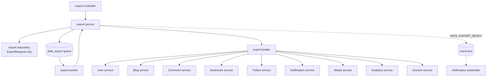
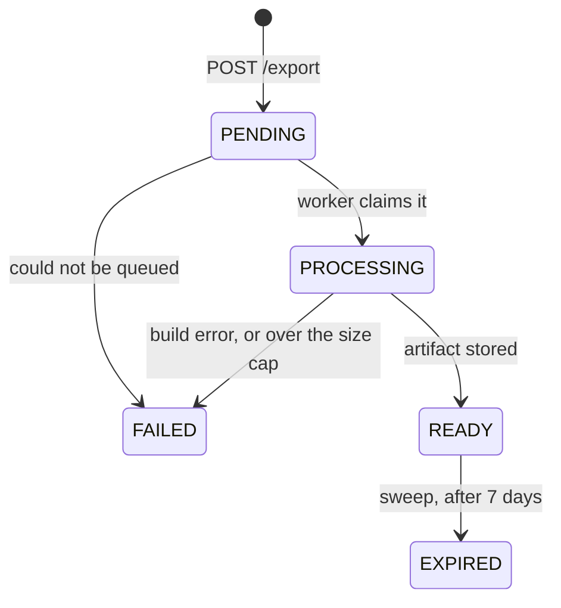

# Data Export Module

Everything Narrative holds about you, in one file you can download.

> **One sentence:** Export owns the **request lifecycle** and the **document
> shape** — every fact inside the file is produced by the module that owns it,
> through a `collectForExport` method, so this module contains no SQL about
> blogs, comments, follows or anything else.

---

## 1. Why it is a module at all

The obvious home for "export my data" is the User module. It cannot live there.

An export has to read Blog, Comment, Bookmark, Follow, Notification, Media and
Analytics. **Every one of those imports User.** Putting the export in `user/`
would invert the dependency graph and create real import cycles — the first rule
in [ARCHITECTURE.md](./ARCHITECTURE.md#5-dependency-rules).

So it sits *above* them: Export imports everything and is imported by nothing.
That is the same position Dashboard occupies, and Export follows the same
discipline — with one deliberate difference:

| | Dashboard | Export |
| --- | --- | --- |
| Owns a table | no | **yes** — `ExportRequest` |
| Owns SQL about other modules' data | no | no |
| Composes sibling services | yes | yes |

Dashboard's "no repository at all" rule could not survive here: a build is
asynchronous, so the request has to be *persisted* to be tracked. Export owns
exactly one table and reads nothing else directly.

---

## 2. Architecture



`export.builder.ts` is the composition layer and contains **no SQL**. If it ever
needs a fact no service exposes, the method is added to the module that owns the
data — the same rule Moderation follows.

### File layout

```text
src/modules/export/
├── export.routes.ts       four routes, all scoped to the caller
├── export.controller.ts   parse → delegate → format; the raw download response
├── export.service.ts      cooldown, claim, build, store, expiry, DTOs
├── export.repository.ts   ExportRequest SQL — and the artifact projection rule
├── export.builder.ts      composes sibling services into the document
├── export.worker.ts       BUILD + SWEEP jobs on the data_export queue
├── export.config.ts       cooldown, TTL, size cap, page size
└── export.types.ts        the document shape and the request DTO
```

### Upstream capabilities added for this module

Each was added to the module that owns the data, never reimplemented here:

| Module | Added |
| --- | --- |
| User | `collectForExport` — account, profile, settings, developer links, skills, minus the password hash |
| Auth | `sessionService.collectForExport` — sign-in history without the refresh-token hash |
| Blog | `collectForExport` + `findAllByAuthorForExport` (drafts and archived included) |
| Comment | `collectForExport` + `findAllByAuthorForExport` |
| Bookmark | `collectForExport` + `findAllByUserForExport` |
| Follow | `collectForExport` + `findAllForExport` (both directions) |
| Notification | `collectForExport` + `findAllByRecipientForExport` |
| Media | `collectForExport` + `findAllByUploaderForExport` (metadata only) |
| Analytics | `collectForExport` + `findUserDailyForExport` / `findBlogDailyForExport` |
| Core | `collectPaged` — the shared cursor-drain with a row ceiling |

---

## 3. Where the artifact lives, and why

**In the `ExportRequest` row, as gzipped bytes.** Not on the storage provider.

`IStorageProvider` has no private-object or signed-URL concept: every URL it
returns is world-readable, and the production provider is Cloudinary — a media
CDN. A complete dump of one person's account does not belong behind a guessable
public URL.

Held in the column, the bytes inherit the database's access control, and the only
way to read them is an authenticated request that proves ownership. There is no
URL that works on its own, which is also why the "your export is ready"
notification carries an **export id, not a link**.

The cost is bounded on purpose:

- `EXPORT_MAX_BYTES` (25 MB compressed) caps one artifact. Over it, the build
  **fails rather than truncating** — a silently partial export of your own data
  is worse than none, because you cannot tell which half is missing.
- `EXPORT_TTL_DAYS` (7) bounds how long it sits around. The artifact is the most
  concentrated copy of a person's data the platform ever produces, and its risk
  is almost entirely a function of how long it exists.
- The hourly sweep nulls expired bytes. The **row survives** as `EXPIRED` — a
  user must be able to see that an export they requested has lapsed, rather than
  finding no trace of it.

### The projection rule

`artifact` is a `bytea` column holding up to 25 MB, and Prisma returns every
scalar by default. A bare `findMany` would stream every stored artifact out of
Postgres to render a list of status badges, on the request path, getting slower
as the feature succeeded.

So **nothing in `export.repository.ts` selects `*`**. `METADATA_FIELDS` is the
explicit column list every read uses, and exactly one method — `findArtifact` —
may touch the bytes.

---

## 4. Lifecycle



Every transition is a **conditional UPDATE**, the same technique
`userRepository.transitionStatus` uses. BullMQ is at-least-once: a retry after a
worker died mid-build would otherwise run a second build concurrently with the
first and race it to the same row. Claiming `PENDING → PROCESSING` conditionally
means the second dispatch sees `false` and stops.

**Expiry is enforced on the download path, not by the sweep.** The sweep runs
hourly, so there is a window in which a lapsed artifact still has status `READY`.
The download checks `expiresAt` against the clock, so an artifact becomes
unreachable the moment it lapses. The sweep reclaims space; it does not enforce
the rule.

---

## 5. API

| Method | Path | Notes |
| --- | --- | --- |
| `POST` | `/api/v1/export` | 202 Accepted. Requires an active account. |
| `GET` | `/api/v1/export` | The caller's last 20 requests. |
| `GET` | `/api/v1/export/:id` | One request's status. |
| `GET` | `/api/v1/export/:id/download` | The artifact, `Content-Encoding: gzip`. |

There is **no `:userId` anywhere in this module.** The subject is always
`req.user.userId` from the verified access token, so "export someone else's
account" is not an authorization check that could be forgotten — it is
unrepresentable.

Another user's export returns **404, not 403**. A distinguishable "forbidden"
would confirm the id exists, which is an enumeration oracle over other people's
requests.

### Who may do what

| | Requesting a build | Reading / downloading |
| --- | --- | --- |
| Active | ✅ | ✅ |
| Suspended | ❌ `requireActiveAccount` | ✅ |
| Deactivated | ❌ | ✅ |

The asymmetry is the point. A build is expensive and is a write, so a suspended
account should not start one. But an artifact already produced belongs to the
person who asked for it — withholding it would make moderation a way to cut
someone off from their own data, which is the outcome an export feature exists to
prevent.

### Two refusals, deliberately distinct

`EXPORT_IN_PROGRESS` (409) and `EXPORT_COOLDOWN` (429) are different situations
the user needs told apart: *wait for the one that is building* versus *come back
tomorrow*. Collapsing them into one "try again" makes a stuck job
indistinguishable from a policy limit.

The cooldown anchors on the last request of **any** status, including `FAILED`.
Anchoring on successes only would let a user whose exports keep failing retry in
a loop — and a failing export is the expensive case, because it fails at the
*end* of a full build.

---

## 6. What the document contains

```jsonc
{
  "meta": { "formatVersion": 1, "exportId": "...", "generatedAt": "...",
            "truncated": [], "excluded": [ /* in plain language */ ] },
  "account":       { /* profile, settings, developer links, skills */ },
  "blogs":         [ /* incl. drafts, archived, content, tags, categories, SEO */ ],
  "comments":      [ /* incl. deleted and hidden, with the parent blog's title */ ],
  "bookmarks":     [ /* with blog title, slug, author username */ ],
  "follows":       { "following": [...], "followers": [...] },
  "notifications": [ /* with render metadata; actor reduced to public identity */ ],
  "media":         [ /* metadata only — never file bytes */ ],
  "analytics":     { "daily": [...], "blogDaily": [...] },
  "sessions":      [ /* device, agent, IP, timestamps — never the token hash */ ]
}
```

Every section is present even when empty: an absent key and an empty array are
different messages to a reader.

### Exclusions are part of the artifact

`meta.excluded` is written **into the file**, not just documented here. A reader
who notices their moderation reports are missing should find out why from the
file itself rather than concluding the export is broken.

| Excluded | Why |
| --- | --- |
| Password hash, session refresh tokens | Live credentials. An export lands in email and cloud storage; a working key to the account must never travel with it. |
| Reports filed **about** this account | A report names its reporter. Handing the subject a copy turns "report this user" into "tell this user who reported them", which ends community moderation immediately. |
| Other accounts' data | Beyond the username and display name already public on the platform. |
| Uploaded file contents | The media section records the URLs the files are already served from. |

### Known gaps, named honestly

Also listed in `meta.excluded`, because a gap nobody declared is a bug report
waiting to happen:

- **Reports this account filed** — theirs by rights, but the Moderation module
  has no export collector yet.
- **Likes** — the schema defines the table, but no feature writes to it, so
  there is nothing to export.

### Truncation is visible

`meta.truncated` names any collection that hit
`EXPORT_MAX_ROWS_PER_COLLECTION` (50,000). Without it, a user with a very long
notification history gets a file that looks complete and is not. Reaching the cap
is the one place a partial answer is allowed — the alternative is failing an
export over a notification backlog nobody needs in full.

---

## 7. Configuration

| Constant | Default | Governs |
| --- | --- | --- |
| `EXPORT_COOLDOWN_HOURS` | 24 | Gap between requests from one account |
| `EXPORT_TTL_DAYS` | 7 | How long an artifact stays downloadable |
| `EXPORT_MAX_BYTES` | 25 MB | Hard cap on one compressed artifact |
| `EXPORT_PAGE_SIZE` | 500 | Rows per query inside a collector |
| `EXPORT_MAX_ROWS_PER_COLLECTION` | 50,000 | Row ceiling before truncation |
| `EXPORT_FORMAT_VERSION` | 1 | Document schema version |

The per-IP `exportRequestLimiter` (10/hour) is the cheap outer layer only. The
real control is the per-account cooldown, which no IP change can evade.

---

## 8. Future work

- **Reports the user filed** — needs a `collectForExport` on Moderation, scoped
  to reports where they are the reporter, with resolver identity stripped.
- **Object storage** — if artifacts outgrow the column, the seam to move is
  `export.repository` alone. It would need `IStorageProvider` to grow a private
  upload and a signed URL first; today it has neither.
- **Format negotiation** — one gzipped JSON file today. A ZIP with per-section
  files, or Markdown for the blog content, would both be additive.
