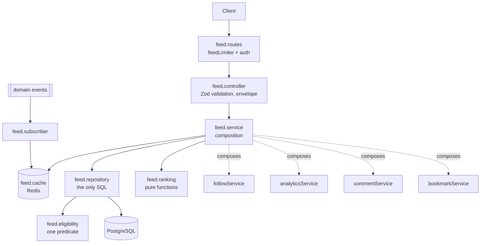
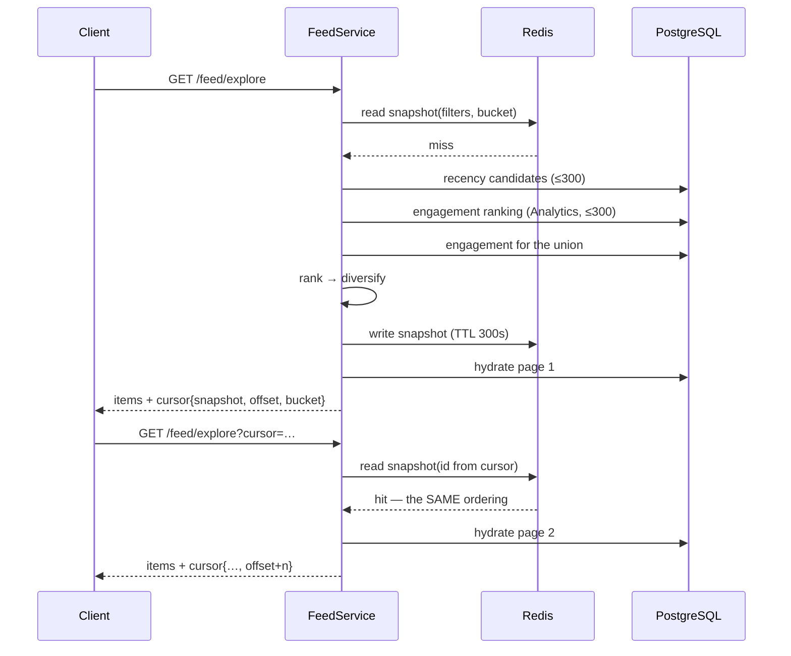
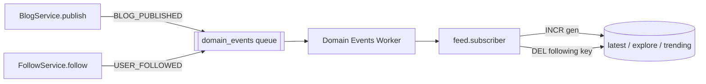

# Feed & Explore Module

Narrative's content-discovery surface: four feeds that decide **what a reader
sees next**, built entirely out of capabilities other modules already own.

- **Following** — recent posts from the authors you follow
- **Latest** — everything discoverable, newest first
- **Explore** — a ranked mixture of new and well-received writing
- **Trending** — what is gaining engagement right now

Source: [`src/modules/feed/`](../backend/src/modules/feed/) ·
Indexes: [`prisma/sql/feed_indexes.sql`](../backend/prisma/sql/feed_indexes.sql) ·
Verification: `npm run feed:report`

---

## 1. Responsibilities

**Owns**

- The four feed endpoints and their HTTP contract.
- Candidate retrieval, and the *discovery* eligibility rules layered on top of the Blog module's.
- Ranking, diversity, and the configuration behind both.
- Feed pagination — two cursor styles, one wire format.
- Feed caching and its invalidation.
- The feed-card DTO.

**Does not own — and never reimplements**

| Fact | Owner | How Feed gets it |
| --- | --- | --- |
| Blog lifecycle, visibility, content | Blog | reads `Blog` through its own projection; mirrors `blogService.canView`'s rules, narrowed |
| The follow graph | Follow | `followService.followedAuthorIdsSql()`, `followService.getFollowedSubset()` |
| Engagement measurement | Analytics | `analyticsService.getEngagementRanking()` / `getEngagementForBlogs()` |
| Comment counts | Comment | `commentService.getCommentCounts()` |
| Bookmark counts | Bookmark | `bookmarkService.getBookmarkCounts()` |
| Text relevance | Search | not used — a feed is not a query |
| Authentication | Auth | `requireAuth` / `optionalAuth` middleware |

Feed is a **consumer/composition module** and a leaf in the dependency graph.
Nothing depends on it, so `Blog → Feed → Blog` and `Analytics → Feed → Analytics`
cannot arise.

---

## 2. Architecture



### The pipeline, identical for every feed

```text
1. RETRIEVE candidates   feed.repository        ← the only SQL in the module
2. APPLY eligibility     feed.eligibility       ← inside that SQL, one predicate
3. RANK + DIVERSIFY      feed.ranking           ← pure, clock-injected, no I/O
4. BUILD the response    feed.service           ← batched hydration, DTO mapping
```

Chronological feeds skip step 3 — their ordering *is* the data. Ranked feeds run
all four and freeze the result as a snapshot so pagination is exact.

Ranking never filters, and eligibility never ranks. Keeping "what may be seen"
and "what should be seen first" in separate layers is what stops a ranking tweak
from becoming a privacy bug.

### File layout

```text
src/modules/feed/
├── feed.types.ts        shared vocabulary — no Redis, Prisma or table names
├── feed.config.ts       every tunable number: weights, windows, caps, TTLs
├── feed.eligibility.ts  what may be discovered (SQL predicate + TS guard)
├── feed.cursor.ts       chronological + ranked cursors, fingerprinting
├── feed.ranking.ts      scoring and diversity — pure functions
├── feed.repository.ts   candidate retrieval, taxonomy hydration
├── feed.cache.ts        generations, page cache, ranked snapshots
├── feed.service.ts      composition, hydration, DTO mapping
├── feed.validator.ts    Zod schemas for every query string
├── feed.controller.ts   parse → call → envelope. No logic.
├── feed.routes.ts       mount, auth, rate limit
└── subscribers/         cache invalidation from existing domain events
```

---

## 3. Feed types

All four surface exactly the same content set — published, PUBLIC, active
author (§4). They differ in *which* of it they select and *how* they order it.

| Feed | Auth | Ordering | Pagination | Cached |
| --- | --- | --- | --- | --- |
| Following | required | `publishedAt DESC, id DESC` | keyset | first page, per viewer |
| Latest | public | `publishedAt DESC, id DESC` | keyset | shared, per query |
| Explore | public | ranked: recency + engagement | ranked snapshot | shared, unless `excludeFollowing` |
| Trending | public | ranked: windowed engagement × recency | ranked snapshot | shared, per window |

### Why Explore is not Latest with extra steps

Explore draws candidates from **two** sources and merges them:

- the newest eligible posts — so new writing is always considered, on a platform
  where a popularity-only pool could never surface anything new;
- the platform's most-engaged posts over a two-week window — so a good post from
  ten days ago can outrank a post from an hour ago, which Latest can never do.

It then scores, diversifies, and pages from the frozen result.

---

## 4. Content eligibility

**One predicate, one visibility, all four feeds.** Defined in
[`feed.eligibility.ts`](../backend/src/modules/feed/feed.eligibility.ts) and used
by every query in the module:

```sql
b."status" = 'PUBLISHED'
AND b."visibility" IN ('PUBLIC')
AND b."publishedAt" IS NOT NULL
AND u."status" = 'ACTIVE'
```

| Excluded | Why |
| --- | --- |
| `DRAFT`, `ARCHIVED`, `DELETED` | not published content |
| `PRIVATE` | never visible to anyone but the author |
| `UNLISTED` | **reachable by link ≠ advertised to strangers** |
| `MEMBERS_ONLY` | see below |
| Posts with no `publishedAt` | cannot be ordered deterministically, so cannot be paged without risking duplicates |
| Posts by `SUSPENDED` / `DELETED` authors | the account is not in good standing |

There is deliberately **no per-feed visibility set**. The Following feed could in
principle be wider — it is authenticated and never shares a cache entry — but a
discovery rule that depends on which feed you are reading is a rule nobody can
hold in their head, and every widening is a leak waiting for the day someone
forgets which feed they were editing. Being authenticated widens *who is asking*,
not *what is discoverable*. It is also the same set Search resolves to, so the
platform's two discovery surfaces cannot disagree about what exists.

### This narrows the Blog module's rules, it does not replace them

`blogService.canView` remains the authority on whether a viewer may **read** a
blog. Discovery is a strictly smaller question, and two of Blog's four
visibilities are the difference:

- **`UNLISTED`** — `canView` allows it, and that is the point: an unlisted post
  is reachable by anyone holding the link. A feed must never surface it, because
  "reachable by link" and "advertised to strangers" are the two halves of what
  unlisted means.
- **`MEMBERS_ONLY`** — `canView` currently grants it to *any* authenticated
  viewer, a documented placeholder awaiting a real membership check
  ([BLOG_MODULE.md § Future work](./BLOG_MODULE.md)); the PRD defers the
  membership system itself. Discovery does not lean on a placeholder: a feed that
  advertised members-only posts to every signed-in reader would leak gated
  content the moment that check becomes real. When membership exists, admitting
  it here is a deliberate decision for *that* change to make — not something a
  feed quietly inherited. Search takes the same position today.

An import-time assertion in `feed.eligibility.ts` throws if anything but
`PUBLIC` is ever added to the set, so the rule survives an edit that removes the
comment explaining it.

### Author privacy

`UserSettings.isPrivate` hides a user from the **people directory** (Search's user
results), not their published public posts — which is exactly how blog search
already behaves. Feeds follow blog search, so the two discovery surfaces cannot
disagree about whether an author's public writing exists.

---

## 5. Upstream changes this module required

Per the module-boundary rule, each change was made in the **owning** module
rather than duplicated here.

| Module | Added | Why |
| --- | --- | --- |
| Follow | `followedAuthorIdsSql(viewerId)` (repository + service) | the following feed must express "by anyone I follow" *inside* one ordered, keyset-paginated query. Returning ids instead would ship thousands of bind parameters for a heavy follower and rob the planner of its best plan. A SQL fragment keeps Follow's table private to Follow. |
| Follow | `getFollowedSubset(viewerId, ids)` on the service | already existed on the repository; exposed so Explore's `excludeFollowing` filters a page in one batched query instead of an N+1. |
| Analytics | `getEngagementRanking()`, `getEngagementForBlogs()`, `buildEngagementWindow()`, plus the discovery types | Analytics owns engagement data and what a "day" means. Feed supplies only the **weights**. See §6.3. |
| Comment | `countForBlogs(ids)` (repository + service) | a card shows a comment count; a page of fifty must not become fifty counts. |
| Bookmark | `countForBlogs(ids)` (repository + service) | same, for bookmarks. |
| core | `feedLimiter`, `/api/v1/feed` in `SELF_LIMITED_PATH_PREFIXES` | see §11. |

No new domain events were introduced. Every subscription in §9 is to an event
that Blog, User or Follow already emitted.

---

## 6. Ranking

All ranking lives in [`feed.ranking.ts`](../backend/src/modules/feed/feed.ranking.ts)
as **pure functions** — no database, no Redis, no ambient clock (`now` is always a
parameter). That is what makes ranking assertable in a unit test with no
fixtures, and replaceable without touching retrieval. Every constant lives in
[`feed.config.ts`](../backend/src/modules/feed/feed.config.ts).

V1 is **deterministic and viewer-independent**: given the same candidates and
signals, every reader gets the same Explore and the same Trending. That is what
makes those feeds cacheable across viewers at all, and what keeps "why am I
seeing this?" answerable.

### 6.1 Signals

```ts
interface RankingSignals {
  blogId: string;
  authorId: string;       // diversity
  publishedAt: Date;      // recency        ← Blog
  engagementScore: number;// engagement     ← Analytics (weighted, windowed)
  primaryTopic: string|null; // diversity   ← first tag by addedAt
}
```

### 6.2 Explore

```text
score = 1.0 × recency(halfLife = 7d)
      + 1.4 × engagement/(engagement + 20)
```

A weighted **sum**, because either signal alone is a valid reason to surface a
post: a well-received older piece and a brand-new one both belong on a discovery
page, and a product would zero out the new post for having no engagement yet.

The engagement transform saturates rather than normalizing against the candidate
set's maximum. That is load-bearing for pagination: set-relative normalization
would move *every* score in the feed the moment one viral post arrived or aged
out, and a ranked walk needs a stable ordering.

### 6.3 Trending

```text
score = windowedEngagement × (0.25 + 0.75 × recency(halfLife = 7d))
```

A **product**, unlike Explore, because trending means "engagement, now": a post
with nothing happening in the window is not trending at any age.

Two independent guards keep an all-time favourite off the list:

1. **The engagement half is windowed.** Only interactions inside the requested
   window (`24h`, `7d`, `30d`) count, so a post's history is invisible here.
2. **The recency boost has a floor of 0.25.** An older post with four times the
   current engagement of a new one still wins — so a genuine surge on archive
   writing trends, while merely-popular-forever does not.

Engagement is computed by Analytics, from weights Feed supplies:

```ts
ENGAGEMENT_WEIGHTS = { views: 1, uniqueReaders: 2, readCompletions: 4, bookmarks: 6, comments: 8 }
```

Ordered by how much deliberate effort the reader spent, which is also how hard
each is to fake. `views` is the smallest **non-zero** weight rather than zero: it
is the only signal every post has, so dropping it would score a post with a
thousand readers and no comments at exactly zero.

### 6.4 Diversity

A greedy single pass over the ranked list, capped at **2 per author** and
**3 per topic**:

```text
in:  A1 A2 A3 B1        (A prolific, B not)
out: A1 A2 B1 | A3      ← A3 deferred to the tail, never dropped
```

Nothing is removed. An item over its quota is **deferred** to the tail of the
ranking, so a prolific author's fifth post is still reachable by paging — it
simply does not take three of the first five slots. The pass is deterministic and
order-preserving within both groups, which is a requirement rather than a
nicety: the snapshot must be reproducible for pagination to be exact.

Applied to the whole candidate list rather than per page, so the caps mean
"across the ranked feed" and a client changing `limit` cannot change the ordering.

### 6.5 Ties are broken, always

`rank()` sorts by score, then by `blogId` descending. Zero-engagement ties are
the common case on a young platform, not an edge case: without a total order two
equally-scored posts have no defined relative position, a rebuild could order
them differently, and the walk would start repeating and skipping items.

---

## 7. Pagination

One wire contract, matching the rest of the platform:

```text
request:  ?cursor=<opaque>&limit=<n>
response: { success, data: { items }, meta: { nextCursor, hasNextPage, hasMore } }
```

Two implementations behind it, because the four feeds are ordered two different
ways.

### 7.1 Chronological — keyset (following, latest)

The ordering is a column, so the next page is an exact tuple comparison:

```sql
WHERE (b."publishedAt", b."id") < (:ts, :id)
ORDER BY b."publishedAt" DESC, b."id" DESC
LIMIT :limit + 1
```

- **No duplicates, no gaps** — a keyset cut cannot skip or repeat a row however
  long the walk takes or however much is published meanwhile.
- **Total order** — the trailing id keeps two posts published in the same
  millisecond from swapping places between pages.
- **Flat cost with depth** — page 200 costs what page 1 costs (§12).
- `hasMore` comes from a sentinel row (`limit + 1`), never a second COUNT.

### 7.2 Ranked — snapshot offset (explore, trending)

The ordering is *computed* from signals that move: engagement accrues, recency
decays. There is no column to seek to, and a keyset over a moving score would
drop and repeat rows. So the ordering is frozen once, as a snapshot of candidate
ids in Redis, and the cursor is an offset into it.



**Snapshot loss is survivable, not silent.** A ranked cursor carries both the
snapshot id *and* the ranking bucket it was built in. If the snapshot has
expired, the service rebuilds it against that bucket — same window bounds, same
weights, same candidate query — so the ordering is reproduced rather than
replaced.

**Ids are re-checked as they are consumed.** A snapshot outlives the content it
references, so every id passes back through the same eligibility SQL before it
becomes a card: a post archived or deleted since the snapshot was built silently
drops out instead of 404-ing the reader who clicks it. The resume offset is the
position *after the last item placed*, not after the last id inspected, so
nothing is lost in the gap a withdrawn post leaves behind.

### 7.3 Fingerprinting

Every cursor is stamped with a 12-character fingerprint of the request that
produced it — the feed, the filters, the options, and (for Following) the viewer.
Replaying a cursor against a different request would otherwise produce a page
keyed on a position from an unrelated ordering. A mismatch is a **400
`INVALID_CURSOR`**, not a strange page. `limit` is deliberately *not* part of the
fingerprint: a client may change page size mid-walk and both styles handle it.

Cursors are **not signed**. They encode no authorization decision — the following
feed is scoped by the access token on every request, never by anything inside the
cursor — so a stolen cursor grants nothing, and an HMAC would add key management
for no security gain. Every malformed, foreign, wrong-kind or out-of-range cursor
produces the same 400, so the error text cannot be used to probe the format.

### 7.4 Limits

| | |
| --- | --- |
| Default page size | 20 |
| Maximum page size | 50 (below the platform's 100 — a feed page costs four hydration queries) |
| Ranked feed depth | 300 items (`CANDIDATE_LIMIT`) |
| Chronological depth | unbounded |

The ranked depth cap is the same trade every production ranking system makes
(Elasticsearch calls it `max_result_window`). Without it, "rank everything
published" would be a full scan on every request that got slower every day the
platform lived.

---

## 8. Caching

Three artifacts, three reasons, in [`feed.cache.ts`](../backend/src/modules/feed/feed.cache.ts).

```text
feed:v1:gen:{scope}                     STR  generation counter per shared feed
feed:v1:page:{scope}:g{n}:{hash}        STR  a rendered page of a shared feed   (30s)
feed:v1:following:{viewerId}            STR  one viewer's first page            (30s)
feed:v1:snap:{snapshotId}               STR  a frozen ranked ordering           (300s)
```

| Artifact | Shared? | Why it is safe |
| --- | --- | --- |
| Shared page | across all viewers, incl. anonymous | the feed resolves to PUBLIC-only content and the ranking is not personalized, so one entry is correct for everyone |
| Following page | per viewer | the viewer id is in the key; nothing else can read it |
| Snapshot | across viewers | it holds ids in a viewer-independent order; every id is re-checked for eligibility before it becomes a card |

### Generations, not key deletion

A feed cache key encodes filters, options and cursor, so a single blog being
published invalidates an unknowable set of keys. `SCAN`+`DEL` is O(keyspace) on a
shared Redis and `KEYS` is worse. Each scope instead carries a generation number
*inside the key*:

```text
feed:v1:page:latest:g7:<hash>
                    ^^ one INCR makes every entry in the scope unreachable
```

Invalidation is O(1) regardless of cache size; orphaned keys are reclaimed by
their own TTL. Generations are memoized in-process for 5 seconds — and the memo
is dropped by the bump itself, so the instance that invalidated never serves the
old generation.

### What is deliberately **not** cached

- **Deep following pages.** Only the first, unfiltered page is cached: that is
  what every client requests on every app open, while a deep page is walked once
  by one person. Caching every cursor would grow the keyspace by users × scroll
  depth for entries never read twice.
- **Filtered following pages.** Same reason, one dimension worse.
- **Viewer-filtered Explore.** A page served with `excludeFollowing` bypasses the
  shared cache entirely rather than being written under a key that omits the
  dimension that made it different.

### The cache can never break a feed

Every Redis call is best-effort: unreachable, slow, or corrupt must degrade a
feed to *uncached*, never to a 500. A corrupt entry falls through to the loader
and is overwritten. A generation that cannot be read falls back to 0 — the
correct direction to fail for a cache, bounded by the TTL.

---

## 9. Event integration and freshness

Feeds are **eventually consistent by design**, and the domain event is what makes
"eventually" short.



| Event | Effect |
| --- | --- |
| `BLOG_PUBLISHED` `BLOG_UPDATED` `BLOG_UNPUBLISHED` `BLOG_ARCHIVED` `BLOG_RESTORED` `BLOG_DELETED` `BLOG_COVER_UPDATED` | bump all three shared generations |
| `USER_PROFILE_UPDATED` `USER_AVATAR_UPDATED` `USER_DELETED` | bump all three — a card embeds its author's name, avatar and badge, so a profile edit makes cached **blog** pages stale |
| `USER_FOLLOWED` `USER_UNFOLLOWED` | drop exactly `feed:v1:following:{followerId}` |

**Core operations never depend on feed processing.** Handlers run in the
domain-events worker, after the user's request has returned, and every one is
best-effort: publishing a blog cannot fail, slow down or roll back because a
generation could not be bumped. The consequence of a failure is a stale entry for
at most its TTL.

**Not invalidated on purpose:** a newly published blog does not drop the cached
following feed of every follower. That would be a fan-out over an unbounded set
on the platform's hottest write, to save at most 30 seconds of staleness on a
feed nobody is looking at in that instant. If following feeds are ever
materialized (§13), that fan-out becomes the write path itself.

---

## 10. API

All routes are mounted at `/api/v1/feed` and are **reads**. There is no write
surface.

### Common parameters

| Parameter | Type | Default | Notes |
| --- | --- | --- | --- |
| `cursor` | string ≤512 | — | opaque; from the previous page's `meta.nextCursor` |
| `limit` | int 1–50 | 20 | |
| `tag` | slug ×10 | — | repeatable or comma-separated; ANY-match |
| `category` | slug ×10 | — | repeatable or comma-separated; ANY-match |
| `author` | string ≤50 | — | username, case-insensitive |
| `minReadingTime` / `maxReadingTime` | int 0–600 | — | minutes; `min ≤ max` enforced |

`from`/`to` are deliberately absent: a feed is a recency-ordered window by
construction, and an arbitrary date range is a *search*. `visibility` is absent
because each feed resolves to exactly one visibility set — an endpoint that
advertises a filter it silently ignores is worse than one that never offered it.

### `GET /feed/following` — auth required

Always the token's own feed. There is no `:userId` on this route, so asking for
someone else's is not an authorization check that could be forgotten; it is a
request that cannot be expressed.

### `GET /feed/latest` — public

### `GET /feed/explore` — public

| Parameter | Type | Default | Notes |
| --- | --- | --- | --- |
| `excludeFollowing` | `true`/`false`/`1`/`0` | `false` | authenticated only; silently ignored for anonymous callers |

### `GET /feed/trending` — public

| Parameter | Type | Default | Notes |
| --- | --- | --- | --- |
| `window` | `24h` \| `7d` \| `30d` | `7d` | echoed back in `meta.window` |

A fixed vocabulary, not a free day count: each value is a snapshot namespace and
a cache key, and an open-ended parameter would let one caller mint unbounded
distinct rankings, each costing an aggregate scan to build.

### Response

```jsonc
{
  "success": true,
  "data": {
    "items": [
      {
        "id": "clx…",
        "title": "Understanding Promise Chains",
        "slug": "understanding-promise-chains",
        "excerpt": "A tour of the microtask queue",   // from the subtitle, ≤200 chars
        "coverImage": "https://…",
        "author": { "id": "clx…", "username": "grace", "name": "Grace Hopper",
                    "avatar": null, "isVerified": true },
        "tags": [{ "id": "…", "name": "javascript", "slug": "javascript" }],
        "categories": [],
        "readingTimeMinutes": 8,
        "publishedAt": "2026-03-01T00:00:00.000Z",
        "engagement": { "comments": 12, "bookmarks": 34 }
      }
    ]
  },
  "meta": { "nextCursor": "eyJ2Ijox…", "hasNextPage": true, "hasMore": true }
}
```

**Never returned:** the Tiptap `content` body, `status`, `visibility`, word/char
counts, SEO, any author field beyond the public five, any analytics figure, and
the ranking `score`.

The score's absence is deliberate and differs from Search, which publishes its
relevance score. A search score is computed from the query and public text; a
feed score is computed partly from private analytics, and publishing it would
leak an invertible signal about view counts. **Order** is the product feature;
the number behind it is not.

`publishedAt` is an ISO string rather than a `Date` so a cache hit and a cache
miss serialize to byte-identical JSON.

### Errors

| Code | Status | When |
| --- | --- | --- |
| `VALIDATION_ERROR` | 400 | any query parameter out of range, with per-field `details` |
| `INVALID_CURSOR` | 400 | malformed, foreign, wrong-kind or out-of-range cursor |
| `UNAUTHORIZED` | 401 | `/feed/following` without a valid token |
| `TOO_MANY_REQUESTS` | 429 | `feedLimiter` |

---

## 11. Security and privacy

| Requirement | How it is met |
| --- | --- |
| Auth through existing middleware | `requireAuth` / `optionalAuth`; no auth logic in this module |
| No reading another user's following feed | the route takes no user id; the viewer comes only from the verified token |
| Private content cannot leak through caches | shared caches hold PUBLIC-only content by construction; the one viewer-conditional path (`excludeFollowing`) bypasses the shared cache; the per-viewer cache has the viewer id in its key |
| Unauthorized blogs never appear | a single eligibility predicate, applied in SQL, in every query — including the re-check of ids suggested by Analytics |
| Restricted users follow existing rules | `u."status" = 'ACTIVE'` in the same predicate |
| Analytics privacy preserved | engagement signals influence order and are never serialized; the counts on a card come from Comment and Bookmark, which are already public |
| Scraping is bounded | `feedLimiter`: 120 req/min per IP, plus the 300-item ranked depth cap |
| Cursors/filters cannot force expensive queries | every parameter is bounded (page size, tag-list length, cursor length, reading-time range); ranked offsets are capped at `CANDIDATE_LIMIT`; the trending window is a fixed vocabulary |

`/api/v1/feed` is exempt from the global `/api` limiter (100 req/15 min) and
carries `feedLimiter` instead — the same inversion `/api/v1/search` needed. An
infinite scroll across four feeds passes 100 requests in a single browsing
session, so the global limiter would cut off ordinary use of the platform's
primary surface.

---

## 12. Performance

### Index set

Because every feed resolves to the same visibility, **one shared index serves
all four**, and the module adds exactly one of its own.

| Index | Used by | Source |
| --- | --- | --- |
| `blog_search_published_idx` — `(publishedAt DESC, id DESC) WHERE PUBLISHED AND PUBLIC` | latest, explore, trending, and following when the viewer follows many authors | `search_indexes.sql` — **shared**, not duplicated |
| `blog_feed_author_public_idx` — `(authorId, publishedAt DESC, id DESC) WHERE PUBLISHED AND PUBLIC` | following, when the viewer follows few authors **and one of them has a large archive** | `feed_indexes.sql` |
| `BlogAnalyticsDaily_date_idx` | the engagement ranking's window scan | `schema.prisma` |
| `Follow_followerId_*` | the semi-join / follow-subset lookups | `schema.prisma` |

The status/visibility predicate is emitted as **SQL literals**, never as bind
parameters: Postgres can only prove a partial index applies against constants,
and parameterising it would disqualify every index above with nothing in the logs
to notice.

### Measured plans

`EXPLAIN (ANALYZE, BUFFERS)` against a seeded corpus of 50 000 blogs (~32 000
publicly discoverable — the rest are drafts, archived, private or unlisted),
2 000 users, 500 follow edges and 20 000 analytics rows:

| Query | Plan | Time |
| --- | --- | --- |
| Latest, page 1 | `Index Scan using blog_search_published_idx` → memoized `User_pkey` | 0.21 ms |
| Latest, page ~100 (cursor at row 2000) | same index; the keyset tuple appears as an **Index Cond** | 0.17 ms |
| Following, viewer follows 500 authors | `Index Scan using blog_search_published_idx` → memoized index-only probe into `Follow_followerId_followingId_key` | 0.42 ms |
| Following, viewer follows 3 authors (~16 posts each) | drives from `Follow`, then a per-author `Blog` index scan + top-N sort | 0.32 ms |
| Following, viewer follows 1 author with 5 000 posts | `Index Only Scan using blog_feed_author_public_idx` + top-N sort | 1.9 ms |
| Latest filtered by tag | `Bitmap Index Scan on BlogTag_tagId_idx` → `Blog_pkey` | 1.8 ms |
| Trending engagement ranking (7 d) | `Bitmap Index Scan on BlogAnalyticsDaily_date_idx` → HashAggregate → top-N | 5.6 ms |
| Explore candidate pool (300) | `Index Scan using blog_search_published_idx` | 1.06 ms |

The deep-page number is the one that matters: **page 100 costs what page 1
costs**, which is the whole point of keyset pagination.

### No N+1

A page of *n* items costs a fixed number of queries, independent of *n*:

```text
1  page query   (keyset page, or one batch of snapshot ids)
2  taxonomy     (tags + categories, batched by blog id)
2  engagement   (comment counts + bookmark counts, batched by blog id)
```

Hydration runs **after** the sentinel row is trimmed, so the extra row fetched to
detect `hasMore` never costs a lookup for an item nobody will see.

Two costs sit outside that five and are worth naming rather than hiding:

- A ranked page walks its snapshot in batches, so it issues one extra page query
  per batch when candidates have been withdrawn since the snapshot was built.
  Bounded by snapshot length ÷ batch size (12 in the worst case, 1 in the
  overwhelming majority) and independent of page size.
- Building a snapshot costs four queries — two candidate sources, one engagement
  lookup, one taxonomy load. That happens at most once per ranking bucket (60 s)
  per distinct filter combination, not per request.

### Verification

```bash
npm run feed:report      # DATABASE_URL=<url> npx tsx scripts/feed-index-report.ts
```

Checks every expected index exists, times each feed's real query cold and warm,
and reports which indexes were actually scanned. It probes the **repository**,
not the service, because a warm Redis cache would report microseconds while
saying nothing about the database.

### Residual cost: the prolific-author sort

A viewer following **few** authors is the one shape that does not reduce to a
pure index walk. The ORDER BY is global while any per-author index is ordered
within an author, so Postgres reads each followed author's eligible posts and
top-N sorts them. That cost is linear in those authors' archives:

| Followed authors | Plan | Time |
| --- | --- | --- |
| 3 authors, ~16 posts each | `Blog_authorId_status_idx` (schema.prisma) + sort | 0.32 ms |
| 1 author, 5 000 posts | `Index Only Scan using blog_feed_author_public_idx` + sort | 1.9 ms |

**Which per-author index the planner picks is a cost decision, and both outcomes
are fine.** For an ordinary author it prefers the smaller, non-partial
`Blog_authorId_status_idx` and the difference is immeasurable. For a prolific
one it switches to `blog_feed_author_public_idx`, whose partial predicate and
trailing `publishedAt`/`id` columns make the scan index-only and skip every
non-public row — which is exactly the case that index exists for. Seeing zero
scans on it in `npm run feed:report` is therefore normal on a corpus where no
author has a large archive, not a missing index.

If a following-feed probe *is* slow and that index went unused, the planner is
under-estimating how many posts one author has. The fix is a better estimate,
not another index:

```sql
ALTER TABLE "Blog" ALTER COLUMN "authorId" SET STATISTICS 1000;
ANALYZE "Blog";
```

The sort itself is the honest cost of fan-out on read, and disappears once the
feed is materialized (§13), because the ordering is then stored rather than
derived.

---

## 13. Scalability and future evolution

V1 is **fan-out on read** — the position the PRD sets out — and it holds well
because the ordering is index-native and the cut is a keyset.

Nothing in the design blocks the next steps, because every one of them replaces
an implementation behind an existing seam:

| Evolution | What changes | What does not |
| --- | --- | --- |
| **Materialized following feeds** (fan-out on write) | `findChronologicalPage` reads a per-user feed table/list; the fan-out hangs off `BLOG_PUBLISHED`, which is already subscribed | the cursor format, the DTO, the API |
| **Precomputed ranked feeds** | a worker writes snapshots on a schedule instead of on demand; `readSnapshot` already tolerates a miss by rebuilding | ranking functions, pagination |
| **Dedicated feed storage / event streaming** | the repository and the subscriber | everything above them |
| **Personalized ranking** | `scoreExplore` gains viewer signals — **and the viewer id must enter the cache key in the same change** (this is stated in `feed.config.ts` where the invariant lives) | the pipeline shape |
| **ML ranking** | `rank()` takes a different scoring function; signals are already an explicit, typed struct | retrieval, eligibility, pagination |

Deliberately **not** built now: a materialized feed store, a fan-out-on-write
pipeline, a recommendation model, or per-viewer ranking. Each is real work with
real operational cost, and the measured numbers in §12 say the current
architecture has room.

---

## 14. Testing strategy

240 tests across nine suites, split by what only that layer can prove.

| Suite | Kind | Covers |
| --- | --- | --- |
| `feed.ranking.test.ts` | pure unit | decay/saturation monotonicity and bounds, explore vs trending semantics, the recency floor, total ordering, diversity caps, nothing dropped, determinism |
| `feed.cursor.test.ts` | pure unit | round-trips, fingerprint mismatch, wrong cursor kind, forged/out-of-range offsets, malformed input — all one 400 |
| `feed.eligibility.test.ts` | pure unit | the rule table, that the discoverable set is `PUBLIC` alone (UNLISTED, PRIVATE and MEMBERS_ONLY each asserted out by name), and that the predicate emits **literals** with no bind parameters — one there would silently disqualify every index |
| `feed.validator.test.ts` | pure unit | every bound, the multi-value parameter shapes, and that `excludeFollowing=false` is not truthy |
| `feed.db.test.ts` | real SQL + Redis | eligibility across all four feeds, ordering, keyset walks with no duplicates/gaps, publication-time ties, large follow lists, every filter, ranked ordering and diversity, window semantics, DTO shape, cache-until-invalidated |
| `feed.service.test.ts` | composition (mocked siblings, real Redis) | no N+1, sentinel not hydrated, snapshot reuse and rebuild-on-eviction, offset accounting across skipped ids, per-viewer cache isolation, viewer-filtered pages bypassing the shared cache, graceful degradation when a count source fails |
| `feed.integration.test.ts` | HTTP (mocked service) | auth wiring, the envelope, validation → 400 with details, parameter forwarding, error codes, and that a viewer identity can only come from the token |
| `feed.cache.test.ts` | real Redis | generation semantics, canonicalized keys, per-scope isolation, TTLs, and five distinct Redis-failure paths |
| `feed.subscriber.test.ts` | events | every subscription, precise vs coarse invalidation, malformed payloads, and failure isolation |

Two properties are asserted repeatedly on purpose, because they are the ones a
refactor breaks silently: **a walk never repeats or skips an item**, and **a
failure in a non-essential dependency degrades the feed rather than failing it**.

---

## 15. Known limitations

1. **Ranked feeds are 300 items deep.** Beyond that, `hasNextPage` is false.
   Deep exploration is what Search is for.
2. **Ranked pagination is snapshot-stable, not globally stable.** If a snapshot
   is evicted mid-walk (>5 min between pages) and the underlying aggregates moved
   in the meantime, a rebuilt ordering can differ slightly from the original.
   Bounded by the TTL and far longer than any realistic scroll session.
3. **Explore and Trending are not personalized.** By design in V1 — see §6.
4. **The following feed can be up to 30 s stale** after someone you follow
   publishes. Follows and unfollows are invalidated immediately; publications are
   not (§9).
5. **Engagement is as fresh as Analytics.** The flush interval (60 s by default)
   is the floor on how quickly a new interaction can influence Trending.
6. **`MEMBERS_ONLY` posts never appear in any feed**, even for a follower who
   could open them by link. That is deliberate while `canView`'s grant to any
   authenticated user remains a placeholder (§4); when a real membership check
   lands in Blog, admitting them to the Following feed is a one-line change to
   `FEED_VISIBILITY` — and a decision that should be made on purpose, with the
   cache implications in §8 in view.

---

## 16. Operations

### Configuration

Everything is a compile-time constant in `feed.config.ts` — no new environment
variables were introduced.

| Constant | Default | Effect |
| --- | --- | --- |
| `MAX_FEED_LIMIT` / `DEFAULT_FEED_LIMIT` | 50 / 20 | page size |
| `CANDIDATE_LIMIT` | 300 | ranked candidate pool **and** ranked depth |
| `EXPLORE_ENGAGEMENT_WINDOW_DAYS` | 14 | Explore's engagement lookback |
| `TRENDING_WINDOWS` | 24h/7d/30d | the trending vocabulary |
| `ENGAGEMENT_WEIGHTS` | 1/2/4/6/8 | what counts as engagement |
| `EXPLORE_WEIGHTS`, `*_HALF_LIFE_DAYS`, `TRENDING_RECENCY_FLOOR`, `ENGAGEMENT_SATURATION` | see §6 | ranking shape |
| `DIVERSITY` | 2 per author, 3 per topic | head-of-feed spread |
| `CACHE_TTL_SECONDS` | 30 / 30 / 300 | page, following, snapshot |
| `RANKING_BUCKET_SECONDS` | 60 | how often a ranked ordering is refreshed |

### Bootstrapping

```bash
npm run db:indexes     # applies prisma/sql/*.sql, including feed_indexes.sql
npm run feed:report    # verify the indexes are present AND being used
```

`prisma db push` never creates the partial indexes — they are not expressible in
Prisma's schema language — so a deployment that skips `db:indexes` runs a
different index set than development. On a live database, build them by hand with
`CREATE INDEX CONCURRENTLY`; the automated path cannot, because it leaves an
INVALID index behind on failure.

### Redis keyspace

Every key expires. Feed holds no durable state: flushing the entire `feed:v1:*`
namespace costs one round of cache misses and nothing else.
