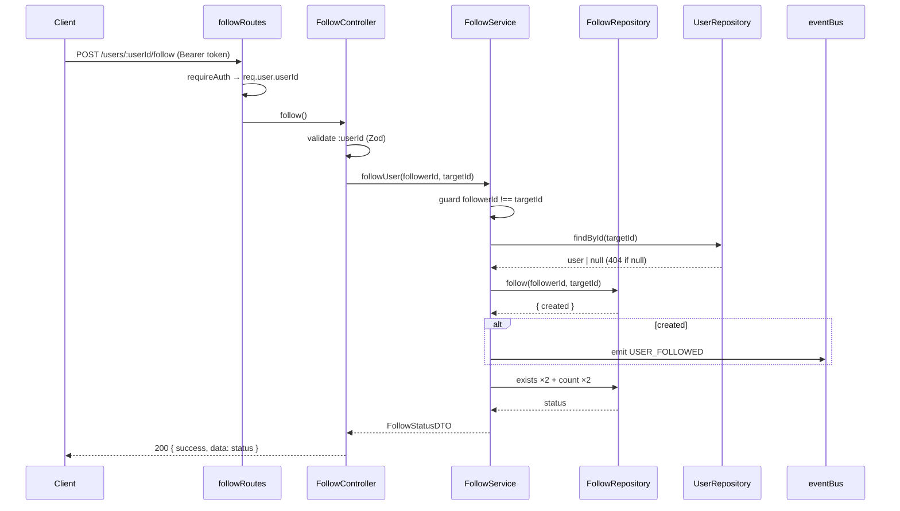
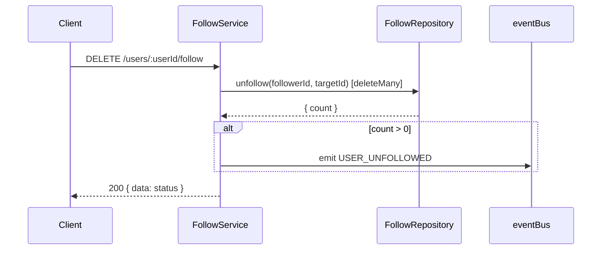
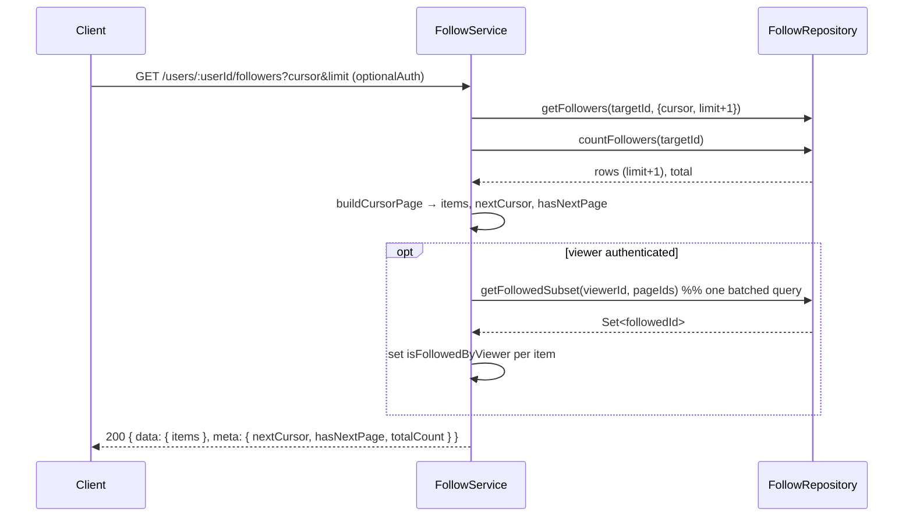

# Follow Module Documentation

The Follow Module owns the **social graph** of Narrative — every follow relationship between users. It is the single source of truth for who follows whom, and exposes the read models (followers, following, follow status, counts, mutual detection) that feeds, dashboards, recommendations, notifications, and analytics consume.

It communicates outward **only through domain events** (`USER_FOLLOWED`, `USER_UNFOLLOWED`); it never calls the Notification, Dashboard, Feed, or Analytics modules directly.

## Responsibilities

The module owns:

- Follow a user
- Unfollow a user
- Followers list (paginated)
- Following list (paginated)
- Follow status (relationship between a viewer and a target)
- Mutual follow detection (`isMutual`, plus a future-ready mutual-followers query)
- Follow statistics (follower / following counts)

It deliberately knows **nothing** about:

- User profiles (owned by the **User** module — this module only reads existence + public fields)
- Notifications, feed generation, analytics (they subscribe to this module's events)

## Architecture

Follows the established **Modular Monolith** layering; each layer is a class exported as a singleton instance.

- **Repository** — [follow.repository.ts](../backend/src/modules/follow/follow.repository.ts) — all Prisma access, cursor pagination, idempotent writes, batched enrichment lookups.
- **Service** — [follow.service.ts](../backend/src/modules/follow/follow.service.ts) — business rules (self-follow guard, target existence, idempotency), DTO mapping, event emission.
- **Controller** — [follow.controller.ts](../backend/src/modules/follow/follow.controller.ts) — thin HTTP handlers; validates params/query with Zod; response envelope.
- **Validator** — [follow.validator.ts](../backend/src/modules/follow/follow.validator.ts) — Zod schemas for the `:userId` param and pagination query.
- **Routes** — [follow.routes.ts](../backend/src/modules/follow/follow.routes.ts) — RESTful routes nested under the user resource with per-route auth.
- **Shared** — cursor pagination primitives live in [core/utils/pagination.ts](../backend/src/core/utils/pagination.ts) (reused by future feed modules).

## Database Design

The `Follow` model ([schema.prisma](../backend/prisma/schema.prisma)) is a self-referential join on `User`:

```prisma
model Follow {
  id String @id @default(cuid())

  followerId String
  follower   User   @relation("UserFollowing", fields: [followerId], references: [id], onDelete: Cascade)

  followingId String
  following   User   @relation("UserFollowers", fields: [followingId], references: [id], onDelete: Cascade)

  createdAt DateTime @default(now())

  @@unique([followerId, followingId]) // prevents duplicate follows
  @@index([followingId, createdAt])   // followers list + follower count
  @@index([followerId, createdAt])    // following list + following count
}
```

Design notes:

- **`followerId`** is the user doing the following; **`followingId`** is the user being followed. (The Prisma relation *names* are inverted by convention: `follower` uses relation `"UserFollowing"`, `following` uses `"UserFollowers"`.)
- **Composite unique `(followerId, followingId)`** makes a duplicate follow a no-op at the database level (the repository catches the `P2002` violation).
- **Cascade deletes** on both foreign keys: when a user is deleted, all their inbound and outbound follow edges are removed automatically.
- **Composite `(col, createdAt)` indexes** make the newest-first cursor pagination index-ordered and also cover the single-column count queries (leftmost-prefix rule), so both list and count scale for users with very large follower counts.
- **Self-follow** is prevented in the **service layer** (`followerId === followingId → 400`). A DB `CHECK` constraint was intentionally not added (Prisma schema + the migration workflow don't express it declaratively); the service guard is the single enforcement point.

Migrations are tracked under `backend/prisma/migrations/` (baselined `0_init`, then `optimize_follow_indexes`). Apply in production with `prisma migrate deploy`.

## API Documentation

All endpoints are nested under the user resource. Base path: `/api/v1/users`.

Response envelope (success): `{ "success": true, "data": {...}, "meta": {...} }`
Error envelope: `{ "success": false, "error": { "code", "message", "details" } }`

| Method | Path | Auth | Description |
|---|---|---|---|
| `POST` | `/users/:userId/follow` | **required** | Follow `:userId`. Idempotent. |
| `DELETE` | `/users/:userId/follow` | **required** | Unfollow `:userId`. Idempotent. |
| `GET` | `/users/:userId/followers` | optional | Paginated followers of `:userId`. |
| `GET` | `/users/:userId/following` | optional | Paginated users `:userId` follows. |
| `GET` | `/users/:userId/follow-status` | **required** | Viewer↔`:userId` relationship + counts. |

### Auth model

- **Follow / unfollow / follow-status** require a valid `Authorization: Bearer <token>`. The follower is **always** the authenticated user (`req.user.userId`) — never taken from the body or params — which structurally guarantees "users can only follow/unfollow as themselves".
- **Followers / following lists are public** (`optionalAuth`). When a token *is* present, each list item is annotated with `isFollowedByViewer` so signed-in clients can render follow buttons.

### `POST` / `DELETE /users/:userId/follow` → `200`

```jsonc
{
  "success": true,
  "data": {
    "isFollowing": true,
    "isFollowedBy": false,
    "isMutual": false,
    "followersCount": 128,
    "followingCount": 87
  },
  "meta": { "message": "Followed successfully" }
}
```

Errors: `400 SELF_FOLLOW`, `404 USER_NOT_FOUND`, `401 UNAUTHORIZED`.

### `GET /users/:userId/followers` (and `/following`)

Query: `?cursor=<opaque>&limit=<1..100>` (default `limit` = 20). The `cursor` is the `id` of the last item from the previous page.

```jsonc
{
  "success": true,
  "data": {
    "items": [
      {
        "id": "clx...", "username": "alice", "name": "Alice",
        "avatar": null, "bio": null, "isVerified": false,
        "followedAt": "2026-07-13T10:00:00.000Z",
        "isFollowedByViewer": true   // present only for authenticated viewers
      }
    ]
  },
  "meta": { "nextCursor": "clx...", "hasNextPage": true, "totalCount": 128 }
}
```

### `GET /users/:userId/follow-status` → `200`

```jsonc
{
  "success": true,
  "data": {
    "isFollowing": true, "isFollowedBy": true, "isMutual": true,
    "followersCount": 128, "followingCount": 87
  }
}
```

### Business rules

- **Cannot follow yourself** → `400 SELF_FOLLOW`.
- **Following twice is idempotent** → `200`, no duplicate row, event emitted only on the first (creating) call.
- **Unfollowing a non-followed user is idempotent** → `200`, no event.
- **Target must exist** → `404 USER_NOT_FOUND`.

## Event Flow

Events are emitted via the central `eventBus` ([core/events/eventBus.ts](../backend/src/core/events/eventBus.ts)) as fire-and-forget. This module only **emits**; consumers (Notification, Feed, Analytics) subscribe independently.

| Event | Emitted when | Payload |
|---|---|---|
| `USER_FOLLOWED` | a new follow edge is created | `{ followerId, followingId }` |
| `USER_UNFOLLOWED` | an existing follow edge is removed | `{ followerId, followingId }` |

Idempotent no-ops (re-follow / re-unfollow) emit **nothing**, so downstream consumers never see phantom events.

## Sequence Diagrams

### Follow a user



### Unfollow a user



### Paginated followers with viewer enrichment



## Performance & Scalability

- **Cursor pagination** (`take: limit + 1`, `cursor: { id }`, `skip: 1`) — no `OFFSET` scan, so page cost is constant regardless of depth.
- **Composite indexes** make both the paginated list (ordered by `createdAt`) and the count queries index-served.
- **No N+1** on enrichment: `isFollowedByViewer` is resolved with a single `WHERE followingId IN (...)` query per page.
- Counts use indexed `COUNT` and are computed in parallel with the page fetch (`Promise.all`).

## Future Extension Points

- **Mutual followers endpoint** — `FollowRepository.getMutualFollowers()` already implements the intersection query; expose it as `GET /users/:userId/mutual-followers` when needed.
- **Notification / Feed / Analytics subscribers** — add `eventBus.on(EVENTS.USER_FOLLOWED, …)` listeners (or enqueue to the existing `notification_queue`) in their own modules; no change to this module.
- **Private accounts / follow requests** — introduce a `status` (PENDING/ACCEPTED) column and a request/approve flow; the service is the single place to gate edge creation.
- **Denormalized counters** — if counts become hot, cache `followersCount`/`followingCount` on `User` and update them inside the follow/unfollow transaction; the repository is the only writer, so the change is localized.
