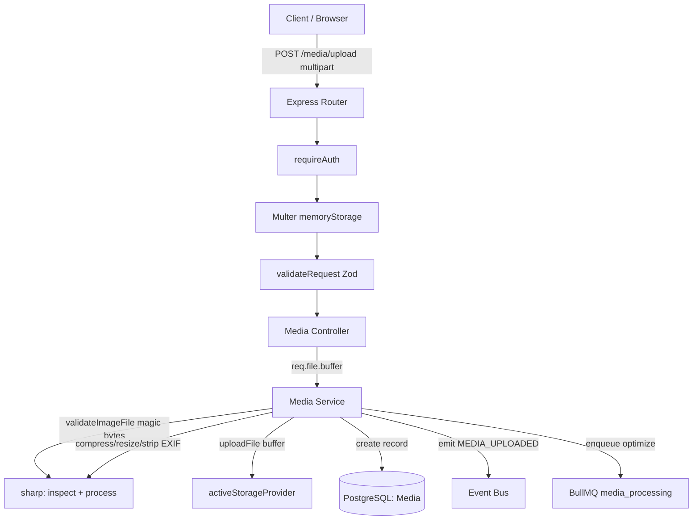

# Media Module Documentation

The Media Module is the **centralized file-management service** for Blogzilla 2.0. It is the **only** module permitted to talk to a storage provider (Cloudinary, local disk, or a future S3/GCS). Every other module (User, Blog, …) depends solely on `MediaService` and never touches Cloudinary directly.

## Responsibilities

The module owns the full asset lifecycle:

- Uploading files (streaming from an in-memory buffer)
- Authoritative validation (true MIME via magic bytes, size, dimensions)
- Image processing (auto-orient, downscale, compress, strip EXIF)
- Persisting file metadata (the `Media` table)
- Storage abstraction & provider selection
- Replace, soft-delete, and retrieval
- Emitting domain events and enqueuing async processing

It deliberately knows **nothing** about Blogs, Users, Comments, or Notifications — it only manages media assets.

## Architecture & Responsibilities

Follows the established **Modular Monolith** layering:

- **Repository** — [media.repository.ts](../backend/src/modules/media/media.repository.ts) abstracts all Prisma access (including the soft-delete filter).
- **Service** — [media.service.ts](../backend/src/modules/media/media.service.ts) holds all business logic: validation, processing, ownership, cleanup-on-failure, events.
- **Controller** — [media.controller.ts](../backend/src/modules/media/media.controller.ts) handles the Express request/response cycle and the response envelope.
- **Validator** — [media.validator.ts](../backend/src/modules/media/media.validator.ts) holds Zod body schemas, limit constants, and the `validateImageFile` (sharp) inspector.
- **Infrastructure abstraction** — uploads go through `IStorageProvider`, decoupling business logic from any concrete backend. Multer sits at the routing middleware layer, keeping Express out of the service logic.

## Storage Architecture & Provider Abstraction

The contract in [IStorageProvider.ts](../backend/src/core/providers/storage/IStorageProvider.ts) exposes a rich API alongside the pre-existing legacy methods:

```ts
interface IStorageProvider {
  readonly name: 'local' | 'cloudinary';
  uploadFile(buffer, opts): Promise<StorageResult>;   // publicId, secureUrl, width, height, bytes, format
  deleteFile(publicId, resourceType?): Promise<void>;
  upload(buffer, filename, mimetype): Promise<string>; // legacy (kept for back-compat)
  delete(identifier): Promise<void>;                   // legacy
}
```

Two implementations ship today:

- **`LocalStorageProvider`** — writes to `backend/uploads/`, derives dimensions via sharp. Default; needs no credentials.
- **`CloudinaryStorageProvider`** — streams the buffer via `upload_stream` (no temp files), delivers with `fetch_format=auto` / `quality=auto`, signs requests (an `api_secret` is configured), and deletes by `public_id`.

### Provider selection

[storage/index.ts](../backend/src/core/providers/storage/index.ts) exports `activeStorageProvider`, chosen at boot from the `STORAGE_PROVIDER` env var:

```ts
export const activeStorageProvider =
  env.STORAGE_PROVIDER === 'cloudinary' ? cloudinaryStorageProvider : storageProvider;
```

Adding a new backend (S3, GCS, Azure) means writing one class that implements `IStorageProvider` and adding a branch here — **no business logic changes**.

### Environment variables

| Var | Required | Notes |
| --- | --- | --- |
| `STORAGE_PROVIDER` | no (default `local`) | `local` \| `cloudinary` |
| `CLOUDINARY_CLOUD_NAME` | only when `cloudinary` | validated via `superRefine` in `env.ts` |
| `CLOUDINARY_API_KEY` | only when `cloudinary` | |
| `CLOUDINARY_API_SECRET` | only when `cloudinary` | enables signed uploads |

Because the default is `local`, the module (and its tests) run green with no credentials.

## Upload Flow



### Validation & the sharp pipeline

Client-provided `mimetype`/extension are **never trusted**. `validateImageFile`:

1. Rejects empty files and anything over **5 MB** (`FILE_TOO_LARGE`).
2. Reads magic bytes with `sharp(buffer).metadata()` — the real format must be one of `jpeg, png, webp, gif, avif` (`UNSUPPORTED_MEDIA_TYPE`).
3. Enforces min **32 px** / max **6000 px** on each side (`IMAGE_TOO_SMALL` / `IMAGE_TOO_LARGE`).

The stored `mimeType`/`extension` are derived from sharp's detected format. Non-GIF images are re-encoded (`.rotate().resize(≤2560, fit:inside, noEnlarge).toFormat(quality:82)`), which downscales, compresses, strips EXIF, and neutralizes malformed payloads. Animated GIFs are passed through to preserve animation.

## Database Design

A single `Media` table (source of truth). Existing `User.avatar` / `Blog.coverImage` remain denormalized secure-URL strings — non-breaking.

```prisma
model Media {
  id, publicId (unique), url, secureUrl
  originalFilename, mimeType, extension, fileSize
  width?, height?
  resourceType  MediaResourceType @default(IMAGE)  // IMAGE | VIDEO | DOCUMENT (last two reserved)
  provider      String                              // 'local' | 'cloudinary'
  checksum?     String                              // sha256 of stored bytes
  metadata?     Json                                // { context, format, altText }
  uploadedById  String → User (onDelete: Cascade)
  deletedAt?    DateTime                            // soft delete
  createdAt, updatedAt
  @@index([uploadedById]) @@index([deletedAt]) @@index([resourceType])
}
```

Schema changes are applied with `npx prisma db push` + `npx prisma generate` (this project uses `db push`, not migration files).

## API Documentation

All routes are under `/api/v1/media` and require `Authorization: Bearer <accessToken>`. Success envelope: `{ success, data, meta }`. Error envelope: `{ success:false, error:{ code, message, details } }`.

| Method | Path | Body | Success |
| --- | --- | --- | --- |
| `POST` | `/upload` | multipart: `file` (required), `context?` (`generic\|avatar\|cover`), `altText?` | `201` `{ media }` |
| `GET` | `/:id` | — | `200` `{ media }` |
| `PATCH` | `/:id/replace` | multipart: `file` (required) | `200` `{ media }` |
| `DELETE` | `/:id` | — | `200` (soft delete) |

**Error codes:** `NO_FILE`, `VALIDATION_ERROR`, `UNSUPPORTED_MEDIA_TYPE`, `FILE_TOO_LARGE`, `IMAGE_TOO_SMALL`, `IMAGE_TOO_LARGE`, `INVALID_IMAGE`, `MEDIA_NOT_FOUND`, `FORBIDDEN`, `STORAGE_UPLOAD_FAILED`.

### Integration surface

Other modules depend only on `MediaService`:

```ts
mediaService.uploadImage(userId, file, input?)
mediaService.uploadAvatar(userId, file)
mediaService.uploadCoverImage(userId, file)
mediaService.replaceMedia(id, userId, file)
mediaService.deleteMedia(id, userId)
mediaService.getMedia(id, userId)
```

The User module's avatar flow now delegates here: `user.service.uploadAvatar` calls `mediaService.uploadAvatar`, creating a `Media` record. `User.avatar` keeps the secure URL for convenience, and `User.avatarMediaId` holds a proper FK to the current avatar's `Media` row. When an avatar is replaced or removed, the **previous** avatar's Media record is retired through `mediaService.deleteMedia` (soft-delete + storage cleanup), so no orphaned rows or files are left behind.

## Event Flow

Emit-only domain events (added to `core/events/eventBus.ts`):

| Event | Payload |
| --- | --- |
| `MEDIA_UPLOADED` | `{ mediaId, userId, secureUrl }` |
| `MEDIA_REPLACED` | `{ mediaId, userId, secureUrl, oldPublicId }` |
| `MEDIA_DELETED` | `{ mediaId, userId }` |

The module never calls Blog/User/Notification logic directly.

## Async Processing (Worker/Queue)

Uploads enqueue an `optimize` job on the `media_processing` BullMQ queue. The worker in [media.worker.ts](../backend/src/modules/media/media.worker.ts) verifies/backfills derived metadata (thumbnails and responsive variants are future work).

> **Boot-safety:** a BullMQ `Worker` opens Redis and polls the moment it is constructed. The worker is therefore imported **only from `server.ts`**, never from `app.ts` or the service layer, so test suites that import `app` don't spin up a live worker.

## Security Considerations

- **AuthN/AuthZ** — every route behind `requireAuth`; every read/mutate enforces `media.uploadedById === userId` (`403 FORBIDDEN`).
- **No trusted client metadata** — MIME/extension/dimensions are derived from the bytes themselves.
- **Executable/oversized rejection** — non-image or >5 MB payloads are rejected before storage; re-encoding strips embedded payloads and EXIF.
- **Signed Cloudinary uploads** — configured with `api_secret`, `secure:true`.
- **Cleanup-on-failure** — if the DB write fails after a successful storage upload, the orphaned asset is deleted; on replace failure the *new* asset is rolled back and the original preserved.

## Testing

- **Unit** — [media.service.test.ts](../backend/src/modules/media/__tests__/media.service.test.ts): mocks repository, storage, queue, sharp, and eventBus. Covers validation rejections, happy-path persistence + event + enqueue, cleanup-on-failure, and ownership `403` on get/delete/replace.
- **Integration** — [media.integration.test.ts](../backend/src/modules/media/__tests__/media.integration.test.ts): supertest against the real `app` with a mocked service — `401` without token, `NO_FILE`, `VALIDATION_ERROR`, and the `201` envelope.
- External storage is always mocked; tests run under the default `local` provider with no credentials.

## Future Extension Points

- `VIDEO` / `DOCUMENT` resource types (enum values already reserved).
- Thumbnail / responsive-variant generation in the worker.
- Restore endpoint (soft-delete already records `deletedAt`; `findByIdWithDeleted` exists).
- Normalizing `Blog.coverImage` into an FK relation to `Media` (already done for the User avatar via `User.avatarMediaId`).
- Direct-to-Cloudinary signed client uploads for very large files.
- Additional providers (S3, GCS, Azure) via new `IStorageProvider` implementations.
