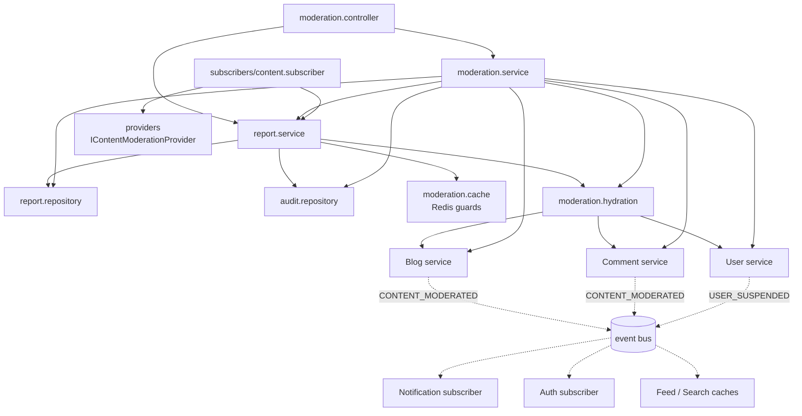
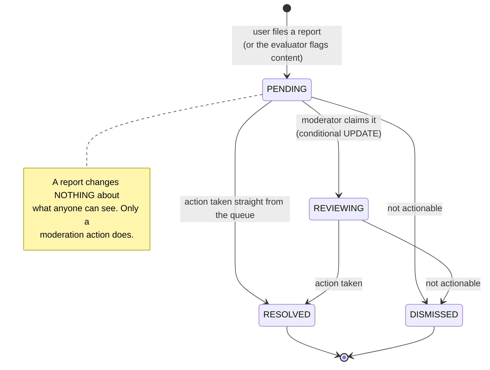
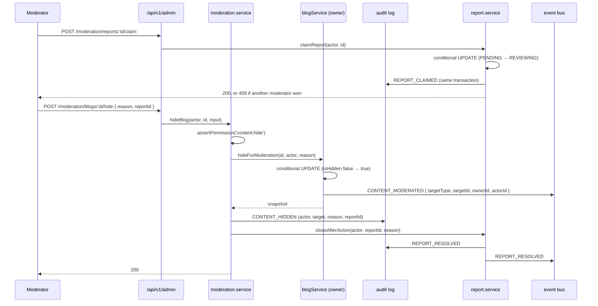
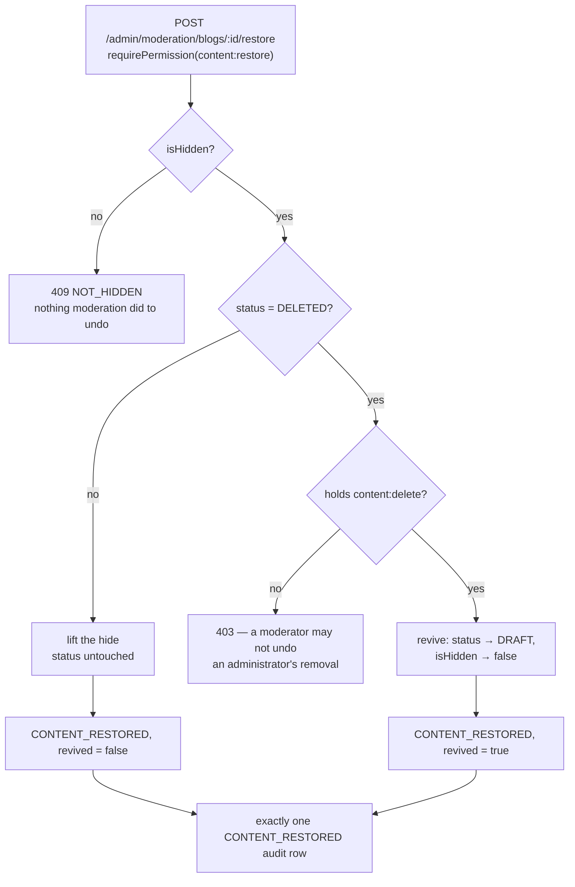
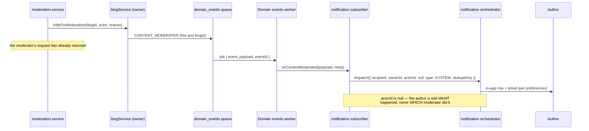
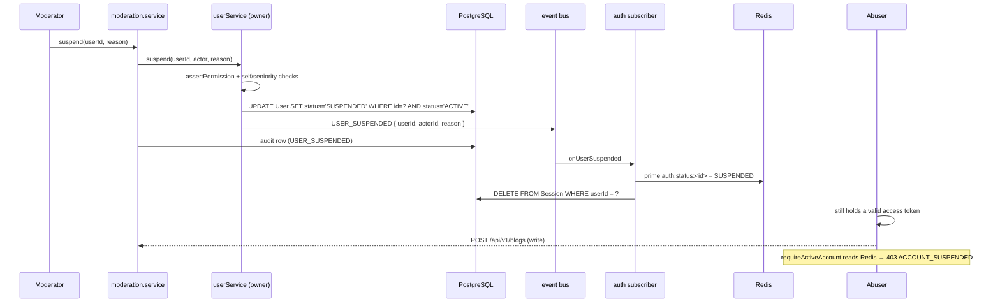
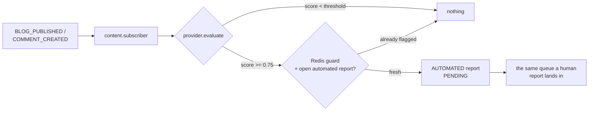

# Moderation & Administration Module

The platform-level machinery for keeping Narrative safe: what the community
flags, what moderators do about it, and the record of who did what.

> **One sentence:** Moderation owns **reports** and the **audit log**, and
> nothing else — every action it takes is performed by the module that owns the
> data (Blog, Comment, User), so there is exactly one definition of "hidden",
> "deleted" and "suspended" on the platform.

---

## 1. Responsibilities

**Owns**

- **Reports** — the queue, its statuses, its filters, its duplicate rules.
- The **moderation audit log** — append-only, and the only complete record of
  administrative action.
- The **orchestration** of an administrative decision: authorize → ask the
  owning module to act → record what happened → close the report.
- The **automated evaluation seam** (`IContentModerationProvider`) and the
  threshold at which a verdict becomes a report.
- The **administrative API contract** and its DTOs.

**Does not own — and must never start owning**

| Not owned | Owner |
| --- | --- |
| Blog content, status, visibility, `isHidden` | Blog |
| Comment content, tombstones, `isHidden` | Comment |
| Account status (`ACTIVE` / `SUSPENDED` / `DELETED`) | User |
| Session revocation, token verification | Auth |
| Notification copy, channels, preferences, delivery | Notification |
| Discovery eligibility | Feed / Search |
| The role → permission catalogue | `modules/auth/permissions.ts` |

**The structural rule that enforces it:** there is **no query in this module
that writes another module's table**. `moderationService.hideBlog` calls
`blogService.hideForModeration`; `suspendUser` calls `userService.suspend`. If a
moderation action ever needs data no service exposes, the method is added to the
module that owns it — exactly how `blogService.getModerationSnapshot` and
`userService.getModerationSummary` came to exist.

---

## 2. Architecture



Solid arrows are synchronous calls; dashed arrows are domain events. Note the
direction of the dashed ones: the modules that OWN the data emit the facts, and
Notification, Auth, Feed and Search react. **Nothing outside this module imports
it**, which is what keeps it a leaf rather than a hub.

### File layout

```text
src/modules/moderation/
├── moderation.routes.ts        reportRoutes (users) + adminRoutes (staff)
├── moderation.controller.ts    parse → delegate → format; builds the actor
├── report.service.ts           filing, the queue, triage, closure
├── moderation.service.ts       content/account actions, overview, history
├── report.repository.ts        report SQL (raw where the partial index needs it)
├── audit.repository.ts         audit SQL — append only, no update, no delete
├── moderation.hydration.ts     ids → things, batched, through owning services
├── moderation.mappers.ts       rows → DTOs (pure)
├── moderation.query.ts         shared keyset primitives
├── moderation.cursor.ts        opaque cursors + request fingerprinting
├── moderation.cache.ts         Redis duplicate guards (never authoritative)
├── moderation.transaction.ts   decision + audit row, atomically
├── moderation.validator.ts     Zod schemas
├── moderation.config.ts        thresholds, limits, TTLs
├── moderation.types.ts         DTOs
├── providers/                  IContentModerationProvider + rule-based impl
└── subscribers/                automated evaluation on new content
```

### Upstream capabilities added for this module

Each was added to the module that owns the data, never reimplemented here:

| Module | Added |
| --- | --- |
| Blog | `isHidden` / `hiddenAt`, `hideForModeration`, `restoreFromModeration`, `deleteForModeration`, `getModerationSnapshot`, and the write guard that stops an author editing their way out of a hide |
| Comment | `hiddenAt`, `hideForModeration`, `restoreFromModeration`, `deleteForModeration`, `getModerationSnapshot` |
| User | `suspendedAt` / `suspendedReason`, `suspend`, `unsuspend`, `getModerationSummary`, `getPublicUserCards`, conditional `transitionStatus` |
| Auth | The permission catalogue, `requirePermission`, `requireActiveAccount`, `accountStatusService`, and the subscriber that revokes sessions on suspension |
| Notification | A moderation subscriber that turns moderation facts into SYSTEM notifications |
| Feed / Search | `isHidden = false` in the eligibility predicate, and cache invalidation on moderation events |

---

## 3. Roles and permissions

Authorization is **permission-based**, defined once in
[`modules/auth/permissions.ts`](../backend/src/modules/auth/permissions.ts).
No controller, route or service names a role.

| Permission | USER | MODERATOR | ADMIN |
| --- | :-: | :-: | :-: |
| `reports:view` | | ✅ | ✅ |
| `reports:review` | | ✅ | ✅ |
| `reports:resolve` | | ✅ | ✅ |
| `content:hide` | | ✅ | ✅ |
| `content:restore` | | ✅ | ✅ |
| `content:delete` | | | ✅ |
| `users:suspend` | | ✅ | ✅ |
| `users:unsuspend` | | ✅ | ✅ |
| `users:manage` | | | ✅ |
| `moderation:history:view` | | ✅ | ✅ |
| `platform:settings:manage` | | | ✅ |

**Why the split is where it is.** A moderator can do everything that is
reversible and audited — including suspension, because a moderation team that
must escalate every account to an administrator stops nobody at 3am. The three
administrator-only permissions are each escalation-sensitive:

- `content:delete` — a removal, and its undo. A moderator cannot remove content,
  and cannot revive content that was removed (§ 5): if lifting an
  administrator's removal cost only `content:restore`, the admin-only gate on
  taking it would be worth nothing.
- `users:manage` — includes changing roles, so granting it to moderators would
  let any moderator promote themselves. Privilege escalation in one hop.
- `platform:settings:manage` — changes the rules everyone else enforces.

**Adding a role** (content moderator, support administrator, …) is one entry in
`ROLE_PERMISSIONS` and one value in the `Role` enum. `ROLE_PERMISSIONS` is a
`Record<Role, …>`, so adding an enum value without deciding what it may do is a
compile error rather than a role that silently holds everything.

**Two enforcement points, deliberately.** Routes carry
`requirePermission([...])`; every service method calls `assertPermission` again.
The middleware protects the HTTP path, but a service is also reachable from
subscribers, workers and tests — and this is the module where "somebody forgot
the middleware" is a privilege escalation rather than a bug.

**Seniority.** A moderator cannot act on their own account, nor on another
account that holds any permission. Administrators (`users:manage`) are exempt —
someone has to be able to stop a compromised staff account.

---

## 4. Reporting

Any authenticated, non-suspended member can report a **blog**, a **comment** or
a **user**.

### Report lifecycle



`RESOLVED` and `DISMISSED` are terminal. A closed report is never re-opened —
the same target reported again produces a **new** report, which is what keeps
"who decided this, when, and why" attributable to one decision.

### The rule that makes reporting safe

**Filing a report has no effect on visibility.** If it did, reports would be the
platform's censorship API and a brigade would be its user interface. The queue
records that people are unhappy; a human decides what that is worth.

### Duplicate suppression — two layers

| Layer | What it does | Authoritative? |
| --- | --- | --- |
| Redis `SET NX`, 6h TTL | Answers a repeat submission without touching Postgres | **No** |
| Partial unique index on OPEN reports | Refuses a genuine duplicate | **Yes** |

```sql
CREATE UNIQUE INDEX report_open_unique_idx
  ON "Report" ("reporterId", "targetType", "targetId")
  WHERE "status" IN ('PENDING','REVIEWING') AND "reporterId" IS NOT NULL;
```

The index is **partial** on purpose. A plain unique constraint would forbid
re-reporting a user who resumed the same behaviour months after an earlier
report was dismissed — permanently, and in a way that would only be discovered
by the person it silenced.

Because the pre-check and the INSERT are not atomic, two simultaneous
submissions can both pass the check; the index settles it and `P2002` is
surfaced as the same `409 DUPLICATE_REPORT`. The Redis guard is **released** on
every path that does not end in a stored report, or a rejected submission would
lock a reporter out for hours over a report that does not exist.

### Other filing rules

- You cannot report your own account (decided with no I/O at all).
- You cannot report your own content — you can delete it yourself.
- An unknown target is `404 TARGET_NOT_FOUND`.
- The reason must be one of the `ReportReason` enum values.
- `targetId` is pattern-checked (`[A-Za-z0-9_-]{1,64}`) before it reaches
  anything — it is carried in a polymorphic column with no foreign key behind
  it, so nothing downstream would reject a 4 KB string.

---

## 5. Moderation workflow



### Available actions

| Action | Permission | Effect | Reversible |
| --- | --- | --- | --- |
| Hide blog | `content:hide` | `Blog.isHidden = true` | Yes, `content:restore` |
| Restore blog | `content:restore` | `Blog.isHidden = false` | — |
| Remove blog | `content:delete` | `Blog.status = DELETED` **and** `isHidden = true` | Yes, but only with `content:delete` |
| Revive a removed blog | `content:delete` | `status = DRAFT`, `isHidden = false` | — |
| Hide comment | `content:hide` | `Comment.isHidden = true` (tombstone keeps replies readable) | Yes |
| Restore comment | `content:restore` | `Comment.isHidden = false` | — |
| Remove comment | `content:delete` | `Comment.deletedAt` set **and** `isHidden = true` | Yes, but only with `content:delete` |
| Revive a removed comment | `content:delete` | `deletedAt = null`, `isHidden = false` | — |
| Suspend user | `users:suspend` | `User.status = SUSPENDED` | Yes, `users:unsuspend` |
| Unsuspend user | `users:unsuspend` | `User.status = ACTIVE` | — |

### Restoring, and undoing a removal

There is **one** restore endpoint per content type, and what it undoes depends
on the state of the row rather than on a flag the caller passes:



Four decisions worth stating, because each of them is load-bearing:

**A removal sets `isHidden` too.** Not defensive duplication: `assertNotModerated`
gates every author-side write on that flag alone, and `DELETED → DRAFT` is an
ordinary author transition. A removal that moved only the status would be
undoable by the very person it was aimed at — with nothing in the audit log to
show for it.

**`status = DELETED AND isHidden` is the marker for "moderation removed this".**
No `deletedBy` column exists and none is needed: the author's own delete cannot
run while the flag is set, so a plain `DELETED` row is always their own doing.
A restore refuses to resurrect one — that decision is theirs, and undoing it is
theirs too (`POST /blogs/:id/restore`). The comment side reads
`deletedAt AND isHidden` the same way, which is why the author path refuses to
delete a hidden comment as well as to edit one.

**Reviving costs `content:delete`, not `content:restore`.** Undoing an
administrator-only action has to cost what taking it cost. Otherwise the
admin-only gate on removal buys nothing: a moderator could not remove a post,
but could put back one removed for being illegal. The route still carries
`requirePermission(['content:restore'])`; the service escalates when it sees it
is reviving. The equivalent side door is closed too — `commentService.restore`,
which is the cheaper `content:restore` tombstone-clear, refuses a comment
carrying the hide flag.

**A revived blog comes back as a `DRAFT`.** Its pre-removal status is recorded
nowhere, and republishing on the author's behalf is not moderation's call. The
author republishes, which re-runs the publish path; the notification says so
(`revived: true` on the event is what the notification copy branches on).

### Why `Blog.isHidden` is a new axis and not a status

`BlogStatus` is the **author's** lifecycle (draft → published → archived) and
the author moves it freely. A moderation decision encoded there could be undone
with an ordinary republish. `isHidden` is orthogonal, only moderation writes it,
and while it is set:

- the blog is refused by `blogService.canView` — even for its author, so a stale
  public URL cannot resurface it;
- every author-side mutation (edit, autosave, publish, unpublish, archive,
  restore, delete, cover change) returns `409 CONTENT_MODERATED` — including for
  ADMIN callers, so an administrator who disagrees must restore it through the
  audited endpoint rather than edit around the decision;
- it is excluded from Feed, Explore, Trending and Search by the eligibility
  predicate, not by a moderation-specific filter;
- it still appears in the author's own `/blogs/me` listing carrying
  `isHidden: true`, because content that silently stops appearing — with the
  dashboard still calling it published — is indistinguishable from a platform
  bug.

This mirrors `Comment.isHidden`, which has meant exactly this since the Comment
module shipped.

### Concurrency

Two moderators working the same queue page is the normal case. Every transition
is a **conditional UPDATE** whose row count decides the outcome:

| Race | Outcome |
| --- | --- |
| Two claims | One `200`, one `409 REPORT_NOT_PENDING` |
| Two resolutions | One sticks; the other gets `409 REPORT_ALREADY_CLOSED`. Status and note never interleave |
| Two hides | One `200`, one `409 ALREADY_HIDDEN` — one audit row, one notification |
| Two restores | One `200`, one `409 NOT_HIDDEN` — one audit row, one notification |
| A restore racing a removal | The revive's `WHERE` names both halves of the state it read, so the loser changes 0 rows and gets `409` rather than half-applying |
| Two suspensions | One `200`, one `409 ALREADY_SUSPENDED` |
| Claim on a closed report | `409` |

No distributed lock, no `SELECT … FOR UPDATE`, no advisory lock: the conditions
are single-row and the database is already the arbiter. Introducing locking
would add a failure mode (a held lock outliving a crashed process) to solve a
problem that does not exist at this concurrency.

---

## 6. Audit logging

Every administrative action writes exactly one `ModerationAction` row:

| Column | Meaning |
| --- | --- |
| `actorId` | The moderator, always from the verified token |
| `action` | `CONTENT_HIDDEN`, `USER_SUSPENDED`, `REPORT_CLAIMED`, … |
| `targetType` / `targetId` | Polymorphic target (`BLOG`, `COMMENT`, `USER`, `REPORT`) |
| `subjectUserId` | The affected account, denormalized |
| `reportId` | The report this came from, if any |
| `reason` | The moderator's rationale |
| `metadata` | Action-specific detail (blog slug, comment's blog id, …) |
| `createdAt` | When. There is no `updatedAt` — that is the point |

### Append-only, enforced by the database

Writing no update method is a convention, and a convention is one careless
`prisma.moderationAction.update(...)` away from being untrue — with no error and
no log line. So the guarantee lives in the database:

```sql
CREATE TRIGGER moderation_action_no_update BEFORE UPDATE ON "ModerationAction"
  FOR EACH ROW EXECUTE FUNCTION moderation_action_append_only();
CREATE TRIGGER moderation_action_no_delete BEFORE DELETE ON "ModerationAction"
  FOR EACH ROW EXECUTE FUNCTION moderation_action_append_only();
```

Any UPDATE or DELETE raises, from any client — a future service, a psql session,
a migration script. `TRUNCATE` deliberately still works (it fires no row
triggers), which is what lets the test suite reset. Retention pruning is a
conscious privileged act: disable the trigger, delete, re-enable.

### Ordering: act first, then record

The audit row is written **after** the action succeeds. Recording an intention
that then fails would put actions in the log that never happened, and a log
containing things that did not happen is worse than one that is occasionally
missing something — nothing in it can be trusted.

Two consequences, both deliberate:

1. **A failed audit write does not fail the request.** The content is already
   hidden; a `500` would tell the moderator their action failed when it did not,
   and the retry they would reasonably make would act a second time — a second
   suspension, a second notification. That trades a missing row for a wrong one.
2. **Cross-module actions are not transactional.** Hiding a blog commits inside
   the Blog module before the audit row is written; a failure or crash in between
   loses the row. Closing that gap would mean threading a transaction client
   through another module's service — the exact coupling the modular monolith
   exists to prevent. **Local** decisions (claim, resolve, dismiss) *are* wrapped
   in one transaction with their audit row, via `runModerationTransaction`.

This is a **foundation-level limitation**, not a moderation bug, and it is
handled rather than hidden — see § 18.1. The compensating control is a single
structured log line, and it is written to be found:

```jsonc
{
  "level": "error",
  "event": "moderation.audit_write_failed",   // stable key — alert on any rate > 0
  "msg": "moderation: ACTION PERFORMED BUT NOT AUDITED — audit log is incomplete",
  "actorId": "...", "action": "CONTENT_HIDDEN", "targetType": "BLOG",
  "targetId": "...", "subjectUserId": "...", "reportId": "...",
  "reason": "...", "metadata": { }, "err": { }
}
```

The **entire entry** is logged, not a summary of it, because this line is then
the only surviving trace of the decision and has to carry enough to write the
row back by hand. The window is one `INSERT` wide into a table with no foreign
keys and no unique constraints to violate, so in practice it opens only when
Postgres itself is unavailable — at which point the action would rarely have
committed either. The action's domain event is durable (BullMQ) and carries the
actor, so a second trace survives independently.

### Adding an action type

Add a value to `ModerationActionType` and call `this.audit(...)` from the new
service method. The log's shape — actor, action, target, subject, reason,
metadata — was chosen so no future action needs a schema change.

---

## 7. Events

No new event bus, no duplicate events. Additions to the shared catalogue in
[`core/events/eventBus.ts`](../backend/src/core/events/eventBus.ts):

| Event | Emitted by | Payload |
| --- | --- | --- |
| `REPORT_CREATED` | Moderation | `{ reportId, targetType, targetId, targetOwnerId, reporterId, reason, source }` |
| `REPORT_ASSIGNED` | Moderation | `{ reportId, moderatorId, targetType, targetId }` |
| `REPORT_RESOLVED` | Moderation | `{ reportId, moderatorId, resolution }` |
| `REPORT_DISMISSED` | Moderation | `{ reportId, moderatorId, targetType, targetId }` |
| `CONTENT_MODERATED` | **Blog / Comment** | `{ targetType, targetId, ownerId, actorId, action, reason }` |
| `CONTENT_RESTORED` | **Blog / Comment** | `{ targetType, targetId, ownerId, actorId }` |
| `USER_SUSPENDED` | **User** | `{ userId, actorId, reason }` |
| `USER_UNSUSPENDED` | **User** | `{ userId, actorId }` |

**Who emits what, and why it matters.** Outcome events are emitted by the module
that OWNS the changed data, not by Moderation. The fact is "this blog is now
hidden", and the only code that can truthfully state it is the code that hid it.
That is also what lets Feed, Search, Auth and Notification subscribe without any
of them depending on the Moderation module — a suspension applied by some future
admin CLI would be enforced and notified identically.

Report events are Moderation's own, because Moderation owns reports. Nothing
subscribes to them to change visibility; they exist for operational awareness
and as the seam a future triage automation would hook into.

### Event-driven notification flow



Three properties this arrangement buys:

- **Moderation never sends a notification.** It emits a fact; copy, channels,
  preferences and delivery stay with the module that owns them.
- **The moderator is not named to the affected user.** Moderation staff are the
  most harassment-exposed people on any platform. The actor *is* recorded — in
  the audit log, which the affected user cannot read.
- **One event, one notification.** `dedupeKey` embeds the bus's `eventId`, which
  is stable across retries and unique per emission, so a redelivered job
  notifies once while a genuine hide → restore → hide sequence notifies three
  times. A key built from the target id alone would swallow the second hide.

`SYSTEM` is reused rather than a new `NotificationType` added: it already
defaults to reachable on both channels and already has an email template, and a
new type would let someone mute the message telling them their account has been
suspended.

---

## 8. User suspension



### Why a per-request check exists

Auth already refuses a login and a refresh for a suspended account. Neither
helps against the token the abuser is holding right now: an access token is
valid for its full lifetime (15 minutes by default) and nothing consults the
database while it is. Suspension that takes effect in a quarter of an hour is
not suspension — it is exactly long enough to finish a spam run.

Alternatives considered and rejected: shortening every user's token lifetime
(punishes everyone for one abuser), a JWT denylist (needs an enumeration of live
tokens that nothing tracks), a status claim in the token (frozen at mint time —
the very problem).

### The check

`requireActiveAccount` reads `auth:status:<userId>` from Redis (60s TTL), falling
back to a primary-key lookup of the status column alone. PostgreSQL is
authoritative; Redis only makes the common case a `GET`. Suspension **primes**
the cache through the auth subscriber, so enforcement is immediate; the TTL is
the backstop for a lost event or a restarted Redis.

### Where it is applied

| Applied | Not applied |
| --- | --- |
| Blog create / update / publish / archive / delete / cover | All reads |
| Comment create / reply / edit | Unfollow |
| Follow | Bookmarks (private, affects nobody else) |
| Profile mutations | Account deletion (a suspended user may still leave) |
| Account **deactivation** | |
| Filing a report | |
| **Every administrative route** | |

A suspended user can still read the platform and see their own account —
including why they were suspended. What they cannot do is act.

Deletion and deactivation land on opposite sides of that table, and the
difference is the whole point of guarding one and not the other. Leaving is
always permitted. Hiding is not: deactivation is reversed by a successful login,
so a suspended user allowed to deactivate could log straight back in to an
`ACTIVE` account and launder the suspension away through a feature built for
something else. `userService.deactivate` restricts its conditional UPDATE to
`expected: ['ACTIVE']` for the same reason, so the rule survives the guard being
dropped from the route.

The converse also holds: `suspend` accepts `DEACTIVATED` as a source state, so
stepping out of view is not a way to become unreachable by moderation. A
suspension lifted afterwards returns the account to `ACTIVE` rather than to the
`DEACTIVATED` state it was in — a deliberate trade, recorded in
[USER_MODULE.md](./USER_MODULE.md#account-deactivation).

Administrative routes are included for a specific reason: a moderator's own
account can be suspended (that is how a compromised staff account is stopped),
and without the check their existing token would keep moderating for its full
lifetime.

### What else changes on suspension

- Sessions are deleted, so no new access token can be minted.
- `authService.login` refuses with `403 ACCOUNT_SUSPENDED`; `refreshTokens`
  refuses any non-ACTIVE user.
- Every blog they wrote leaves Feed, Explore, Trending and Search — because
  `u."status" = 'ACTIVE'` is already in the discovery predicate. **No blog row is
  touched**, so unsuspending restores their whole catalogue with one UPDATE.
- Feed and Search caches are invalidated immediately (they subscribe to
  `USER_SUSPENDED`), rather than serving a stale page for the rest of its TTL.
- The account is notified.

---

## 9. Content visibility

Moderated content must not appear anywhere. It is excluded by the **existing**
mechanism in each surface, never by a moderation-specific filter:

| Surface | Mechanism |
| --- | --- |
| Blog page (`/blogs/:slug`) | `blogService.canView` returns false for `isHidden` |
| Feed / Explore / Trending | `FEED_ELIGIBILITY`: `b."isHidden" = false` |
| Search | `PUBLIC_BLOG_PREDICATE`: `b."isHidden" = false` |
| Public profile / author listing | Goes through the same blog queries |
| Dashboard panels | `listMyBlogs` / `getMyBlogCards` exclude hidden |
| Comment threads | Existing tombstone: content replaced with a placeholder |
| Everything by a suspended author | `u."status" = 'ACTIVE'`, already present |

One definition per surface, and each lives in the file that already owned
"what may be seen here" — so the next visibility rule (memberships, say) does
not have to be added to a moderation query as well.

---

## 10. API

All routes are under `/api/v1`, use the standard envelope
(`{ success, data, meta }` / `{ success, error }`), Zod validation, and the
shared error handler.

### User-facing

#### `POST /reports`

`requireAuth` + `requireActiveAccount` + `reportLimiter` (20/hour).

```json
{
  "targetType": "BLOG",
  "targetId": "clx...",
  "reason": "SPAM",
  "description": "Nothing but affiliate links"
}
```

`201` with the created report. There is no `reporterId` field and never will be
— the reporter is the authenticated caller.

| Error | Code |
| --- | --- |
| `400` | `VALIDATION_ERROR`, `INVALID_TARGET` (self-report, own content) |
| `403` | `ACCOUNT_SUSPENDED` |
| `404` | `TARGET_NOT_FOUND` |
| `409` | `DUPLICATE_REPORT` |
| `429` | `TOO_MANY_REQUESTS` |

### Administrative

Every route below: `requireAuth` + `requireActiveAccount` +
`requirePermission([...])`.

| Method | Path | Permission |
| --- | --- | --- |
| `GET` | `/admin/me` | *(auth only)* |
| `GET` | `/admin/moderation/overview` | `reports:view` |
| `GET` | `/admin/moderation/reports` | `reports:view` |
| `GET` | `/admin/moderation/reports/:id` | `reports:view` |
| `POST` | `/admin/moderation/reports/:id/claim` | `reports:review` |
| `POST` | `/admin/moderation/reports/:id/resolve` | `reports:resolve` |
| `POST` | `/admin/moderation/reports/:id/dismiss` | `reports:resolve` |
| `POST` | `/admin/moderation/blogs/:id/hide` | `content:hide` |
| `POST` | `/admin/moderation/blogs/:id/restore` | `content:restore` (`content:delete` to revive a removal) |
| `POST` | `/admin/moderation/blogs/:id/remove` | `content:delete` |
| `POST` | `/admin/moderation/comments/:id/hide` | `content:hide` |
| `POST` | `/admin/moderation/comments/:id/restore` | `content:restore` (`content:delete` to revive a removal) |
| `POST` | `/admin/moderation/comments/:id/remove` | `content:delete` |
| `POST` | `/admin/moderation/users/:id/suspend` | `users:suspend` |
| `POST` | `/admin/moderation/users/:id/unsuspend` | `users:unsuspend` |
| `GET` | `/admin/moderation/users/:id` | `reports:view` |
| `GET` | `/admin/moderation/content/:targetType/:targetId` | `reports:view` |
| `GET` | `/admin/moderation/history` | `moderation:history:view` |

#### Action bodies

Every action endpoint accepts the same optional body:

```json
{ "reason": "Affiliate spam", "reportId": "clx..." }
```

`reportId` links the action to the report that prompted it: the action is
performed, audited, and that report is closed — one round trip for one decision.
Omitted, it is a direct action, equally legitimate and equally audited.

#### `GET /admin/moderation/reports`

| Parameter | Values | Default |
| --- | --- | --- |
| `status` | CSV of `PENDING,REVIEWING,RESOLVED,DISMISSED` | open only |
| `targetType` | `BLOG` \| `COMMENT` \| `USER` | — |
| `reason` | any `ReportReason` | — |
| `source` | `USER` \| `AUTOMATED` | — |
| `assignedTo` | moderator id | — |
| `targetOwner` | account id | — |
| `from` / `to` | ISO dates | — |
| `sort` | `oldest` \| `newest` | `oldest` |
| `limit` | 1–100 | 25 |
| `cursor` | opaque | — |

`meta` carries `{ nextCursor, hasNextPage, limit }`.

#### `GET /admin/moderation/reports/:id`

The queue row plus:

- `target` — the **live** blog, comment or account (`kind: 'MISSING'` when the
  target has since been hard-deleted, so the page still renders);
- `relatedOpenReports` — how many *others* have reported the same thing;
- `history` — what has already been done about this report.

#### `GET /admin/moderation/overview`

```json
{
  "queue": { "pending": 12, "reviewing": 3, "oldestOpenAt": "2026-08-18T09:00:00Z" },
  "openByReason": [{ "reason": "SPAM", "count": 9 }],
  "openByTargetType": [{ "targetType": "BLOG", "count": 7 }],
  "activity": [{ "action": "CONTENT_HIDDEN", "count": 22 }],
  "activityWindowDays": 7,
  "recentActions": [ /* … */ ]
}
```

Every figure is bounded. There is deliberately no "reports ever" or "actions
ever": those are full-table counts that get slower every day and that nobody
acts on.

### DTOs, never Prisma models

`ReportListItemDTO`, `ReportDetailDTO`, `ModerationActionDTO`, `UserCardDTO`,
`BlogTargetDTO`, `CommentTargetDTO`, `UserTargetDTO`, `MissingTargetDTO`,
`ModerationOverviewDTO`. `UserCardDTO` carries only public profile fields — a
moderator judging a report does not need the reporter's email, and an admin
surface is where an over-wide DTO does the most damage.

---

## 11. Pagination

Both administrative lists use **keyset** pagination over `(createdAt, id)`.

- **Not offset.** Both lists are append-heavy and read while being written to.
  Under OFFSET, each insert shifts every later page by one — a moderator sees a
  report twice, or never sees one, and neither failure announces itself.
- **The trailing `id` makes the ordering total.** `createdAt` alone is not
  unique: a spam wave files several reports inside one millisecond. A keyset over
  a non-unique column is exactly as broken as OFFSET, just less obviously. The DB
  suite asserts this against rows that deliberately share timestamps.
- **Value comparison, not Prisma's `cursor`.** Prisma's cursor seeks by primary
  key and needs `skip: 1`, which is only correct while that row still exists. A
  row-wise `(createdAt, id) > (t, i)` describes a position, not a row.
- **Fingerprinted.** Every cursor carries a digest of the filters and sort that
  produced it. Replaying one against a different query is `400 INVALID_CURSOR`,
  not a plausible-looking wrong page.
- **Not signed.** The cursor encodes no authorization: routes are gated by
  permission and queries are never scoped by anything inside the cursor. Signing
  would add key management for no security gain — the same call Search and Feed
  made.

---

## 12. Database design

### `Report`

Polymorphic over `(targetType, targetId)` with **no foreign key** to the target.
A real FK would need one nullable column and one relation per target type, and a
fifth reportable thing would be a migration on two tables plus a schema change on
`User`. The cost is a possible dangling `targetId`, handled at read time by
rendering `kind: 'MISSING'`.

`targetOwnerId` is denormalized at filing time so the queue can answer "who is
this about" and "does this account have a history" without joining three tables
per row — the N+1 a polymorphic target otherwise guarantees.

### `ModerationAction`

Actor is a real FK with `onDelete: Restrict`, so an audit row can never be
orphaned or cascaded away. Users are soft-deleted on this platform, so it never
blocks a real operation. No `updatedAt`: a row that can be updated is not an
audit log.

### Indexes

| Index | Serves |
| --- | --- |
| `report_open_queue_idx` *(partial)* | The default queue — open reports in `(createdAt, id)` order |
| `report_open_unique_idx` *(partial unique)* | Duplicate suppression |
| `Report_status_createdAt_id_idx` | Closed/filtered status views |
| `Report_createdAt_id_idx` | The unfiltered queue and date-range views |
| `Report_targetType_targetId_status_idx` | "What else has been reported about this" |
| `Report_targetOwnerId_createdAt_id_idx` | "This account's record" |
| `Report_assignedToId_status_createdAt_idx` | A moderator's claimed queue |
| `Report_reporterId_createdAt_idx` | A reporter's history |
| `ModerationAction_createdAt_id_idx` | The history feed |
| `ModerationAction_targetType_targetId_createdAt_idx` | Everything done to one thing |
| `ModerationAction_actorId_createdAt_idx` | Reviewing a reviewer |
| `ModerationAction_action_createdAt_idx` | Filtered history and throughput |
| `ModerationAction_subjectUserId_createdAt_idx` | One account's full record |

### Why the queue query is raw SQL

`report_open_queue_idx` is partial on `status IN ('PENDING','REVIEWING')`, and
**Postgres can only prove a partial index applies against constants**. Prisma
always parameterizes, so the planner fell back to the full `(createdAt, id)`
index and filtered. Measured on a seeded 20 300-row table
(`npm run moderation:report`):

| Form | Time | Buffers | Rows discarded |
| --- | --- | --- | --- |
| Parameterized (Prisma) | 13 ms | 19 801 | 19 652 |
| Literal (raw SQL) | 0.15 ms | 3 | 0 |

The gap is not a constant factor — the parameterized plan's work is proportional
to CLOSED reports, which accumulate forever. So `list`, `oldestOpenAt` and the
two overview groupings emit the status predicate as literals (validated against
the Prisma enum before interpolation; every other value is a bind parameter).
Same technique, same reason, as `feed.eligibility.ts` and the Search engine.

### Verification

```bash
npm run db:indexes                       # apply the partial indexes + trigger
DATABASE_URL=<local> npm run moderation:report -- --seed
```

The report checks every expected index exists, runs each moderation read through
its repository, and reports which indexes were actually scanned. `moderation.db.test.ts`
additionally asserts the plans with `EXPLAIN`.

---

## 13. Redis usage

| Key | Purpose | TTL |
| --- | --- | --- |
| `moderation:v1:dup:<reporter>:<type>:<id>` | Duplicate-report shortcut | 6h |
| `moderation:v1:auto:<type>:<id>` | Automated re-evaluation guard | 24h |
| `auth:status:v1:<userId>` | Account status for the suspension guard | 60s |

**Nothing here is a source of truth.** Reports, audit records, suspension and
every moderation decision live in PostgreSQL. The test for whether something
belongs in Redis: if it were flushed right now, would the platform lose a
moderation fact? If yes, it does not go there.

Both duplicate guards **fail open** — a Redis outage means duplicates reach
Postgres, where the partial unique index refuses them properly. Failing closed
would mean a Redis blip silently stopping people from reporting abuse, which is
the worse failure by a wide margin.

The account-status cache fails to a **database read**, never to a decision: a
Redis error logs and falls through; a database error propagates, because failing
open on an authorization check is the same as having no check.

---

## 14. Abuse prevention

### Rate limits

Reusing the existing Redis-backed `express-rate-limit` infrastructure — no second
limiter system. Added for this module:

| Limiter | Budget | Guards |
| --- | --- | --- |
| `reportLimiter` | 20/hour | Report flooding — burying the queue |
| `blogCreateLimiter` | 20/hour | Bulk post creation (link farms) |
| `profileWriteLimiter` | 30/15min | Impersonation churn, abusive display names |
| `adminLimiter` | 600/15min | Not an abuse control — a backstop against a runaway admin client. The administrative surface is exempt from the global limiter, because 100 per 15 minutes runs out after ~25 reports, which is precisely wrong during a spam wave |

Already present and unchanged: `authLimiter` (5/15min),
`commentWriteLimiter` (15/min), `bookmarkWriteLimiter`, `searchLimiter`,
`feedLimiter`, `analyticsIngestLimiter`.

Report and blog-creation limits use an **hour-long** window rather than a minute:
a per-minute cap is trivially evaded by a script that sleeps, and what is being
bounded is volume over a session, not burstiness.

### Automated content evaluation



The strongest thing an automated verdict can do is **file a report**. It cannot
hide, delete or suspend anything. That is a deliberate ceiling, not a stage in a
roadmap: automated moderation that acts on its own is the mechanism behind every
"my account was deleted by a robot and there was nobody to appeal to" story.

`IContentModerationProvider` takes plain text and returns
`{ flagged, score, reason, signals, provider }`. The shipped implementation is
local, deterministic and dependency-free — link farms, link density, shouting,
repeated characters, repeated phrases, and a short list of diagnostic scam
phrases. It is modest on purpose: judging whether a post is harassment is a job
for a human or a real model, and a rule engine that tried would produce confident
nonsense. The signals are stored on the report, because an automated report a
moderator cannot evaluate is one they can only rubber-stamp.

The threshold lives in `moderation.config.ts`, not in the provider: how much
confidence is worth a moderator's time is a policy decision, so swapping
providers cannot silently change how eagerly the platform files reports.

Blogs are evaluated on **publish** rather than create (a draft is invisible, and
scanning every autosave would evaluate the same post dozens of times); comments
on creation, because a comment is public the moment it exists.

---

## 15. Security model

| Property | How it holds |
| --- | --- |
| Regular users cannot reach admin APIs | `requirePermission` on every route + `assertPermission` in every service; asserted route-by-route in the integration suite |
| Moderators cannot perform admin-only actions | `content:delete`, `users:manage`, `platform:settings:manage` are not in `MODERATOR_PERMISSIONS` |
| Actor identity cannot be spoofed | Built from `req.user` only; no schema in the module accepts an actor id, and Zod strips unknown keys |
| Suspended staff lose their powers immediately | `requireActiveAccount` on every administrative route |
| Target ids are validated | Pattern + length bounded before any I/O |
| Audit records cannot be modified | Database triggers refuse UPDATE and DELETE |
| Sensitive user data is not exposed | `UserCardDTO` carries public profile fields only; no email, no hash |
| Privilege escalation is blocked | Role changes need `users:manage`; a moderator cannot act on any privileged account or on themselves |
| The reporting channel cannot be weaponised | A report changes nothing; rate-limited; duplicate-suppressed |
| Moderator identity is not disclosed to subjects | Notifications are `actorId: null`; the actor is in the audit log only |
| Unknown/forged roles hold nothing | Prototype-safe `Map` lookup — `__proto__` and friends resolve to no permissions |
| Raw SQL cannot be injected | Only report STATUSES are literal, re-validated against the Prisma enum; ids, dates and cursors are bind parameters |

### An accepted capability, stated plainly

`GET /admin/moderation/content/:targetType/:targetId` will return any blog or
comment by id — including an unpublished draft — to anyone holding
`reports:view`. That is deliberate: a moderator investigating an account needs to
see what it has been writing, and a report can name content that has since been
unpublished. It is also real power over private material, so it is worth naming
rather than leaving implicit. Two things bound it: the id must be known (cuids
are unguessable, and there is no listing endpoint), and the capability belongs to
staff accounts whose every ACTION is audited.

Moderator READS are not audited today — see § 18.

---

## 16. Testing

268 tests across nine suites:

| Suite | What it holds still |
| --- | --- |
| `permissions.test.ts` | The role model: nobody privileged or unprivileged by accident, unknown roles hold nothing |
| `moderation.cursor.test.ts` | Round-trip fidelity, fingerprint rejection, hostile input |
| `moderation.provider.test.ts` | Flags the shapes it claims to — and leaves ordinary writing alone |
| `moderation.service.test.ts` | Authorize → delegate → audit, with every collaborator mocked |
| `report.service.test.ts` | Filing rules, duplicate paths, triage, concurrency responses |
| `moderation.integration.test.ts` | The HTTP contract and the full permission matrix, route by route |
| `moderation.db.test.ts` | Real SQL: partial indexes, conditional updates, keyset correctness, the append-only trigger, query plans |
| `moderation.e2e.test.ts` | The whole workflow with nothing mocked, including suspension enforcement on a live token, and removal → recovery end to end |
| `moderation.subscriber.test.ts` | Automated evaluation files reports; it never acts |

Plus `notification/__tests__/moderation.subscriber.test.ts` (copy, anonymity,
deduplication) and `auth/__tests__/accountStatus.test.ts` (cache behaviour and
failure modes).

The restore/recovery rules are held from both sides of the boundary, because
that is where they can drift: `blog.repository` / `comment.repository` suites
assert the exact `WHERE` and `data` of the conditional writes (a "tidying"
refactor that drops `isHidden` from a removal silently reopens the author's undo
path), and the `blog.service` / `comment.service` suites assert the permission
escalation and the refusal to resurrect an author's own deletion.

---

## 17. Extension points

| Want to add | Do this |
| --- | --- |
| A new role | One entry in `Role`, one in `ROLE_PERMISSIONS` |
| A finer permission | One entry in `PERMISSIONS`, then name it on the routes/services that need it |
| A new report target (a media item, a tag) | One value in `ReportTargetType`, one branch in `moderation.hydration` |
| A new moderation action | One value in `ModerationActionType`, one service method calling `this.audit` |
| An external spam/AI provider | Implement `IContentModerationProvider`, swap the binding in `providers/index.ts` |
| Auto-actioning above a very high score | A branch in `content.subscriber` calling the same service methods — with a deliberate decision to raise the ceiling documented in § 14 |
| Admin analytics | A new read on `moderation.service` over the audit log |

---

## 18. Known limitations

1. **The cross-module audit gap.** An action commits inside the owning module's
   transaction; its audit row is a separate write. If that write fails — or the
   process dies first — the action stands and the record is missing. This is a
   **foundation-level property of a modular monolith without a shared outbox**,
   the same gap the event bus itself documents, and closing it inside this module
   would mean running another module's write in this module's transaction.
   Deliberately *not* silent: the whole entry is logged at `error` under the
   stable key `moderation.audit_write_failed` (§ 6), which is enough to
   reconstruct the row and is the thing to alert on — a non-zero rate means the
   audit log is no longer a complete record, which is an operational incident.
   The inverse failure — a log claiming actions that never happened — is ruled
   out by the ordering, and that is the trade being made.
2. **Other open reports about the same target are not auto-closed.** Hiding a
   blog closes the report you acted from; five other reports about it stay in the
   queue for a moderator to dismiss. Auto-closing them would attribute a decision
   to a moderator who never saw them.
3. **A revived blog loses its pre-removal status.** Removals *are* undoable
   through the restore endpoints (§ 5), but a revived post returns as a `DRAFT`:
   nothing records whether it was published before, and republishing on the
   author's behalf is not moderation's call. Recording the previous status in the
   audit row's `metadata` would let a future revive offer it as a suggestion.
4. **Stale role claims.** A demoted staff member's existing access token still
   carries the old role for up to its lifetime. There is no role-management
   endpoint yet, so this is only reachable by editing the database directly; when
   role management lands, `requireActiveAccount` should compare the token's role
   against the stored one (it already loads the row).
5. **No appeals workflow.** A suspended user is told what happened and why, but
   there is no in-product channel to contest it.
6. **No bulk actions.** Hiding forty posts from one spam account is forty
   requests. A bulk endpoint would need its own audit semantics (one row per
   target, not one per request).
7. **The rule-based evaluator is deliberately shallow.** It catches spam shapes,
   not harassment or misinformation. That is the provider seam's whole purpose.
8. **Temporary suspensions are not supported.** Suspension is indefinite until
   lifted; a `suspendedUntil` column plus a sweep job would be the shape.
9. **Moderator reads are not audited.** Every administrative *action* writes a
   `ModerationAction`; opening a report or viewing content writes nothing. A
   platform with a larger trust-and-safety team would want view auditing, which
   is a new `ModerationActionType` and a call in the read paths — the log's shape
   already accommodates it.
10. **No moderator-facing UI.** The React frontend does not exist in this
   repository yet, so this module ships as an API. Section 10 is the contract an
   admin client would build against; `GET /admin/me` exists so a client can
   render only the actions its user actually holds — while the backend remains
   the authority regardless.

---

## 19. Operations

```bash
npm run db:sync            # prisma db push + raw indexes + generate
npm run db:indexes         # partial indexes and the append-only trigger only
npm run moderation:report  # index verification (add -- --seed on a local DB)
```

**The first moderator.** Roles are set in the database:

```sql
UPDATE "User" SET role = 'MODERATOR' WHERE username = 'someone';
```

**Log lines worth alerting on**

| Message | Meaning |
| --- | --- |
| `ACTION PERFORMED BUT NOT AUDITED` | An action succeeded and its audit row failed. Investigate immediately |
| `moderation: failed to close report after an action` | The action stands; the report is still open |
| `moderation: duplicate guard unavailable — allowing` | Redis is degraded; Postgres is still refusing real duplicates |
| `auth: account status cache read failed` | Suspension enforcement is falling back to database reads |
