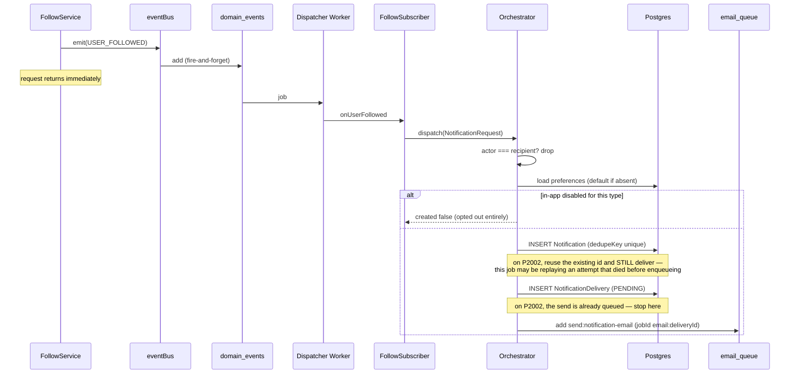
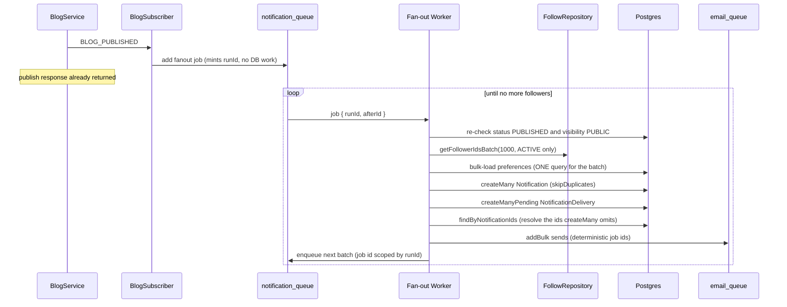
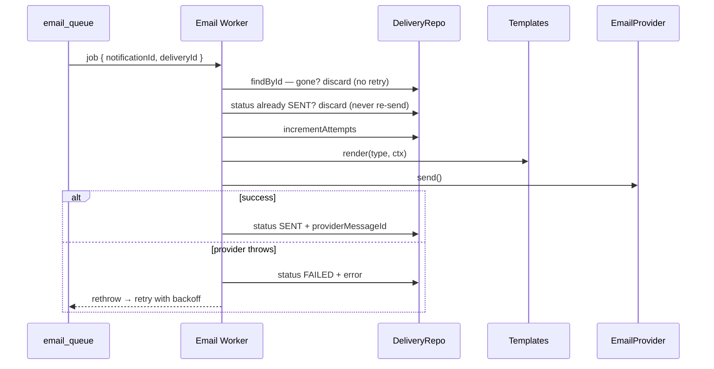

# Notification Module Documentation

The Notification Module is Narrative's central notification infrastructure. It consumes domain events emitted by other modules and delivers notifications through multiple channels, while remaining completely decoupled from business logic.

**No module calls NotificationService.** Every notification originates from a domain event. The Follow, Blog, and Comment modules have no idea notifications exist — they emit facts, and this module decides what that means.

## Responsibilities

The module owns:

- Notification persistence and read management
- Notification orchestration and channel selection
- In-app notifications
- Email notifications (asynchronous, via BullMQ)
- Notification preferences
- Event subscribers
- Delivery tracking

It deliberately knows **nothing** about authentication, users, blogs, comments, bookmarks, follows, search, or analytics beyond the read-only lookups needed to address a recipient.

## Module Boundaries

| Direction | Module | Nature |
|---|---|---|
| inbound | Follow / Blog / Comment | **Events only.** They emit; this module subscribes. No import in that direction exists. |
| outbound (read) | User | Recipient email/name/status, and preferences from `UserSettings`. |
| outbound (read) | Blog | Fan-out re-checks the blog is still published **and still publicly visible**. |
| outbound (read) | Follow | Batched follower ids for fan-out. |
| inbound | Authentication | `requireAuth` on every route; the recipient is always the token's user. |

The only upstream changes made were **additive**: `COMMENT_CREATED` and `COMMENT_REPLIED` each gained a `blogAuthorId` field ([comment.service.ts](../backend/src/modules/comment/comment.service.ts)). The blog was already loaded there, so surfacing its author costs nothing — without it every subscriber would re-fetch the blog just to learn who to notify.

## Architecture

```text
Domain Event  ──emit──►  domain_events queue  ──►  Domain Events Worker
                                                          │
                                                          ▼
                                                    Subscribers
                                          (follow / blog / comment)
                                                          │
                                                          ▼
                                             Notification Orchestrator
                                        (self-check → preferences → dispatch)
                                                          │
                                        ┌─────────────────┴─────────────────┐
                                        ▼                                   ▼
                              InAppNotificationChannel          EmailNotificationChannel
                                        │                                   │
                                        ▼                                   ▼
                                 Notification (DB)                    email_queue
                                                                            │
                                                                            ▼
                                                                     Email Worker
                                                                            │
                                                             Template Renderer → EmailProvider
                                                                            │
                                                                            ▼
                                                                 NotificationDelivery
```

Layers, each a class exported as a singleton:

- **Repositories** — [notification.repository.ts](../backend/src/modules/notification/notification.repository.ts), [notificationDelivery.repository.ts](../backend/src/modules/notification/notificationDelivery.repository.ts)
- **Orchestrator** — [notification.orchestrator.ts](../backend/src/modules/notification/notification.orchestrator.ts) — the only writer
- **Channels** — [channels/](../backend/src/modules/notification/channels/) — strategy pattern
- **Subscribers** — [subscribers/](../backend/src/modules/notification/subscribers/) — event → request translation
- **Workers** — [notification.worker.ts](../backend/src/modules/notification/notification.worker.ts) (fan-out), [email.worker.ts](../backend/src/modules/notification/email.worker.ts) (send)
- **Templates** — [templates/](../backend/src/modules/notification/templates/) — pure DTO → `{subject, html, text}`
- **Service / Controller / Routes / Validator** — the read-side API

### The durable event bus

`eventBus` was an in-process `EventEmitter`. It is now backed by a BullMQ `domain_events` queue ([eventBus.ts](../backend/src/core/events/eventBus.ts)), which buys:

- **durability** — a job survives a crash and retries with backoff
- **isolation** — a failing subscriber cannot break the HTTP request that emitted
- **scale** — dispatch capacity independent of the web process

`emit(event, payload)` kept its original fire-and-forget signature, so all 30 existing call sites were unchanged. Under `NODE_ENV=test` it dispatches inline so suites stay synchronous.

**Residual gap:** a crash between the database commit and the enqueue completing loses that event. Closing it fully needs a transactional outbox — writing the event in the same transaction as the business change.

### Strategy pattern

```ts
interface INotificationChannel {
  readonly name: ChannelName;
  supports(request: NotificationRequest, prefs: ResolvedPreferences): boolean;
  deliver(request: NotificationRequest, notificationId: string): Promise<void>;
}
```

The orchestrator holds `INotificationChannel[]` and iterates. Adding Push, SMS, or WebSocket means writing one class and adding one array entry — the orchestrator never changes.

In-app is a pseudo-channel: the `Notification` row **is** the delivery, so `deliver()` is a no-op and no `NotificationDelivery` row is written. That is also the natural seam for real-time WebSocket push later.

## Event Subscriptions

| Event | Recipient | Notes |
|---|---|---|
| `USER_FOLLOWED` | `followingId` | Upstream is already guarded by `if (created)`, so a re-follow emits nothing. |
| `COMMENT_CREATED` | `blogAuthorId` | **Skipped when `parentId` is set** — see below. |
| `COMMENT_REPLIED` | `parentAuthorId` **and** `blogAuthorId` | Two dispatches, two different people: a `REPLY` for the comment's author and a `COMMENT` for the blog owner. |
| `BLOG_PUBLISHED` | all followers of `authorId` | Enqueues a fan-out job; never fans out inline. |

**`BLOG_UPDATED` is deliberately NOT subscribed to.** It fires on every draft edit, for a blog followers cannot see yet — subscribing would spam them on every save.

**Reply de-duplication.** A reply emits *both* `COMMENT_CREATED` and `COMMENT_REPLIED`. Handling both would notify the same person twice for one action, so the comment subscriber returns early from `COMMENT_CREATED` when `parentId` is set; `COMMENT_REPLIED` is the more specific event and owns that case.

Because `COMMENT_CREATED` bails on *every* reply, `onCommentReplied` is the only path that can reach the blog owner, so it dispatches twice. `shouldNotifyBlogOwner` decides whether the second one fires: the three roles (replier, parent author, blog owner) can overlap in any combination, and the owner is skipped when they wrote the reply or are already receiving the `REPLY`. See [B7](#b7--a-reply-on-a-third-partys-comment-never-reached-the-blog-owner).

## Notification Lifecycle

1. A business module emits a domain event (it knows nothing beyond this).
2. The event is published to `domain_events` and survives a restart.
3. The dispatcher worker runs every registered handler, each isolated.
4. The subscriber translates the event into a `NotificationRequest` with a `dedupeKey`.
5. The orchestrator:
   - drops it if actor === recipient (**no self-notification**),
   - resolves preferences (defaulting when absent),
   - returns early if in-app is disabled for that type,
   - persists the `Notification`,
   - dispatches enabled external channels — **including when the row was deduped**, because the job may be a replay of one that died before enqueueing (see [B1](#b1--a-crash-mid-dispatch-lost-the-email-permanently)).
6. The email channel writes a `PENDING` delivery and enqueues a send.
7. The email worker renders, sends, and records `SENT`/`FAILED`.

## Database Design

```prisma
model Notification {
  id          String  @id @default(cuid())
  recipientId String
  actorId     String?          // null for SYSTEM; SetNull on actor delete
  type        NotificationType
  entityType  String?          // 'BLOG' | 'COMMENT' | 'USER'
  entityId    String?
  metadata    Json?            // render inputs, NOT rendered text
  isRead      Boolean   @default(false)
  readAt      DateTime?
  dedupeKey   String    @unique
  createdAt   DateTime  @default(now())

  @@index([recipientId, createdAt])
  @@index([recipientId, isRead, createdAt])
  @@index([entityType, entityId])
}
```

Design notes:

- **`metadata`, not rendered text.** Persisting a finished string freezes it: a renamed user leaves stale copy behind, and `UserSettings.language` could never be honoured. Copy is rendered at read/send time.
- **`actorId` is `SetNull`, not `Cascade`** — a deleted actor must not erase the recipient's history.
- **`dedupeKey` is the idempotency backbone.** It makes a retried fan-out batch or a replayed event a no-op via `createMany(skipDuplicates)`.
- **Partial index** for the unread count lives in [prisma/sql/notification_unread_idx.sql](../backend/prisma/sql/notification_unread_idx.sql), applied by `npm run db:indexes` — Prisma cannot express a `WHERE` clause on an index.

`NotificationDelivery` tracks **external channels only** (`EMAIL`, with `PUSH`/`SMS` reserved). Its `@@unique([notificationId, channel])` is one of the four layers described under [Idempotency layers](#idempotency-layers) below.

## Queue Architecture

| Queue | Purpose |
|---|---|
| `domain_events` | Every published domain event; consumed by the dispatcher. |
| `notification_queue` | Blog-publish fan-out jobs (batched, chained). |
| `email_queue` | Individual notification email sends. |

`createQueue` previously passed only a connection, so the retry policy `ARCHITECTURE.md` promised was never configured. It now applies `DEFAULT_JOB_OPTIONS`: 5 attempts, exponential backoff from 2s, completed jobs reaped after an hour, **failed jobs retained 24h** — a failed job is the only record that something went wrong.

Workers are registered in a module-level array so `closeWorkers()` can drain them on shutdown; `server.ts` closes workers → Prisma → Redis, in that order.

## Email Architecture

```text
IEmailProvider
├── LogEmailProvider   (default — renders and logs, no account needed)
└── ResendProvider     (active when EMAIL_PROVIDER=resend)
```

Config: `EMAIL_PROVIDER` (`log` | `resend`, default `log`), `EMAIL_FROM`, `RESEND_API_KEY` (required only for `resend`), `APP_URL`. Env validation **rejects `log` in production** — logging emails there would be a failure that looks like success.

Templates are pure functions returning `{ subject, html, text }`, structured for a later React Email swap. Every template carries a preferences link, since non-transactional mail legally requires an opt-out path.

**Not gated on email verification:** there is no `emailVerified` field. `User.isVerified` is a *public profile badge* used in follower lists, not an email-confirmation flag. Flagged as a deliverability concern.

## API Documentation

Base path `/api/v1/notifications`. Every route requires auth and is scoped to the token's user — notifications are private, so no route accepts a user id.

| Method | Path | Description |
|---|---|---|
| `GET` | `/notifications` | Paginated list. |
| `GET` | `/notifications/unread-count` | Badge count. |
| `PATCH` | `/notifications/:id/read` | Mark one read. |
| `PATCH` | `/notifications/read-all` | Mark all read. |
| `GET` | `/notifications/preferences` | Resolved preference matrix. |
| `PATCH` | `/notifications/preferences` | Partial patch. |

Literal routes are declared before `/:id/...` so `/read-all` and `/unread-count` are not captured as an id.

Query: `cursor`, `limit` (1–100), `sort` (`recent`|`oldest`), `type`, `isRead`.

```jsonc
{
  "success": true,
  "data": { "items": [{
    "id": "clx...", "type": "FOLLOW",
    "actor": { "id": "clx...", "username": "grace", "name": "Grace", "avatar": null, "isVerified": true },
    "entityType": "USER", "entityId": "clx...",
    "metadata": null, "isRead": false, "readAt": null,
    "createdAt": "2026-07-01T00:00:00.000Z"
  }] },
  "meta": { "nextCursor": null, "hasNextPage": false, "totalCount": 1, "unreadCount": 1 }
}
```

**Authorization:** `markRead` scopes its `UPDATE` by `recipientId` — that scoping *is* the check, so another user's notification simply matches nothing and returns **404, never 403**, so ids cannot be probed.

Preferences are a partial patch on both axes; sending `{ "FOLLOW": { "email": false } }` leaves every other type untouched.

## Sequence Diagrams

### Follow notification



### Blog-publish fan-out



### Email delivery with retry



## Performance Considerations

- **Fan-out never touches the request path.** The subscriber only enqueues; a 100k-follower author costs the publish request nothing.
- **Batched and chained.** Each job handles 1000 followers and enqueues the next position, so no job runs unboundedly, progress survives a crash, and a retry replays only the failed batch.
- **Bulk everything in fan-out** — one `createMany` for the notifications, one bulk preference query, one `createManyPending` for the deliveries, one `findMany` to resolve their ids, and one `addBulk` to queue the sends. A batch of 1000 recipients costs a handful of round trips, not 2000.
- **Unread count** is served by a partial index that stores only unread rows, so an account with 100k read notifications does not pay for them.
- **Cursor pagination** throughout (`take: limit + 1`, `(createdAt, id)` tiebreaker).
- **Keyset fan-out** ordered by `id`, so paging is stable even while new follows arrive mid-fan-out.
- **Email is fully asynchronous** — a slow provider costs a retry, never a request.
- **Exactly-once email** via four independent guards — see [Idempotency layers](#idempotency-layers).

### Known trade-offs

- **No digest/aggregation.** 50 comments produce 50 notifications, not "50 people commented". `ARCHITECTURE.md` describes the module as aggregating; that is a future extension.
- **No retention policy.** Designed for millions of rows, but nothing purges old ones yet.
- **`totalCount` is a full `COUNT(*)` on every list request**, and unlike the unread count it has no partial index behind it. Cursor pagination does not need a total; it is served because the response envelope exposes one.
- **`PENDING` deliveries are never swept.** `findStuckPending` exists and answers "are we dropping mail?", but nothing calls it on a schedule yet.
- **Preferences are not re-checked at send time.** A user who disables email between enqueue and send still receives that one message.
- **Intermediate retries are recorded as `FAILED`.** The email worker writes `FAILED` on every attempt, so a row still being retried is indistinguishable from one that gave up. `failedAt` means "last attempt failed", not "abandoned".

## Bugs Found and Fixed

A review of the module after the initial build turned up seven defects. Six could silently lose a notification or leak a private post; one was a gap in who gets notified. All are fixed. This section records what was wrong and, more usefully, *why each fix takes the shape it does* — several of the original bugs came from a guard duplicating another layer's job and losing work in the process.

| # | Severity | Defect | Consequence | Fix |
|---|---|---|---|---|
| B1 | 🔴 | Orchestrator returned early when the notification deduped | A worker killed between INSERT and enqueue lost the email **permanently** — every replay took the same early exit | Deliver on the dedupe path too |
| B2 | 🔴 | A failed `emailQueue.add` left an orphaned `PENDING` row | One Redis blip lost the email forever; the orphan row blocked every future retry | Roll the row back on enqueue failure |
| B3 | 🔴 | Fan-out checked `status` but never `visibility` | Publishing a `PRIVATE` post fanned out to every follower, emails included | Fan out only when `visibility === 'PUBLIC'` |
| B4 | 🟠 | Fan-out issued ~2000 concurrent queries per batch | A single batch monopolised the pg pool shared with Express, stalling all HTTP traffic | Bulk insert + `addBulk`, ~5 round trips |
| B5 | 🟠 | `PATCH /preferences` persisted the raw request body | Arbitrary client-supplied keys written into the JSON column, unbounded | Re-parse and copy named toggles only |
| B6 | 🟡 | Continuation job ids keyed on `(blogId, position)` | Re-publishing within an hour silently truncated the fan-out after batch 1 | Scope job ids by a per-run `runId` |
| B7 | 🟡 | `COMMENT_CREATED` skips every reply | Replies on a third party's comment never reached the blog owner | Second dispatch in `onCommentReplied` |

### Idempotency layers

B1, B2 and B4 all trace back to the same confusion, so it is worth stating the invariant plainly. Domain-event and fan-out jobs are **at-least-once**: every handler must be safe to replay. Replay-safety means *converging on the same end state*, not *doing nothing the second time* — that distinction is exactly what B1 got wrong.

Send-once is guaranteed by four independent guards, each owning one layer:

1. **`Notification.dedupeKey`** (unique) — one notification row per event occurrence. Makes `createMany(skipDuplicates)` and the P2002 path no-ops.
2. **`NotificationDelivery @@unique([notificationId, channel])`** — one delivery row per channel. In the single-dispatch path, the caller that creates the row is the only one that enqueues.
3. **BullMQ job id `email:<deliveryId>`** — a duplicate `add` collapses into one job. This is what lets the bulk fan-out path work at all: `createMany` returns only a count, so "did I create this row?" is unavailable there and the job id has to carry the property instead. Safe forever, since delivery ids are never recycled.
4. **`status === 'SENT'` check in the email worker** — a retry after a successful send, a stalled job whose lock expired, or a provider that timed out on a message it accepted.

Because all four hold, an extra dispatch is *cheap and safe*, while a skipped one is *unrecoverable*. Every fix below leans in that direction.

Note the contrast between layer 3 and B6: a deterministic job id is the guard in one place and the bug in the other. Here a duplicate add is exactly what should be dropped; there a legitimate second run collided with a stale completed job. Same mechanism, opposite correctness — which is why "use a deterministic job id" is not a rule that can be applied blindly.

### B1 — a crash mid-dispatch lost the email permanently

`NotificationOrchestrator.dispatch` returned `{ created: false }` as soon as the notification row already existed, before dispatching any external channel:

```ts
if (!created || !id) return { created: false };   // ← never reached deliverExternal
```

The comment justifying it claimed re-dispatching would double-send. It would not: layers 2–4 above already prevent that. So the guard was redundant, and it was lossy — a worker killed between the INSERT and the enqueue stranded the notification with no email, and every subsequent replay took the same early exit.

**Fix.** Deliver even when the row already existed; return early only when there is genuinely no row to attach to (`!id`, meaning the recipient was deleted mid-flight). The return value still reports whether *this* call created the notification, so callers and their tests keep an accurate answer.

### B2 — a queue outage lost the email, with no way back

`EmailNotificationChannel.deliver` swallowed an `emailQueue.add` failure and left the `PENDING` row in place, with a comment claiming it was "visible to a retry sweep". No retry sweep existed. `findFailed` was dead code and queried only `FAILED`, never `PENDING`.

The row's existence is precisely what makes the next `create` return `created: false`, so an orphaned `PENDING` row **blocked every future retry from ever re-queueing that email**. A single transient Redis error lost it silently and permanently.

**Fix.** Delete the delivery row when the enqueue fails, restoring the invariant *a delivery row exists ⟺ a job was enqueued*. B1's replay path can then recreate and re-queue it. If even the rollback fails, that is logged loudly and surfaced by the new `findStuckPending`.

### B3 — fan-out ignored blog visibility

The fan-out worker re-checked `blog.status !== 'PUBLISHED'` each batch but never looked at `blog.visibility` — even though `blogVisibilitySelect` already returns it and `blogService.canView` rejects `PRIVATE`/`MEMBERS_ONLY` for an ordinary reader.

Publishing a `PRIVATE` post therefore pushed a notification row **and an email carrying the post's title** to every follower, linking somewhere they would be refused.

**Fix.** Stop the fan-out unless `visibility === 'PUBLIC'`. `UNLISTED` is excluded deliberately: it means "reachable by link, absent from discovery", and a notification to every follower is a discovery surface.

### B4 — one fan-out batch could stall the whole web tier

The batch's email step ran `Promise.all` over up to 1000 `deliverExternal` calls, each doing one INSERT and one Redis add. The pg pool (`@prisma/adapter-pg`, default `max: 10`) is **shared with Express**, so a single batch parked roughly 2000 queued operations in front of every concurrent HTTP request — the same N+1 the bulk preference load directly above it exists to avoid.

**Fix.** A new `enqueueEmailsBulk` collapses the step into three round trips: `createManyPending`, one `findByNotificationIds` to resolve the ids `createMany` does not return, and one `addBulk`. Rows already `SENT` are filtered client-side. Send-once survives the rewrite via layer 3 above.

Folded in: the preference lookups in that function used `p[request.type].inApp` with no optional chaining, so a `NotificationType` added to Prisma but not to `DEFAULT_PREFERENCES` would throw and take down the entire batch. Both reads now use `?.`.

### B5 — preference updates persisted unvalidated JSON

`validateRequest` parses `req.body` and **discards the result**, leaving `req.body` raw. The controller passed that raw object to the service, which spread it straight into the stored JSON.

Zod objects *strip* unknown keys from their output rather than rejecting them, so this validated cleanly and persisted the junk:

```json
PATCH /preferences   {"FOLLOW": {"inApp": false, "junk": "<1MB of anything>"}}
```

Reads stayed safe — `resolvePreferences` re-parses — but the column grew unboundedly with attacker-controlled content.

**Fix.** `updatePreferences` re-parses the input and copies `inApp`/`email` by name rather than spreading, so only keys this module defines can reach the column.

The shared `validateRequest` middleware was **deliberately left alone**. Making it assign the parsed result back to `req.body` is probably correct, but it changes behaviour for every module in the codebase and deserves its own review rather than riding along with a notification fix.

### B6 — re-publishing a blog silently truncated the fan-out

Continuation jobs used `jobId: fanout:${blogId}:${nextAfterId}`. Completed jobs linger for an hour (`removeOnComplete`), `TRANSITIONS` allows `ARCHIVED → PUBLISHED`, and `queue.add` on an existing job id is a **silent no-op**. An archive→publish cycle inside that hour therefore reused the previous run's ids and the chain simply stopped after batch one, with nothing logged.

**Fix.** `onBlogPublished` mints a `runId` once and carries it in the job payload; continuation ids are `fanout:${blogId}:${runId}:${nextAfterId}`. Retries *within* a run stay idempotent, while separate runs no longer collide. A retried domain-event job mints a fresh `runId` and re-walks the followers — redundant work, but never a duplicate notification, because layer 1 covers it.

### B7 — a reply on a third party's comment never reached the blog owner

`onCommentCreated` returns early for **any** `parentId`, which made `onCommentReplied` the only path to the blog owner — and it only ever notified the parent comment's author. If someone replied to another reader's comment on your post, you were told nothing at all.

This was documented as an intentional V1 limitation to "avoid doubling reply volume", but there was no doubling: the two notifications go to two different people.

**Fix.** `COMMENT_REPLIED` now carries `blogAuthorId` (already in scope at the emit site), and `onCommentReplied` dispatches a second `COMMENT` notification to the owner. `shouldNotifyBlogOwner` suppresses it when the owner wrote the reply, or when the owner is the parent author and is already receiving the `REPLY`. The two dispatches use distinct dedupeKeys (`REPLY:<id>` and `COMMENT:<id>`) — sharing one would let whichever ran second silently no-op.

## Testing

Notification coverage spans four suites:

- **Unit** — preference resolution (including malformed stored data), validators, all templates, `LogEmailProvider`.
- **Real database** (`notification.db.test.ts`) — orchestrator behaviour, preference honouring, subscriber translation, read state, cursor pagination, cross-user authorization, cascade semantics, and **genuine concurrency** (three simultaneous dispatches → one row, one email).
- **Integration** — the six endpoints, auth on each, route ordering, validation.
- **Worker** — send success, retry on provider failure, delivery status transitions, non-retryable discards.

The bug fixes above added three `notification.db.test.ts` cases covering the reply/blog-owner matrix from [B7](#b7--a-reply-on-a-third-partys-comment-never-reached-the-blog-owner): all three roles distinct (two notifications), owner is the parent author (one), owner wrote the reply (one).

Integration tests run against a **local Postgres**, not mocks. `TEST_DATABASE_URL` is enforced by guards in `jest.setup.js` and `jest.globalSetup.js` that refuse to run against a hosted database, since the suite truncates tables.

`jest.globalSetup.js` runs `prisma db push --force-reset` before **any** suite, so the whole run — including the pure-unit suites, which need no database — fails outright when local Postgres is not up. Worth decoupling so unit tests can run standalone.

## Future Extension Points

- **Push / SMS / WebSocket** — implement `INotificationChannel`, register it in the orchestrator array. Both enum values already exist.
- **New notification types** — add to `NotificationType`, register a template, add a default preference row. The orchestrator is untouched.
- **Digest / aggregation** — group by `(recipientId, type, entityId)` in a scheduled job.
- **Transactional outbox** — closes the residual event-loss window.
- **One-click unsubscribe tokens** — some providers now require this for bulk senders.
- **Retention** — a scheduled purge of read notifications older than N months.
- **Correlation ids** — thread a request id through event payloads into job data so a notification traces back to the HTTP request that caused it.
