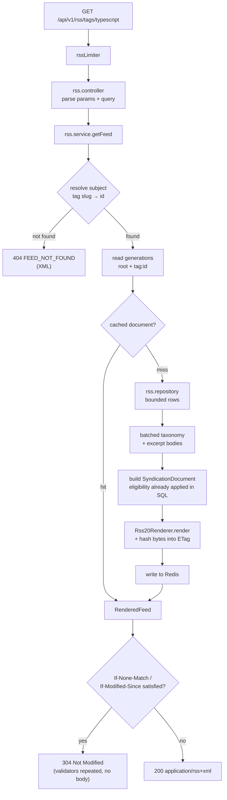
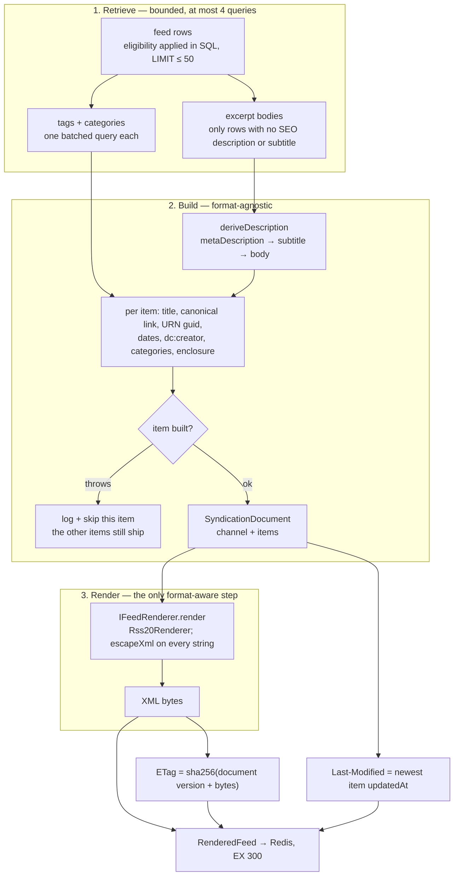
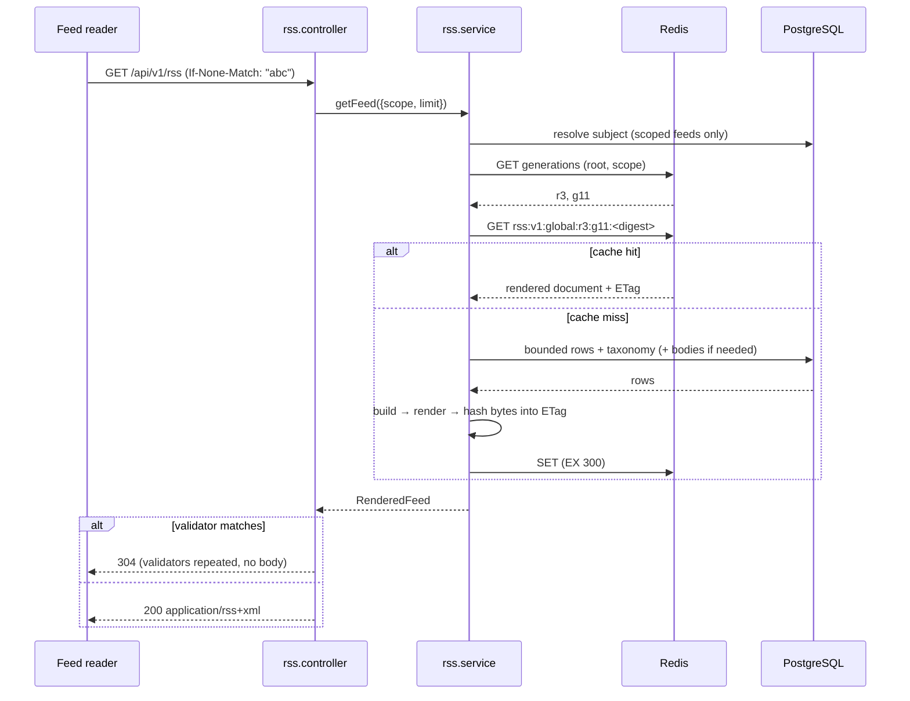
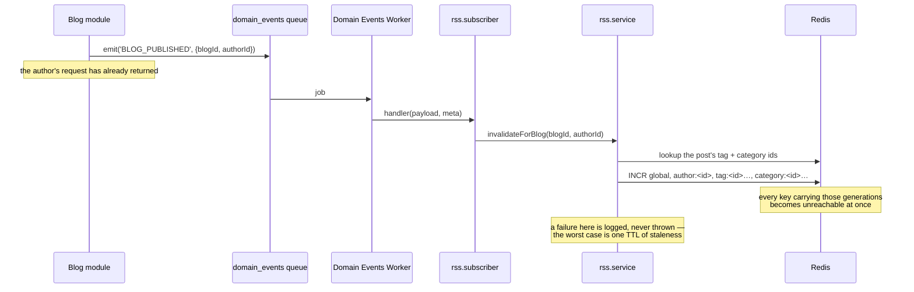

# RSS & Distribution Module

Narrative's syndication surface: bounded, cacheable RSS 2.0 documents for the
platform's public writing.

The module is a **pure composition module**, in the same sense the Feed and
Dashboard modules are. It owns no table, no migration and no column. Posts and
their lifecycle belong to Blog, accounts to User, the tag and category
vocabularies to Blog, images to Media, canonical metadata to the `BlogSEO` row
Blog maintains, and *what may be discovered* to the platform's single eligibility
predicate. What RSS owns is the act of turning those into a document a feed
reader can subscribe to, and knowing when that document has stopped being true.

---

## 1. Responsibilities

**Owns**

- RSS feed generation and the RSS 2.0 serialization
- Feed-specific querying and orchestration
- Feed caching (Redis) and its invalidation
- HTTP cache semantics for feed responses (ETag, `Last-Modified`, 304)
- Distribution-specific identity: GUIDs, channel identifiers, self URLs

**Does not own**

Blog lifecycle · user profiles · blog content · tags and categories · search ·
feed ranking or recommendation · analytics · notifications · media storage.

Each of those is consumed through the module that owns it, and nothing in this
module writes to any table.

**Consumes**

| From | What | How |
|---|---|---|
| Feed | `FEED_ELIGIBILITY` — the discovery predicate | imported by `rss.eligibility.ts` |
| Blog | posts, `BlogSEO`, the tag/category joins | the module's own bounded SQL |
| User | author identity and `status` | joined in that SQL |
| Media | cover `secureUrl`, MIME type, byte size | joined in that SQL |
| core/providers/editor | plain text from a Tiptap document | `editorParser.extractMetadata` |
| core/utils | `sanitizePlainText` | on every description source |
| core/providers/redis | the feed cache | `rss.cache.ts` |
| core/events | invalidation triggers | `subscribers/rss.subscriber.ts` |
| core/middlewares | `rssLimiter` | `rss.routes.ts` |

RSS is a **leaf**: nothing imports it, and it emits no events. It is an event
*consumer* only.

---

## 2. Architecture

### File layout

```text
src/modules/rss/
├── rss.config.ts        every tunable number and every piece of fixed copy
├── rss.types.ts         format-agnostic document types + internal row shapes
├── rss.eligibility.ts   delegation to the platform's discovery predicate
├── rss.urls.ts          public URLs, self URLs, GUIDs, untrusted-URL handling
├── rss.repository.ts    the only SQL: bounded retrieval + batched taxonomy
├── rss.content.ts       description derivation through the editor abstraction
├── rss.renderer.ts      IFeedRenderer + Rss20Renderer + XML escaping
├── rss.cache.ts         Redis: generation counters + rendered-document storage
├── rss.http.ts          conditional-request rules (RFC 9110 §13)
├── rss.service.ts       orchestration: resolve → cache → build → render
├── rss.controller.ts    HTTP only: parse, call, 200 or 304
├── rss.errors.ts        the router's own XML error handler
├── rss.routes.ts        route wiring
├── rss.validator.ts     Zod schemas for params and query
└── subscribers/
    └── rss.subscriber.ts  event-driven invalidation
```

### Request flow



### Generation pipeline

What happens on a miss, as a transformation rather than as a call sequence. Each
stage narrows what the next one is allowed to know: retrieval is the only stage
that touches a table, building is format-agnostic, and only the renderer has ever
heard of RSS 2.0.



Both best-effort stages degrade rather than fail: a taxonomy read that throws
produces items with no `<category>` elements, and a body read that throws
produces items with no description. Neither produces a 500, because a subscriber
polling at that moment would receive one in place of a feed they already had.

### Layer rules

- **Controller** — no SQL, no eligibility, no XML. Parses, calls, chooses
  200 or 304.
- **Service** — no SQL, no HTTP, no XML syntax. Resolves, caches, composes.
- **Repository** — the only file in the module that names a table.
- **Renderer** — the only file that knows RSS 2.0 exists.
- **Cache** — the only file that speaks to Redis.
- **Subscriber** — a mapping from domain events to invalidation intentions; the
  invalidation itself lives on the service.

There are no circular dependencies: RSS → Feed (one constant), RSS → core. Feed
does not import RSS, and nothing else does either.

---

## 3. Supported feed types

| Feed | Route | Subject | Cache scope |
|---|---|---|---|
| Global | `GET /api/v1/rss` | — | `global` |
| Author | `GET /api/v1/rss/authors/:username` | `User.id` | `author:<id>` |
| Category | `GET /api/v1/rss/categories/:slug` | `Category.id` | `category:<id>` |
| Tag | `GET /api/v1/rss/tags/:slug` | `Tag.id` | `tag:<id>` |

These are the four groupings the Narrative domain actually has. No relationship
was introduced to support any of them — author, tag and category feeds all reuse
associations the Blog module already maintains.

### Why this route shape

The module owns its own mount and shares no prefix with another router, so — like
`/search`, `/feed` and `/dashboard` — no registration-ordering constraint applies
to it in `app.ts`.

The obvious alternative was to hang each feed off the resource it describes
(`/users/:username/rss`). It was not taken because `/api/v1/users` already
carries **three** stacked routers whose registration order is load-bearing (see
the comments in `app.ts`), and adding a fourth path into that arrangement to
serve a document nobody browses to would trade real fragility for tidiness. A
feed URL is subscribed to once and then polled by a machine forever; what it
needs to be is stable, not decorative.

---

## 4. Content eligibility

**This is the module's most security-relevant decision, and it is a delegation.**

`rss.eligibility.ts` re-exports `FEED_ELIGIBILITY` from the Feed module — the
platform's single definition of what may be shown to someone who did not ask for
a specific post. It does not restate it. A private copy of the same predicates
is the single most dangerous thing this module could contain: two definitions of
"public" drift, and the one that drifts is discovered by a reader finding a
withdrawn post in their feed reader.

The inherited rules, and the class each excludes:

| Rule | Excludes |
|---|---|
| `status = 'PUBLISHED'` | drafts, archived posts, soft-deleted posts |
| `visibility = 'PUBLIC'` | private, **unlisted** and **members-only** posts |
| `isHidden = false` | posts a moderator has withheld |
| `publishedAt IS NOT NULL` | published rows with no publication instant |
| author `status = 'ACTIVE'` | posts by suspended, deactivated or deleted accounts |

### Why syndication cannot be one rule looser

`blogService.canView` **allows** an UNLISTED post — that is exactly what unlisted
means, reachable by anyone holding the link. RSS must still refuse it. A feed
document is copied by every reader that subscribes, indexed by aggregators, and
re-published by services the platform has no relationship with; putting an
unlisted post in one converts *"reachable by link"* into *"broadcast"*, which is
the precise distinction the visibility exists to draw. MEMBERS_ONLY is worse
still: its V1 check is a documented placeholder (any authenticated viewer), and
RSS has no viewer at all.

An import-time assertion in `rss.eligibility.ts` throws if anything but `PUBLIC`
ever enters the set. That assertion is **not** redundant with the identical one
in `feed.eligibility.ts`: that one protects the Feed module's invariant, this one
protects syndication's, so a future change that deliberately widened discovery
for feeds cannot silently widen broadcast along with it.

### Author privacy

`UserSettings.isPrivate` is deliberately not consulted. It hides a user from the
**people directory** (Search's user results), not their published public posts —
which continue to appear in Latest, in Explore and in blog search. RSS follows
blog search, so the platform's discovery surfaces cannot disagree about whether
an author's public writing exists. (See FEED_MODULE.md § Author privacy.)

### Inactive authors are 404, never 403

A suspended, deactivated or deleted account is indistinguishable from one that
never existed. Any other status code would turn this public endpoint into an
oracle: a script could walk a username list and learn exactly who had been
suspended. `rss.db.test.ts` asserts that the status code, error code and message
are byte-identical for the two cases.

---

## 5. RSS schema

`Content-Type: application/rss+xml; charset=utf-8`. Never JSON — including for
errors, which the module's own handler renders as XML.

### Channel

```xml
<?xml version="1.0" encoding="UTF-8"?>
<rss version="2.0" xmlns:atom="http://www.w3.org/2005/Atom"
                   xmlns:dc="http://purl.org/dc/elements/1.1/">
  <channel>
    <title>#typescript — Narrative</title>
    <link>https://narrative.example/tags/typescript</link>
    <description>Public posts tagged typescript on Narrative.</description>
    <atom:link href="https://narrative.example/api/v1/rss/tags/typescript"
               rel="self" type="application/rss+xml" />
    <atom:id>urn:narrative:feed:tag:clx0tag1</atom:id>
    <generator>Narrative RSS</generator>
    <docs>https://www.rssboard.org/rss-specification</docs>
    <ttl>5</ttl>
    <language>en</language>
    <lastBuildDate>Mon, 02 Mar 2026 08:00:00 GMT</lastBuildDate>
    ...
```

| Element | Source | Notes |
|---|---|---|
| `title` / `description` | `rss.config` copy + the subject's name | |
| `link` | the subject's page on `APP_URL` | where a human reads the feed |
| `atom:link rel="self"` | `RSS_SELF_BASE_URL` (or `APP_URL` + the mount) | the feed's own address |
| `atom:id` | `urn:narrative:feed:<scope>[:<id>]` | identity independent of URL |
| `generator` | `Narrative RSS` | names the producer, discloses no version |
| `ttl` | derived from `HTTP_MAX_AGE_SECONDS` | a polling hint, in minutes |
| `language` | author feeds: `UserSettings.language`; otherwise `en` | see below |
| `lastBuildDate` | **max `updatedAt` across items** | never the clock — see §8 |

`language` is stated per author because an author feed has exactly one writer and
their setting is a truthful answer. Mixed-author feeds fall back to the platform
default: no single language claim would be true of them. The stored value is
validated against a BCP-47-ish shape before publication, because
`user.validator.ts` bounds it to *any* two characters.

An empty feed omits `lastBuildDate` entirely rather than inventing one, and is
still a complete, valid document.

### Item

```xml
    <item>
      <title>Structural Typing</title>
      <link>https://narrative.example/blog/structural-typing</link>
      <guid isPermaLink="false">urn:narrative:blog:clx0blog1</guid>
      <description>What it buys and what it costs.</description>
      <dc:creator>Grace Hopper</dc:creator>
      <pubDate>Sun, 01 Mar 2026 10:30:00 GMT</pubDate>
      <atom:updated>2026-03-02T08:00:00.000Z</atom:updated>
      <category>Engineering</category>
      <category>typescript</category>
      <enclosure url="https://cdn.example/cover.jpg" type="image/jpeg" length="12345" />
    </item>
```

| Element | Source | Present when |
|---|---|---|
| `title` | `Blog.title` | always |
| `link` | `BlogSEO.canonicalUrl` if set and `http(s)`, else `APP_URL/blog/<slug>` | always |
| `guid` | `urn:narrative:blog:<Blog.id>` | always |
| `description` | `BlogSEO.metaDescription` → `subtitle` → body excerpt | when any source has text |
| `dc:creator` | `User.name` | always |
| `pubDate` | `Blog.publishedAt` | always in practice (eligibility requires it) |
| `atom:updated` | `Blog.updatedAt` | always |
| `category` | categories first, then tags, each by `addedAt` | per term |
| `enclosure` | the linked `Media` row's `secureUrl` / `mimeType` / `fileSize` | when a non-deleted cover exists |

**`dc:creator`, never RSS 2.0's `<author>`.** That element is *defined* by the
specification as an email address, and publishing addresses into the least
controlled surface the platform has would undo `UserSettings.hideEmail` for
everyone at once. Dublin Core's `creator` is the standard way to name a person
without one, and is what WordPress and most producers emit.

`atom:updated` carries the last-modification instant because RSS 2.0 has no
element for it. Atom's is the spelling a reader looking for "has this changed
since I stored it" already understands.

---

## 6. GUID strategy

```text
urn:narrative:blog:<Blog.id>          isPermaLink="false"
urn:narrative:feed:<scope>[:<id>]     the channel's atom:id
```

A feed reader uses the GUID to decide whether an item is one it has already
shown, which makes this a product decision rather than a formatting one:

- **Not the link.** A canonical URL contains the slug, and `blogService`
  re-slugs on a title change. A URL-based GUID would resurface every renamed post
  in every subscriber's unread list, and leave the original behind as a duplicate
  that never goes away.
- **Not a content hash.** A corrected typo is not a new article.
- **The row id.** `Blog.id` is a cuid assigned at creation and never written
  again. It survives retitling, re-slugging, unpublishing and republishing,
  archiving and restoration — exactly the set of events after which a reader
  should see the item it already has.

`isPermaLink="false"` is required: RSS 2.0 defaults it to `true`, and some
readers would try to resolve a URN as a URL.

Channel identifiers follow the same rule and are built from the subject's
**database id**, not its slug. A category renamed from `web-dev` to
`web-development` is the same channel; a subscriber should not be asked to
resubscribe. This is also why the cache is keyed on ids (§8).

---

## 7. Content transformation

The stored body is a Tiptap/ProseMirror document. It is **never** exposed.

`rss.content.ts` derives a plain-text description in the same precedence
`blogService.effectiveSeo` uses — `metaDescription` → `subtitle` → body — so what
a feed says about a post and what its Open Graph card says cannot disagree. Every
source, not just the body, passes through `sanitizePlainText` (subtitles and SEO
descriptions are stored raw; `blog.validator.ts` bounds their length and nothing
more), then has its whitespace collapsed, then is truncated at a word boundary to
`MAX_DESCRIPTION_LENGTH`.

Not one line in this module understands the editor schema: the document is handed
to `editorParser`, the platform's single editor abstraction. A second parser here
would be a second thing to keep in step with that schema, and the first place a
node type nobody remembered would leak raw JSON into a public document.

**Why plain text and not HTML.** RSS allows escaped HTML in a description and
richer feeds use it. Narrative has no Tiptap-to-HTML renderer, and writing one
*here* would be exactly the second rich-text system this module must not contain
— and would give the platform two answers to how a post renders, one of which
nobody looks at. The extension point is an HTML serializer on `IEditorParser`,
used by both the web client and this module (§14).

### Body loading is conditional, and that is the point

`content` is **absent from the feed query's projection**. After the rows come
back, the service filters to those with neither an SEO description nor a
subtitle and issues **one** batched query for just those bodies. On a platform
where most authors write one or the other this is a small minority of a page —
and frequently none of it, in which case the query never runs at all. Pulling
twenty rich-text documents to publish twenty two-line summaries would otherwise
dominate the cost of the whole request.

---

## 8. Caching

### What is cached

The **rendered document**, together with its ETag and `Last-Modified` — not the
rows, and not the intermediate `SyndicationDocument`. That is what makes the
common case cheap: an RSS reader polling on a timer sends a conditional request,
and answering it needs the validator and nothing else. With the validator cached,
a 304 costs one Redis read and no rendering at all.



### Cache keys

```text
rss:v1:<scope>:r<rootGen>:g<scopeGen>:<sha256(version, scope, subjectId, limit)>
```

Everything that can change the bytes is in the key: the document version (a
deploy that changes the renderer must not serve documents built by the old one),
the scope, the subject's **database id**, the requested item count, and the two
generations. Global, author, category and tag feeds are therefore cached
independently, and so is each distinct `limit`.

TTL is **300 seconds** (`CACHE_TTL_SECONDS`) on every entry, so the keyspace is
self-reclaiming and cannot become an unbounded store. The TTL is an upper bound
on staleness only in the *absence* of events — see §10.

### Generations, not key deletion

A single publish can affect the global feed, its author's feed, and one feed per
tag and category it carries, each once per requested `limit`. `SCAN`+`DEL` over
that is O(keyspace) on a shared Redis and `KEYS` is worse. Instead the generation
numbers live *in* the key and invalidation is an `INCR`: old keys become
unreachable instantly and are reclaimed by their own TTL, at O(1) per event
however large the cache grows. This is the same design the Search and Feed
modules use.

### Two generations, and the reason for the second

- **Scope generation** — the precise one. Publishing a post bumps exactly the
  feeds that post belongs to and leaves every other author, tag and category
  untouched. Nearly all of the cache's value survives here.
- **Root generation** — the sledgehammer, reserved for events whose blast radius
  genuinely cannot be enumerated cheaply. A suspension removes an entire
  catalogue from discovery at once, and finding every tag and category that
  catalogue touches is an unbounded query on a moderation path that must be
  immediate.

Splitting it this way means the precise mechanism handles the frequent, ordinary
events and the coarse one handles the rare, security-critical ones — rather than
choosing between a cache that is useless and one that leaks.

### Redis is never load-bearing

Every call in `rss.cache.ts` is best-effort. A missing or unreadable generation
reads as `0`, which is a valid generation. A miss, an unreachable Redis, a
corrupt payload and a structurally wrong payload all produce the same outcome —
build it from the database. Redis being down degrades RSS to *uncached*, never to
a 500, and `rss.db.test.ts` asserts a complete feed is served with `get`, `set`
and `pipeline` all rejecting.

### One lookup a warm feed still pays

A scoped feed resolves its subject **before** consulting the cache, so it costs
one indexed lookup per request however warm the cache is. That is a deliberate
trade in favour of keying on the subject's database id: keying on the slug would
remove the lookup but would let a renamed category silently occupy two entries,
the older of which would go on being served under a name that no longer exists.

---

## 9. HTTP caching

```text
Content-Type:  application/rss+xml; charset=utf-8
ETag:          "<32 hex chars>"                     strong
Last-Modified: Mon, 02 Mar 2026 08:00:00 GMT        omitted for an empty feed
Cache-Control: public, max-age=300, stale-while-revalidate=600
```

`public` rather than `private` because the document is identical for every caller
*by construction* — RSS reads no token, never varies on a viewer, and carries only
PUBLIC content — so a CDN or corporate proxy holding one copy for everybody is
correct. That property is asserted in the route tests.

### The ETag is a hash of the rendered bytes

Hashing the output rather than a list of inputs means the validator automatically
accounts for everything that can change the representation — a renderer change,
a config change, a different item order — with no ingredient list to keep in
step. It is only sound because `render` is deterministic, which is stated and
tested in `rss.renderer.ts`.

### `lastBuildDate` comes from the data, never the clock

The channel's build date is the newest item's `updatedAt`. Using `new Date()`
would be the obvious reading of the element's name and would break HTTP caching
completely: every regeneration would produce different bytes, a different ETag,
and a `Last-Modified` marching forward while nothing had changed — so every
reader would download every feed on every poll and the 304 path would never fire.
It is also simply more accurate: RSS defines `lastBuildDate` as when the
channel's *content* last changed.

The consequence is the property `rss.e2e.test.ts` asserts directly: **a cache
eviction does not change the validator.** The document is rebuilt, byte for byte,
and every subscriber still gets a 304.

### Conditional-request rules (RFC 9110 §13)

- `If-None-Match` takes precedence whenever present; `If-Modified-Since` is
  evaluated only in its absence. Every serious feed reader sends both.
- Entity tags compare **weakly**: `W/"abc"` matches `"abc"`. A strict comparison
  would 200 every client behind a proxy that weakened the tag in transit,
  silently turning the caching layer off.
- `*` matches any current representation.
- `If-Modified-Since` comparison truncates to **whole seconds**. HTTP-date has
  one-second resolution while `updatedAt` carries milliseconds; without this, a
  feed modified at `.500` is forever "newer" than the second the client was sent
  and every conditional request 200s. This is the single most common way the
  header is implemented wrongly.
- Anything ambiguous — an unparsable date, a malformed tag, a feed with no
  modification instant — resolves to *modified*. Sending a body that could have
  been a 304 wastes bandwidth; the reverse strands a reader on a stale feed
  forever.
- A 304 repeats `ETag`, `Cache-Control` and `Last-Modified`, and carries no body.

### Caching cannot bypass eligibility

A 304 is only ever produced against a validator minted from a document the
service built under the full eligibility rules. A conditional request cannot
revive a representation containing a withdrawn post: that post's removal bumped a
generation, the rebuilt document has different bytes, and its ETag no longer
matches what the client holds. Revalidation is the mechanism by which removal
*reaches* the client, not a way around it.

---

## 10. Invalidation

RSS subscribes only to events that already existed. It introduces none, and emits
none.



### Three tiers, chosen by blast radius

| Tier | Events | Invalidates |
|---|---|---|
| **Per blog** | `BLOG_PUBLISHED`, `BLOG_UPDATED`, `BLOG_UNPUBLISHED`, `BLOG_ARCHIVED`, `BLOG_RESTORED`, `BLOG_DELETED`, `BLOG_COVER_UPDATED` | `global` + that author + each of the post's tags and categories |
| **Per author** | `USER_PROFILE_UPDATED`, `USER_AVATAR_UPDATED` | `global` + that author |
| **Everything** | `USER_SUSPENDED`, `USER_UNSUSPENDED`, `USER_DEACTIVATED`, `USER_REACTIVATED`, `USER_DELETED`, `CONTENT_MODERATED`/`CONTENT_RESTORED` (BLOG targets) | the root generation |

`BLOG_CREATED` is deliberately **not** subscribed to: a new post is a DRAFT,
which no feed can contain, so invalidating on it would drop cache entries on the
platform's most frequent content write for no possible change in output.
`BLOG_VIEWED`, comment and bookmark events are likewise absent — a feed carries
no engagement counts.

Moderation events are filtered on `targetType === 'BLOG'`; comments are not
syndicated. A blog target still takes the **root** path rather than the per-blog
one even though the blog id is in the payload: a moderator removing content is
the one case where being a term-lookup slow — or getting a stale answer from it —
is not acceptable, and one `INCR` is both faster and unconditionally correct.

### Why eligibility alone is not enough

The predicate lives in the query, so a suspended author or a hidden post leaves
every feed on the next **uncached** read. But a document written a moment earlier
would go on being served — and re-served to conditional requests as a 304 — for
the rest of its TTL. For ordinary staleness that is fine; for content a moderator
just removed it is not. That is the entire reason the root tier exists.

### What is deliberately left to the TTL

A display-name change does not fan out over every tag and category the author has
ever used. Their name is embedded in items sitting in those feeds, and it will be
up to five minutes stale there. That is an acceptable staleness for a syndication
document, unlike a moderation removal; the fan-out would be unbounded and the
benefit cosmetic.

### The subscriber contract

Registered **once** (idempotent; a second call is ignored), registered from
`server.ts` and never from `app.ts`, and defensive on every path: a missing
payload field is logged and ignored, a failed invalidation is swallowed. These
handlers run in the domain-events worker, and a throw would fail the job and have
it retried — for a cache bump whose failure costs at most one TTL.

Idempotence is structural rather than achieved: what invalidates a key is the
generation *changing*, not its value, so a redelivered job simply advances a
counter again. There is nothing to deduplicate, which is why no handler reads
`meta.eventId`.

Notably, a blog event with no `blogId` does **not** escalate to a root bump. An
unknown payload shape is a bug to fix, not a reason to flush the platform's cache
on every delivery.

---

## 11. Security

| Threat | Control |
|---|---|
| Private / unlisted / members-only content leaking | one eligibility predicate, shared with Feed, PUBLIC-only, guarded by an import-time assertion |
| Draft / archived / deleted content leaking | same predicate (`status = 'PUBLISHED'`) |
| Moderated content leaking | same predicate (`isHidden = false`) **plus** a root-generation bump on the moderation event |
| Suspended author's catalogue leaking | same predicate (`u.status = 'ACTIVE'`) plus a root bump |
| XML injection through titles, names, tags, descriptions, URLs | `escapeXml` at the single serialization boundary — all five entities, `&` first |
| A document made unparseable by one post | XML-1.0-illegal control characters and lone surrogates are stripped before escaping |
| One malformed post breaking a whole channel | per-item `try` in `rss.service.buildItems`; a bad row costs its own item and nothing else |
| `javascript:` / `data:` in `BlogSEO.canonicalUrl` | `safeHttpUrl` scheme allowlist; falls back to the derived URL |
| Internal storage paths published | `Media.publicId` is never selected; `absolutePublicUrl` refuses anything that is not a platform path or a web address |
| Email addresses published | `dc:creator`, never RSS 2.0's `<author>` |
| Cache poisoning through `Host` / `X-Forwarded-Host` | every URL is built from configuration; nothing in `rss.urls.ts` reads a request |
| Suspension oracle via status codes | inactive authors 404 with the identical body as an unknown one |
| Internal details in an error | operational `AppError`s only; everything else is a fixed 500 string, with the real error logged |

Nothing in this module reads `req.user`. There is no viewer-conditional branch
that could be got wrong, because there is no viewer — which is also the property
that makes `Cache-Control: public` and a cache shared across callers safe.

---

## 12. Rate limiting

`rssLimiter` — **60 requests per minute per IP**, Redis-backed under the
`rl:rss:` namespace, and the *only* limit on these paths: `/api/v1/rss` is listed
in `SELF_LIMITED_PATH_PREFIXES` and therefore exempt from the global `/api`
limiter.

The exemption is necessary rather than convenient. The global budget of 100 per
15 minutes is under seven requests a minute, which a hosted aggregator polling on
behalf of many subscribers passes while doing exactly what the format is for.

The budget is generous on purpose, and it is safe for a reason specific to this
module: **RSS has no pagination.** `MAX_ITEM_COUNT` caps a feed at 50 items and
there is no cursor, so however many times a scraper asks, it can only ever see
the newest 50 posts of each feed. Enumerating the corpus through this surface is
not slow — it is impossible. The limiter is protecting the database from
pathological polling, not the content from extraction.

Caching absorbs the rest: the endpoints advertise `<ttl>5</ttl>`, and a
well-behaved reader's conditional request is answered with a 304 out of Redis.

A 429 from this limiter is rendered as XML with a `Retry-After: 60` header, so a
polling client sees one error format from the module whether the refusal came
from the limiter or from the feed itself.

---

## 13. Failure handling

| Failure | Behaviour |
|---|---|
| Unknown author / category / tag | 404 `FEED_NOT_FOUND`, XML, `Cache-Control: no-store` |
| Inactive author | identical to the above, deliberately |
| `limit` out of range or non-numeric | 400 `VALIDATION_ERROR`, XML |
| Redis unavailable | feed built from the database, uncached; logged at `warn` |
| Corrupt cache entry | treated as a miss; the following write repairs it |
| Taxonomy query fails | items carry no `<category>`; the feed is still served |
| Excerpt-body query fails | items carry no `<description>`; the feed is still served |
| One post cannot be mapped | that item is skipped and logged; the rest are delivered |
| Unparseable editor document | that item has no description |
| Cover `Media` row missing or soft-deleted | no `<enclosure>`; the feed stays valid |
| Unexpected error | 500, XML, fixed message; the real error goes to the log |
| Event handler throws | caught in the subscriber; the queue job still succeeds |

No stack trace, query fragment, constraint name or connection string leaves the
process through an RSS response by any path.

---

## 14. Extension points

**A second distribution format.** `IFeedRenderer` has three members — the
format's name, its content type, and `render` — because that is all a format
differs by once the document above it is format-agnostic. `SyndicationChannel`
and `SyndicationItem` describe a *feed*, not an RSS feed: there is no `guid`
here, no `pubDate`, no namespace and no escaping. Adding Atom or JSON Feed is a
second `IFeedRenderer` plus content negotiation in the controller; the querying,
eligibility, caching and invalidation beneath do not move. **Neither is
implemented, and neither should be until something needs it.**

**A new feed type.** Add a value to `RssFeedScope`, a branch to
`RssRepository.scopeClause` and `RssService.resolveSubject`, a route, and copy in
`rss.config`. The cache and invalidation machinery is already keyed by
`(scope, subjectId)` and needs no change.

**HTML item bodies.** The right change is an HTML serializer on `IEditorParser`,
used by both the web client and this module — not a renderer in `rss.content.ts`.

**Per-item full content.** Would arrive as `content:encoded` in the RSS renderer,
fed by the same abstraction, and would need `MAX_ITEM_COUNT` revisited: fifty
full articles is a very different document from fifty excerpts.

**WebSub / PubSubHubbub.** RSS is already an event consumer with a precise notion
of "this feed changed"; a hub ping would hang off the same subscriber.

---

## 15. API examples

```bash
# The global feed
curl -i https://narrative.example/api/v1/rss

# An author, a category, a tag
curl https://narrative.example/api/v1/rss/authors/gracehopper
curl https://narrative.example/api/v1/rss/categories/engineering
curl https://narrative.example/api/v1/rss/tags/typescript

# Fewer or more items (1–50; 20 by default)
curl "https://narrative.example/api/v1/rss?limit=50"

# A conditional request — what a feed reader actually sends
curl -i https://narrative.example/api/v1/rss \
     -H 'If-None-Match: "9f2c1a0b4d7e6f3a8c5b2d1e0f4a7c9b"'
# HTTP/1.1 304 Not Modified

curl -i https://narrative.example/api/v1/rss \
     -H 'If-Modified-Since: Mon, 02 Mar 2026 08:00:00 GMT'
# HTTP/1.1 304 Not Modified
```

An unknown subject:

```xml
<?xml version="1.0" encoding="UTF-8"?>
<error>
  <code>FEED_NOT_FOUND</code>
  <message>Feed not found</message>
</error>
```

### Discovery

Pages should advertise their feed so a reader can find it:

```html
<link rel="alternate" type="application/rss+xml" title="Narrative"
      href="https://narrative.example/api/v1/rss" />
<link rel="alternate" type="application/rss+xml" title="Grace Hopper — Narrative"
      href="https://narrative.example/api/v1/rss/authors/gracehopper" />
```

---

## 16. Configuration

| Setting | Where | Default | Notes |
|---|---|---|---|
| `APP_URL` | `core/config/env.ts` | `http://localhost:3000` | base for every public link |
| `RSS_SELF_BASE_URL` | `core/config/env.ts` | `${APP_URL}/api/v1/rss` | set when the API is on another origin |
| `DEFAULT_ITEM_COUNT` | `rss.config.ts` | 20 | |
| `MAX_ITEM_COUNT` | `rss.config.ts` | 50 | also the depth of the whole surface |
| `MAX_DESCRIPTION_LENGTH` | `rss.config.ts` | 500 | |
| `CACHE_TTL_SECONDS` | `rss.config.ts` | 300 | |
| `HTTP_MAX_AGE_SECONDS` | `rss.config.ts` | 300 | matched to the Redis TTL |
| `HTTP_STALE_WHILE_REVALIDATE_SECONDS` | `rss.config.ts` | 600 | |
| `GENERATION_MEMO_MS` | `rss.config.ts` | 5 000 | per-instance staleness after a remote bump |
| `RSS_DOCUMENT_VERSION` | `rss.config.ts` | `v1` | bump when the document shape changes |
| `rssLimiter` | `core/middlewares/rateLimiter.ts` | 60/min | |

`RSS_SELF_BASE_URL` cannot be derived from the request: `Host` and
`X-Forwarded-Host` are attacker-controlled on a public endpoint, and this module
*caches* what it builds — one request with a spoofed host would poison the copy
served to every subsequent subscriber.

### Redis keyspace

```text
rss:v1:gen:root
rss:v1:gen:global
rss:v1:gen:author:<userId>
rss:v1:gen:category:<categoryId>
rss:v1:gen:tag:<tagId>
rss:v1:<scope>:r<n>:g<n>:<digest>     the rendered documents (TTL 300s)
```

Generation counters have no TTL — they are small, one per subject that has ever
been invalidated, and losing one only means a cache generation restarts at 0.

### Database

**No schema change, no migration, and no new index.**
`prisma/sql/rss_indexes.sql` deliberately creates nothing and instead records
which existing index serves which feed — because each of them now has one more
dependant than its owner may realise:

| Feed | Index | Declared in |
|---|---|---|
| global, category, tag | `blog_search_published_idx` | `search_indexes.sql` |
| author | `blog_feed_author_public_idx` | `feed_indexes.sql` |
| category / tag subqueries | `BlogCategory_categoryId_idx`, `BlogTag_tagId_idx` | `schema.prisma` |
| subject resolution | `User_username_key`, `Tag_slug_key`, `Category_slug_key` | `schema.prisma` |
| SEO / cover joins | `BlogSEO_blogId_key`, `Media_pkey` | `schema.prisma` |

Verify with `npm run rss:report`, which EXPLAINs the statement the repository
actually builds and times each feed cold and warm.

---

## 17. Performance

### Queries per feed

| | Global | Scoped |
|---|---|---|
| Cache hit | **0** | **1** (subject resolution) |
| Cache miss, every item has a subtitle or SEO description | **3** | **4** |
| Cache miss, every item needs a body excerpt | **4** | **5** |

Rows, tags, categories and bodies are each **one** query for the whole page. The
count does not scale with page size — asserted directly in `rss.db.test.ts` by
spying on the Prisma entry points and comparing a 1-item feed against a 20-item
one.

### Why the taxonomy is batched and the rest is joined

The author, SEO row and cover are **joined**: they are one-to-one and a join
costs nothing. Tags and categories are **batched**: they are one-to-many, and
joining them would multiply every blog row by its term count *before* the
`LIMIT` — quietly returning fewer than `limit` posts and making feed size depend
on how many tags its authors happened to use. `rss.db.test.ts` asserts twenty
distinct rows come back from a corpus where every post carries four terms.

### Measured plans

Against 500 syndicatable posts, all sharing one tag and one category
(`npm run rss:report`):

```text
  2.7 /  1.8ms   20 rows  global feed
  2.0 /  2.0ms   50 rows  global feed (limit=50)
  3.0 /  1.4ms   20 rows  author feed (500 posts)
  2.4 /  2.3ms   20 rows  tag feed (500 posts)
  2.4 /  2.4ms   20 rows  category feed (500 posts)
```

Every plan is an `Index Scan using blog_search_published_idx on "Blog"` feeding
nested loops, with the join tables reached by index-only scans on their primary
keys. `rss.db.test.ts` asserts no plan contains `Seq Scan on "Blog"` and that the
global plan names that index — so the literal-predicate requirement below cannot
regress unobserved.

### Literals, not bind parameters

The status and visibility predicate is emitted as SQL **literals**. The `Blog`
discovery indexes are PARTIAL on exactly that predicate, and Postgres can only
prove a partial index applies against constants — parameterising it would
silently disqualify every one of them and turn each feed into a sequential scan
with nothing in the logs to notice. Nothing user-supplied is interpolated
anywhere; every request value is bound.

---

## 18. Testing

`src/modules/rss/__tests__/` — **256 tests across 9 suites**.

| Suite | What it establishes |
|---|---|
| `rss.renderer.test.ts` | valid RSS 2.0, channel and item metadata, dates, enclosures, escaping of hostile input, determinism |
| `rss.content.test.ts` | description precedence, sanitization, bounding, every shape of malformed body |
| `rss.urls.test.ts` | configured URLs, GUID stability under retitling, scheme allowlist, media-URL resolution |
| `rss.http.test.ts` | ETag weak comparison, `If-None-Match` precedence, second-truncation, header set |
| `rss.cache.test.ts` | key uniqueness, TTL, targeted vs root invalidation, corrupt entries, Redis unavailable |
| `rss.subscriber.test.ts` | event→tier mapping, single registration, idempotence, defensiveness |
| `rss.integration.test.ts` | media type, routing, validation, 200/304, XML errors, no viewer influence |
| `rss.db.test.ts` | eligibility against real SQL, all four feed types, item content, bounds, **query counts**, **query plans**, caching and invalidation, hostile content |
| `rss.e2e.test.ts` | the whole path: HTTP → Postgres → Redis → event bus → XML |

Notable assertions:

- Eight separate exclusion cases, each named for the class it excludes, plus a
  combined leak sweep across every feed type and both limits.
- Query **counts** rather than repository method calls — counting method calls
  would prove only that the service called a batching method, not that the method
  batched.
- Query **plans** over `rssRepository.buildFeedQuery`, the statement that
  actually runs, rather than a copy that would drift.
- A cache eviction produces a byte-identical document and the same ETag.
- A suspended author's posts disappear from a **warm** tag feed, which is the
  root generation's whole justification.
- One deliberately unmappable row costs its own item and nothing else.

---

## 19. Known limitations

1. **Descriptions are plain text, never HTML.** Deliberate — see §7. Feeds are
   teasers pointing at the article, which is the common convention, but readers
   that render full articles inline will show only the excerpt.

2. **Editor-escaped text appears escaped in an excerpt.** `TiptapParser.sanitize`
   converts `<` and `>` to entities in text nodes at write time, so a post
   discussing `<div>` yields an excerpt containing `&lt;div&gt;` which is then
   XML-escaped again. The platform's own API returns the same, so this is
   consistent rather than a divergence — but a body-derived excerpt of a
   code-heavy post reads less well than an author-written summary. The fix
   belongs in the editor abstraction, not here.

3. **No pagination, by design.** `MAX_ITEM_COUNT` (50) is the total depth of the
   syndication surface. A reader offline for a month sees only the newest 50
   posts of a busy feed. Deep history is `/feed/latest`, which is paginated.

4. **A scoped feed pays one indexed lookup even on a cache hit.** The deliberate
   price of keying the cache on database ids — see §8.

5. **Author display names in tag and category feeds can be up to one TTL stale.**
   A profile edit invalidates the global and author feeds only; see §10.

6. **Every distinct `limit` is a distinct cache entry.** Bounded at 50 per feed
   and each entry expires, so the keyspace is bounded — but a client varying
   `limit` gets no cache benefit.

7. **`<enclosure length="0">` when a byte size is unknown.** RSS 2.0 requires the
   attribute; `0` is the established producer convention and is better than
   dropping a usable image.

8. **`atom:id` and `atom:updated` are namespaced extensions.** Legal RSS 2.0 and
   widely understood, but some strict validators emit an advisory note about
   foreign-namespace elements. RSS 2.0 has no native element for either.

9. **The global feed is not partitioned by language.** `<language>` is stated per
   author and defaults to `en` for mixed-author feeds. A multilingual platform
   would want per-language feeds, which is a new feed type rather than a change
   to this design.

10. **Root-generation invalidation is coarse.** A single suspension drops every
    cached feed on the platform, and the next request for each rebuilds it. That
    is correct and cheap to trigger, but on a moderation-heavy day the cache hit
    rate suffers. The precise alternative — enumerating a catalogue's terms — is
    an unbounded query on a path that must be immediate.

11. **Local storage produces relative cover URLs.** `LocalStorageProvider` is a
    development provider; its `/uploads/...` URLs are resolved against `APP_URL`,
    which is only correct when the backend serves that path. Production uses
    Cloudinary, which returns absolute HTTPS URLs.

---

## 20. Related documents

- [ARCHITECTURE.md](./ARCHITECTURE.md) — modular monolith, dependency rules, caching strategy
- [FEED_MODULE.md](./FEED_MODULE.md) — discovery eligibility, the predicate RSS delegates to
- [BLOG_MODULE.md](./BLOG_MODULE.md) — lifecycle, visibility, SEO fields
- [SEARCH_MODULE.md](./SEARCH_MODULE.md) — `blog_search_published_idx`, the shared discovery index
- [MEDIA_MODULE.md](./MEDIA_MODULE.md) — storage abstraction and public URLs
- [MODERATION_MODULE.md](./MODERATION_MODULE.md) — `isHidden`, suspension, the events RSS consumes
