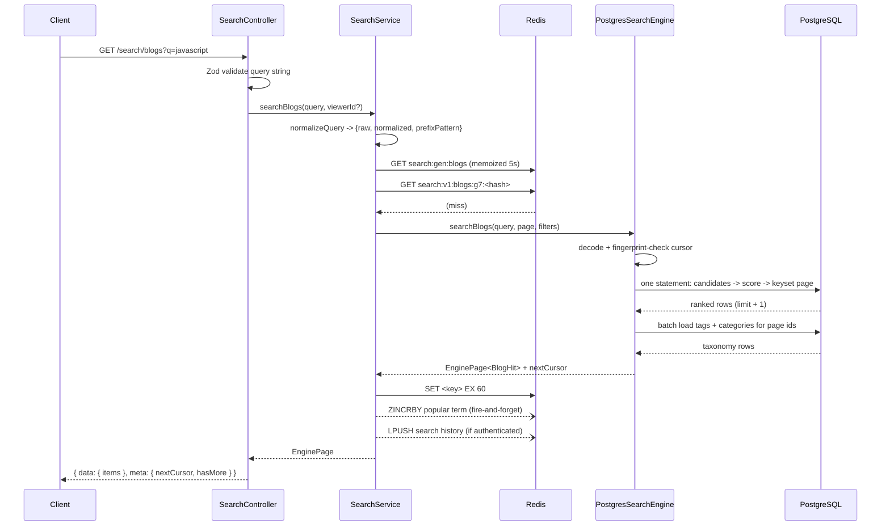
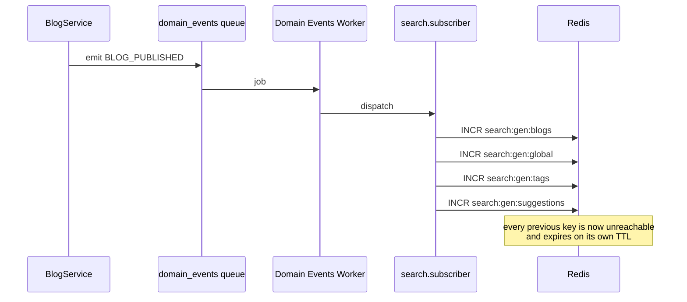
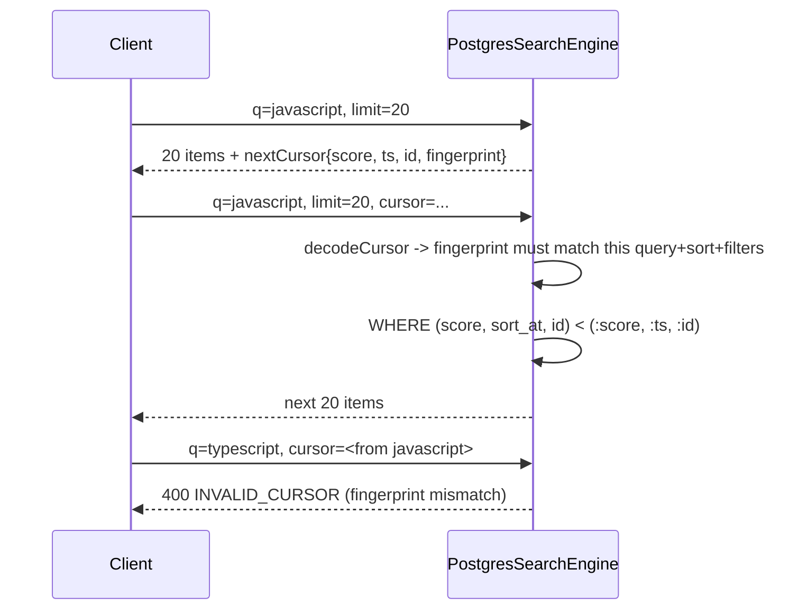

# Search & Discovery Module

Cross-entity search over blogs, users, tags and categories, backed by PostgreSQL
full-text search and `pg_trgm`, cached in Redis, and hidden behind an engine
abstraction so a dedicated search service can replace the backend later without
touching the API.

- **Status:** implemented, integrated, tested (`src/modules/search/`)
- **Type:** read/query module — it owns no writable domain data
- **Engine:** `PostgresSearchEngine` (selected via `SEARCH_ENGINE`, default `postgres`)

---

## 1. Responsibilities

**Owns**

- Global search, blog search, user search, tag search, category search
- Ranking, filtering, sorting
- Cursor pagination for search results
- Search suggestions (typeahead)
- Search result caching and its invalidation
- Per-user search history and aggregate term popularity (Redis only)

**Does not own**

Blog creation or lifecycle, user management, follows, comments, bookmarks,
notifications, analytics. Search never writes to any of them, and never calls
their services.

---

## 2. Architecture

```text
                       GET /api/v1/search/*
                                │
                       ┌────────▼────────┐
                       │ SearchController│  query-string validation (Zod)
                       └────────┬────────┘
                                │
                       ┌────────▼────────┐
                       │  SearchService  │  normalize · cache · orchestrate
                       └───┬────────┬────┘       · record side effects
                           │        │
             ┌─────────────▼──┐  ┌──▼──────────────────────┐
             │  ISearchEngine │  │ Redis                   │
             ├────────────────┤  │  · result cache         │
             │PostgresSearch  │  │  · popular terms (ZSET) │
             │Engine          │  │  · search history (LIST)│
             │(all SQL lives  │  └─────────────────────────┘
             │ here)          │
             └────────┬───────┘
                      │
                 PostgreSQL
             (FTS + pg_trgm indexes)


   domain events ──▶ search.subscriber ──▶ cache generation bump
```

### File layout

```text
src/modules/search/
├── search.types.ts           shared contracts (no SQL vocabulary)
├── search.query.ts           normalization, LIKE escaping, limits
├── search.cursor.ts          keyset cursor encode/decode/fingerprint
├── search.cache.ts           Redis read-through cache + generations
├── search.history.ts         per-user recent searches (Redis)
├── search.terms.ts           aggregate term popularity (Redis)
├── search.validator.ts       Zod schemas for every endpoint
├── search.service.ts         orchestration
├── search.controller.ts      HTTP layer
├── search.routes.ts          route table + rate limiting
├── engines/
│   ├── ISearchEngine.ts      the swap seam
│   ├── PostgresSearchEngine.ts   every line of search SQL
│   ├── ranking.ts            weights and retrieval limits
│   └── index.ts              engine selection
└── subscribers/
    └── search.subscriber.ts  cache invalidation from domain events
```

---

## 3. The search engine abstraction

`ISearchEngine` is the seam that keeps "replace Postgres with OpenSearch" a
configuration change rather than a rewrite:

```ts
interface ISearchEngine {
  readonly name: string;
  searchBlogs(query, page, filters): Promise<EnginePage<BlogHit>>;
  searchUsers(query, page): Promise<EnginePage<UserHit>>;
  searchTags(query, page): Promise<EnginePage<TagHit>>;
  searchCategories(query, page): Promise<EnginePage<CategoryHit>>;
  suggest(query, limit): Promise<Suggestion[]>;
}
```

Three contract decisions make the seam real rather than decorative:

1. **Inputs arrive normalized.** An engine never sees raw user text and is never
   responsible for length limits or escaping.
2. **Cursors are opaque to everyone but the engine.** An engine that needs a
   different key — a Lucene `search_after`, say — is free to encode one.
3. **Visibility is the engine's job, not a filter the caller remembers to pass.**
   Every method returns publicly visible content only. There is no
   "include private" parameter that could be passed by mistake, and a future
   engine cannot accidentally omit a `where` clause and start serving drafts.

To add an engine: implement the interface, register it in `engines/index.ts`,
set `SEARCH_ENGINE`. No route, controller, service, validator, cache key or test
above that file changes.

---

## 4. PostgreSQL implementation

### 4.1 Retrieval: bounded top-K, not exhaustive scan

"Score every row, then sort" is fine on ten thousand blogs and fatal on ten
million. Each blog query instead runs in three phases inside a single statement:

**Phase 1 — candidate generation.** Six index-backed sources each contribute at
most `CANDIDATE_LIMIT` (300) rows, ordered by their own relevance measure:

| Source           | Matches on                          | Index |
|------------------|-------------------------------------|-------|
| `fts`            | weighted title/subtitle tsvector    | `blog_search_fts_idx` (GIN) |
| `title_prefix`   | `lower(title) LIKE 'q%'`            | `blog_search_title_lower_idx` (B-tree, `text_pattern_ops`) |
| `tag_match`      | tag name → `BlogTag` → `Blog`       | `tag_search_*`, `BlogTag_tagId_idx` |
| `category_match` | category name → `BlogCategory`      | `category_search_*`, `BlogCategory_categoryId_idx` |
| `author_match`   | username / display name → `Blog`    | `user_search_*`, `Blog_authorId_status_idx` |
| `title_fuzzy`    | `title % 'q'` (trigram) — **gated** | `blog_search_title_trgm_idx` (GIN) |

**Phase 2 — ranking.** The union is scored once in SQL using `BLOG_WEIGHTS`.

**Phase 3 — keyset page.** The scored set is cut with a `(score, timestamp, id)`
row comparison and ordered deterministically.

### 4.2 The gated fuzzy pass

Trigram matching is the most expensive source by an order of magnitude —
measured at ~360 ms over 53k rows when the planner chooses a sequential scan,
against ~1–3 ms for the full-text and prefix sources. It is also *only useful
when the cheap sources found nothing*, i.e. when the user made a typo.

So the fuzzy CTE carries a one-time filter on the cheap-source count:

```sql
title_fuzzy AS (
  SELECT b."id" FROM "Blog" b
  WHERE (SELECT count(*) FROM cheap) < 10   -- FUZZY_FALLBACK_THRESHOLD
    AND b."status" = 'PUBLISHED' AND b."visibility" = 'PUBLIC'
    AND b."title" % $q
  ORDER BY similarity(b."title", $q) DESC, b."id" DESC
  LIMIT 300
)
```

Postgres evaluates the count once and reports `One-Time Filter: false` when it is
not needed, skipping the table entirely. Typo tolerance is preserved exactly
where it matters and costs nothing where it does not. This single change took the
worst-case query from 455 ms to 97 ms.

Queries under three characters skip the trigram path altogether: `pg_trgm` builds
three-character grams, so a one- or two-character query produces only padded
prefix grams that match almost everything. Those queries take the anchored B-tree
prefix path, which serves them better anyway.

### 4.3 Full-text strategy

The searchable vector is title (weight A) and subtitle (weight B):

```sql
setweight(to_tsvector('english', coalesce(title, '')),    'A') ||
setweight(to_tsvector('english', coalesce(subtitle, '')), 'B')
```

- The **two-argument** `to_tsvector(regconfig, text)` form is required: it is
  `IMMUTABLE`, while the one-argument form depends on
  `default_text_search_config` and is only `STABLE`, which Postgres refuses to
  index.
- The config is emitted as a SQL **literal**, not a bind parameter, in both the
  index and the query — an expression index is matched structurally, and a
  parameterised config would silently stop matching.
- `websearch_to_tsquery` parses user input, not `to_tsquery`: it accepts
  quotes, `OR`, and leading `-` without erroring on unbalanced syntax.
- Stemming comes free with the `english` configuration — a search for `promise`
  matches a post titled *"JavaScript Promises Explained"*.

**Blog body content is deliberately NOT indexed.** See §11.

### 4.4 `pg_trgm` usage

`pg_trgm` provides partial matching and typo tolerance:

- `title % 'javascrpt'` finds *"JavaScript"* despite the missing character
- `similarity()` supplies the fuzzy component of the score
- trigram GIN indexes on `Tag.name`, `Category.name`, `User.username`,
  `User.name` back the taxonomy and author candidate sources

`pg_trgm` lowercases internally, so trigram indexes are built on the raw column;
a `lower(...)` expression there would *not* be used by the `%` operator. Case
folding for equality and prefix matching is handled by the separate
`lower(col) text_pattern_ops` B-trees.

The `%` operator uses the session GUC `pg_trgm.similarity_threshold`
(default 0.3). The module relies on that default and never sets it, so behaviour
cannot vary between pooled connections.

---

## 5. Ranking

Weights live in `engines/ranking.ts`, apart from the SQL that applies them.
Every component is normalized to `[0, 1]` before weighting — `ts_rank_cd` is
called with normalization flag `32` (`rank / (rank + 1)`), `similarity()` is
already bounded, and the boolean signals are 0 or 1 — so **each weight is
exactly that component's maximum contribution**, and the priority ladder can be
read straight off the constants.

| Rank | Signal | Weight | Expression |
|------|--------|--------|------------|
| 1 | Exact title match | **6.0** | `lower(title) = q` |
| 2 | Title prefix | **3.0** | `lower(title) LIKE 'q%'` |
| 3 | Full-text relevance | **2.5** | `ts_rank_cd(vector, tsquery, 32)` |
| 4 | Title fuzzy | **1.2** | `similarity(title, q)` |
| 5 | Tag / category relevance | **1.5** | `greatest(tag_sim, category_sim)` |
| 6 | Author relevance | **1.0** | `greatest(username_sim, name_sim, exact_username)` |
| 7 | Recency | **0.8** | `exp(-age / 180 days)` |

Results are **never** ordered by `createdAt DESC`. Recency is deliberately the
smallest weight: it reorders near-ties without ever promoting an
irrelevant-but-fresh post above a relevant older one.

**Recency is quantized to the day.** At full resolution the score would drift by
a hair between two requests of the same paginated walk, and a keyset cursor
comparing `score = :score` would start skipping or repeating rows. Day
granularity makes the score stable for the entire life of any realistic
pagination session:

```sql
exp(-greatest(0, extract(epoch FROM (date_trunc('day', now()) - published_at))) / 15552000.0)
```

User and vocabulary ranking use their own weight tables (`USER_WEIGHTS`,
`TERM_WEIGHTS`) in the same file.

---

## 6. Filters and sorting

### Blog filters

| Parameter | Meaning |
|-----------|---------|
| `author` | author username (exact, case-insensitive) |
| `tag` | tag slug — repeatable or comma-separated; matches ANY |
| `category` | category slug — repeatable or comma-separated; matches ANY |
| `from` / `to` | inclusive bounds on `publishedAt` |
| `minReadingTime` / `maxReadingTime` | inclusive bounds on `readingTimeMinutes` |

Filters are applied **during candidate generation**, not after it. This is
load-bearing: with an `?author=` filter, an unfiltered candidate pass could spend
its whole `CANDIDATE_LIMIT` budget on posts by other authors and return an empty
page while matches existed.

`visibility` is intentionally **not** a filter. Public search resolves to exactly
one visibility, and accepting the parameter would imply the API can be asked for
anything else. An endpoint that silently ignores a filter it advertises is worse
than one that never offered it.

### Sorting

`relevance` (default), `newest`, `oldest`. Validated by Zod; anything else is a
400. The recency sorts still use the relevance-matched candidate set — they
change the ordering, not what matches.

---

## 7. Cursor pagination

The rest of the platform paginates on a single opaque row id, which works because
those feeds order by an indexed column Prisma can `cursor:` on. Search cannot:
its primary ordering is a **computed relevance score**, which exists only for the
duration of one query.

A search cursor therefore carries the full sort key — `(score, timestamp, id)` —
base64url-encoded, and the next page is a keyset cut:

```sql
WHERE (score, sort_at, id) < (:score::numeric, :ts::timestamptz, :id::text)
ORDER BY score DESC, sort_at DESC, id DESC
LIMIT :limit + 1
```

The trailing row id makes the order **total** even when score and timestamp tie,
which is what stops a row being skipped or served twice.

Three details make this safe rather than merely plausible:

1. **The score travels as a decimal string, never a float.** The engine rounds it
   in SQL (`round(..., 6)`) and compares as `numeric`. Round-tripping through a
   JS double could shift the value by one ULP and silently drop a row.
2. **The cursor is fingerprinted** against the normalized query, sort and filters
   it was minted for. Replaying it elsewhere is a 400 `INVALID_CURSOR` rather
   than a page keyed on scores from an unrelated result set. Page size is
   deliberately *not* fingerprinted — keyset pagination handles a changed `limit`
   correctly.
3. **`hasMore` comes from a sentinel row** (`limit + 1`), never a second COUNT.

The cursor is not signed: it encodes no authorization decision and reveals
nothing the client did not already have, so an HMAC would add key management for
no security gain.

Response shape follows the platform envelope produced by `sendSuccess`:

```json
{
  "success": true,
  "data": { "items": [ ... ] },
  "meta": { "nextCursor": "eyJ2Ijox...", "hasNextPage": true, "hasMore": true }
}
```

> The brief sketched `{ items, pagination: { nextCursor, hasMore } }`. Every other
> module on this platform returns pagination in `meta`, and `sendSuccess` builds
> that envelope, so search matches its siblings — with `hasMore` emitted alongside
> `hasNextPage` so clients written against either name work.

---

## 8. Redis caching

### Keys and generations

```text
search:v1:<scope>:g<generation>:<sha256(canonical request)>
```

A cache key encodes the query, filters, sort and cursor, so a single blog being
published invalidates an unknowable set of keys. `SCAN`+`DEL` is O(keyspace) on a
shared Redis, and `KEYS` is worse. Instead each scope carries a **generation
counter** that is part of the key. Invalidation is a single `INCR`: old keys
become unreachable instantly and are reclaimed by their own TTL. Cost is O(1) per
event regardless of how many cached queries existed.

The generation is memoized in process for 5 seconds so the hot path does not pay
an extra Redis round trip per search. The cost is up to 5 seconds of extra
staleness after an invalidation on *other* instances — well inside what the TTLs
already allow.

| Scope | TTL | Rationale |
|-------|-----|-----------|
| `blogs`, `users`, `global` | 60s | Readers notice these going stale |
| `suggestions` | 120s | Read on every keystroke |
| `tags`, `categories` | 300s | Vocabularies change rarely |

### What is not cached

Nothing viewer-specific. Public results are identical for every caller *by
construction* — the engine hard-filters to PUBLISHED + PUBLIC + ACTIVE author —
which is exactly what makes one cache entry correct for every viewer. `viewerId`
reaches the service but never the engine and never the cache key.

> **If personalized ranking is ever added, the cache key must gain the viewer id
> in the same change.** That is the one invariant a future contributor could break
> without a test failing.

Search history is never cached: it is per-user data that would need the user id
in the key to be safe, and it is already a single Redis read.

### Cache never breaks search

Every Redis call is best-effort. A miss, an unreachable Redis, or a corrupt
payload logs and falls through to the loader. `search.cache.test.ts` covers the
outage and the poisoned-entry paths explicitly.

---

## 9. Cache invalidation

`subscribers/search.subscriber.ts` is the module's **only** inbound coupling, and
it is one-directional. Search listens; it never calls `BlogService`,
`UserService`, or any sibling repository.

| Event | Invalidates |
|-------|-------------|
| `BLOG_CREATED` (may mint tags) | `blogs`, `global`, `tags`, `suggestions` |
| `BLOG_UPDATED` | same |
| `BLOG_PUBLISHED` | same |
| `BLOG_UNPUBLISHED` | same |
| `BLOG_ARCHIVED` | same |
| `BLOG_RESTORED` | same |
| `BLOG_DELETED` | same |
| `BLOG_COVER_UPDATED` | same |
| `USER_PROFILE_UPDATED` | `users`, **`blogs`**, `global`, `suggestions` |
| `USER_AVATAR_UPDATED` | same |
| `USER_SETTINGS_UPDATED` | same |
| `USER_DELETED` | same |
| `CATEGORY_CREATED` | `categories`, `global`, `suggestions` |

Two notes on the list being longer than the brief's minimum:

- **User events invalidate `blogs`.** A blog hit *embeds* its author's username,
  display name, avatar and verified badge. Without this, a renamed author would
  show their old name in search for the life of the cache entry.
- **`USER_SETTINGS_UPDATED` matters** because it carries the `isPrivate` toggle,
  which decides whether a user appears in search at all.

`CATEGORY_CREATED` is new — emitted by `blogService.createCategory`, since the
Blog module owns the curated category vocabulary. It is the only change this
module required outside its own directory, besides route/subscriber registration.

Invalidation is deliberately **coarse**: one blog being published drops every
cached blog search, not just the ones that would have matched it — which is
unknowable without re-running them. With a 60-second TTL those entries were
nearly worthless anyway, and correctness is worth more than a hit-rate point.

---

## 10. Privacy and security

| Concern | Handling |
|---------|----------|
| SQL injection | Every user-derived value is a bind parameter via `Prisma.sql`. `Prisma.raw` wraps only compile-time module constants and fixed column names — never anything reachable from a request. |
| `LIKE` wildcard abuse | `%`, `_` and `\` are escaped by `escapeLike` and patterns use `ESCAPE '\'`. Unescaped, a query of `%d` becomes a leading wildcard matching every row and using no index. Covered by two-character regression tests that isolate the `LIKE` path. |
| Excessively long queries | Rejected at 128 characters, and capped at 12 tokens. Rejected, not truncated — truncating searches for something the user did not ask for and reports success. |
| Private blog exposure | `status = 'PUBLISHED' AND visibility = 'PUBLIC'` is emitted once, as a module constant, into every candidate source. Drafts, archived, deleted, private, unlisted and members-only posts are all excluded. |
| Deleted content | `DELETED` is not `PUBLISHED`, so the same predicate covers it. |
| Suspended / deleted authors | `scored` requires `u.status = 'ACTIVE'`, so their posts never surface. |
| Private-user enumeration | Users with `UserSettings.isPrivate = true` are excluded from user search *and* suggestions. They remain reachable by exact username through the User module's profile endpoint, which applies its own minimal-disclosure rules. A missing settings row reads as defaults, not as private. |
| Search abuse / scraping | `searchLimiter`: 60 requests/minute/IP, `rl:search:` namespace, in front of the whole router. |
| Query-term retention | See below. |

### Term popularity is privacy-constrained by design

`search:terms:v1` is the one structure that retains what people typed, so it is
deliberately narrow:

1. **Nothing identifying is stored** — terms and counts only, no user id anywhere
   near it.
2. **Only terms that found something are recorded.** A query matching nothing is
   far more likely to be a name, an email or a typo'd private string.
3. **k-anonymity before surfacing** — a term is never suggested until at least
   `MIN_SUGGESTION_COUNT` (3) searches have produced it, so one person's unusual
   query cannot become a public autocomplete entry.
4. **Shape filtering** — anything email-shaped, URL-shaped, or containing a run
   of 6+ digits is refused outright.
5. **The whole set expires** after 30 idle days.

---

## 11. Deliberate scope exclusion: blog body content

**Blog body text is not searchable.** Only title, subtitle, tags, categories and
author are.

This was an explicit product decision, not an oversight. Indexing the body would
require a plain-text mirror of the Tiptap JSON — the JSON itself cannot be fed to
`to_tsvector` — which means a new denormalized column on `Blog`, maintained by
`BlogService` on every content write, plus a backfill for existing rows.

Consequences to be aware of:

- A post whose title and tags never mention a topic discussed at length in its
  body will not be found by that topic.
- `excerpt` in a search result is derived from the **subtitle**, not from the
  body. Posts without a subtitle return `excerpt: null`.

The design accommodates the change without disruption when it is wanted — see
§15.

---

## 12. API

All endpoints are under `/api/v1/search` and rate-limited at 60 req/min/IP.
Search endpoints are public and use `optionalAuth`: results do not differ for a
signed-in viewer; the token is read only so an authenticated search can be
written to that user's private history. An expired token degrades to an anonymous
search rather than a 401 mid-typing.

| Method | Path | Auth | Purpose |
|--------|------|------|---------|
| GET | `/search` | optional | Cross-entity overview |
| GET | `/search/blogs` | optional | Blog search (paginated) |
| GET | `/search/users` | optional | User search (paginated) |
| GET | `/search/tags` | optional | Tag search (paginated) |
| GET | `/search/categories` | optional | Category search (paginated) |
| GET | `/search/suggestions` | optional | Typeahead |
| GET | `/search/history` | **required** | Own recent searches |
| DELETE | `/search/history` | **required** | Clear own history |

### Common parameters

| Param | Type | Default | Notes |
|-------|------|---------|-------|
| `q` | string | — | required, 1–128 chars |
| `cursor` | string | — | opaque; from a previous `meta.nextCursor` |
| `limit` | int | 20 | 1–50 (`/search`: 1–20, default 5; `/suggestions`: 1–20, default 10) |
| `sort` | enum | `relevance` | `relevance` \| `newest` \| `oldest` |

`limit` is capped lower than the platform-wide 100: a search page is far more
expensive than a feed page (every item was ranked, and a large page pulls
proportionally more taxonomy rows).

### `GET /search/blogs`

```http
GET /api/v1/search/blogs?q=javascript&sort=relevance&limit=20&tag=react&author=gracehopper
```

```json
{
  "success": true,
  "data": {
    "items": [
      {
        "id": "clx...",
        "title": "JavaScript Promises Explained",
        "slug": "javascript-promises-explained",
        "excerpt": "A tour of the microtask queue",
        "coverImage": "https://.../cover.jpg",
        "author": {
          "id": "clx...", "username": "gracehopper", "name": "Grace Hopper",
          "avatar": null, "isVerified": true
        },
        "tags": [{ "id": "clx...", "name": "javascript", "slug": "javascript" }],
        "categories": [],
        "readingTimeMinutes": 12,
        "publishedAt": "2026-01-04T00:00:00.000Z",
        "score": 12.007679
      }
    ]
  },
  "meta": { "nextCursor": "eyJ2IjoxLCJmIjoi...", "hasNextPage": true, "hasMore": true }
}
```

Never includes the Tiptap `content` document. `publishedAt` is an **ISO string**,
not a `Date` — so a cache hit and a cache miss serialize to byte-identical JSON.
`score` is comparable within one result set only, never across queries.

### `GET /search`

Returns `{ query, blogs[], users[], tags[], categories[] }` — a capped slice of
each. Deliberately **not** cursor-paginated: "page 2 of a mixture of blogs, users
and tags" is not a coherent request. Deep paging uses the per-entity endpoints.
The four engine calls run concurrently.

### `GET /search/suggestions`

```json
{ "success": true,
  "data": { "suggestions": [
    { "text": "javascript promises", "source": "POPULAR" },
    { "text": "javascript", "source": "TAG", "slug": "javascript" },
    { "text": "gracehopper", "source": "USER", "slug": "gracehopper" }
  ] } }
```

`source` is `POPULAR | TAG | CATEGORY | USER | BLOG`. Popular terms come first —
a term other people actually searched for is a better completion than an
arbitrary tag sharing a prefix. De-duplication is case-insensitive on the text.

### Errors

| Code | Status | Cause |
|------|--------|-------|
| `VALIDATION_ERROR` | 400 | Bad/missing `q`, out-of-range `limit`, unknown `sort`, inverted range |
| `INVALID_SEARCH_QUERY` | 400 | Query empty or over-length after normalization |
| `INVALID_CURSOR` | 400 | Malformed, wrong version, or fingerprint mismatch |
| `TOO_MANY_REQUESTS` | 429 | Rate limit |
| `UNAUTHORIZED` | 401 | History endpoints without a token |

---

## 13. Sequence diagrams

### Blog search, cache miss



### Cache invalidation



### Cursor walk



---

## 14. Database indexes

All in `prisma/sql/search_indexes.sql`, applied by `npm run db:indexes` (and by
`npm run db:sync`, and by the Jest global setup so tests exercise the same index
set as production).

**None of it is expressible in Prisma's schema language** — GIN indexes, trigram
operator classes, expression indexes over `to_tsvector`, and partial-index
`WHERE` clauses all live outside it. `prisma db push` never creates them, which is
exactly the drift that hides a sequential scan until deploy day.

| Index | Table | Type | Serves |
|-------|-------|------|--------|
| `blog_search_fts_idx` | Blog | GIN, expression, partial | full-text `@@` |
| `blog_search_title_trgm_idx` | Blog | GIN `gin_trgm_ops`, partial | `title % q`, `ILIKE '%q%'` |
| `blog_search_title_lower_idx` | Blog | B-tree `text_pattern_ops`, partial | exact + prefix title |
| `blog_search_published_idx` | Blog | B-tree, partial | `sort=newest/oldest`, recency |
| `user_search_username_trgm_idx` | User | GIN `gin_trgm_ops` | fuzzy handle |
| `user_search_name_trgm_idx` | User | GIN `gin_trgm_ops` | fuzzy display name |
| `user_search_username_lower_idx` | User | B-tree `text_pattern_ops` | exact + prefix handle |
| `user_search_name_lower_idx` | User | B-tree `text_pattern_ops` | prefix display name |
| `tag_search_name_trgm_idx` | Tag | GIN `gin_trgm_ops` | fuzzy tag |
| `tag_search_name_lower_idx` | Tag | B-tree `text_pattern_ops` | exact + prefix tag |
| `category_search_name_trgm_idx` | Category | GIN `gin_trgm_ops` | fuzzy category |
| `category_search_name_lower_idx` | Category | B-tree `text_pattern_ops` | exact + prefix category |

### Why an expression index and not a stored generated column

A `GENERATED ALWAYS AS (...) STORED` tsvector column is the textbook approach and
is **wrong for this repository**: `prisma db push` reconciles the table against
`schema.prisma` and drops columns it does not know about, so the column would
vanish on every sync and have to be rebuilt. An index is invisible to that
reconciliation. The cost is that `to_tsvector` is recomputed for candidate rows
during ranking — negligible for title and subtitle, which are short.

### Why the Blog indexes are partial

Every Blog index is partial on `(status = 'PUBLISHED' AND visibility = 'PUBLIC')`.
Public search never looks at anything else, so indexing drafts and private posts
would only inflate the index. The engine repeats that predicate as **SQL
literals, never bind parameters** — the planner can only prove a partial index
applies against constants.

> **Two coupled invariants.** `BLOG_FTS_EXPRESSION` in
> `PostgresSearchEngine.ts` must stay character-identical to the expression in
> `search_indexes.sql`, and the visibility predicate must stay literal. Break
> either and every full-text search silently becomes a sequential scan — no error,
> just latency. `npm run search:report` is the check.

### Production note

`CREATE INDEX` takes an ACCESS EXCLUSIVE lock for the duration of the build. On a
live database with a large `Blog`/`User` table, run these once by hand with
`CREATE INDEX CONCURRENTLY` (it cannot run inside a transaction and leaves an
INVALID index behind on failure, which is why the automated bootstrap path does
not use it).

---

## 15. Performance

Measured on PostgreSQL 18, local, with **53,000 blogs / 80,040 users / 40,030
tags**, via `npm run search:report`:

| Query | Cold | Warm median |
|-------|------|-------------|
| Common term (full-text + prefix) | 142.7 ms | **71.4 ms** |
| Multi-word phrase | 62.1 ms | 61.8 ms |
| Typo (gated trigram fallback) | 48.5 ms | 46.9 ms |
| Short prefix (B-tree only) | 35.5 ms | 35.2 ms |
| No match at all | 6.7 ms | 6.4 ms |
| `sort=newest` | 63.7 ms | 62.7 ms |
| Filtered by author | 52.5 ms | 51.7 ms |
| User search | 3.0 ms | 1.9 ms |
| Tag search | 7.9 ms | 7.5 ms |
| Category search | 6.5 ms | 6.5 ms |
| Suggestions | 9.5 ms | 9.4 ms |

Index usage verified through `pg_stat_user_indexes`: 11 of 12 indexes are
exercised by the probe set. The two Category indexes are not — that table holds
five rows and a sequential scan is genuinely cheaper. The report prints this
caveat rather than treating an unused index as a bug.

### `npm run search:report`

A permanent tool, not a one-off script. It checks every expected index exists,
snapshots `pg_stat_user_indexes.idx_scan`, runs a representative probe set
through the **real engine**, and reports which indexes were touched plus cold and
warm-median latency per probe.

Two details worth knowing, both learned the hard way while building it:

- Index counters flush lazily, so the report calls `pg_stat_force_next_flush()`
  first. Without it, indexes that were demonstrably used report zero scans.
- Each probe is timed repeatedly. A single timed run straight after a bulk load
  measures cold shared buffers and an uncached plan; an early version of this
  report inflated latency 25× that way and looked exactly like a scaling defect.

### Performance decisions

- **N+1 avoided in two places.** Tags and categories for a page load in two
  batched queries over the already-trimmed id list. A `LEFT JOIN` inside the
  ranking query would multiply every scored row by its tag count *before* the
  LIMIT; a per-row lookup is a textbook N+1.
- **Hydration runs after trimming**, so the sentinel row fetched to detect
  `hasMore` never triggers a taxonomy lookup for a blog nobody sees.
- **`blogCount` for tags/categories is computed in the outer select**, after the
  page is cut, so the counting join runs for at most `limit + 1` rows instead of
  every matching term.
- **The candidate→Blog join is currently a hash join.** At 53k rows the planner
  correctly prefers it (~6 ms); hash-join cost scales with table size while a
  nested-loop PK lookup does not, so the planner switches on its own as the table
  grows. Worth re-checking with `search:report` past ~1M blogs.

---

## 16. Testing

611 tests pass across the suite; 188 are search-specific.

| Suite | Kind | Covers |
|-------|------|--------|
| `search.query.test.ts` | unit | normalization, NFKC, `LIKE` escaping, length/token caps, trigram threshold |
| `search.cursor.test.ts` | unit | encode/decode round trip, decimal-string score, fingerprint mismatch, tampering, canonicalization |
| `search.cache.test.ts` | real Redis | key stability + scoping, generation bumps, TTLs, corrupt payload, Redis outage |
| `search.service.test.ts` | unit, mocked engine | normalization hand-off, filter mapping, cache scoping, side effects, suggestion merge, `isRecordable` |
| `search.integration.test.ts` | supertest, mocked service | routes, validators, auth, envelope, route ordering, 400/401 paths |
| `search.db.test.ts` | **real SQL** | ranking order, stemming, every candidate source, visibility exclusions, privacy, filters, cursor walks, hostile input |

The database suite is the load-bearing one. Ranking comes out of `ts_rank_cd` and
`similarity()`, visibility is enforced by predicates in the query text, and keyset
pagination over a computed score is exactly the kind of thing that looks right
and walks wrong — none of it is observable through a mocked Prisma delegate.

Cursor-walk tests page through the whole result set at several page sizes and
assert every row is seen exactly once, in the same order as an unpaginated fetch,
for all three sort modes. The `LIKE`-escaping tests deliberately use
**two-character** queries, because below three characters the trigram sources are
skipped — which isolates the `LIKE` path, the only place escaping can go wrong.

No external search engine is required for any test.

---

## 17. Future migration to a dedicated search engine

The seam is `ISearchEngine`. A migration looks like:

1. **Implement** `OpenSearchEngine implements ISearchEngine` in `engines/`.
2. **Register** it in `engines/index.ts` and promote `SEARCH_ENGINE` into
   `core/config/env.ts` (deliberately not there yet — an env var with exactly one
   legal value is ceremony).
3. **Build the indexing path.** The `search.subscriber` already receives every
   event that changes searchable content; today it bumps a cache generation, and
   it would additionally enqueue a reindex job. The event list needs no change.
4. **Backfill**, then dual-run: serve from Postgres, shadow-query the new engine,
   compare. `search.db.test.ts` becomes the conformance suite — point it at the
   new engine and it asserts the same visibility, privacy and pagination
   invariants.
5. **Flip** `SEARCH_ENGINE`. Roll back by flipping it again.

What does **not** change: routes, controller, validators, the response envelope,
cursor semantics (opaque to clients), caching, history, popularity, rate limiting.

### Adding body-content search later

Whichever engine is in play:

1. Add `contentText String? @db.Text` to `Blog`.
2. Populate it in `BlogService` — `editorParser.extractMetadata()` already
   returns `plainText`, and the service already writes derived fields
   (`wordCount`, `readingTimeMinutes`) on every content change.
3. Backfill existing rows with a script.
4. Add `setweight(to_tsvector('english', coalesce(contentText,'')), 'C')` to both
   `BLOG_FTS_EXPRESSION` and `search_indexes.sql`, and add a `CONTENT` weight to
   `BLOG_WEIGHTS` below `TAXONOMY`.
5. Derive `excerpt` from `contentText` when the subtitle is absent.

No API, cursor, cache or route change.

### Also enabled without redesign

Personalized ranking (**must add the viewer id to the cache key**), trending
search, semantic/vector search (`pgvector` as another candidate source),
search analytics, `unaccent` for accent-insensitive matching (available in both
databases; needs a custom text-search configuration, since bare `unaccent()` is
`STABLE` and cannot be indexed).

---

## 18. Known limitations

| # | Limitation | Impact | Fix |
|---|-----------|--------|-----|
| 1 | **Blog body content is not searchable** | A topic discussed only in the body is unfindable | §17 — needs a schema change |
| 2 | **Result depth is capped** at ~`CANDIDATE_LIMIT × sources` (≈1800) | Paging far past that returns nothing | Inherent to top-K retrieval; Elasticsearch calls it `max_result_window` |
| 3 | **Tags and categories have no description column** | Search matches names only, though the brief allows descriptions | Add `description` to `Tag`/`Category` — foundation-level |
| 4 | **Ranking weights are hand-set, not learned** | Reasonable, not optimal | Needs click-through data, i.e. the Analytics module |
| 5 | **No accent-insensitive matching** | "café" does not match "cafe" via full-text (trigram partially compensates) | Custom text-search config with `unaccent` |
| 6 | **Generation memo is per-process (5s)** | Up to 5s extra staleness on other instances after an invalidation | Redis pub/sub, if ever justified |
| 7 | **Cross-entity `/search` is not paginated** | No deep paging on the overview | By design — use the per-entity endpoints |
| 8 | **Recency quantized to the day** | Two posts published hours apart get an identical recency boost | Required for cursor stability; the trade is deliberate |
| 9 | **`prisma db push` cannot manage these indexes** | `npm run db:indexes` must run on every environment | Move to `prisma migrate` with raw SQL — foundation-level |
| 10 | **Suggestion popularity scans the top 500 terms in process** | Fine at this scale; not a prefix index | A prefix-indexed structure, if the vocabulary grows |
| 11 | **The User module's `GET /users/search` still exists** | Two user-search implementations (old one is offset + `ILIKE %q%`) | Superseded by `/search/users`; retired when clients migrate |

---

## 19. Operations

```bash
npm run db:indexes     # apply search indexes (idempotent, safe to re-run)
npm run db:sync        # prisma db push + db:indexes + generate
npm run search:report  # verify indexes exist and are used; report latency
npm test               # full suite (provisions its own test schema)
```

**After deploying this module, `npm run db:indexes` must be run against every
environment.** Without it, `pg_trgm` is missing and every search fails.

| Variable | Default | Purpose |
|----------|---------|---------|
| `SEARCH_ENGINE` | `postgres` | Engine selection. Unknown values log a warning and fall back. |

### Redis keyspace

```text
search:v1:<scope>:g<n>:<hash>   result cache      TTL 60–300s
search:gen:<scope>              generation counter (no TTL)
search:terms:v1                 popularity ZSET   TTL 30d idle
search:history:v1:<userId>      recent searches   TTL 30d idle, max 20
rl:search:<ip>                  rate limit        TTL 60s
```
