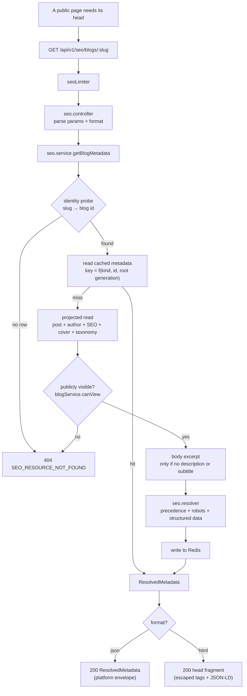
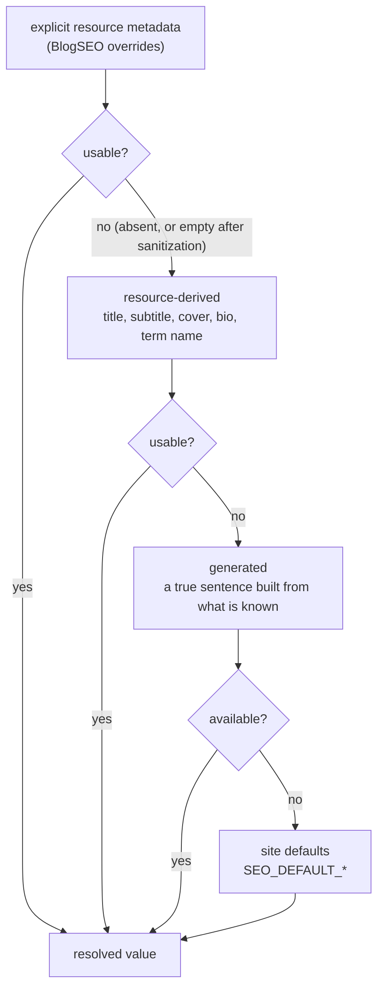
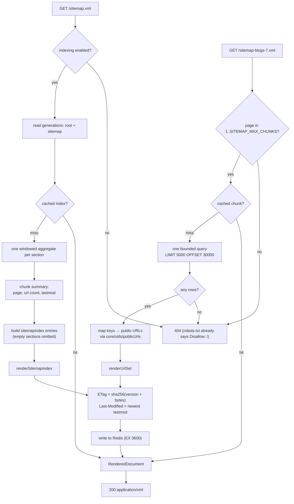
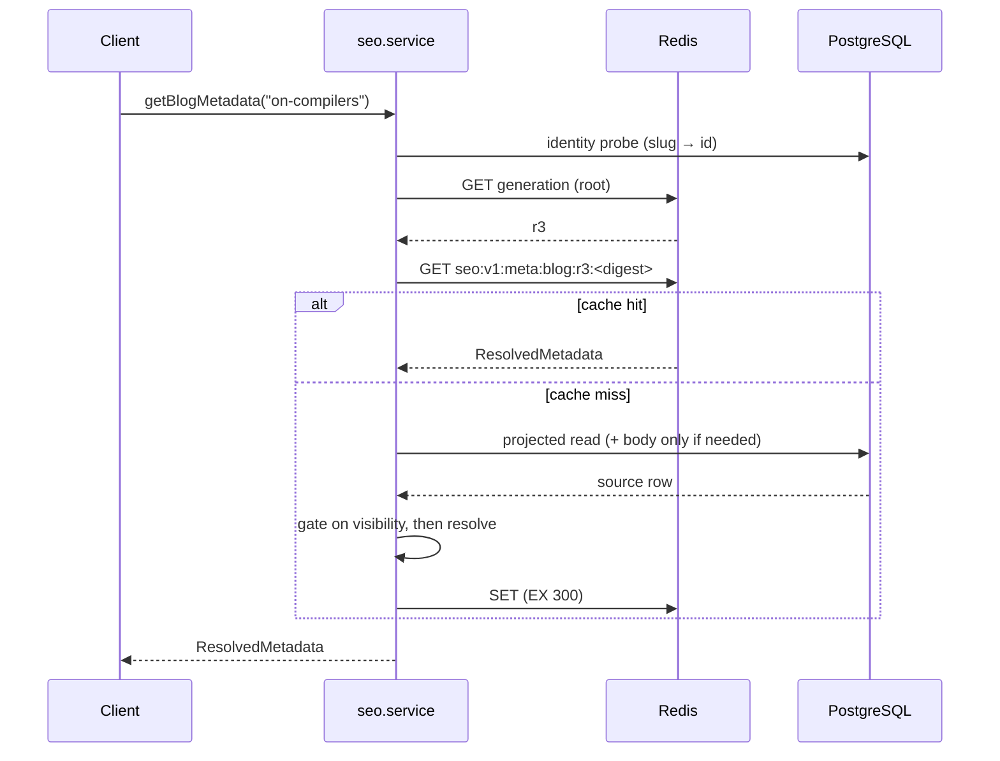

# SEO & Public Metadata Module

> Resolved metadata for every public page, plus the two documents crawlers ask
> for: `robots.txt` and a chunked sitemap.

The module owns **composition, not content**. It holds no table and no column.
Posts and their lifecycle belong to Blog, accounts to User, the taxonomy to
Blog's curated vocabularies, images to Media, and "what may be discovered" to
the platform's single eligibility predicate. What SEO owns is turning those into
a finished description of a page — and knowing when that description has stopped
being true.

- [1. Responsibilities](#1-responsibilities)
- [2. Architecture](#2-architecture)
- [3. Supported resource types](#3-supported-resource-types)
- [4. Route structure](#4-route-structure)
- [5. Metadata resolution](#5-metadata-resolution)
- [6. Canonical URLs](#6-canonical-urls)
- [7. Open Graph](#7-open-graph)
- [8. Twitter/X cards](#8-twitterx-cards)
- [9. Robots directives](#9-robots-directives)
- [10. Structured data](#10-structured-data)
- [11. Breadcrumbs](#11-breadcrumbs)
- [12. Sitemap architecture](#12-sitemap-architecture)
- [13. robots.txt](#13-robotstxt)
- [14. Caching](#14-caching)
- [15. HTTP caching](#15-http-caching)
- [16. Invalidation](#16-invalidation)
- [17. Duplicate content protection](#17-duplicate-content-protection)
- [18. Security](#18-security)
- [19. Rate limiting](#19-rate-limiting)
- [20. Failure handling](#20-failure-handling)
- [21. Configuration](#21-configuration)
- [22. Frontend integration](#22-frontend-integration)
- [23. Performance](#23-performance)
- [24. Extension points](#24-extension-points)
- [25. API examples](#25-api-examples)
- [26. Testing](#26-testing)
- [27. Known limitations](#27-known-limitations)
- [28. Related documents](#28-related-documents)

---

## 1. Responsibilities

**Owns**

- Metadata resolution — title, description, canonical URL, robots directive
- Open Graph and Twitter/X card metadata
- Schema.org structured data and breadcrumbs
- Sitemap generation, chunking and the sitemap index
- `robots.txt`
- The public metadata API

**Does not own**

| Concern | Owner |
| --- | --- |
| Blog content, lifecycle, slugs | Blog |
| User profiles and account status | User |
| Media storage and image processing | Media |
| The category / tag vocabulary | Blog |
| What is discoverable | Feed (`feed.eligibility`) |
| Whether a viewer may read a post | Blog (`blogService.canView`) |
| Syndication | RSS |
| Search, ranking, analytics, notifications | their own modules |

The module is an event **consumer** only. Nothing in it emits.

---

## 2. Architecture

### File layout

```text
modules/seo/
├── seo.config.ts          site identity, sitemap limits, TTLs, robots ruleset
├── seo.types.ts           sources vs. resolved metadata — the module's vocabulary
├── seo.indexability.ts    what may be crawled, indexed and listed
├── seo.urls.ts            this module's OWN endpoint URLs (sitemaps, robots)
├── seo.repository.ts      every line of SEO SQL
├── seo.resolver.ts        the precedence engine — pure, no I/O
├── seo.structuredData.ts  Schema.org node builders
├── seo.serializer.ts      sitemap XML, JSON-LD, head tags
├── seo.cache.ts           Redis: generations + exact-key deletion
├── seo.service.ts         metadata orchestration
├── sitemap.service.ts     sitemap + robots.txt orchestration
├── seo.controller.ts      the metadata API's HTTP layer
├── sitemap.controller.ts  the crawler routes' HTTP layer
├── seo.errors.ts          XML / plain-text error handler for crawlers
├── seo.routes.ts          both routers
├── seo.validator.ts       Zod schemas
└── subscribers/
    └── seo.subscriber.ts  event-driven invalidation
```

Public **page** URLs are not in this list. They live in
`core/utils/publicUrls.ts` — see [§6](#6-canonical-urls).

### Public page → metadata flow



### Layer rules

- **Controllers** — no SQL, no visibility logic, no precedence, no markup.
  Parse, call, choose a representation, choose 200 or 304.
- **Services** — no SQL, no HTTP, no markup. Identify, cache, orchestrate.
- **Resolver** — pure. No I/O, no clock, no Redis. Every rule is assertable
  from a literal object.
- **Repository** — the only file in the module that names a table.
- **Serializer** — the only file that knows what XML or a `<meta>` tag is.
- **Indexability** — the only file that decides what may be indexed, and it
  decides by delegating.
- **Cache** — the only file that speaks to Redis.
- **Subscriber** — a mapping from events to invalidation intentions; the
  invalidation itself lives on the services.

### Dependency direction

SEO imports from **Blog** (`canView`) and **Feed** (`isFeedEligible`,
`FEED_ELIGIBILITY`). Neither imports SEO, and nothing else imports SEO, so it
stays a leaf and no cycle can form — the same position RSS occupies.

---

## 3. Supported resource types

| Resource | Public page | Metadata | In sitemap | `og:type` | Structured data |
| --- | --- | --- | --- | --- | --- |
| Site / home | `/` | ✅ | ✅ (`pages`) | `website` | `WebSite` |
| Blog post | `/blog/:slug` | ✅ | ✅ | `article` | `BlogPosting` |
| Author | `/@:username` | ✅ | ✅ | `profile` | `ProfilePage` + `Person` |
| Category | `/categories/:slug` | ✅ | ✅ | `website` | `CollectionPage` |
| Tag | `/tags/:slug` | ✅ | ✅ | `website` | `CollectionPage` |

No new database model was created. `BlogSEO` already existed and remains the
single store of per-post overrides — the module **reads** it and never writes it,
because the Blog module owns a post's data including its SEO row.

Comments have no page of their own and appear nowhere here.

---

## 4. Route structure

### The metadata API — `/api/v1/seo`

```text
GET /api/v1/seo/site
GET /api/v1/seo/blogs/:slug
GET /api/v1/seo/authors/:username
GET /api/v1/seo/categories/:slug
GET /api/v1/seo/tags/:slug
```

All five accept `?format=json` (default) or `?format=html`.

### The crawler routes — the site root

```text
GET /robots.txt
GET /sitemap.xml                      the index
GET /sitemap-<section>-<page>.xml     one chunk
```

These are **not** under `/api/v1`, and that is not a style choice. `/robots.txt`
is specified to live at the origin's root and a crawler will not look anywhere
else. A sitemap must sit at or above the URLs it lists, so one served from
`/api/v1/...` could not legally list `/blog/...` at all.

Both are designed to be proxied to this service from the application's own
origin. `SEO_SITEMAP_BASE_URL` exists for the deployment where they are not —
see [§21](#21-configuration).

### Why an API at all

The brief asks not to introduce one "merely for the sake of having one". There is
no frontend in this repository: `backend/` and `docs/` are the whole tree, and
no `.tsx` file has ever been committed. So server-side or static generation
cannot resolve this metadata today, and an API is the only way a future frontend
gets it. See [§22](#22-frontend-integration) for the contract it should consume.

---

## 5. Metadata resolution

The precedence chain, applied by `seo.resolver.ts`:



"Usable" means **non-empty after sanitization** — an override consisting of a
stray `<span>` is not an override, it is an empty string wearing markup.

### Per field

| Field | Precedence |
| --- | --- |
| `title` (post) | `metaTitle` **verbatim** → `"<title> — <site>"` |
| `title` (author) | `"<name> — <site>"` |
| `title` (term) | `"<name> — <site>"`, tags prefixed `#` |
| `title` (site) | `SEO_DEFAULT_TITLE` |
| `description` (post) | `metaDescription` → `subtitle` → body excerpt → `"<title> — a post by <author> on <site>."` |
| `description` (author) | `bio` → `"Posts by <name> on <site>."` |
| `description` (term) | `"Posts in/tagged <name> on <site>."` |
| `description` (site) | `SEO_DEFAULT_DESCRIPTION` |
| `canonicalUrl` | `BlogSEO.canonicalUrl` (scheme-checked) → derived |
| `og:title` | `ogTitle` → `metaTitle` → resource title (**never** site-suffixed) |
| `og:description` | `ogDescription` → resolved description |
| `og:image` | `ogImage` → cover → `SEO_DEFAULT_IMAGE` → omitted |
| `twitter:card` | `twitterCard` → large if there is an image, else summary |
| `twitter:creator` | derived from `DeveloperProfile.x`, strictly |

### An explicit title is used verbatim

A **derived** title gets the site's name appended; an explicit `metaTitle` does
not. "Override" is taken literally — an author who writes a meta title has
decided what the tab should say, and appending to it would mean no author could
ever choose a title that did not end in the site's name.

This is the one place the module's output differs from
`blogService.effectiveSeo`, which returns the stored overrides as they are for
the blog API rather than resolving them for rendering.

### The chain never ends in `null`

A post with no description of any kind resolves to
`"<title> — a post by <author> on <site>."` rather than to the site's own
tagline: a description that describes the site instead of the page is worse than
a generic one that is at least about the page. Nothing is fabricated — every
generated string is assembled from values the page itself displays.

---

## 6. Canonical URLs

Public page URLs come from **`core/utils/publicUrls.ts`**, the platform's single
URL vocabulary:

```text
PUBLIC_PATHS.home()             /
PUBLIC_PATHS.blog(slug)         /blog/<slug>
PUBLIC_PATHS.author(username)   /@<username>
PUBLIC_PATHS.category(slug)     /categories/<slug>
PUBLIC_PATHS.tag(slug)          /tags/<slug>
```

### Why it moved to `core/`

Four places need to answer "where does this post live": RSS (an item's `<link>`),
SEO (a canonical URL, an `og:url`, a sitemap `<loc>`), the Notification email
templates, and any future distribution surface. Before this module, RSS and
Notification each had their own copy of `${APP_URL}/blog/${slug}` — which agreed
only because someone had checked. A canonical URL that disagrees with the link in
the email announcing the post is a duplicate-content bug nobody can see from
inside either module, so the answer now lives in exactly one place and all three
modules consume it.

### Configuration, never request headers

Nothing in the URL vocabulary reads a `Request`. URLs are built from `APP_URL`,
and the alternative is a vulnerability rather than a style preference: `Host` and
`X-Forwarded-Host` are attacker-controlled on a public endpoint, and this module
**caches** what it builds — so one request carrying a spoofed host would poison
the copy served to everyone afterwards, with canonical tags pointing at the
attacker's domain. Asserted end to end in `seo.e2e.test.ts`.

### One spelling of the home page

`homeUrl()` returns the base URL **without** a trailing slash. Which spelling is
arbitrary; having two is not — `https://site` and `https://site/` are distinct
URLs to a crawler, and a canonical tag that disagrees with a sitemap `<loc>` is
exactly the problem canonical tags exist to solve.

---

## 7. Open Graph

| Property | Notes |
| --- | --- |
| `og:type` | `article` for posts, `profile` for authors, `website` for terms and the home page |
| `og:site_name` | `SEO_SITE_NAME` |
| `og:title` | the bare page title — **not** site-suffixed, because `og:site_name` already carries it |
| `og:url` | the canonical URL, always the same value |
| `og:description` | the resolved description |
| `og:image` | absolute and scheme-checked, or omitted |
| `article:published_time` | ISO-8601, omitted when the post has no publication instant |
| `article:modified_time` | ISO-8601 |
| `article:author` | the author's public profile URL |
| `article:section` | the post's first category |
| `article:tag` | one element per tag |
| `profile:username` | the author's username |

A missing image never invalidates the rest: the tag is omitted and the page
keeps every other property.

---

## 8. Twitter/X cards

`twitter:card`, `twitter:title`, `twitter:description`, `twitter:image`,
`twitter:site`, `twitter:creator`.

Derived from what Open Graph already resolved rather than resolved a second
time: X's crawler falls back to the Open Graph tags for anything the `twitter:*`
tags omit, so two independent chains could only ever differ by being wrong in one
of them.

The card **type** is the one genuine decision. An explicit `twitterCard` wins;
otherwise a page with an image gets `summary_large_image` and one without gets
`summary`, because a large card with no image renders as a blank space.

### `twitter:creator` is derived carefully

`DeveloperProfile.x` is validated only as a well-formed URL, so it can be any
address at all. A handle is derived **only** when:

1. the host is `x.com` or `twitter.com` (after stripping `www.`),
2. the first path segment matches `^[A-Za-z0-9_]{1,15}$`, and
3. that segment is not one of X's reserved routes (`i`, `home`, `intent`, …).

Anything else yields `null`. Without those checks an author could put any string
into every preview card of every post they write — `twitter:creator` renders as
an attribution, and attributing a post to someone else's account is exactly the
impersonation the platform's moderation rules exist to prevent.

Images come from the Media abstraction. No image processing happens here and
none should: resizing, format conversion and derivative URLs belong to Media.

---

## 9. Robots directives

Two independent axes, because the interesting cases disagree.

| Page | Directive | Why |
| --- | --- | --- |
| Published public post | `index, follow` | |
| **Unlisted post** | `noindex, follow` | reachable by link, never advertised |
| Members-only / private / draft / hidden / deleted post | *no page* — 404 | |
| Post by a suspended, deactivated or deleted author | `noindex, follow` | the page still exists (Blog's rule); it leaves discovery |
| Public author with published work | `index, follow` | |
| Private profile (`isPrivate`) | `noindex, follow` | |
| Author with nothing published | `noindex, follow` | |
| Term with eligible posts | `index, follow` | |
| Term with none | `noindex, follow` | |
| Anything, when `SEO_INDEXING_ENABLED` is off | `noindex, nofollow` | |

`follow` is only ever withdrawn by the deployment-wide switch: the platform never
asks a crawler to ignore the links on a page it is willing to serve.

### There is no second authorization model

`seo.indexability.ts` **delegates**. Two questions, two existing definitions:

| Question | Answered by |
| --- | --- |
| Does this page exist for a stranger? | `blogService.canView(blog)` with no viewer |
| May a search engine index it? | `isFeedEligible` — the platform's single discovery predicate, shared with Feed, Search and RSS |

Restating either here is the single most dangerous thing this module could do:
two definitions of "public" drift, and the one that drifts is discovered by
someone finding a withdrawn post in a search result — where, unlike in a feed, it
can persist in a third party's index long after the platform stopped serving it.

**Unlisted is the case that proves the two questions are different.** `canView`
allows it — that is what unlisted means. `isFeedEligible` refuses it, because
"reachable by link" and "advertised to strangers" are the two halves of the
distinction. A module with one boolean could not express that.

### A listing page is indexable when it has something to list

One rule, three resource types. An author page on a writing platform **is** the
list of that author's writing; with nothing published it is a name and a bio,
which is the thin auto-generated page search guidelines warn about — and every
spam signup's free page in the index. The same reasoning excludes empty tag and
category pages. Each becomes indexable the moment it has something to show.

---

## 10. Structured data

JSON-LD, emitted per page:

| Page | Nodes |
| --- | --- |
| Home | `WebSite` |
| Post | `BlogPosting` + `BreadcrumbList` |
| Author | `ProfilePage` (carrying `Person`) + `BreadcrumbList` |
| Category / tag | `CollectionPage` + `BreadcrumbList` |

`BlogPosting` carries `headline`, `description`, `mainEntityOfPage`, `url`,
`image`, `datePublished`, `dateModified`, `author` (a `Person`), `publisher` (an
`Organization`), `keywords` and `articleSection`.

### The rule every builder follows

A node states only what the platform **knows** and the page **displays**. No
rating, no interaction count, no `publisher.logo` invented from the social
preview image, and no `SearchAction` — the platform has a search endpoint but no
public search page to send a visitor to, so claiming a sitelinks search box would
be a fabrication.

Absent values are **omitted**, never emitted as `null`: `"datePublished": null`
is not "unknown", it is a malformed claim.

`headline` is truncated at 110 characters, which is where Google stops reading
it, while `Blog.title` permits 200.

### Serialization is where the danger is

`JSON.stringify` produces valid JSON and an **unsafe script body**. An HTML
parser does not parse the contents of a `<script>` element as JSON — it scans for
the literal string `</script`. So a blog title of
`</script>` survives `JSON.stringify` intact, closes
the element early, and executes on every page that renders the post.

`renderJsonLd` escapes `<`, `>`, `&`, U+2028 and U+2029 as `\uXXXX`, which makes
the closing sequence unrepresentable and remains valid JSON. It is the only place
structured data is serialized.

---

## 11. Breadcrumbs

Built from the platform's **actual** hierarchy, never an invented one:

```text
Home → Category → Post      (a categorised post)
Home → Post                 (a post with no category)
Home → Author
Home → #Tag
```

There is no `/categories` index page in the product, so no such step is claimed.
A trail of fewer than two items emits no `BreadcrumbList` node at all — one step
describes no hierarchy and is noise in the markup.

---

## 12. Sitemap architecture

Five sections. One is static, four are backed by rows.

| Section | Contents | `changefreq` | `priority` |
| --- | --- | --- | --- |
| `pages` | the home page | `daily` | 1.0 |
| `blogs` | indexable posts | `weekly` | 0.8 |
| `authors` | public profiles with published work | `weekly` | 0.6 |
| `categories` | categories with eligible posts | `daily` | 0.5 |
| `tags` | tags with eligible posts | `daily` | 0.4 |

`changefreq` and `priority` are advisory — Google ignores them, Bing and several
smaller crawlers still read them. They are included because they cost nothing,
and they are set honestly.

### Generation flow



### Chunking

- `SITEMAP_URLS_PER_CHUNK = 5 000` — an order of magnitude below the protocol's
  50 000/50 MB ceilings, because the ceiling is not the constraint that matters:
  a chunk is held in memory while it is rendered, so the chunk size **is** the
  module's memory bound per request.
- `SITEMAP_MAX_CHUNKS = 200` — a million URLs per section. It bounds the
  `OFFSET` a stranger can ask the database to walk, and it bounds the size of the
  index document.

### Ordered oldest-first, deliberately

Every other listing on the platform is newest-first. A sitemap is not, because
its chunks are addressed by page number: newest-first would shift every URL by
one position on every publication, so `sitemap-blogs-1.xml` would change
completely each time anyone published and a crawler would have to re-fetch every
chunk. Oldest-first makes early chunks effectively immutable and only the last
one grows — which is the entire point of chunking.

The ordering is `(sort_time, sort_id)`, a **total** order, so chunk boundaries
are reproducible between two requests.

### One query per section for the whole index

The index needs, per chunk: how many URLs and when they last changed. A naive
implementation asks per chunk — an N+1 across the index. Instead one windowed
aggregate per section returns every chunk at once:

```sql
SELECT chunk, COUNT(*), MAX(lastmod) FROM (
  SELECT ((ROW_NUMBER() OVER (ORDER BY sort_time, sort_id) - 1) / 5000)::int AS chunk,
         lastmod
  FROM (<section source>) src
  ORDER BY sort_time, sort_id
  LIMIT 1000000            -- SITEMAP_MAX_CHUNKS × SITEMAP_URLS_PER_CHUNK
) t GROUP BY chunk ORDER BY chunk
```

`ROW_NUMBER()` assigns each row to a chunk under exactly the ordering
`findSitemapChunk` pages by, so the counts and `lastmod` values describe the
documents that will actually be served. A per-chunk `lastmod` is what makes the
oldest-first ordering pay off: a crawler holding chunk 1 is told it has not
changed instead of being sent back for every chunk because something new was
published into the last one.

### Why `OFFSET`, when the rest of the platform uses keyset cursors

A sitemap chunk is addressed by **page number** — `/sitemap-blogs-7.xml` must be
answerable on its own, by a crawler that has never fetched chunk 6 — and a cursor
cannot express random access without walking every page before it. The offset is
bounded by `SITEMAP_MAX_CHUNKS`, the scan is index-ordered, and the result is
cached for an hour.

---

## 13. robots.txt

Deterministic and dependency-free: a function of configuration alone, so it is
the same bytes for every requester and is cached, ETagged and served like any
other document here.

```text
# Narrative

User-agent: *
Disallow: /api/
Disallow: /admin/
Disallow: /moderation/
Disallow: /dashboard/
Disallow: /settings/
Disallow: /login
Disallow: /register
Disallow: /forgot-password
Disallow: /reset-password
Disallow: /verify-email
Allow: /

Sitemap: https://narrative.example/sitemap.xml
```

Every disallowed path is a surface this codebase actually serves or references —
no route is invented. `/api/` is this application's own mount; the rest are the
authenticated areas the backend modules imply, and `/settings/` is referenced by
name in the Notification email templates.

### It is a crawling hint, not access control

Nothing is protected **by** being listed. Every disallowed path is gated by
`requireAuth` and, where relevant, a permission check. That cuts both ways:
listing a genuinely secret path would publish its existence to anyone who reads
the file, which is why the list contains only paths that are already obvious.

A test asserts that no public path (`/`, `/blog/`, `/@…`, `/categories/`,
`/tags/`) is matched by any rule — accidentally disallowing the platform's own
content is the failure this file is most likely to produce, and the one nobody
would notice until traffic disappeared.

### When indexing is disabled

The whole site is disallowed and the sitemap is **not** advertised. Pointing a
crawler at a sitemap while asking it not to crawl is a contradiction, and the
sitemap is exactly the document that would help it ignore the request. The
metadata layer resolves to `noindex` in the same breath, so a deployment cannot
end up half-indexable.

---

## 14. Caching

### Two mechanisms, for two different keyspaces



**Sitemap — generation counters.** One counter, `sitemap`. Any publish can move a
post between chunks, so the blast radius genuinely is "all of it", and a single
`INCR` expresses that in one operation. Old keys become unreachable instantly and
are reclaimed by their own TTL.

**Metadata — exact-key deletion.** A generation *per resource* would mean one
Redis counter per blog, per author and per tag: a counter keyspace that grows
with the platform forever and is never reclaimed, which is precisely the
"unbounded memory store" a cache must not become. Metadata keys are deterministic
from a resource's identity, so the subscriber computes the exact key and `DEL`s
it — O(1), precise, and nothing accumulates.

**Root generation.** Above both, for events whose blast radius cannot be
enumerated cheaply.

### Cache keys

```text
seo:v1:meta:<kind>:r<rootGen>:<sha256(version, kind, identifier)>
seo:v1:sitemap:index:r<rootGen>:s<sitemapGen>:<version>
seo:v1:sitemap:<section>:<page>:r<rootGen>:s<sitemapGen>:<version>
seo:v1:robots:r<rootGen>:<version>
seo:v1:gen:{root,sitemap}
```

The identifier is a **database id** for blogs and authors, not the slug or
username from the URL — both are mutable (`blogService` re-slugs on a title
change; `userService.updateProfile` allows a username change), and an entry keyed
by the old name would be served under an address that now 404s, carrying a
canonical tag pointing at it. Categories and tags **are** keyed by slug: the
platform has no route that renames one.

That identity probe is the price: a metadata request costs one unique-index
lookup even on a cache hit. The RSS module makes the same trade for the same
reason.

### TTLs

| Artifact | TTL | Why |
| --- | --- | --- |
| Resolved metadata | 300 s | backs a page render; a stale title is visible to a human |
| Sitemap index and chunks | 3 600 s | backs a crawler that visits on a schedule of hours |
| `robots.txt` | 3 600 s | changes only on deploy |
| Generation memo (in-process) | 5 s | one Redis read per counter per window |

A TTL is an upper bound on staleness only in the **absence** of events — see
[§16](#16-invalidation). What it really bounds is a lost event.

### Redis is never load-bearing

Every Redis call is best-effort. Redis being down, slow, or returning garbage
degrades a response to "uncached", never to a 500: every failure path logs and
returns a value that makes the caller fall through to the database. A missing
generation reads as 0, which is a valid generation. Asserted directly in
`seo.cache.test.ts` and end to end in `seo.e2e.test.ts`.

### Caching can never leak private content

Visibility is checked on the way **in**, before anything is resolved or cached —
so a draft, a private post, a members-only post, a hidden post or a suspended
author's profile never produces a cache entry at all. There is no cached
representation of a hidden thing that a later change could accidentally serve.

404s are likewise never cached: a category created a second after someone probed
for it would otherwise keep 404-ing for the rest of the TTL.

---

## 15. HTTP caching

The rules live in `core/utils/httpCache.ts`, shared with RSS — RFC 9110 §13,
including the two that are most often got wrong:

- **Precedence.** `If-None-Match` wins whenever it is present.
  `If-Modified-Since` is evaluated only in its absence.
- **Comparison.** Entity tags compare **weakly** on GET, so `W/"abc"` and
  `"abc"` match. A strict comparison would 200 every client behind a proxy that
  weakened the tag in transit, silently turning caching off.

| Response | `Cache-Control` | `ETag` | `Last-Modified` |
| --- | --- | --- | --- |
| Metadata | `public, max-age=300` | ✅ | — |
| Sitemap | `public, max-age=3600, stale-while-revalidate=600` | ✅ | newest `lastmod` |
| `robots.txt` | `public, max-age=3600, stale-while-revalidate=600` | ✅ | — |
| Any error | `no-store` | — | — |

Metadata carries no `Last-Modified` because it has no single modification instant
it can state honestly — a page's title can change with its author's display name
as easily as with its own edit. A validator that cannot be stated truly is better
omitted than guessed.

The ETag is a hash of the **bytes that will be sent**, so the JSON and HTML
representations get different validators and a client that switched format is
never told 304 about the other one.

`public` rather than `private`: these documents are identical for every caller by
construction — no token is read, nothing varies on a viewer — so a CDN holding
one copy for everybody is correct. That property is asserted in the route tests.

### Caching cannot bypass eligibility

A 304 is only ever produced against a validator minted from a document built
under the full rules. A conditional request cannot revive a representation
containing something since withdrawn: its removal changed the bytes, and the new
ETag no longer matches what the client holds. Revalidation is the mechanism by
which a removal **reaches** the client, not a way around it.

---

## 16. Invalidation

SEO subscribes only to events that already existed. It introduces none, and emits
none.

```mermaid
sequenceDiagram
    participant B as Blog module
    participant Q as domain_events queue
    participant W as Domain Events Worker
    participant R as seo.subscriber
    participant S as seo.service
    participant X as Redis

    B->>Q: emit('BLOG_PUBLISHED', {blogId, authorId})
    Note over B: the author's request has already returned
    Q->>W: job
    W->>R: handler(payload, meta)
    R->>S: invalidateForBlog(blogId, authorId)
    S->>X: DEL meta:blog:<id>, meta:author:<id>
    S->>X: INCR gen:sitemap
    Note over X: the post's page and its author's are gone;<br/>every sitemap becomes unreachable at once
    Note over S: a failure here is logged, never thrown —<br/>the worst case is one TTL of staleness
```

### Three tiers, chosen by blast radius

| Tier | Events | Effect |
| --- | --- | --- |
| **Per-blog** | `BLOG_PUBLISHED`, `BLOG_UPDATED`, `BLOG_UNPUBLISHED`, `BLOG_ARCHIVED`, `BLOG_RESTORED`, `BLOG_DELETED`, `BLOG_COVER_UPDATED` | `DEL` that post's key + its author's, `INCR` the sitemap generation |
| **Per-author** | `USER_PROFILE_UPDATED`, `USER_AVATAR_UPDATED` | `DEL` that profile's key |
| **Everything** | `USER_SUSPENDED`, `USER_UNSUSPENDED`, `USER_DEACTIVATED`, `USER_REACTIVATED`, `USER_DELETED`, `CONTENT_MODERATED`, `CONTENT_RESTORED` (BLOG targets only) | `INCR` the root and sitemap generations |
| **Sitemap only** | `CATEGORY_CREATED` | `INCR` the sitemap generation |

`BLOG_CREATED` is deliberately **absent**: a new post is a draft, which has no
public page and appears in no sitemap, so invalidating on it would drop cache
entries on the platform's most frequent content write for no possible change in
output.

### Events the brief suggested that do not exist

`USER_UPDATED`, `CATEGORY_UPDATED` and `TAG_UPDATED` are **not** in the
platform's catalogue and are not subscribed to — a handler registered for a name
nothing emits is a handler that silently never runs, and a test asserts none is
registered. The real events are `USER_PROFILE_UPDATED` and `CATEGORY_CREATED`.
Tags have no lifecycle event at all: they are created implicitly when a post is
published and are never edited, so tag pages are kept current by the blog events
and by their TTL — exactly right for a page whose only content is a term's name.

### What is deliberately left to the TTL

- **Category and tag page metadata on a publish.** Their metadata is the term's
  name and a generated sentence; nothing in it changes when a post enters or
  leaves the term, except the indexability of a page crossing zero posts. The
  alternative is a fan-out over every term a post carries, on the platform's most
  frequent write, to correct a value that is almost never different.
- **An author's display name inside their posts' structured data.** A name up to
  five minutes stale in a JSON-LD node is not worth an unbounded fan-out over an
  author's entire catalogue on an event a user can fire by editing their bio.

### Why indexability alone is not enough

The rules live in the resolver, so a suspended author's post resolves to
`noindex` on the next **uncached** read. But a document written a moment earlier
would go on being served, and re-served to conditional requests as a 304, for the
rest of its TTL. For ordinary staleness that is fine; for content a moderator has
just removed it is not — which is the whole reason the root tier exists. A search
index remembers far longer than a cache does.

### The subscriber contract

- **Registered once**, from `server.ts`, before the dispatcher starts. Never from
  `app.ts`, which would make every test that imports `app` start writing to Redis.
- **Idempotent.** Deleting a key twice is indistinguishable from deleting it
  once; bumping a generation twice from bumping it once — what invalidates a key
  is the number *changing*. The queue is at-least-once, so a redelivered job
  repeats a no-op. No handler reads `meta.eventId`, because there is nothing to
  deduplicate.
- **Defensive.** Every handler swallows and logs. A failed invalidation must
  never fail the job that carried the event.
- **Never a producer.** Nothing in this module emits.

---

## 17. Duplicate content protection

| Risk | Handling |
| --- | --- |
| Trailing slash | `homeUrl()` returns exactly one spelling, with no trailing slash |
| Old slugs | the cache is keyed by database id, so an old slug 404s immediately rather than serving stale metadata |
| Query and tracking parameters | never enter a canonical URL — canonicals are built from configuration and a slug, and nothing from `req.query` reaches them |
| Route aliases | there are none; `PUBLIC_PATHS` is a closed vocabulary |
| Pagination URLs | not emitted — no paginated public page exists |
| The same URL twice in a sitemap | each section derives from a distinct table with a total order; asserted for a post carrying many terms |
| A post whose canonical points elsewhere | excluded from the sitemap — see below |

### The sitemap never contradicts a canonical tag

An author may set `BlogSEO.canonicalUrl` to another site — that is what the field
is for, and it is how cross-posted writing points home. A sitemap, though, is a
list of **canonical** URLs. Listing such a post under our address would have the
platform asserting in one document exactly what it denies in another, which is a
contradiction search engines resolve by trusting neither.

So the `blogs` section excludes any post carrying a canonical that is not the URL
we would have generated anyway:

```sql
AND NOT EXISTS (
  SELECT 1 FROM "BlogSEO" seo
  WHERE seo."blogId" = b."id"
    AND seo."canonicalUrl" IS NOT NULL
    AND seo."canonicalUrl" <> ''
    AND seo."canonicalUrl" <> $1 || b."slug"
)
```

The page is still served, and still carries the author's canonical — it simply is
not advertised as ours.

---

## 18. Security

| Threat | Handling |
| --- | --- |
| Private / gated / draft / deleted content leaking | gated by `blogService.canView` **before** resolution or caching; a 404 that names nothing |
| Moderated content leaking | `isHidden` is part of `canView`; moderation events flush the root generation immediately |
| Suspended-account enumeration | a non-ACTIVE account is a 404 with a message and code identical to an unknown one — asserted |
| Deleted content in a sitemap | the eligibility predicate is a SQL literal in the query; asserted against real SQL |
| Host-header canonical poisoning | no URL reads a request header; asserted with spoofed `Host` and `X-Forwarded-Host`, including a cache-poisoning attempt |
| Hostile canonical / `og:image` | `safeHttpUrl` allows only `http`/`https`; `javascript:` and `data:` fall back to the derived URL |
| Internal storage paths | `Media.publicId` is never selected; only `secureUrl` is published |
| HTML injection in metadata | every override passes `toPlainText`; every rendered value passes `escapeXml` |
| `</script>` breakout in JSON-LD | `<`, `>`, `&`, U+2028, U+2029 escaped as `\uXXXX` |
| Attribute injection in head tags | all five predefined entities escaped, including both quote characters |
| Impersonation via `twitter:creator` | host + pattern + reserved-path checks, or `null` |
| Internal columns in a response | `ResolvedMetadata` is a distinct type from the source row; asserted field by field |
| Stack traces / connection strings | non-operational errors render a fixed string; the real error goes to the log |
| Unbounded work from a stranger | `page` capped at `SITEMAP_MAX_CHUNKS`, identifiers length-bounded, chunk size fixed |

### Author-controlled canonical URLs

Permitted, scheme-checked, and excluded from the sitemap ([§17](#17-duplicate-content-protection)).
The residual risk is an author pointing their canonical at a site they do not own
to pass ranking signals — a content-policy question, visible in the `BlogSEO`
row, and one the Moderation module is the right place to act on. The metadata
layer's job is to render it safely and not to contradict itself.

---

## 19. Rate limiting

`seoLimiter` — 120 requests per minute per IP, on both routers.

One limiter for both because the workloads are the same shape: automated clients
fetching public, cacheable documents on a schedule. What differs is only whose
automation it is — a server-side renderer on one side, a search engine on the
other.

`/api/v1/seo` is exempt from the global `/api` limiter for the same inversion
`/search`, `/feed` and `/rss` are: a renderer asks for metadata once per page it
renders, so a reader browsing a dozen posts produces a dozen requests, and the
global budget of under seven a minute would be a site that stops rendering
titles. The crawler routes are not under `/api` at all, so `seoLimiter` is their
only limit.

The generous limit is safe because nothing here is unbounded: metadata is one
resource per request, a chunk is capped at 5 000 URLs and a section at 200
chunks, and every response is served from Redis and answered with a 304 on
revalidation.

---

## 20. Failure handling

| Failure | Behaviour |
| --- | --- |
| Redis unreachable | every read is a miss, every write a no-op; responses are built from the database |
| A sitemap section's aggregate fails | that section is omitted from the index; the rest of the document is served |
| A malformed editor document | the excerpt is empty and the description falls through to the generated sentence |
| An unknown slug / username / term | 404, uncached, with a message that names nothing |
| A page beyond the end of a section | 404 rather than an empty document, so a crawler with a stale index stops asking |
| `robots.txt` cannot be produced | a valid `Disallow: /` document — the safe direction, and what a 5xx would mean to a crawler anyway |
| Any unexpected error on a crawler route | XML `<error>` with a fixed message, `Cache-Control: no-store` |
| Any unexpected error on the metadata API | the platform's JSON envelope, no internals |
| A subscriber throws | logged, swallowed; the event's job is unaffected |

---

## 21. Configuration

| Variable | Default | Purpose |
| --- | --- | --- |
| `APP_URL` | `http://localhost:3000` | the reader-facing origin every public URL is built from (pre-existing) |
| `SEO_SITE_NAME` | `Narrative` | `og:site_name`, title suffix, `WebSite`/`Organization` name |
| `SEO_DEFAULT_TITLE` | `Narrative` | the home page's title |
| `SEO_DEFAULT_DESCRIPTION` | *(a sentence)* | the home page's description |
| `SEO_DEFAULT_IMAGE` | — | fallback social image; must be an absolute URL |
| `SEO_TWITTER_SITE` | — | the platform's `@handle` |
| `SEO_INDEXING_ENABLED` | `true` in production, else `false` | the deployment-wide indexing switch |
| `SEO_SITEMAP_BASE_URL` | `APP_URL` | where the sitemaps and `robots.txt` are publicly reachable |

Everything else — chunk sizes, TTLs, the robots ruleset, title formats — lives in
`seo.config.ts`. A setting whose value should never differ between environments
is not configuration, it is a value with a longer name and one more way to be
wrong in production. Nothing in the module reads `process.env` directly.

### `SEO_INDEXING_ENABLED` defaults to "only in production"

A staging or preview deployment serves the same public content as production, and
an indexed staging site competes with the real one for its own queries. The
ambiguous case therefore resolves to the safe answer rather than the convenient
one. When it is off, every page resolves to `noindex, nofollow`, `robots.txt`
disallows everything, and the sitemaps 404 — three statements that move together
so a deployment cannot be half-indexable.

### Database

**No migration, no new column, no new index.** `prisma/sql/seo_indexes.sql` adds
nothing and documents which existing index serves each query, so a future cleanup
cannot drop one that has a dependant nobody remembered. Verify with
`npm run seo:report`.

---

## 22. Frontend integration

**There is no frontend in this repository.** The tree is `backend/` and `docs/`;
no `.tsx` file has ever been committed. The brief's §18 asks for a reusable
metadata mechanism in the existing React application — there is none to extend,
so what this module provides instead is the contract one should consume, in two
forms.

### `?format=json` — the data

`ResolvedMetadata`, in the platform's standard envelope. A frontend maps it onto
whatever head-management library it uses (`react-helmet`, Next's `generateMetadata`,
`@unhead/vue`, …). Every field is decided, every URL absolute, nothing internal.

### `?format=html` — the tags

The same resolution, rendered as a `<head>` fragment: `<title>`, the meta tags,
the canonical link and an escaped JSON-LD `<script>`.

This exists because escaping metadata into markup is the one part of consuming
this API that is genuinely dangerous. A template that interpolates a title into
`<meta content="...">` without escaping the quote is a two-line mistake, and it
ships stored XSS to every visitor. One implementation, tested against hostile
input, is better than each consumer's own.

### The recommended shape for a future frontend

1. One `usePageMetadata(resource, key)` hook (or a server-side `getMetadata`)
   that calls this API — **one** call site, so no page re-implements resolution.
2. One `<Metadata />` component that renders what it returns.
3. Never derive a canonical URL, a title or a robots directive in a page
   component. If a page needs something this API does not return, the field
   belongs here.

That keeps the rule the brief actually cares about: SEO logic is not duplicated
across React pages, because there is exactly one source for it.

---

## 23. Performance

### Queries per request

| Request | Cold | Warm |
| --- | --- | --- |
| Post metadata (has description or subtitle) | 2 | 1 |
| Post metadata (needs a body excerpt) | 3 | 1 |
| Author metadata | 3 | 1 |
| Category / tag metadata | 2 | 0 |
| Sitemap index | 4 (one per section) | 0 |
| Sitemap chunk (any size) | 1 | 0 |
| `robots.txt` | 0 | 0 |

The warm count for a post or a profile is 1, not 0: that is the identity probe,
paid deliberately so a renamed resource cannot serve stale metadata
([§14](#14-caching)).

### No N+1, by construction

- A post's author, SEO row, cover, tags and categories arrive with the projected
  read — a post with twenty tags costs the same as one with none.
- A sitemap chunk of 5 000 URLs is **one** query.
- The author, category and tag sections aggregate their counts and modification
  times in the same statement that selects them — the difference between one
  query and five thousand.
- The whole sitemap index is one aggregate per section, with nothing per chunk.

All four are asserted by counting driver calls, not repository method calls —
counting methods would prove only that the service called something named
`findMany`.

### Bounded everywhere

`SITEMAP_URLS_PER_CHUNK` bounds memory per request, `SITEMAP_MAX_CHUNKS` bounds
the `OFFSET` and the index size, the metadata path is one resource, and the
validator refuses a page number beyond the ceiling before it becomes a query.
There is no path through this module that loads a table.

### Literals, not bind parameters

The eligibility predicate carries literal status and visibility values because
`Blog`'s discovery indexes are **partial** on exactly that predicate, and
Postgres can only prove a partial index applies against constants.
Parameterising it would disqualify every one of them silently. `seo.db.test.ts`
asserts the partial index can serve the query — with `enable_seqscan = off`, so
the assertion is about the query's shape rather than the size of the fixture.

Everything that comes from a request is bound.

---

## 24. Extension points

| Want | Change |
| --- | --- |
| A new public page type | add a path to `PUBLIC_PATHS`, a resolver method, an indexability rule, and (if it should be crawled) a sitemap section |
| A new sitemap section | one `sectionSource` case returning `key`/`lastmod`/`sort_time`/`sort_id`, plus an entry in `DYNAMIC_SITEMAP_SECTIONS` |
| Per-post `changefreq`/`priority` | `SITEMAP_HINTS` becomes a function of the row |
| An RSS `<link rel="alternate">` in the head | add it to `renderHeadTags`; the URL builder lives in `rss.urls` — do not duplicate it |
| Hreflang / multi-language pages | `<language>` per author already exists in RSS; a per-language feed is a new resource type, not a change to this design |
| A sitelinks `SearchAction` | becomes truthful the day a public `/search` page exists |
| Image or video sitemaps | new sections; the Media module already stores what they need |
| Per-post `noindex` chosen by the author | a column on `BlogSEO`, then one clause in `isBlogIndexable` |

The seams that make these cheap: URL construction is in `core`, indexability is
one small file that delegates, serialization is separate from resolution, and the
resolver is pure.

---

## 25. API examples

```bash
# Resolved metadata for a post
curl https://narrative.example/api/v1/seo/blogs/on-compilers

# The same, as head tags ready to inject
curl 'https://narrative.example/api/v1/seo/blogs/on-compilers?format=html'

# A profile, a category, a tag, the home page
curl https://narrative.example/api/v1/seo/authors/gracehopper
curl https://narrative.example/api/v1/seo/categories/engineering
curl https://narrative.example/api/v1/seo/tags/typescript
curl https://narrative.example/api/v1/seo/site

# What a crawler does
curl https://narrative.example/robots.txt
curl https://narrative.example/sitemap.xml
curl https://narrative.example/sitemap-blogs-1.xml

# A conditional request — what a crawler actually sends
curl -H 'If-None-Match: "8f14e45fceea167a5a36dedd4bea2543"' \
     https://narrative.example/sitemap-blogs-1.xml
# HTTP/1.1 304 Not Modified
```

### A response

```json
{
  "success": true,
  "data": {
    "resource": "blog",
    "title": "On Compilers — Narrative",
    "description": "A short tour of the front end",
    "canonicalUrl": "https://narrative.example/blog/on-compilers",
    "robots": { "index": true, "follow": true, "directive": "index, follow" },
    "openGraph": {
      "title": "On Compilers",
      "description": "A short tour of the front end",
      "url": "https://narrative.example/blog/on-compilers",
      "type": "article",
      "siteName": "Narrative",
      "image": "https://cdn.example/cover.jpg",
      "article": {
        "publishedTime": "2026-01-01T00:00:00.000Z",
        "modifiedTime": "2026-02-01T00:00:00.000Z",
        "author": "https://narrative.example/@gracehopper",
        "section": "Engineering",
        "tags": ["TypeScript", "Postgres"]
      }
    },
    "twitter": {
      "card": "summary_large_image",
      "title": "On Compilers",
      "description": "A short tour of the front end",
      "image": "https://cdn.example/cover.jpg",
      "site": "@narrative",
      "creator": "@gracehopper"
    },
    "structuredData": [
      { "@context": "https://schema.org", "@type": "BlogPosting", "...": "..." },
      { "@context": "https://schema.org", "@type": "BreadcrumbList", "...": "..." }
    ],
    "breadcrumbs": [
      { "name": "Home", "url": "https://narrative.example" },
      { "name": "Engineering", "url": "https://narrative.example/categories/engineering" },
      { "name": "On Compilers", "url": "https://narrative.example/blog/on-compilers" }
    ]
  }
}
```

---

## 26. Testing

Nine suites, 321 tests.

| Suite | Covers |
| --- | --- |
| `seo.indexability.test.ts` | visibility vs. indexability, every exclusion, the deployment switch |
| `seo.resolver.test.ts` | precedence, canonicals, OG, Twitter, robots, structured data, breadcrumbs, sanitization, determinism |
| `seo.serializer.test.ts` | sitemap XML, W3C dates, JSON-LD escaping, head tags, hostile input |
| `seo.robots.test.ts` | contents, sitemap URL, blocked paths, public paths crawlable, the disabled document |
| `seo.cache.test.ts` | keys, read/write, TTLs, generations, memo, Redis unavailable |
| `seo.subscriber.test.ts` | registration, the three tiers, absent events, defensiveness, idempotence |
| `seo.db.test.ts` | real SQL: eligibility, sitemap contents, chunking, query counts, query plans |
| `seo.integration.test.ts` | media types, conditional requests, validation, error formats, no viewer |
| `seo.e2e.test.ts` | the whole stack: a complete page, a complete crawl, invalidation, security, degradation |

The security cases are full-stack on purpose: hostile content is written to the
database, read back through every layer, and asserted **on the wire**.

---

## 27. Known limitations

1. **There is no frontend to integrate with.** The API and the head-tag renderer
   are the contract; §22 records the shape a future client should take.
2. **A metadata request costs one indexed lookup even on a cache hit.** The
   deliberate price of an identity that cannot drift — see §14.
3. **Root-generation invalidation is coarse.** A single suspension drops every
   cached page and sitemap on the platform. Correct and O(1) to trigger; on a
   moderation-heavy day the hit rate suffers.
4. **Category and tag page metadata can be up to one TTL stale** after a post
   enters or leaves the term. Only the indexability of a page crossing zero posts
   is affected — see §16.
5. **Sitemap chunk boundaries shift when an old post is deleted.** Oldest-first
   ordering makes early chunks stable against *publication*, not against removal
   from the middle. A crawler re-reads the affected chunks; nothing is lost.
6. **`SITEMAP_MAX_CHUNKS` is a hard ceiling**, one million URLs per section.
   Crossing it silently truncates the section — a real scaling event that should
   be noticed, and `npm run seo:report` prints the current chunk counts.
7. **`priority` and `changefreq` are static per section.** Google ignores both.
8. **No image, video, or news sitemaps**, and no hreflang. All are extension
   points rather than gaps in the design.
9. **The `robots.txt` disallow list is derived from the backend's own surfaces.**
   A frontend that adds an authenticated route must add it here too — the file
   cannot discover routes that do not exist yet.
10. **A cross-posted canonical is trusted after a scheme check.** Whether an
    author may point a canonical at a site they do not own is a content-policy
    question for Moderation, not a rendering one.
11. **Local storage produces relative cover URLs.** `LocalStorageProvider` is a
    development provider; its `/uploads/...` URLs are resolved against `APP_URL`,
    which is only correct when the backend serves that path. Production uses
    Cloudinary, which returns absolute HTTPS URLs.

---

## 28. Related documents

- [ARCHITECTURE.md](./ARCHITECTURE.md) — the modular monolith, and where SEO sits in it
- [RSS_MODULE.md](./RSS_MODULE.md) — the syndication surface; shares the URL vocabulary, the eligibility predicate and the HTTP-caching helpers
- [FEED_MODULE.md](./FEED_MODULE.md) — owns `feed.eligibility`, the platform's single discovery predicate
- [BLOG_MODULE.md](./BLOG_MODULE.md) — owns `canView`, slugs and the `BlogSEO` row
- [MEDIA_MODULE.md](./MEDIA_MODULE.md) — owns cover images and their public URLs
- [MODERATION_MODULE.md](./MODERATION_MODULE.md) — emits the outcomes that flush this module's caches
