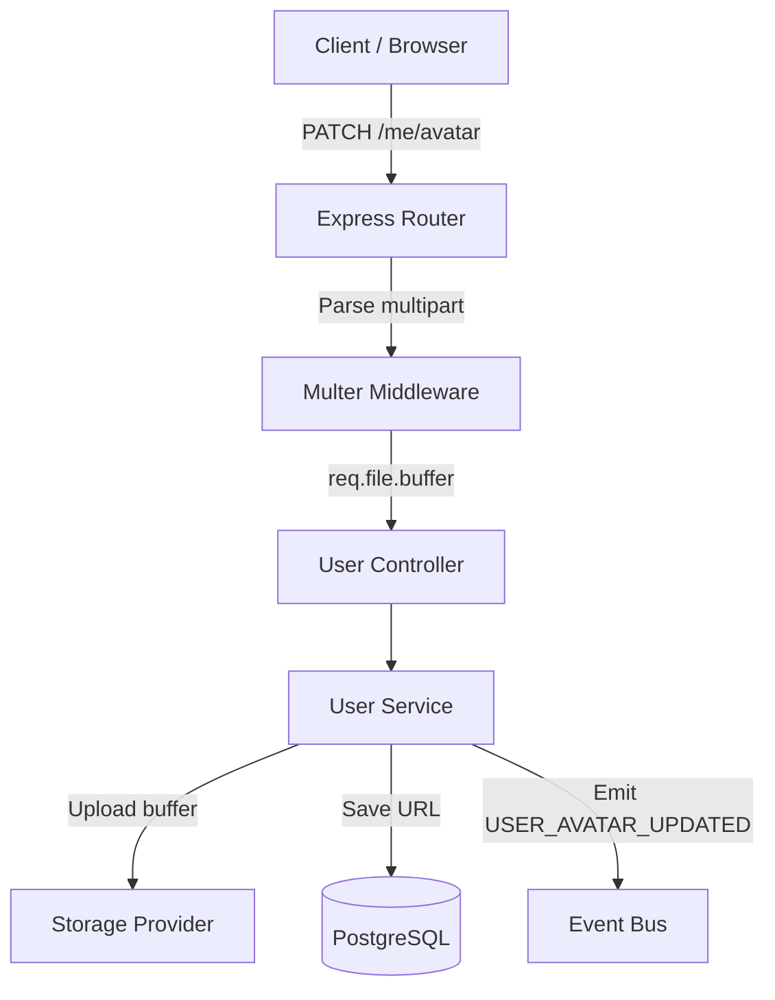
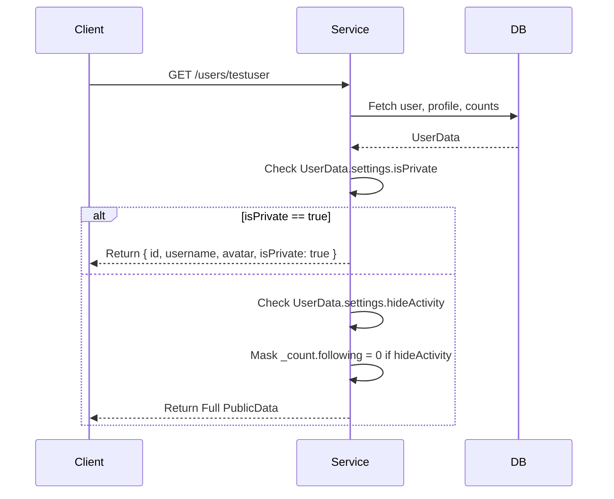

# User Module Documentation

The User Module handles profile management, privacy settings, developer metadata, and user search. It serves as the foundational domain that other modules (Blog, Follow, Dashboard) depend on.

## Architecture & Responsibilities

The module strictly follows the **Modular Monolith** pattern:
- **Repository Pattern**: `user.repository.ts` abstracts all database interactions and Prisma-specific syntax.
- **Service Layer**: `user.service.ts` contains all business logic (e.g., privacy masking, coordinating storage).
- **Controller Layer**: `user.controller.ts` handles Express request/response cycles.
- **Infrastructure Abstraction**: Avatar uploads use `IStorageProvider`, completely decoupling the business logic from Cloudinary, S3, or local storage. Multer sits at the routing middleware layer, keeping Express out of the service logic.

## Event Flow

## Relational Design & Search

To support future scalability without heavy refactoring:
- **Skills** are mapped via an M:N `UserSkill` join table. This makes it trivial to later query "Find all developers with 'React' skill".
- **Developer Profile** is 1:1, explicitly typing supported platforms (GitHub, LinkedIn, LeetCode) instead of relying on a loose JSONB structure.
- **Search Abstraction**: `UserService.search()` calls `userRepository.searchUsers()`. Currently it uses ILIKE filtering, but it's architected so the implementation inside the repository can be swapped out for `pg_trgm` or Elasticsearch without breaking the Service Layer API.

## Public Profile & Privacy Flow

## Public Endpoints
- `GET /api/v1/users/search?q={query}`
- `GET /api/v1/users/:username`

## Protected Endpoints (Requires Auth)
- `GET /api/v1/users/me/profile`
- `PATCH /api/v1/users/me`
- `DELETE /api/v1/users/me` (Soft Delete)
- `GET /api/v1/users/me/stats`
- `GET /api/v1/users/me/sessions`
- `PATCH /api/v1/users/me/developer`
- `PATCH /api/v1/users/me/skills`
- `PATCH /api/v1/users/me/avatar`
- `DELETE /api/v1/users/me/avatar`
- `PATCH /api/v1/users/me/preferences`
- `PATCH /api/v1/users/me/privacy`
