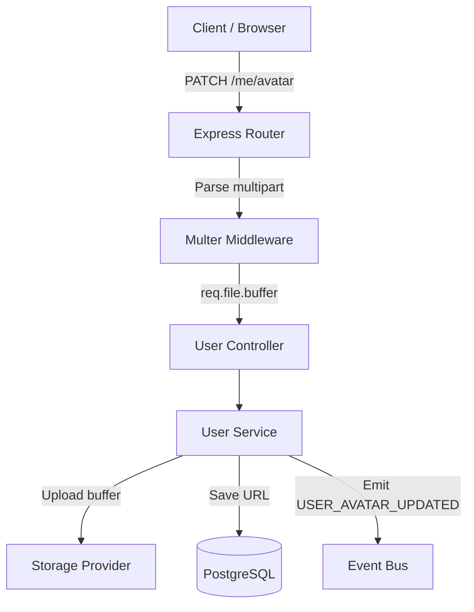
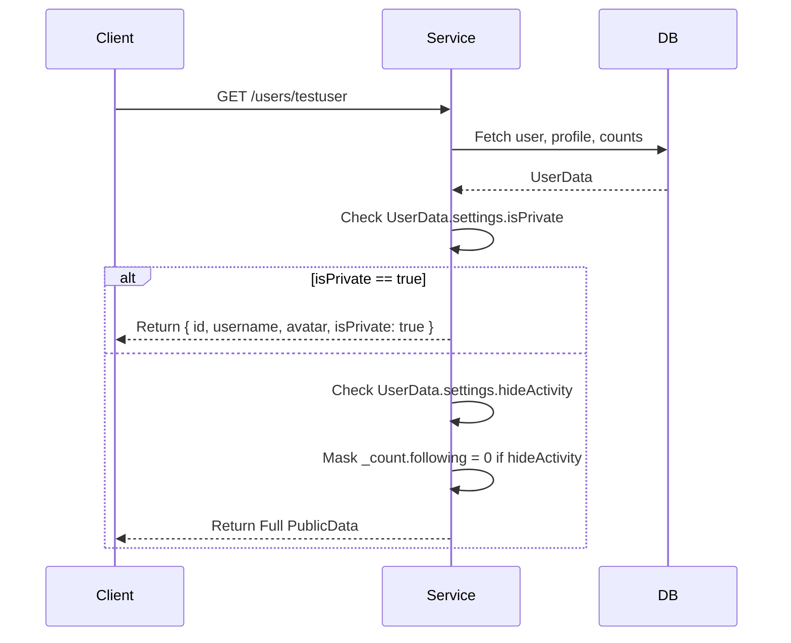
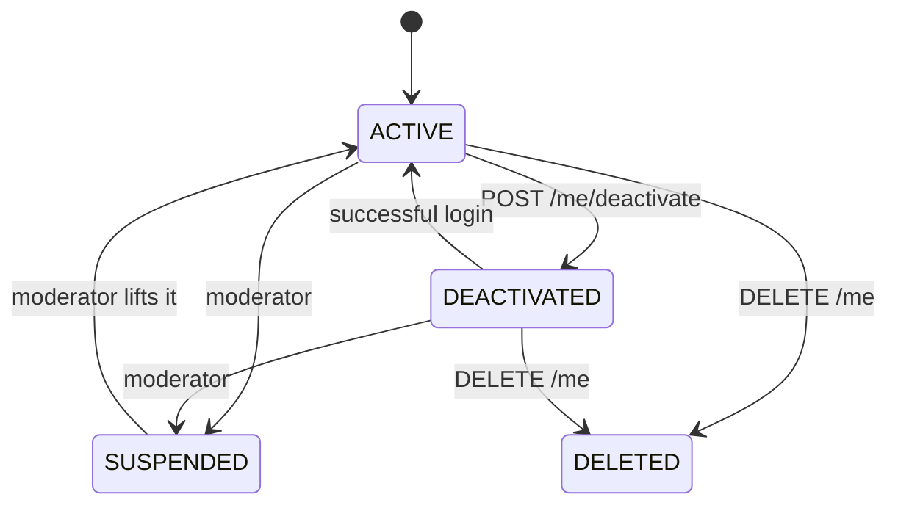

# User Module Documentation

The User Module handles profile management, privacy settings, developer metadata, and user search. It serves as the foundational domain that other modules (Blog, Follow, Dashboard) depend on.

## Architecture & Responsibilities

The module strictly follows the **Modular Monolith** pattern:
- **Repository Pattern**: `user.repository.ts` abstracts all database interactions and Prisma-specific syntax.
- **Service Layer**: `user.service.ts` contains all business logic (e.g., privacy masking, coordinating storage).
- **Controller Layer**: `user.controller.ts` handles Express request/response cycles.
- **Infrastructure Abstraction**: Avatar uploads use `IStorageProvider`, completely decoupling the business logic from Cloudinary, S3, or local storage. Multer sits at the routing middleware layer, keeping Express out of the service logic.

## Event Flow

## Relational Design & Search

To support future scalability without heavy refactoring:
- **Skills** are mapped via an M:N `UserSkill` join table. This makes it trivial to later query "Find all developers with 'React' skill".
- **Developer Profile** is 1:1, explicitly typing supported platforms (GitHub, LinkedIn, LeetCode) instead of relying on a loose JSONB structure.
- **Search Abstraction**: `UserService.search()` calls `userRepository.searchUsers()`. Currently it uses ILIKE filtering, but it's architected so the implementation inside the repository can be swapped out for `pg_trgm` or Elasticsearch without breaking the Service Layer API.

## Public Profile & Privacy Flow

## Account Deactivation

The reversible exit, and the platform's fourth `UserStatus`. Deactivation hides
the account and everything it wrote; one successful login brings all of it back.

**Nothing but `User.status` changes.** No blog, comment, follow or bookmark row
is touched. Every discovery surface already gates on `u."status" = 'ACTIVE'`, so
hiding the account hides its whole catalogue as a consequence — and reactivation
restores it with one UPDATE. A deactivation that rewrote content rows would be a
deletion wearing a reversible name.

**Reactivation is a login, not a token.** The password check *is* the
confirmation, so there is no reactivation token to mint, mail, store or expire.
`authService.login` calls `userService.reactivate` **after** verifying the
password — reactivating before it would let anyone who knows an email address
pull a hidden account back into public view. The response carries
`reactivated: true` so the client can say "welcome back" rather than silently
restoring a profile the user last saw hidden.

| | Deactivated | Suspended | Deleted |
| --- | --- | --- | --- |
| Chosen by | the user | a moderator | the user |
| Reversible by | logging in | a moderator | nobody |
| Guarded by `requireActiveAccount` | yes — cannot deactivate while suspended | — | no, leaving is always allowed |
| Error code on a guarded route | `ACCOUNT_DEACTIVATED` (403) | `ACCOUNT_SUSPENDED` (403) | `UNAUTHORIZED` (401) |

### What happens on deactivation

1. `userService.deactivate` transitions `ACTIVE → DEACTIVATED` with a conditional
   UPDATE and stamps `deactivatedAt`, then emits `USER_DEACTIVATED`.
2. Auth revokes every session and primes the account-status cache, so the access
   token minted a minute ago stops working on its next request rather than at the
   end of its 15-minute lifetime.
3. Feed and Search drop their cached pages — the same staleness gap they close
   for `USER_SUSPENDED`.
4. The public profile 404s; the account disappears from search, feeds, explore
   and trending.

On login, `reactivate` reverses the transition, clears `deactivatedAt`, emits
`USER_REACTIVATED`, and **writes the status cache synchronously** rather than
waiting for that event. `emit` is queue-backed: leaving the repair to the
subscriber would return tokens that `requireActiveAccount` rejects until the
domain-events worker catches up.

### The one deliberate trade

A moderator may suspend a `DEACTIVATED` account — otherwise deactivating would
be a shield against moderation. Lifting that suspension returns the account to
`ACTIVE`, not to `DEACTIVATED`: the user's own choice is overwritten by the
round-trip. The alternative is a "status before suspension" column whose only
job is to remember one flag. A reinstated user who finds themselves visible can
deactivate again in one request; a suspended user who cannot be suspended is a
hole.

## Public Endpoints
- `GET /api/v1/users/search?q={query}`
- `GET /api/v1/users/:username`

## Protected Endpoints (Requires Auth)
- `GET /api/v1/users/me/profile`
- `PATCH /api/v1/users/me`
- `DELETE /api/v1/users/me` (Soft Delete — terminal)
- `POST /api/v1/users/me/deactivate` (reversible — see [Account Deactivation](#account-deactivation))
- `GET /api/v1/users/me/stats`
- `GET /api/v1/users/me/sessions`
- `PATCH /api/v1/users/me/developer`
- `PATCH /api/v1/users/me/skills`
- `PATCH /api/v1/users/me/avatar`
- `DELETE /api/v1/users/me/avatar`
- `PATCH /api/v1/users/me/preferences`
- `PATCH /api/v1/users/me/privacy`
